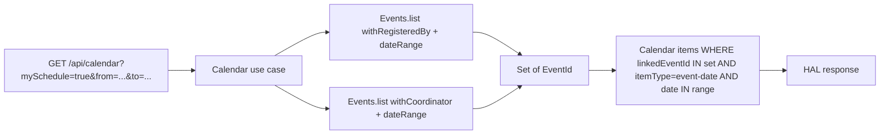

## Context

The calendar (`calendar-items` bounded context) shows every published calendar item in the selected date range to every authenticated member. There is no filtering today. A member who wants to see only events they personally attend or coordinate has to scan the full grid.

Existing primitives in the codebase remove most of the design risk:

- The `events` bounded context already exposes an `EventFilter` value object with two relevant builder methods: `withRegisteredBy(memberId)` and `withCoordinator(memberId)`, both combinable with `withDateRange(from, to)`. The repository adapter implements `withRegisteredBy` as an `EXISTS` query against `event_registrations`. Registration cancellation is a row delete (no status field), so the existing query already returns "events with an active registration for this member" without modification.
- The `calendar-items` aggregate already carries a `linkedEventId` on items that originate from events. Manual calendar items have `linkedEventId = null`.
- The calendar query and REST controller already accept a date range — adding one boolean query parameter is additive.

Stakeholders: club members (primary consumers), coordinators (secondary — they get coordinator-driven items in the same filter), and admins (unaffected — filter is opt-in).

## Goals / Non-Goals

**Goals:**

- Introduce a boolean filter (`mySchedule`) on `GET /api/calendar` that, when `true`, returns only event-date calendar items whose originating event has the current user as either an active participant or the event coordinator.
- Preserve full backward compatibility: when the parameter is absent or `false`, behaviour is unchanged.
- Respect existing module boundaries — the `calendar-items` module continues to depend on `events`, not the other way around. Reuse the existing `EventFilter` rather than introducing a new port.
- Keep deadline calendar items and manual calendar items out of the filtered view (the filter answers "where will I be / where do I have responsibility", not "what's still to do").
- Surface the active filter visibly in the calendar header so the UI does not need a dedicated empty-state banner.

**Non-Goals:**

- Family-member registrations ("show me events where my children are registered"). The MVP filter is strictly the current user.
- Group-relevance filtering (proposal `#110`). Independent dimension, separate change.
- Item-type filtering ("show only deadlines", "hide manual items"). Separate dimension, part of umbrella `#109`.
- Persistence of the toggle across sessions or devices (server-side preference, localStorage). URL-only for now. A later proposal may revisit.
- Deputy / co-coordinator support. Proposal `#83` is unstabilised; if and when it lands, it decides whether deputies are part of "Můj rozvrh".
- HAL-Forms affordance for the filter. Filters on listing endpoints in Klabis are plain query parameters today (see `EventController`); this change follows the same convention.

## Decisions

### Filter is computed via two `EventFilter` queries, unioned in the calendar use case

When `mySchedule=true`, the calendar list use case in the `calendar-items` module performs the following:

```
eventsA = events.list(EventFilter.none()
                .withDateRange(from, to)
                .withRegisteredBy(currentUserId))
eventsB = events.list(EventFilter.none()
                .withDateRange(from, to)
                .withCoordinator(currentUserId))

mineEventIds = eventsA.ids ∪ eventsB.ids

calendar items WHERE
    linkedEventId IN (mineEventIds)
    AND itemType = event-date
    AND date IN [from, to]
```

**Why two queries unioned in code, not one combined query?** `EventFilter` is an AND-of-fields value object. Setting both `withRegisteredBy` and `withCoordinator` on a single filter means "user is BOTH the participant AND the coordinator", which is rare and not what users want. The cheapest, cleanest way to express OR semantics across these two dimensions without polluting `EventFilter` with a special-purpose disjunctive field is to run two queries and union the resulting IDs in the calendar use case. For a typical date range (one month) the result set is small (tens of events per user), so the cost is negligible.

**Alternative considered — extending `EventFilter` with a `withMyInvolvement(memberId)` field that emits a disjunctive SQL clause.** Rejected. It introduces a single-purpose, semantically inconsistent field (the rest of `EventFilter` is AND-of-fields), and the perceived performance gain (one query vs two) does not materialise at the data sizes involved.

**Alternative considered — denormalising "who is registered / who coordinates" onto each calendar item.** Rejected. It requires new tables / columns, event listeners on registration changes and coordinator changes, and introduces eventual-consistency windows. The live-join approach is simpler and the data volumes do not justify the complexity.



### Item-type filtering inside the calendar module, not the events module

Deadline items and manual items are excluded entirely when `mySchedule=true`. The exclusion is a property of the calendar use case (it asks `linkedEventId IN (mineEventIds) AND itemType = event-date`), not a property of the events query. This keeps the events module unaware of calendar item types — only the calendar module knows about them.

### API shape — plain boolean query parameter

`GET /api/calendar?mySchedule=true` (or `false`, or absent). No HAL-Forms affordance, consistent with how `EventController.listEvents` exposes `registeredBy`, `coordinator`, `dateFrom`, `dateTo`, etc. The frontend toggle constructs the URL explicitly; no server-driven form metadata.

### Default OFF, state in URL only

The filter is off by default — a new or hosting member with no registrations would otherwise see an empty calendar, which is hostile. The toggle state lives in the URL query string only. Closing and reopening the calendar resets it. Cross-session or cross-device persistence is deliberately deferred (see Non-Goals).

### No dedicated empty-state copy

The calendar renders as a 7×N month grid, not a list. When the filter is active and no items match, the grid simply renders without item chips. The filter toggle is always present in the calendar header — so the user can connect "empty month" with "filter is active" and turn it off in place. No banner, no text-state, no copy to localise.

### "Coordinator" stays unqualified in the spec

Spec scenarios refer to "the event coordinator" without primary/deputy qualification. Today the data model has exactly one coordinator field on the `Event` aggregate (`MemberId eventCoordinatorId`) and `EventFilter.withCoordinator` filters on it. Proposal `#83` (deputy coordinator) is currently a `question` artefact and is not stabilised. When it lands, it owns the decision to extend the coordinator role in the spec — by widening `EventFilter.withCoordinator` to cover deputies, by adding its own scenario to `calendar-items`, or by explicitly excluding deputies. This change does not prejudge that decision.

### Filter applies to past, present, and future identically

The filter does not restrict by event status or by date relative to today. Past event-date calendar items where the user was registered or coordinated remain visible — the calendar is a historical record, not a TODO list. Cancelled events disappear automatically because the existing `calendar-items` spec already removes their calendar items.

## Risks / Trade-offs

- **[Two queries per request]** → Acceptable. Per-month event volumes are small (tens). If profiling later shows the second query is a problem, a single repository method `findIdsByMemberInvolvement(memberId, range)` can be introduced in the events module without API or spec changes.

- **[OR semantics live in the calendar use case, not in `EventFilter`]** → Acceptable. The calendar module is the only consumer that needs this disjunction today. Pulling the OR upward — into `EventFilter` — would only be justified if a second consumer wants the same thing; until then, the consumer-side union keeps `EventFilter` clean.

- **[Implicit dependency on `EventRegistration` having no status field]** → If a future change introduces a "cancelled registration" status without deleting the row, `EventFilter.withRegisteredBy` would silently start including cancelled registrations in "Můj rozvrh". The spec for `withRegisteredBy` should describe its semantic intent ("member has an active registration"), but enforcing that across modules is a broader concern outside this change.

- **[Active filter awareness depends on visible toggle, not on a banner]** → If a future redesign moves the toggle off-screen on small viewports without a chip in its place, the user could see an empty grid without realising the filter is active. The mitigation is to keep the toggle (or a visible "active filter" chip) in the header at all viewport sizes — captured as a spec scenario.

- **[Two-query union temporarily allocates two `Page<Event>` results]** → Negligible for one month; could matter for very wide ranges. The existing 366-day cap on the calendar date range already bounds the worst case.
