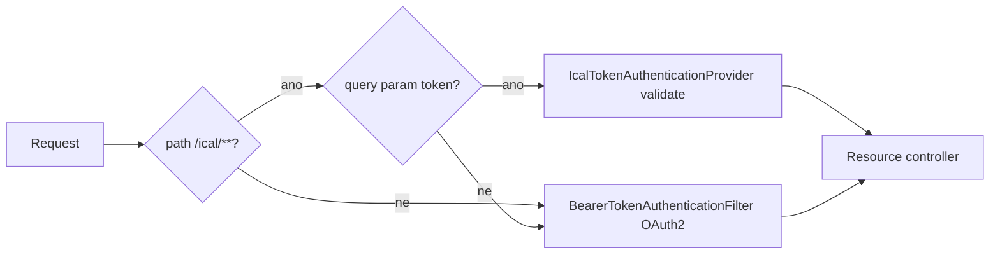

## Context

Klabis aktuálně nemá žádnou integraci s externími kalendáři. Členové si musí akce přepisovat ručně. Standardní pattern je iCalendar subscribe feed (`text/calendar`, RFC 5545) — uživatel přidá URL jednou, externí kalendář si ji periodicky tahá a sám aktualizuje VEVENT záznamy.

Hlavní výzva: autentizace. Kalendářové aplikace (Google Calendar, Apple Calendar, Outlook) neumějí OAuth2 flow ani Bearer hlavičky. URL s tokenem (Personal Access Token, PAT) v query stringu je jediný realistický způsob.

Sémantika obsahu feedu odpovídá filtru „Můj rozvrh" v aplikaci (`calendar-my-schedule-filter`, archivováno 2026-05-20): sjednocení akcí, kde uživatel má aktivní registraci, a akcí, kde je event coordinator. Cíl je, aby externí kalendář ukazoval to samé, co web filter — žádná druhá definice „mého rozvrhu".

Feed je schopnost modulu `calendar`, ne samostatný modul. `calendar` už dnes konzumuje `EventScheduleQuery` pro web filtr; iCal feed je druhý výstup té samé domény.

## Goals / Non-Goals

**Goals:**
- Subscribe URL `/ical/my-schedule.ics?token=...` vrací iCal feed s „Mým rozvrhem" daného uživatele (participant ∪ coordinator).
- Token je per-user, hashed, uložený v samostatné tabulce modulu `calendar`, regenerovatelný uživatelem.
- Feed je deterministický (UID = eventId) — re-fetch updatuje existující eventy v kalendáři, neduplikuje.
- Zrušená akce → VEVENT.STATUS:CANCELLED → externí kalendář ji označí škrtnutím / odstraní.
- Odhlášený uživatel (a zároveň ne koordinátor téže akce) → VEVENT zmizí z feedu → externí kalendář ji odstraní při dalším refreshi.
- Přidaná koordinátorská role → VEVENT se objeví ve feedu na další refresh.
- Reuse `EventScheduleQuery.findEventIdsForMemberSchedule` — žádná duplikace OR semantiky.

**Non-Goals:**
- Veřejný feed bez tokenu.
- iCal pro klubový kalendář (`calendar-items` — manuální položky, deadliny). Stejně jako web filter „Můj rozvrh", feed nese pouze event-date položky.
- Server-side push (CalDAV).
- Multi-user feed (admin vidí přihlášky všech členů).
- Family-member registrations.
- Deputy / zástupný koordinátor (čeká na proposal `#83`).
- Změna `User` aggregátu v `common.users`.
- Ne-UTF-8 character handling (Klabis je UTF-8 napříč).

## Decisions

### Decision 1: PAT — token v samostatné tabulce vlastněné modulem `calendar`

`User` aggregát v `common.users` (shared kernel) se **nemění**. Token feedu žije v nové tabulce / aggregátu vlastněném modulem `calendar`:

```
calendar_feed_token
  user_id       — reference na users.id (vlastník)
  token_hash    — hashed token (passwordEncoder, jako hesla)
  token_lookup  — non-secret prefix raw tokenu, indexovaný (lookup)
  last_set_at   — kdy byl token naposledy vygenerován (UI „naposledy regenerováno")
```

Token je opaque base64url string (32 bytes random = 256 bit). Generování:
```
String raw = base64Url(SecureRandom 32 bytes);
String hash = passwordEncoder.encode(raw);   // BCrypt or Argon2
String lookup = raw.substring(0, 8);          // non-secret index prefix
```
DB uchovává jen hash + lookup prefix. Raw token se uživateli zobrazí **jen jednou** při generování — pokud zapomene, musí regenerovat.

Validace: vyhledej řádek podle `token_lookup` (indexed, O(1)), pak `passwordEncoder.matches(raw, token_hash)` — vyhne se brute-force scanu přes všechny uživatele.

**Why separátní tabulka a ne pole na `User`:** `User` je shared-kernel aggregát v `common.users`. Feed token je čistě záležitost modulu `calendar` — patří do jeho vlastní persistence, ne do sdíleného jádra. Modul `calendar` tak vlastní celý lifecycle tokenu bez zásahu do `common`.

**Alternative considered:**
- *Pole `iCalAccessTokenHash` na `User` aggregátu* — zaplevelilo by shared kernel modul-specifickým konceptem a vynutilo by změnu `backend-patterns` skillu. Zamítnuto.
- *Plain text token v DB* — leaky, pokud někdo pumpne DB.
- *Stateless JWT s expirací* — kalendářové klienty neumějí refresh, expirace by feed přerušila každých N dní; JWT stateless = nemožno revoke jediný token bez rotace klíčů.

### Decision 2: Token regenerace = single token per user (overwrite)

Uživatel má v daný okamžik 0 nebo 1 řádek v `calendar_feed_token`. „Vygenerovat nový token" overwrite-uje `token_hash` + `token_lookup` + `last_set_at` a invaliduje předchozí URL. Žádný history / multiple tokens — KISS.

### Decision 3: URL forma — query param `?token=`

`https://api.klabis.otakar.io/ical/my-schedule.ics?token=<base64url>`

Test alternativ:
- Path param `/ical/<token>/my-schedule.ics` — některé kalendářové klienty (Google Calendar) ho přijmou bez problémů, ale je méně standardní pattern.
- Query param je univerzální. Default zvolen tato varianta.

### Decision 4: Obsah feedu = „Můj rozvrh" sjednocení, reuse `EventScheduleQuery` + `Events`

Modul `calendar` použije existující port `EventScheduleQuery.findEventIdsForMemberSchedule(memberId, from, to)` z `com.klabis.events` — vrací `Set<EventId>` v jednom SQL query (date overlap + `coordinator_id = :id OR EXISTS (registration with member_id = :id)`).

Pro VEVENT serializaci je potřeba plný `Event` aggregát (status pro `STATUS:CANCELLED`, coordinator pro `Role: koordinátor`). Dnešní `EventData` DTO tyto údaje neposkytuje. **Řešení: `events.domain` se otevře pro public access** — interface `Events` (`findById`, `findAll`) a aggregát `Event` budou součástí veřejného API modulu `events`. Modul `calendar` je bude konzumovat přímo (Spring Modulith povolí závislost `calendar → events`, jakou už `calendar` má přes `EventScheduleQuery` a `EventDataProvider`).

Flow v modulu `calendar`:
1. `Set<EventId> ids = eventScheduleQuery.findEventIdsForMemberSchedule(memberId, from, to)`
2. `List<Event> events = ids.stream().map(events::findById).flatMap(Optional::stream).toList()` (přes `Events` interface)
3. Pro každý event: `boolean isCoordinator = event.coordinatorId().equals(memberId)` — určí text `Role: koordinátor` v DESCRIPTION. Žádná další DB query, data jsou v `Event`.
4. Serializace VEVENT.

**Důsledek pro architekturu:** žádná nová logika union; změna sémantiky „Můj rozvrh" v jednom místě (`EventScheduleQuery`) se projeví v obou consumerech (web filter + iCal feed).

**Why ne rozšíření `EventData`:** `EventData` je úzké DTO pro event-driven sync handlery. Přidávat na něj `status` + `coordinatorId` jen kvůli feedu by ho rozšiřovalo o pole, která ostatní consumeři nepotřebují. Otevřít `Events` (read-only query API, k tomu navržené) je čistší — `calendar` dostane plný aggregát a vybere si pole sám.

### Decision 5: Výchozí časové okno feedu — [-30 dní, +12 měsíců]

Feed nemá date range parametr (kalendářoví klienti by ho neuměli nastavit). Server vyplní výchozí okno: posledních 30 dní (členové nechtějí zmizet z kalendáře ihned po události) + 12 měsíců dopředu. Konfigurovatelné property `klabis.ical.window.past=P30D`, `klabis.ical.window.future=P12M`.

### Decision 6: iCalendar generování — manuální (žádná knihovna)

Pole jsou triviální (UID, SUMMARY, DTSTART, DTEND, LOCATION, DESCRIPTION, URL, STATUS). Knihovna `biweekly` přidá závislost a kompletní RFC 5545 podporu, kterou nepotřebujeme. Ruční StringBuilder + escape rules (CRLF, `\,`, `\n`):

```
BEGIN:VCALENDAR
VERSION:2.0
PRODID:-//Klabis//Klabis Member Portal//CS
BEGIN:VEVENT
UID:<eventId>@klabis
DTSTAMP:<now in UTC>
DTSTART;VALUE=DATE:<event date>
DTEND;VALUE=DATE:<event date + 1 day>
SUMMARY:<escaped name>
LOCATION:<escaped location>
URL:<event detail URL>
DESCRIPTION:<escaped description (incl. Role: koordinátor when applicable)>
STATUS:CANCELLED|CONFIRMED
END:VEVENT
...
END:VCALENDAR
```

Unit test pokrývá escape rules a deterministic UID.

### Decision 7: Cache headers — `max-age=600`

Kalendářoví klienti typicky polluji 1× za hodinu nebo víckrát. Server-side cache 10 minut šetří DB queries; uživatel vidí změnu max po 10 min latence — akceptovatelné.

`Cache-Control: max-age=600, public, no-transform`. Žádné per-user cache (každý token má jiný feed obsah, ETag by se nehodil).

### Decision 8: Security pro `/ical/...` — autentizační strategie podle `token` parametru

Místo samostatného filter chainu se stávající resource-server filter chain rozšíří o **autentizační strategii**, která vybírá způsob autentizace podle requestu. Žádný druhý chain, žádný bypass.

**Mechanismus — vlastní `AuthenticationFilter` před `BearerTokenAuthenticationFilter`:**

- Nový `IcalTokenAuthenticationFilter` + `IcalTokenAuthenticationProvider` žijí v **infrastructure vrstvě modulu `calendar`** (`com.klabis.calendar.infrastructure.security`), ne v `common.security`. Důvod: oba závisejí výhradně na token-službě modulu `calendar` (`IcalTokenService`) — je to security *adapter* modulu `calendar`, žádný sdílený security primitiv. `common.security` zůstává nedotčený s výjimkou bodu níže.
- Registrace filtru do existujícího resource-server chainu: modul `calendar` přispěje filter do chainu přes mechanismus, který projekt už používá pro skládání security konfigurace napříč moduly (obdoba `WebSecurityCommonConfiguration` discovery). Pokud takový extension point ještě neexistuje v podobě použitelné pro přidání filtru, zavede se v `common.security` minimální hook (`SecurityFilterChain` customizer / `@Bean` typu, který chain skládá) — to je jediný možný zásah do `common.security` a má být co nejtenčí. Konkrétní podobu potvrdit při implementaci proti aktuálnímu stavu `WebSecurityCommonConfiguration` / `ResourceServerSecurityConfiguration`.
- Filter se zařadí **před** `BearerTokenAuthenticationFilter`.
- Filter má `RequestMatcher` omezený na `/ical/**` — pro ostatní cesty se neaktivuje (`shouldNotFilter`).
- Pokud request na `/ical/**` nese query param `token`:
  - Filter vytvoří neautentizovaný `IcalTokenAuthenticationToken(rawToken)` a předá ho `AuthenticationManager`u.
  - Vlastní `IcalTokenAuthenticationProvider` token zvaliduje přes token-službu modulu `calendar` (`IcalTokenService.validate`), a při úspěchu vrátí autentizovaný principal (user identity), který resource-server controller dál použije.
  - Při neúspěchu → `AuthenticationException` → standardní `AuthenticationEntryPoint` vrátí 401.
- Pokud request na `/ical/**` query param `token` **nenese**, filter neudělá nic — request propadne dál na `BearerTokenAuthenticationFilter` a autentizuje se standardně přes OAuth2 (užitečné např. pro interní/diagnostické volání feedu z přihlášené session).

**Působnost je striktně `/ical/**`.** `?token=` na `/api/**` se ignoruje — alternativní autentizace nikdy neobejde OAuth2 mimo iCal cesty. Tím se nezvětšuje attack surface zbytku aplikace.



**Why filter + provider a ne `AuthenticationManagerResolver`:** `AuthenticationManagerResolver<HttpServletRequest>` na resource serveru by také fungoval, ale je svázaný s `BearerTokenAuthenticationFilter`, který očekává token v `Authorization` hlavičce. iCal token je v query stringu, takže by se stejně musel doplnit custom `BearerTokenResolver` — dvě customizace místo jedné. Samostatný `AuthenticationFilter` před bearer filtrem je přímočařejší a drží iCal logiku na jednom místě.

**`SpaFallbackFilter` exclusion** — do `EXCLUDED_PREFIXES` v `com.klabis.common.ui.SpaFallbackFilter` přidat `/ical`, aby GET na `/ical/my-schedule.ics` s `Accept: text/html` nebyl forwardován na SPA shell. Triviální jednořádková změna; **nezávislá na review-1-1** — dělá se v rámci této change.

`/ical/...` je vlastní top-level path mimo `/api/` prefix (ten je rezervovaný pro OAuth2-protected endpointy).

### Decision 9: Frontend — sekce v profilu uživatele

Stránka `MyProfile` (member detail self-view) má novou sekci „Kalendářový feed":
- Pokud token zatím není vygenerován: tlačítko „Vytvořit kalendářový feed" → POST regenerate, ukáže URL.
- Pokud token existuje: ukáže URL (zamaskovanou: `https://api.klabis.otakar.io/ical/my-schedule.ics?token=••••••••token1234`); button „Zobrazit celou URL" + „Kopírovat" + „Vygenerovat nový token" (s confirm dialog).
- Help text s instrukcemi pro Google Calendar, Apple Calendar, Outlook (krátké screenshot-less how-to). Zmíní, že feed obsahuje účast i koordinátorské role (konzistence s filtrem „Můj rozvrh" v hlavním kalendáři).

## Risks / Trade-offs

- **[Risk] Otevření `events.domain` zvětšuje public surface modulu `events`** → `Events` interface i aggregát `Event` se stanou public. Mitigation: `Events` je už dnes navržené jako „public query API for Event aggregate" (viz jeho Javadoc) — fakticky se jen formálně zveřejní balíček. Závislost `calendar → events` už existuje.
- **[Risk] Token leak (uživatel veřejně publikuje URL)** → Mitigation: regenerace invaliduje starou URL. Help text v UI varuje. Token v query stringu může být v server logs — server logs token surface neukládáme do audit logu. Pokud by se ukázalo problémem, přesun na Authorization Bearer s OAuth2 flow je možný.
- **[Risk] Polling load** → Mitigation: cache 10 min + rate limit follow-up.
- **[Risk] Deterministický UID = pokud Klabis EventId změní (nemělo by se stávat), kalendář ztratí historii** → Mitigation: UUID je stabilní per-event aggregate, žádné re-create.
- **[Risk] Sémantická drift mezi web filtrem a iCal feedem** → Mitigation: oba consumeři používají `EventScheduleQuery.findEventIdsForMemberSchedule`. Změna semantiky (např. přidání deputy coordinator přes `#83`) se projeví v jediném portu a tím v obou výstupech současně.
- **[Trade-off] Žádný iCal pro klubový kalendář** — uživatelé chtějí všechny akce? Web filter „Můj rozvrh" je výchozí OFF, v hlavním kalendáři uživatelé vidí všechny akce. Pro iCal je „Můj rozvrh" záměrně default — externí kalendář nemá zaplevelovat klubovými akcemi, na kterých uživatel nehraje roli. Follow-up `my-club.ics` možný.

## Migration Plan

1. **`events` modul:** otevřít `events.domain` (interface `Events`, aggregát `Event`) pro public access — formálně zveřejnit balíček, ověřit Spring Modulith pravidla.
2. **DB migration:** nová tabulka `calendar_feed_token` (`user_id`, `token_hash`, `token_lookup`, `last_set_at`) — do `V001` in-place.
3. **Domain + service (modul `calendar`):** feed-token aggregát/entita + `IcalTokenService` (generate/regenerate/validate).
4. **REST endpoint:** `GET /ical/my-schedule.ics?token=...` (mimo `/api/` prefix, žádné OAuth2 — token je gating).
5. **Security + routing:** `IcalTokenAuthenticationFilter` + `IcalTokenAuthenticationProvider` v `calendar.infrastructure.security`, zařazené do resource-server chainu před `BearerTokenAuthenticationFilter`; `/ical` do `SpaFallbackFilter.EXCLUDED_PREFIXES`.
6. **REST API pro management:** `POST /api/me/ical-token`, `GET /api/me/ical-token`.
7. **Frontend:** sekce v profilu.
8. **Smoke test:** vygenerovat token, otevřít URL v prohlížeči (HTTPS), ověřit iCal output včetně koordinátorské role v DESCRIPTION, přidat do Google Calendar, ověřit zobrazení.

## Open Questions

- **Token storage modul:** tabulka `calendar_feed_token` je vlastněná modulem `calendar`. Token management REST API (`/api/me/ical-token`) — controller patří taktéž do modulu `calendar` (vystavuje token modulu `calendar`), i když je namountovaný pod `/api/me/...`. Potvrdit při implementaci.
- **Co když user nemá žádné registrace ani koordinátorskou roli?** Feed obsahuje jen `BEGIN:VCALENDAR / END:VCALENDAR` bez VEVENT — validní empty calendar.
