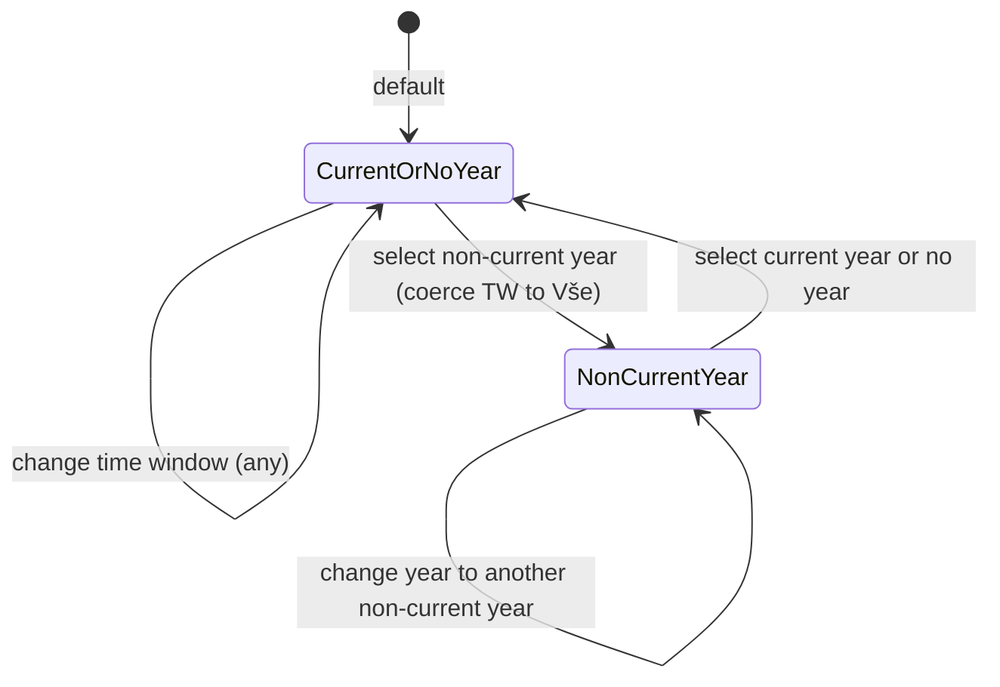

/## Context

The events list page exposes a filter bar with, among others, a time-window selector (Budoucí / Proběhlé / Vše) and a year selector. Today these two filters are mutually exclusive: choosing a year silently flips the time window to "Vše", and changing the time window clears the year. The behaviour was originally added to keep result sets non-empty for past years, but it surprises users and prevents reasonable combinations such as "events from the current year that have already happened".

The filter state is reflected in the page URL (the events spec already mandates URL persistence). The backend events query API already accepts independent date-range and time-window parameters, so this is a frontend-only behaviour change.

## Goals / Non-Goals

**Goals:**
- The year selector and the time-window selector combine with AND semantics.
- Changing one selector never silently changes the other (with one explicit exception below).
- When a non-current year is selected, the "Budoucí" and "Proběhlé" options are disabled because they would always produce results that are either trivially empty (past year + Budoucí) or trivially equal to "Vše" (past year + Proběhlé); the time window is coerced to "Vše" so the visible state matches the active query.
- The default value of the year selector is the current year, so the events list opens scoped to the current year by default.

**Non-Goals:**
- Changing the backend events query API.
- Adding multi-year selection or arbitrary date-range pickers on the events list.
- Restoring the previous time-window value when the user switches back from a non-current year to the current year. Once coerced to "Vše", the value stays "Vše" until the user picks something else. (Keeps state model simple — see decision below.)

## Decisions

### Disable Budoucí / Proběhlé for non-current years rather than redefining them

Alternatives considered:

1. **Disable both for non-current years** (chosen). Matches user intent ("only Vše makes sense") and makes the empty/identical result sets impossible to ask for.
2. Keep all three enabled and let the result set be empty for "past year + Budoucí". Rejected: produces confusing "no events" states for inputs that are logically meaningless rather than just unmatched.
3. Redefine "Budoucí" / "Proběhlé" relative to "today within the selected year" (e.g. for a past year, "Proběhlé" = whole year, "Budoucí" = empty). Rejected: the labels stop meaning what users read them as.

### Coerce time window to "Vše" on selecting a non-current year; don't restore on switch-back

When the user selects a non-current year while "Budoucí" or "Proběhlé" is active, set the time window to "Vše". When the user later switches to the current year or "no year", leave the time window at "Vše"; the user changes it explicitly if they want.

Alternative: remember the previous time-window value and restore it on switch-back. Rejected as added state with little user benefit — the user can see the current selector value and adjust it. Keeps URL state minimal (two independent values, no "previous value" memory).

### "no year" behaves like the current year for time-window availability

Both unlock all three time-window options. The "no year" option simply removes the year constraint; the AND combination then degenerates to the time-window filter alone.

### State model

In the `NonCurrentYear` state the time-window selector is rendered with "Budoucí" and "Proběhlé" disabled and "Vše" selected.

### URL serialisation

Both filters are serialised independently in the URL (e.g. `?year=2024&when=all`). Reloading a URL with `year=2024&when=upcoming` is treated as if the user had loaded the page and then selected the past year: the year wins, the time window is coerced to "Vše", and the URL is normalised on first render.

## Risks / Trade-offs

- **Existing shared URLs** that relied on the old override behaviour (e.g. `?year=2024&when=upcoming` resolving to "all 2024 events") will now render slightly differently — the result set is the same (all 2024), but the UI shows "Vše" instead of "Budoucí". → Acceptable; visible state now matches the query.
- **Discoverability of disabled options**: users who select a past year may briefly wonder why "Budoucí" is greyed out. → Standard disabled affordance with a tooltip ("Není k dispozici pro jiný než aktuální rok") covers this.
- **"Current year" is time-dependent**: on Jan 1 the meaning of "current year" flips, which can affect bookmarked URLs created in late December. → Same edge case the existing year selector already has; no new mitigation needed.
