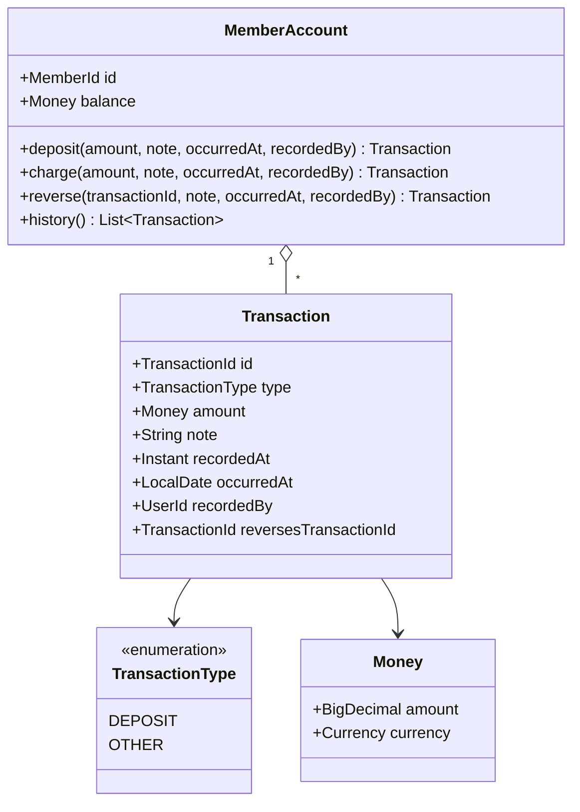
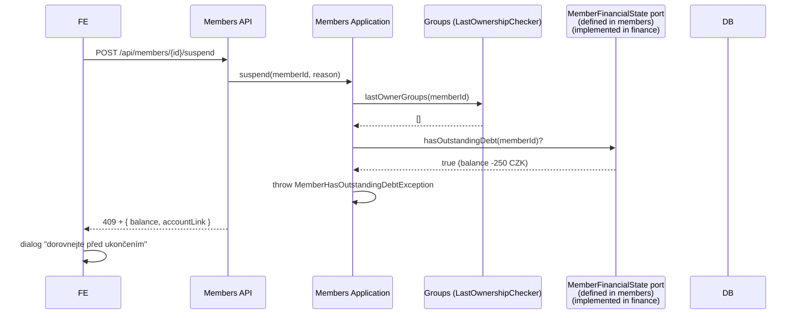

## Context

Klabis dnes nemá žádnou evidenci financí. V projektu existují bounded contexty `members`, `events`, `calendar`, `groups`, `oris`, `users`. Suspend/terminate je jeden a tentýž koncept — terminologie se sjednotila na "suspend" v doméně, "Ukončit členství" v UI. Existuje vzorový cross-module workflow pro "last owner skupiny" (členové → groups via `LastOwnershipCheckerImpl`, výsledek se promítá do HTTP 409 + dialogu na FE). Tato změna zavádí samostatný bounded context **finance** s jediným agregátem **MemberAccount** a navazuje se ve dvou bodech: pre-check při ukončení členství, položka v hlavním menu.

Reference:
- proposal: `./proposal.md`
- gh issue: [#273](https://github.com/zabiny/klabis/issues/273)

## Goals / Non-Goals

**Goals:**

- Izolovaný modul `finance` s vlastní doménou, persistencí a REST API.
- Append-only model transakcí, audit trail bezvýjimečně.
- Storno reverzním zápisem s odkazem na původní transakci.
- Cross-module integrace pouze přes IDs (memberId) a aplikační porty — žádné FK přes hranice.
- Připravenost na pozdější přidání strukturovaných typů poplatků (EVENT_FEE, MEMBERSHIP_FEE, …) bez migrace existujících záznamů.
- Konzistentní UX se vzorem "last owner skupiny" pro blokující pre-check při ukončení členství.

**Non-Goals:**

- Strukturované typy poplatků a vazba na akce (přijde v dalším změnovém návrhu, jakmile events dostanou poplatky).
- Hromadné operace (bulk předpisy).
- Self-service vklad člena a integrace s bankovním API.
- Reporty, exporty, účetní výstupy.
- Více měn (CZK only v1, ale Money VO ponechává budoucnosti otevřené dveře).
- Vlastní lifecycle účtu (žádné rušení, žádné slučování při sjednocení účtů).

## Decisions

### 1. Klubový kredit, ne saldo / čistý log

Účet modeluje **předplacený zůstatek** člena u klubu. Plusové saldo = peníze, které ještě nebyly utraceny. Mínus = klub půjčil členovi do limitu. Alternativy (čistá pohledávka/závazek; nebo "jen log bez konceptu zůstatku") byly zamítnuty — klub potřebuje vědět "kolik mám u klubu", a každá platba se páruje s konkrétním důvodem.

### 2. Aggregate root: MemberAccount, identita = memberId



`MemberAccount.id == Member.id` (sdílí identitu — 1:1). Balance je odvozeno (SUM transactions.amount), ale držené i jako cache na agregátu pro O(1) čtení; znovu-přepočet je deterministický a slouží jako sanity check.

### 3. Transakční typy v1: jen DEPOSIT a OTHER + flag

`reversesTransactionId` je nullable pole na transakci — flag, ne další typ. Důvody:

- Reporty (až přijdou strukturované typy jako EVENT_FEE) jdou bez joinu: `SUM(amount) WHERE type=EVENT_FEE` vrátí správné saldo — storno EVENT_FEE má `type=EVENT_FEE` se znaménkem opačným.
- Doménově poctivější: REVERSAL není "druh peněz", je to vlastnost zápisu.

Alternativa "REVERSAL jako vlastní typ" zamítnuta z výše uvedeného důvodu.

### 4. Append-only, žádná editace ani mazání

Storno se zapisuje jako další transakce. Editace už zapsané transakce není možná — ani správcem. Důvody:

- Audit trail je hodnota pro budoucí účetní výstupy.
- Konzistentní pravidlo "co se zapsalo, zůstává" je jednodušší než časové okno na editaci.

### 5. Limit přečerpání: globální konfigurace v `application.yml`

`klabis.finance.overdraft-limit` (záporné číslo, default např. -500 Kč). Drženo přes `@ConfigurationProperties`. Pro v1 platí pro všechny členy stejně. Změna = redeploy.

Pravidla:

- **DEPOSIT** vždy povolen (jde zůstatek nahoru).
- **OTHER (běžný výdaj)** povolen jen pokud `balance + amount >= overdraftLimit`.
- **Storno (`reversesTransactionId != null`)** limit obchází — opravuje historii, ne nový dluh.

Důvody pro yml (a ne DB / admin UI): jednoduchost v1, prakticky se nemění často, drží to FINANCE:MANAGE mimo "konfigurační" odpovědnost.

### 6. Permission model

Nová authorita **`FINANCE:MANAGE`** v existujícím permission systému:

- deposit / charge / reverse jakémukoli členovi
- číst jakýkoli účet a historii

Vlastník účtu (kdokoli přihlášený) může číst **vlastní** zůstatek a historii bez extra authority. Ověření vlastnictví probíhá porovnáním identity přihlášeného uživatele s `memberId` účtu — analogicky k existujícím endpointům typu "vlastní profil".

### 7. Lifecycle účtu = lifecycle člena

- **Vznik účtu**: `finance` modul subscribuje `MemberRegisteredEvent` publikovaný `members` modulem a vytvoří `MemberAccount` se zůstatkem 0. Event je členem-definovaná publikační smlouva, finance je konzument — směr závislosti zůstává `finance → members`.
- **Suspendovaný/ukončený člen**: účet zůstává plně funkční. FINANCE:MANAGE může i nadále zapisovat transakce (typický scénář: dořešení dluhu/přeplatku po ukončení).
- **Resume**: žádná akce na účtu, kontinuita je zachována přirozeně.
- **Zánik účtu**: v doméně neexistuje (členství je reverzibilní).

### 8. Cross-module integrace: ukončení členství

Závislost modulů je **`finance → members`**, ne naopak. `members` modul **definuje port** (rozhraní), které popisuje, co potřebuje vědět o financích člena při ukončení členství. `finance` modul ten port **implementuje** jako secondary adapter (DIP).



`members.application` definuje rozhraní (např. `MemberFinancialStatePort`) se metodou typu `hasOutstandingDebt(MemberId)` (případně `getBalance(MemberId)` — viz Open Questions). Toto je **port, který si owner (members) deklaruje**: "potřebuji vědět, jestli členova finanční situace blokuje ukončení". `finance` modul poskytne implementaci (`@Component` v `finance.application`/adapter), která čte balance z `MemberAccount` repository a převede ji na doménovou odpověď členů.

Tato volba znamená:

- Members modul **nezná** finance modul ani jeho datový model. Ví jen, že někdo umí odpovědět, jestli má člen "outstanding debt".
- Finance modul **smí** přečíst `MemberId` (členem definovaný value object v common/members public API) a `MemberRegisteredEvent` (publish-subscribe).
- Doménová pravidla "kdy je dluh blokující" patří do `members` (jejich workflow), pravidla "co je balance" patří do `finance` — port stojí přesně na téhle hranici.

Z UI strany: existující suspend dialog dostane další stav "blokováno záporným zůstatkem" se shodnou strukturou jako dialog "last owner" — info + link na účet, žádný override toggle.

### 9. Modulové hranice

- `members` modul je **konzument**, definuje porty: `MemberFinancialStatePort` (read pre-check pro suspend).
- `finance` modul je **provider**, implementuje porty z členů + subscribuje `MemberRegisteredEvent`.
- Závislost dependencies: `finance → members` (jednosměrná). `members → finance` neexistuje.
- Žádné FK přes hranice modulů — `MemberAccount.id` (= `MemberId`) je technicky cizí ID, ale doménově je to identita účtu.

### 10. REST API (HAL+FORMS)

```
GET    /api/members/{memberId}/account
        → MemberAccountResource
          _links: self, history, member
          afford: deposit, charge (pokud FINANCE:MANAGE)

GET    /api/members/{memberId}/account/transactions?page=&sort=&filter=
        → CollectionResource of TransactionResource
          afford: reverse (na každé needstornované, pokud FINANCE:MANAGE)

POST   /api/members/{memberId}/account/transactions
        body: { type: DEPOSIT|OTHER, amount, occurredAt, note }
        → 201 + Location

POST   /api/members/{memberId}/account/transactions/{txId}/reverse
        body: { note, occurredAt }
        → 201 + Location na novou storno transakci
```

Vlastní účet je z menu dostupný přes root link `account` (link customizer postaví URL na základě přihlášeného `memberId`).

Tabulka členů a detail člena dostávají afordanci `account` (link na účet daného člena), zobrazená pouze pokud má FINANCE:MANAGE.

### 11. Datový model (JDBC)

```
member_account
  member_id           PK (FK koncepčně na members, technicky bez FK constraintu)
  balance_amount      DECIMAL
  balance_currency    CHAR(3)
  created_at          TIMESTAMP

finance_transaction
  id                          PK (UUID)
  member_account_id           FK → member_account.member_id
  type                        ENUM/VARCHAR (DEPOSIT, OTHER)
  amount                      DECIMAL (signed: DEPOSIT > 0, OTHER < 0)
  currency                    CHAR(3)
  note                        TEXT
  recorded_at                 TIMESTAMP
  occurred_at                 DATE
  recorded_by_user_id         UUID
  reverses_transaction_id     UUID nullable, FK self → finance_transaction.id

  INDEX (member_account_id, recorded_at DESC) — historie
  UNIQUE PARTIAL (reverses_transaction_id) WHERE reverses_transaction_id IS NOT NULL
  -- ^ vynucuje "transakce nemůže být stornována dvakrát"
```

### 12. Storno storna a invarianty

- Storno (`reversesTransactionId != null`) může mířit i na transakci, která je sama stornem (= storno storna). Universal pravidlo.
- Stejnou transakci nelze stornovat dvakrát — vynuceno na DB úrovni unique partial indexem + v doméně před zápisem.
- Storno má `amount = -original.amount` a `type = opačný od original.type` (DEPOSIT ↔ OTHER).
- Storno respektuje invarianty znamének (DEPOSIT > 0, OTHER < 0) přirozeně.

### 13. Datum: recordedAt vs. occurredAt

- `recordedAt`: server time, auto, neměnné, audit.
- `occurredAt`: zadává správce, default = dnes (LocalDate). Reprezentuje "kdy reálně peníze tekly".
- Historie se primárně řadí podle `occurredAt` (uživatelský pohled), fallback `recordedAt` pro stejné datum.

## Risks / Trade-offs

- **Riziko**: Konkurence při zápisu transakcí na týž účet (např. dvě storna současně).
  → Optimistic locking přes verzi agregátu (`@Version`), retry na 409 v REST API; doménové invarianty (anti-double-reverse) vynucuje DB partial unique index.

- **Riziko**: Drift mezi `balance` na agregátu a `SUM(transactions.amount)`.
  → Balance je computed na zápis (každý write transakce ji upravuje atomicky v rámci jedné DB transakce). Volitelný diagnostický endpoint pro recompute (mimo v1 scope, ale technický prostor je tu).

- **Riziko**: Member spec dnes nemluví o financích — přidání suspend pre-checku přidává cross-module závislost.
  → Stejný vzor jako `LastOwnershipCheckerImpl` (members → groups). Vzor je v projektu zavedený, dev manuál ho bude reflektovat.

- **Trade-off**: Limit jako konfigurace v yml znamená, že klub bez vývojáře ho nemůže měnit.
  → Akceptováno pro v1 (požadavek uživatele). V2 lze přesunout do DB nastavení s admin UI bez breaking change pro doménu.

- **Trade-off**: Storno storna je možné — historie účtu může v patologických případech (mnohonásobné chyby) narůst.
  → V praxi vzácné, alternativa "okno na opravu" by zaváděla časovou složku, kterou doména nemá; preferujeme universal pravidlo.

- **Trade-off**: `Money` modeluje pouze CZK v1, ale je strukturován jako VO s `currency` polem.
  → Drobná režie, ale otevírá dveře pro budoucí měny bez schémové migrace.

## Migration Plan

Aktuálně všechna prostředí (dev, testy) běží na in-memory H2 databázi, která se inicializuje při každém startu aplikace. Žádná persistovaná produkční data zatím neexistují, takže **migrační kroky se omezují na vytvoření schémat a aktivaci listeneru** — žádný backfill, žádný data-migration skript.

1. **DDL**: vytvořit tabulky `member_account` a `finance_transaction` (Flyway migrace, běží automaticky při startu na H2).
2. **Listener**: aktivovat `MemberRegisteredEvent → CreateMemberAccount` pro všechny nové registrace.
3. **REST API**: nasadit, ověřit afordance v HAL+FORMS odpovědích.
4. **Members pre-check**: nasadit suspend pre-check současně s frontendem schopným zobrazit nový dialog (v jednom release, aby starý FE neselhal na neznámé 409 struktuře).
5. **Rollback**: drop tabulek + revert kódu. Žádná závislost členů na finance v DB layeru → nic se nerozbije.

> **Až přijde perzistentní databáze:** v tu chvíli bude potřeba doplnit data-migration krok, který založí `MemberAccount` se zůstatkem 0 pro každého existujícího člena (idempotentní upsert podle `member_id`). Mimo scope této změny.

## Open Questions

- Zobrazí se účet ukončeného/suspendovaného člena v "tabulce členů" stejně jako účet aktivního? (Default ano, ale rozhodnutí UI ladění v rámci implementace.)
- Přesný název authority — `FINANCE:MANAGE` definitivně, nebo se v sjednocení authorit přejmenuje? (Použijeme `FINANCE:MANAGE`, případnou změnu řešit globálně mimo tuto změnu.)
- Tvar členem-definovaného portu: `hasOutstandingDebt(MemberId): boolean` (čistě doménová odpověď, ale zahodí informaci o výši dluhu kterou FE potřebuje pro dialog) vs. `getFinancialSnapshot(MemberId)` vracející i `balance` + odkaz na účet (bohatší kontrakt, ale prosakuje finanční data do members). Rozhodnutí v implementaci — preferujeme variantu, kde members poskytne minimální DTO, finance ho naplní, a controller na 409 doplní `accountLink` z HAL afordance.
