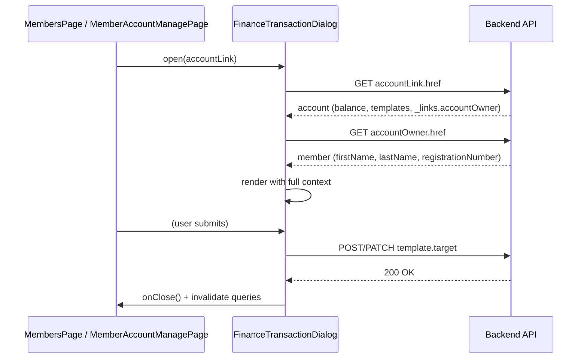

# Design: Unified Finance Dialog (gh-273)

## Context

Finance modul je v provozu se dvěma samostatnými overlays (`HalFormButton name="deposit"` a `HalFormButton name="charge"`) na stránce `MemberAccountManagePage`. Pro spuštění operace musí finance manager nejdřív otevřít detail účtu člena (přes ikonu `PiggyBank` v member listu) a tam zvolit jedno ze dvou tlačítek. Aktuální flow vyžaduje navigaci i pro single-shot operace, což zpomaluje běžnou administrativu (typicky batch deposit/charge přes víc členů najednou).

Pencil mockup (`pencil/klabis-members.pen`, node `0gRCr`) navrhuje jeden overlay s underline-style tabs, zvýrazněným balance pruhem v hlavičce a CTA tlačítkem reflektujícím aktivní operaci.

Backend exponuje deposit/charge jako dvě HAL+FORMS templates na member-account resource. Templates jsou conditional podle autorit (FINANCE:MANAGE). Member-account resource dnes obsahuje linky `self`, `transactions` — ale nikoli odkaz na vlastníka účtu, takže klient nemůže z account resource odvodit jméno/registrationNumber bez znalosti memberId.

## Goals / Non-Goals

**Goals:**
- Sloučit deposit a charge overlay do jednoho dialogu s tabs pro přepínání operace.
- Učinit dialog soběstačnou komponentou, která dostává pouze HAL link na member-account a sama si dotáhne všechna potřebná data.
- Zachovat HAL-driven přístup — žádné hardcoded URL, žádné předávání domain dat (jméno, balance) skrz props.
- Odstranit z member listu navigaci na samostatnou stránku účtu; ponechat ji pouze na detailu člena.
- Sjednotit vizuální podobu ikon pro finance napříč aplikací (Banknote).
- Backend: doplnit member-account resource o link na vlastníka, aby dialog mohl získat basic profile info HAL navigací.

**Non-Goals:**
- Změny v deposit/charge endpointech, doménové logice nebo validacích.
- Změny v reverse transaction flow (zůstává v tabulce transakcí na MemberAccountManagePage).
- Změny v autorizacích a v permission systému.
- Změna pagination/filteringu transakcí na MemberAccountManagePage.
- Mobile / responsive redesign (řešeno standardním Modal komponentem, ne tímto changem).
- Inline historie transakcí v dialogu (vyhozeno z původního Pencil mockupu jako overkill — historie zůstává jen na samostatné stránce účtu).

## Decisions

### Decision 1: Sloučení provést na frontendu, backend ponechat se dvěma templates

**Volba:** Frontend renderuje sloučený dialog, ale stále používá dvě samostatné HAL+FORMS templates (`deposit`, `charge`) z member-account resource. Při přepnutí tabu se mění aktivní template, submit posílá na endpoint z aktivního template.

**Alternativy:**
- Zavést backendovou sloučenou template s field `type: enum(DEPOSIT|CHARGE)` — vyžadovalo by backend refactor (validace, ChargeService vs DepositService dispatch) jen kvůli UI prezentaci.
- Hybridní řešení (pomocný link agregující obě templates) — komplikace bez benefitu.

**Rationale:** Deposit a charge jsou sémanticky dvě samostatné operace s vlastními validacemi (charge má overdraft check). Backend rozdělení je správné. Sloučení je čistě UI/UX záležitost — nemá smysl ho protlačovat do doménového modelu.

### Decision 2: Tabs (underline-style) namísto segmented toggle

**Volba:** Approximation Pencil mockupu — underline-style tabs s ikonou + textem. Aktivní tab má primary barvu textu + 2px underline.

**Alternativy:** Segmented buttons (mutually exclusive button group), radio cards.

**Rationale:** Designer se rozhodl pro tabs. Underline-style je vizuálně tišší než segmented buttons, a v overlay (kde už je dost vizuálních prvků — title, close, balance bar) je tato tlumenost žádoucí. Tabs sémanticky implikují "různé pohledy na stejnou věc" — což zde technicky sedí (dvě templates, jeden member-account).

### Decision 3: Zachování form state při přepnutí tabu

**Volba:** Společný React state pro amount a note. Při přepnutí tabu se hodnoty zachovávají. Při submitu se posílá payload pro aktivní template (endpoint + jeho field schema).

**Alternativy:** Per-tab state (každý tab má vlastní formik instance) — vyhazuje hodnoty při přepnutí.

**Rationale:** Deposit a charge mají identické input fieldy (amount + occurrenceDate + optional note). Přepnutí tabu je vědomá akce uživatele; jeho předchozí input má smysl zachovat. Vyhazování by frustrovalo (typicky uživatel jen ověřuje druhý tab).

### Decision 4: Default tab = poslední volba uživatele (localStorage)

**Volba:** Persistovat poslední aktivní tab do `localStorage` pod jediným globálním klíčem (např. `klabis.financeDialog.lastTab`). Při otevření dialogu se přečte a nastaví. První otevření = default `deposit`.

**Alternativy:**
- Per-member preference — over-engineering, admin si nepamatuje, co naposled dělal s konkrétním členem.
- Per-session — polovičatá varianta.
- Vždy deposit — nereflektuje workflow návyky.

**Rationale:** Admin obvykle dělá batch operací stejného typu (vyúčtoval startovné → strhává všem; přišly příspěvky → vkládá všem). Globální persistence sleduje aktuální workflow uživatele bez extra UI.

### Decision 5: CTA tlačítko mění barvu podle aktivního tabu

**Volba:** Primary CTA tlačítko v patičce dialogu má zelenou (#059669) pro deposit a destruktivní/červenou pro charge. Text reflektuje label aktivního tabu ("Připsání vkladu" / "Stržení částky").

**Rationale:** Charge = peníze pryč z účtu člena = silnější signál "pozor". Barva nese informaci a snižuje riziko nedopatření. Konzistentní s běžným UX patternem (destructive action = červená).

### Decision 6: Graceful degradation — skrytí tabs při single permission

**Volba:** Pokud uživatel má autoritu jen na jednu z operací, dialog se otevře bez tabs a zobrazí jen formulář pro dostupnou operaci. Pokud nemá ani jednu, ikona/tlačítko se nezobrazí (zachování dnešního `hasAnyManagerAffordance` pattern z `MemberAccountManagePage.tsx:40`).

**Rationale:** Tabs jsou kognitivní šum, když je k dispozici jen jedna volba. UI se přirozeně přizpůsobí podle HAL+FORMS metadata (template přítomna ↔ akce povolena).

### Decision 7: Dialog jako soběstačná komponenta s vlastním fetch flow

**Volba:** `FinanceTransactionDialog` přijímá pouze HAL link na member-account resource (`accountLink: Link`) a `onClose: () => void`. Žádné domain data (jméno, balance, member ID) jako props. Komponenta interně:

1. Fetch 1: GET `accountLink.href` → `{ balance, currency, _templates: { deposit, charge }, _links: { self, transactions, accountOwner, ... } }`
2. Fetch 2: GET `_links.accountOwner.href` → `{ firstName, lastName, registrationNumber, ... }`
3. Wait for both, pak render.

**Alternativy:**
- Předávat data přes props — komponenta není reuse-friendly (každý caller musí předem mít načteného membera a account).
- Předávat memberId a komponenta si sestaví URL — porušení HAL principu (`Don't hardcode URLs` z CLAUDE.md).

**Rationale:** Komponenta je nezávislá na callerovi. TanStack Query cache odstíní duplicitní fetche (na `MemberAccountManagePage` má caller už account načtený — query s tím samým klíčem proběhne bez síťového volání).

### Decision 8: Wait-for-both rendering strategy

**Volba:** Dialog se neotevře (resp. zobrazí skeleton overlay), dokud nejsou obě data načtena. Žádné progresivní načítání hlavičky.

**Rationale:** Hlavička bez jména člena nebo bez balance vypadá špatně, a po doplnění "skáče". Header je důležitý kontextový prvek (potvrzení, kterému členovi admin operaci provádí) — musí být kompletní před prvním paintem.

### Decision 9: Nový HAL link rel `accountOwner` na member-account resource

**Volba:** `MemberAccountPostprocessor` přidá link rel `accountOwner` → `methodOn(MembersController.class).getMember(memberId)`.

**Alternativy:** `member` (kratší, ale méně explicitní), nestandardní IANA rel.

**Rationale:** `accountOwner` explicitně popisuje vztah (account → its owner). V kontextu API odpovědi z member-account je `member` slovo už použité na jiných místech (např. embedded entity); `accountOwner` je jednoznačné. Autorizace OK — každý přihlášený člen vidí basic member info, takže follow link funguje pro všechny finance managery.

### Decision 10: Ikona Banknote jako vizuální identifier pro "finanční operace"

**Volba:**
- Member list: nová ikona `Banknote` (lucide) → otevírá sloučený dialog.
- Member detail: změna stávající `PiggyBank` → `Banknote` u tlačítka navigujícího na účet (label zachovat).
- MemberAccountManagePage: jedno tlačítko s ikonou `Banknote` (místo dvou tlačítek deposit/charge).

**Rationale:** Banknote evokuje transakci (akci); konzistentní s ikonou v hlavičce sloučeného dialogu (Pencil mockup používá Banknote). Vizuální spojnice: kliknu na Banknote → vidím stejnou ikonu v hlavičce dialogu.

### Decision 11: Zánik navigace na stránku účtu z member listu

**Volba:** Z member listu zaniká odkaz na `MemberAccountManagePage`. Tato stránka je dostupná pouze z `MemberDetailPage` (FINANCE:MANAGE) a z hlavního menu (vlastní účet).

**Rationale:** Sloučený dialog pokrývá běžnou potřebu (rychlá transakce ze seznamu). Detail účtu (historie, filtry, reverse) je sekundární use-case — dvojí přístupová cesta vytváří kognitivní zátěž a vede k inconsistentnímu UX.

## Risks / Trade-offs

- **[Risk]** Dvojí fetch (account + accountOwner) zvyšuje latenci otevření dialogu oproti dnešnímu jednoduchému přechodu na stránku.
  **Mitigation:** TanStack Query cache — pokud uživatel už viděl account nebo basic member info (např. přišel z member listu, kde je member info v summary), drtivá většina volání bude cache hit. Druhý dotaz (member detail) je malý JSON. Wait-for-both je předpokládaný UX i pro běžný modal v aplikaci.

- **[Risk]** Při přepnutí tabu zůstávají hodnoty, ale uživatel může submitnout charge s amount, který původně chtěl jako deposit (záměna typu operace).
  **Mitigation:** CTA tlačítko mění barvu (zelená vs. červená) a label podle aktivního tabu — uživatel má jasný vizuální signál, kterou operaci submituje. Charge má navíc backend validaci (overdraft check) jako safety net.

- **[Risk]** localStorage default může působit "nedeterministicky" — uživatel B otevře dialog na shared workstation a vidí default podle uživatele A.
  **Mitigation:** Akceptováno — Klabis je SPA s OIDC; shared workstations nejsou cílový scenario. Pokud problém v praxi nastane, dá se klíč rozšířit o user ID. Není to teď priorita.

- **[Risk]** Zánik navigace z member listu změní zaběhnutý zvyk uživatelů, kteří kliknutím na PiggyBank chodili na detail účtu.
  **Mitigation:** Navigace zůstává na detail člena (klik na řádek v member listu → MemberDetailPage → Banknote tlačítko). Krok navíc, ale logická hierarchie (detail člena = jeden zdroj všech akcí pro daného člena).

- **[Trade-off]** Sloučený dialog vs. dva původní overlays — méně tlačítek nahoře na stránce účtu (čistší), ale interakce vyžaduje extra klik pro výběr tabu.
  **Akceptace:** Default tab je preserved, takže pro batch workflow je extra klik eliminován. Pro single-permission scenario tabs nejsou (graceful degradation).

## Migration Plan

1. **Backend (1):** Přidat `accountOwner` link rel do `MemberAccountPostprocessor`. Aktualizovat backendový test. Bez breaking impact (additive HAL link).
2. **Regenerate OpenAPI:** `npm run openapi` (frontend types).
3. **Frontend (1):** Implementovat `FinanceTransactionDialog` komponentu (samostatně, izolovaně, s vlastním testem). Není ještě nikde použita.
4. **Frontend (2):** Integrovat `FinanceTransactionDialog` do `MemberAccountManagePage` — nahradit dvojici `HalFormButton` jedním tlačítkem otevírajícím dialog.
5. **Frontend (3):** Integrovat do `MembersPage` — odstranit `PiggyBank` ikonu, přidat `Banknote` ikonu otevírající dialog.
6. **Frontend (4):** V `MemberDetailPage` zaměnit ikonu `PiggyBank` → `Banknote`.
7. **QA:** Otestovat: oba taby, single-permission scenarios, switching with preserved values, persistence across sessions, oba vstupní body do dialogu.

**Rollback:** Frontend revert je samostatný (čistá kompozice). Backend `accountOwner` link je additive — může zůstat bez harm i po revertu frontendu.
