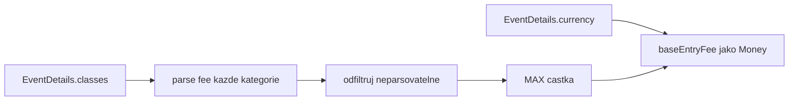
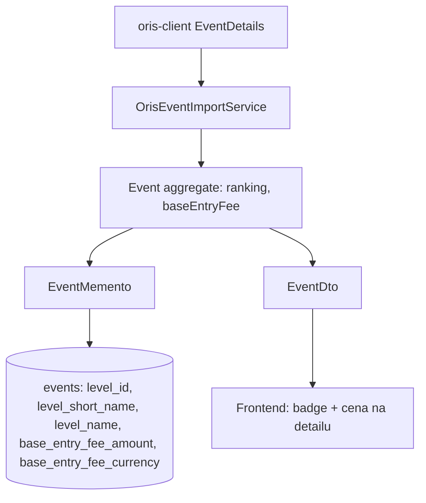

## Context

Závod (Event) v Klabisu je aggregate root v modulu `events`. Dnes eviduje název, datum, místo, pořadatele, typ závodu, kategorie a registrační uzávěrky. Data se importují a synchronizují z ORIS přes `OrisEventImportService`, který mapuje `EventDetails` (z knihovny `oris-client`) na doménové příkazy `CreateEventFromOris` a `SyncFromOris`.

Pro připravovaný výpočet spoluúčasti člena na startovném (change `add-membership-fees`, issue #274) musí závod nově nést dvě hodnoty z ORIS:

1. **Žebříček/série** (ORIS `Level`) — pravidla úrovní rozlišují procentuální doplatek podle kombinace typ závodu + žebříček.
2. **Základní cenu startovného** — procentuální pravidla počítají doplatek z této ceny.

Ověřeno proti reálnému ORIS API a knihovně `oris-client 0.1.0`:

- `EventDetails.level()` vrací `Level(int id, String shortName, String nameCZ, String nameEN)`. ORIS má 22 hodnot žebříčku (MČR, ŽA, ŽB, OŽ, ČP, …).
- Cena startovného **není** na úrovni závodu — je vždy per-kategorie: `EventDetails.classes()` → `Map<String, EventClass>`, kde `EventClass.fee()` vrací cenu jako `String` (např. „650", „320", „0").
- `EventDetails.currency()` existuje (typicky „CZK").
- ORIS pole `ranking()`/`rankingKoef()` (flag 0/1 + koeficient celostátního hodnocení) je **odlišný koncept** od `Level` a do Klabisu se neimportuje.

## Goals / Non-Goals

**Goals:**

- Závod nese **ranking** (žebříček/série) odvozený z ORIS `Level` — uložený jako `levelId` plus denormalizovaný snapshot (`shortName`, `nameCZ`) pro zobrazení.
- Závod nese **základní cenu startovného** (`baseEntryFee`) jako částku s měnou (Money), měna se synchronizuje z ORIS (typicky CZK).
- Import i synchronizace z ORIS naplní obě hodnoty (včetně měny z ORIS).
- Obě hodnoty jsou editovatelné správcem (pro ručně vytvořené akce nebo korekce).
- Ranking a cena jsou viditelné na **detailu akce**.

**Non-Goals:**

- Navýšená cena za pozdní přihlášku (`ManualFeeEntryDate2/3`) — odloženo na samostatný change.
- Cena per kategorie — ukládá se jen jedna reprezentativní hodnota.
- Aktivní vícemenová logika (konverze, výběr měny v UI) — cena nese měnu z ORIS, ale v praxi je vždy CZK; konverze ani víceměnové ceníky nejsou součástí.
- Import ORIS `Ranking`/`RankingKoef` (celostátní hodnocení) — mimo rozsah.
- Samotný výpočet doplatků úrovní — to je change `add-membership-fees`.
- **Jakékoli změny v seznamu akcí** — ranking ani cena se v seznamu nezobrazují; obojí jen na detailu akce.

## Decisions

### Rozhodnutí 1: Reprezentace rankingu — `levelId` + denormalizovaný snapshot

Ranking se uloží jako value object `EventRanking(int levelId, String shortName, String name)`:

- `levelId` — stabilní klíč z ORIS pro matchování pravidel úrovní.
- `shortName`, `name` — denormalizovaný snapshot z ORIS pro zobrazení a lokalizaci (čeština).

**Proč:** `levelId` sám o sobě nestačí pro UI (musela by se mapovat na text). Mapovaný enum by byl typově bezpečný, ale křehký — nová hodnota žebříčku v ORIS by rozbila import a vyžadovala údržbu enumu. Samostatná lookup entita (jako `event_types`) je nadměrná — žebříček nemá vlastní lifecycle ani admin správu, je to čistě atribut převzatý z ORIS. Snapshot je nejjednodušší a odolný vůči změnám v ORIS.

**Trade-off:** Snapshot se neaktualizuje, pokud ORIS přejmenuje žebříček — ale to je akceptovatelné (text se vždy přepíše při příští synchronizaci závodu).

### Rozhodnutí 2: Základní cena — `MAX(EventClass.fee)`

Při importu/synchronizaci se `baseEntryFee` odvodí jako **maximum** ceny přes všechny kategorie závodu.

**Proč MAX:** Hlavní dospělé kategorie (H21/D21) mají typicky nejvyšší cenu; juniorské/žákovské a zlevněné/nulové varianty (`*A` s fee=0) mají nižší. MAX je robustní bez znalosti konkrétních názvů kategorií (které se mezi typy závodů liší). Hledání podle názvu „H21/D21" je křehké — žákovské závody tyto kategorie nemají. Modus je nejednoznačný při shodě.

**Trade-off:** MAX nereprezentuje juniorské ceny — ale pro výpočet procentuálního doplatku z „ceny závodu" je dospělá cena správným referenčním bodem.

**Parsování:** `EventClass.fee()` je `String`; prázdné/neparsovatelné hodnoty se přeskočí. Pokud žádná kategorie nemá platnou cenu, `baseEntryFee` zůstane prázdné.

### Rozhodnutí 3: Typ ceny — Money (částka + měna), měna z ORIS

`baseEntryFee` je hodnota typu **Money** (částka + měna). Měna se synchronizuje z ORIS (`EventDetails.currency()`, typicky „CZK"); částka je `MAX(EventClass.fee)`.

**Proč Money místo holého Integer:** Money je v projektu zavedený value object pro peníze (validace, neporovnatelnost různých měn, konzistentní formátování) a `baseEntryFee` je vstup pro pozdější finanční výpočty (doplatky úrovní) — peníze bez měny jsou v doméně anti-pattern. ORIS měnu poskytuje, takže ji ukládáme spolu s částkou.

**Hranice modulů (důležité):** Existující `com.klabis.finance.domain.Money` patří modulu `finance`; modul `events` na něj nesmí přímo záviset (Spring Modulith dependency rule). Proto se v `events.domain` zavede **vlastní `Money` value object** (stejná sémantika: `BigDecimal amount` + `Currency`, veřejné API `amount()` + `currency()`).

**Rozhodnuto:** vlastní events-lokální `Money` (varianta B) — KISS, nulový dopad na `finance`, za cenu drobné duplicity.

Zvažovaná alternativa (zamítnuta pro tento change): povýšit `Money` do shared kernelu (`common`), aby ho sdílely `finance` i `events`. Dlouhodobě čistší, ale dotýká se `finance` modulu a jeho mementa — mimo rozsah. Konsolidaci do `common` lze řešit samostatně, pokud `Money` začne sdílet víc modulů.

**Persistence:** Money se v `events` tabulce ukládá rozloženě do dvou sloupců — `base_entry_fee_amount` (DECIMAL) a `base_entry_fee_currency` (CHAR(3)) — stejný vzor jako `finance` memento (`amount` + `currency`). Obě nullable; cena je buď celá (částka i měna), nebo prázdná.

### Rozhodnutí 4: Nepovinnost a ruční editace

Oba atributy jsou nullable. Ručně vytvořené akce (tréninky) je nemají; správce je může doplnit přes editaci závodu. Při synchronizaci z ORIS se přepíší hodnotami z ORIS (stejně jako ostatní pole v `SyncFromOris`).

### Rozhodnutí 5: Vrstvy dotčené změnou

- **Doména:** `Event` + nové VO `EventRanking` a events-lokální `Money`; příkazy `CreateEventFromOris`, `SyncFromOris`, `UpdateEvent` rozšířeny.
- **Persistence:** nové sloupce v `events` (migrace do V001 dle CLAUDE.md), mapování v `EventMemento` (cena rozložená na amount + currency).
- **ORIS adapter:** `OrisEventImportService` mapuje `level()`, `MAX(fee)` a `currency()`.
- **API:** `EventDto` + form template (editovatelná pole), HATEOAS beze změny struktury.
- **Frontend:** ranking (badge) a cena s měnou pouze na detailu akce; seznam akcí beze změny.

## Risks / Trade-offs

- **MAX(fee) nemusí být „základní" cena u atypických ceníků** → Pro výpočet doplatku z ceny závodu je dospělá (nejvyšší) cena správným referenčním bodem; správce může opravit ručně.
- **Snapshot názvu žebříčku zastará, pokud ORIS přejmenuje** → Přepíše se při příští synchronizaci závodu; dopad kosmetický.
- **Nová hodnota `Level` v ORIS** → Díky snapshotu (ne enumu) se uloží transparentně bez změny kódu.
- **Migrace existujících závodů** → Nové sloupce jsou nullable; existující řádky zůstanou prázdné, naplní se při příští synchronizaci nebo ruční editaci. Žádný backfill není nutný.
- **`EventClass.fee` jako String s neočekávaným formátem** → Parsování je defenzivní (neparsovatelné se přeskočí); v nejhorším případě `baseEntryFee` zůstane prázdné, ne chyba importu.
- **ORIS `currency()` prázdné nebo neznámé** → Při chybějící/neplatné měně se použije CZK jako default (Klabis je český klub); částka se neztrácí.
- **Duplicita `Money` mezi `finance` a `events`** → Vědomý trade-off pro izolaci modulů; povýšení do `common` je možná pozdější konsolidace, pokud Money sdílí víc modulů.

## Migration Plan

1. Přidat sloupce `level_id` (INT NULL), `level_short_name` (VARCHAR NULL), `level_name` (VARCHAR NULL), `base_entry_fee_amount` (DECIMAL NULL), `base_entry_fee_currency` (CHAR(3) NULL) do tabulky `events` ve `V001__initial_schema.sql`.
2. Nasazení nezahrnuje backfill — sloupce nullable, naplní se synchronizací.
3. Rollback: sloupce jsou aditivní a nullable; odebrání bez ztráty existující funkčnosti.
