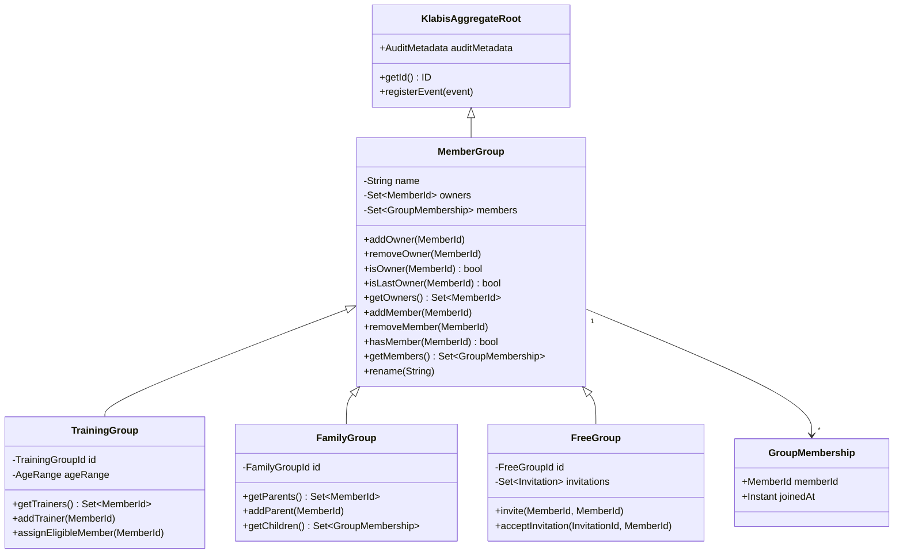

## Context

`UserGroup` je v současnosti kompozitní building block v `common.usergroup`. Tři skupinové agregáty (`TrainingGroup`, `FamilyGroup`, `FreeGroup`) ho drží jako `private final` field a delegují přes něj ~13–15 metod. Každé volání vyžaduje překlad `MemberId ↔ UserId` na vstupu i výstupu.

`common.usergroup` dnes obsahuje:
- `UserGroup` — logika členství a ownership (na `UserId`)
- `GroupMembership` — value object (na `UserId`)
- `WithInvitations` — interface pro pozvánkový flow (na `UserId`)
- `Invitation` — value object pozvánky (na `UserId`)
- 8 doménových výjimek

Výjimky z `common.usergroup` jsou handlery registrovány v globálním `common.mvc.MvcExceptionHandler`, přestože jsou čistě skupinovými výjimkami.

## Goals / Non-Goals

**Goals:**
- Přesunout `UserGroup` do `groups` modulu jako `MemberGroup` s `MemberId` API
- Nahradit kompozici dědičností — agregáty rozšíří `MemberGroup` místo ho držet
- Odstranit překladovou vrstvu `MemberId ↔ UserId` z veřejného API skupin
- Přesunout skupinové výjimky do `groups` modulu s vlastním exception handlerem
- Odstranit celý `common.usergroup` package

**Non-Goals:**
- Žádná změna REST API ani chování skupin z pohledu uživatele
- Nová skupinová funkcionalita
- Změna persistence schématu (DB tabulky zůstanou beze změny)

## Decisions

### 1. MemberGroup jako abstraktní základní třída

`MemberGroup` rozšíří `KlabisAggregateRoot` a stane se abstraktní třídou pro všechny skupinové agregáty. Tím se řeší problém jediné dědičnosti — agregáty nemohou rozšiřovat zároveň `UserGroup` i `KlabisAggregateRoot`.

| Element | Změna |
|---|---|
| `MemberGroup` | PŘIDÁNO — nahrazuje `UserGroup`, rozšiřuje `KlabisAggregateRoot`, `MemberId` API |
| `GroupMembership` | ZMĚNĚNO — `UserId userId` → `MemberId memberId` |
| `TrainingGroup` | ZMĚNĚNO — `extends MemberGroup`, odstraněn `private final UserGroup userGroup` |
| `FamilyGroup` | ZMĚNĚNO — `extends MemberGroup`, odstraněn `private final UserGroup userGroup` |
| `FreeGroup` | ZMĚNĚNO — `extends MemberGroup`, odstraněn `private final UserGroup userGroup` |
| `UserGroup` | ODSTRANĚNO |
| `common.usergroup.*Exception` | PŘESUNUTO do `groups.common.domain` |

### 2. Umístění MemberGroup

`MemberGroup` patří do `groups.common.domain` — není sdíleným buildig blockem pro jiné moduly, slouží výhradně skupinovým agregátům.

### 3. WithInvitations a Invitation

`WithInvitations` interface a `Invitation` value object se přesunou do `groups.freegroup.domain` — jsou výhradně využívány `FreeGroup`. API přepíše z `UserId` na `MemberId`. `Invitation` interně zachová `UUID` pro persistence kompatibilitu, ale veřejné gettery vrátí `MemberId`.

### 4. Exception handler

Skupinové výjimky se přesunou z `common.usergroup` do `groups.common.domain`. Handlery se přesunou z `MvcExceptionHandler` do nového `GroupsExceptionHandler` (`@RestControllerAdvice`) v `groups` modulu.

### 5. GroupMemento a persistence

`GroupMemento` překládá `MemberId` na `UUID` pro persistence — tato vrstva zůstane beze změny logiky, jen se upraví importy (`GroupMembership.userId()` → `GroupMembership.memberId()`).

## Risks / Trade-offs

- **[Risk] Rozsah změny** — dotýká se ~25 souborů napříč `common` a `groups`. Mitigace: refaktor probíhá v jedné větvi, testy ověří korektnost na každém kroku.
- **[Trade-off] `GroupMembership` změna** — `memberId()` místo `userId()` se propaguje do REST response mapperů. Všechna místa jsou v `groups` modulu, žádný jiný modul `GroupMembership` neimportuje.

## Migration Plan

1. Vytvořit `MemberGroup` + `GroupMembership` s `MemberId` API v `groups.common.domain`
2. Přesunout výjimky do `groups.common.domain`, přidat `GroupsExceptionHandler`
3. Přepsat `TrainingGroup` → `extends MemberGroup`
4. Přepsat `FamilyGroup` → `extends MemberGroup`
5. Přepsat `FreeGroup` → `extends MemberGroup`, přesunout `WithInvitations` + `Invitation`
6. Upravit `GroupMemento` (importy a `memberId()`)
7. Odstranit `common.usergroup` package, odebrat handlery z `MvcExceptionHandler`

Každý krok je nezávisle testovatelný. Rollback = revert větve, žádná DB migrace.
