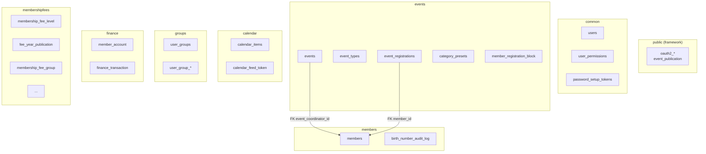

## Context

Klabis backend je modulární monolit (Spring Modulith) s ~30 doménovými tabulkami v jediném PostgreSQL schématu `public`. Každý modul (members, events, calendar, groups, finance, membershipfees, common) má svůj vlastní balíček a doménové hranice, ale tyto hranice nejsou vyjádřeny na úrovni databáze. Orientace v databázi vyžaduje znalost kódu nebo čtení komentářů v migračním souboru.

Tabulky infrastrukturních frameworků — Spring Authorization Server (V002) a Spring Modulith event publication (V003) — nemají konfiguraci pro změnu schématu, a proto zůstávají v `public`.

## Goals / Non-Goals

**Goals:**
- Každý doménový modul má vlastní databázové schéma pojmenované shodně s modulem
- Příslušnost tabulky k modulu je čitelná přímo z databáze (DB klient, schema browser)
- Změna je čistě infrastrukturní — žádná funkční změna API ani business logiky
- Kompatibilita s H2 (testy) i PostgreSQL (produkce)

**Non-Goals:**
- Přesun tabulek Spring Authorization Serveru nebo Spring Modulith
- Změna názvů tabulek
- Zavedení row-level security nebo GRANT oprávnění per schéma
- Příprava na rozpad do mikroslužeb (to by vyžadovalo odstranění cross-schema FK)

## Decisions

### D1 — Schéma per modul, název shodný s modulem

Každý Spring Modulith modul dostane jedno schéma pojmenované shodně s názvem modulu:

| Schéma          | Tabulky                                                                                                          |
|-----------------|------------------------------------------------------------------------------------------------------------------|
| `members`       | `members`, `birth_number_audit_log`                                                                              |
| `common`        | `users`, `user_permissions`, `password_setup_tokens`                                                             |
| `events`        | `events`, `event_types`, `event_type_oris_disciplines`, `event_registrations`, `category_presets`, `member_registration_block` |
| `calendar`      | `calendar_items`, `calendar_feed_token`                                                                          |
| `groups`        | `user_groups`, `user_group_owners`, `user_group_members`, `user_group_invitations`                               |
| `finance`       | `member_account`, `finance_transaction`                                                                          |
| `membershipfees`| `membership_fee_level`, `membership_payment_rule`, `fee_year_publication`, `fee_year_publication_level`, `membership_fee_group`, `membership_fee_group_rule_snapshot`, `fee_group_membership`, `yearly_fee_charge_marker` |
| `public`        | Spring AS tabulky (V002), `event_publication` (V003) — beze změny                                               |



**Alternativa zvažována:** Prefix v názvu tabulky místo schématu (např. `events_event_registrations`). Zamítnuto — přejmenování tabulek by narušilo existující data, je invazivnější, a schémata jsou čistší řešení nabízené přímo databází.

### D2 — Cross-schema FK zůstávají

PostgreSQL plně podporuje FK přes schémata. Dvě existující FK přes hranici modulů:
- `events.events.event_coordinator_id → members.members(id)`
- `events.event_registrations.member_id → members.members(id)`

Tyto FK zůstávají — jejich odstranění by bylo funkční změnou (ztráta referenční integrity na DB úrovni) mimo scope tohoto refaktoringu.

Ostatní cross-module reference (finance, groups, membershipfees) již záměrně FK nemají — to odpovídá principu modulárního monolitu kde aggregate roots různých modulů se referencují pouze přes ID bez FK.

### D3 — `@Table(schema, value)` v Spring Data JDBC

Spring Data JDBC podporuje atribut `schema` v anotaci `@Table`. Každý Memento dostane explicitní `schema`:

```java
// Před
@Table("members")

// Po
@Table(schema = "members", value = "members")
```

H2 v `MODE=PostgreSQL` schémata podporuje — test suite nevyžaduje změny konfigurace, pouze `CREATE SCHEMA` v migraci.

### D4 — Schémata vytvořena v V001, nikoliv nová migrace

Protože projekt používá squashed migrace a instrukce říkají "aktualizovat V001", `CREATE SCHEMA` příkazy jsou přidány na začátek V001. Při prvním nasazení (H2 in-memory) se schémata vytvoří automaticky. Pro existující PostgreSQL databázi by byl potřeba ruční `CREATE SCHEMA` před spuštěním Flyway — aktuálně není produkční prostředí, takže to není relevantní.

## Risks / Trade-offs

| Riziko | Mitigace |
|--------|----------|
| H2 nekompatibilita se schématy | H2 schémata podporuje i v `MODE=PostgreSQL`; ověřeno spuštěním testů po změně |
| Spring Data JDBC generuje dotazy bez schema prefixu | Řeší `@Table(schema=...)` — explicitní schema v každém Mementu |
| Flyway a search_path | Flyway defaultně pracuje se schématem podle datasource URL; `public` zůstane výchozí, doménové schémata jsou explicitní v DDL |
| Test SQL soubory (INSERT/SELECT bez prefixu) | Vyžaduje ruční průchod a doplnění prefixu ve všech test SQL souborech |
