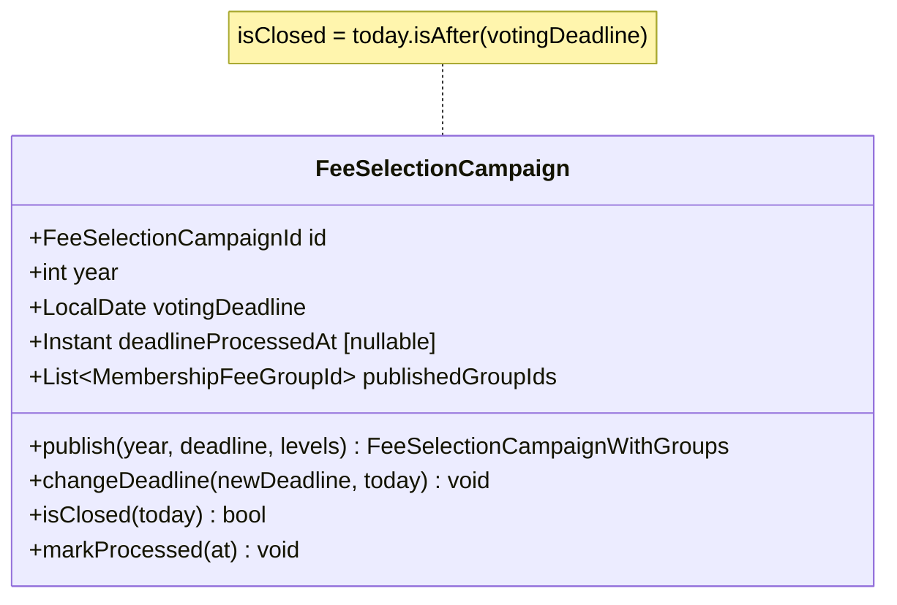

## Context

Modul `membershipfees` spravuje výběr úrovní členských příspěvků. Centrálním agregátem je `FeeYearPublication`, který reprezentuje jedno "vypsání" — sadu dostupných úrovní s deadlinem pro výběr. Aktuálně:

- identita je `FeeYearPublicationId` (UUID), rok je pouze atribut
- `isClosed(today)` je čistě datum-based: `today.isAfter(votingDeadline)`
- neexistuje žádná ochrana proti souběžným aktivním kampaním
- neexistuje operace na změnu deadline
- terminologie "Vypsání pro rok" (FeeYearPublication) je nevýstižná

## Goals / Non-Goals

**Goals:**
- Přidat validaci při zakládání: deadline v budoucnosti, žádná aktivní kampaň
- Přidat operaci změny deadline s validací (ne do minulosti)
- Přejmenovat `FeeYearPublication` → `FeeSelectionCampaign` v celém stacku
- Zachovat stávající logiku scheduleru beze změny chování

**Non-Goals:**
- Předčasné ukončení kampaně administrátorem
- Automatická notifikace členů o změně deadline
- Archivace/mazání kampaní
- Podpora souběžných (paralelních) aktivních kampaní
- Změna logiky fee charges nebo sanction systému

## Decisions

### D1: Stav "uzavřená" zůstává datum-based

**Rozhodnutí:** Ponechat `isClosed(today) = today.isAfter(votingDeadline)` beze změny.

**Rationale:** Bez předčasného ukončení je jediným důvodem uzavření vypršení deadline. Není potřeba žádný dodatečný stavový atribut — KISS.

### D2: Přejmenování FeeYearPublication → FeeSelectionCampaign

**Rozhodnutí:** Přejmenovat v celém stacku — doménový objekt, repository, port, service, REST controller, DTO, frontend stránky, labels, spec.

**Rationale:** Terminologie "kampan" je výrazně výstižnější než "publikace pro rok". Rok není primární identitou (může existovat více kampaní za rok), takže "FeeYear" je matoucí.

**Scope přejmenování:**
- Backend: `FeeYearPublication` → `FeeSelectionCampaign`, `FeeYearPublicationId` → `FeeSelectionCampaignId`, `FeeYearPublicationRepository` → `FeeSelectionCampaignRepository`, `FeeYearPublicationManagementPort/Service` → `FeeSelectionCampaignManagementPort/Service`, controller, DTO, exceptions
- Frontend: `FeeYearPublicationsPage` → `FeeSelectionCampaignsPage`, `FeeYearPublicationDetailPage` → `FeeSelectionCampaignDetailPage`, labels
- DB sloupce/tabulky: `fee_year_publication` → `fee_selection_campaign` (migrace)

### D3: Validace "žádná aktivní kampaň" na aplikační vrstvě

**Rozhodnutí:** Kontrola v `FeeSelectionCampaignManagementService.publishYear()` před vytvořením.

**Rationale:** Logika "existuje aktivní kampaň?" vyžaduje dotaz na repository — patří do aplikační vrstvy, ne do doménového objektu. Doménový objekt zůstane čistý.

```
if (campaignRepository.findActive(today).isPresent()) {
    throw new ActiveCampaignExistsException();
}
```

## Domain Model



| Element | Změna |
|---|---|
| `FeeSelectionCampaign` | Přejmenováno z `FeeYearPublication` |
| `FeeSelectionCampaignId` | Přejmenováno z `FeeYearPublicationId` |
| `changeDeadline(newDeadline, today)` | **NOVÁ** metoda s validací |
| `isClosed(today)` | Beze změny (datum-based) |

## REST API Changes

### Stávající endpoints (přejmenování)

| Původní | Nový |
|---|---|
| `GET /api/membership-fees/publications` | `GET /api/membership-fees/campaigns` |
| `GET /api/membership-fees/publications/{id}` | `GET /api/membership-fees/campaigns/{id}` |
| `POST /api/membership-fees/publications` | `POST /api/membership-fees/campaigns` |

### Nové affordance na campaign resource

**`changeDeadline`** (PATCH `/api/membership-fees/campaigns/{id}/deadline`)
- Request body: `{ "votingDeadline": "2026-12-31" }`
- Validace: `votingDeadline >= today`, kampaň nesmí být uzavřená
- Response: `200 OK` s aktualizovaným campaign resource

### Validace při vytváření (POST campaigns)

Nová chybová odpověď:
- `409 Conflict` — existuje aktivní kampaň (`ActiveCampaignExistsException`)
- `400 Bad Request` — deadline není v budoucnosti (`DeadlineNotInFutureException`)

### HAL links na campaign resource

```json
{
  "_links": {
    "self": { "href": "/api/membership-fees/campaigns/{id}" },
    "campaigns": { "href": "/api/membership-fees/campaigns" }
  },
  "_templates": {
    "changeDeadline": { ... }
  }
}
```

Affordance `changeDeadline` je přítomna pouze pokud je kampaň aktivní (podmíněné hypermedia).

## Migration Plan

1. Přidat DB migraci: přejmenovat tabulku `fee_year_publication` → `fee_selection_campaign`
2. Přejmenovat backend třídy (refactoring — vnitřní změna, API path přejmenování)
3. Přidat metodu `changeDeadline` na doménovém objektu s testy
4. Přidat operaci na port a service
5. Aktualizovat REST controller (nové URL, nová affordance)
6. Přejmenovat frontend stránky a labely

**Rollback:** Migrace je pouze přejmenování — rollback je trivial.

## Glossary

| Termín | Definice |
|---|---|
| **Kampaň volby členského příspěvku** (FeeSelectionCampaign) | Časově ohraničená výzva členům k výběru úrovně členského příspěvku pro daný rok |
| **Aktivní kampaň** | Kampaň, jejíž deadline ještě nenastal |

## Open Questions

_(žádné — vše bylo rozhodnuto v explore fázi)_
