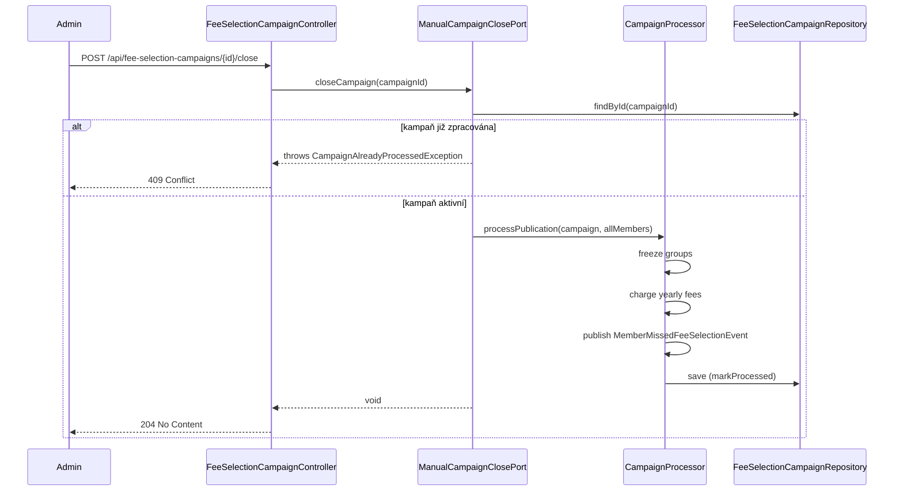

## Context

Kampaň členských příspěvků se automaticky zpracuje každou noc v 3:00 poté, co uplyne hlasovací deadline (`votingDeadline`). Zpracování provádí `CampaignEndProcessingPort.processCampaignEnd(LocalDate)`, který najde kampaně s prošlým deadlinem a nenullovým `deadlineProcessedAt` a provede: zmrazení skupin, výpočet ročních poplatků, sankce pro členy bez volby.

Administrátor doposud nemůže spustit toto zpracování manuálně — musí čekat na noční scheduler.

## Goals / Non-Goals

**Goals:**
- Administrátor může okamžitě uzavřít aktivní kampaň tlačítkem v jejím detailu
- Manuální uzavření provede stejnou logiku jako automatické (freeze, charge, sanctions)
- Duplicitní zpracování je vyloučeno (idempotentní kontrola přes `deadlineProcessedAt`)

**Non-Goals:**
- Změna hlasovacího deadlinu při manuálním uzavření
- Upozornění členů před manuálním uzavřením
- Možnost uzavřít kampaň bez autority MEMBERS:MANAGE

## Decisions

### 1. Nový port `ManualCampaignClosePort` místo rozšíření existujícího

Stávající `CampaignEndProcessingPort.processCampaignEnd(LocalDate)` je navržen pro dávkové zpracování — hledá všechny uzavřené nespracované kampaně podle data. Pro manuální uzavření konkrétní kampaně by bylo nutné buď předat datum v budoucnosti (hack) nebo hledat kampaň zcela jinak.

**Rozhodnutí:** Nový port `ManualCampaignClosePort.closeCampaign(FeeSelectionCampaignId)` se zaměřením na jednu kampaň. Sdílená implementační logika zpracování bude extrahována do privátní metody volaná oběma porty.

Alternativa zvažovaná: rozšíření `CampaignEndProcessingPort` o přetíženou metodu → odmítnuto, port by měl dvě rozdílné odpovědnosti (dávka vs. jednotlivec).

### 2. Sdílení logiky zpracování přes extrakci do společné třídy

Logika zpracování (freeze groups → charge fees → publish sanctions → markProcessed) je v `CampaignEndProcessingPortImpl`. Místo duplicity bude extrahována do `CampaignProcessor` (balíček `application`), která bude injektována do obou portů.

### 3. Affordance na self-linku kampaně, podmíněná stavem

Tlačítko uzavření bude exponováno jako HAL+FORMS affordance na self-linku detailu kampaně — konzistentně s existujícím vzorem affordance pro `changeDeadline`. Affordance bude přidána pouze pokud `!campaign.isClosed(today) && campaign.getDeadlineProcessedAt() == null`.

### 4. Endpoint `POST /api/fee-selection-campaigns/{id}/close`

Akce nemá request body — jde o příkaz bez parametrů. Vrací `204 No Content` po úspěchu.

## REST API

### Nový endpoint

| Atribut | Hodnota |
|---|---|
| Method | `POST` |
| Path | `/api/fee-selection-campaigns/{id}/close` |
| Authority | `MEMBERS:MANAGE` |
| Request body | — (prázdný) |
| Response (success) | `204 No Content` |
| Response (already closed) | `409 Conflict` |
| HAL affordance name | `close` |

Affordance je přidána na self-link detailu kampaně pouze pokud kampaň není uzavřena ani zpracována.

## Domain Changes

Žádné změny v doménovém modelu. `FeeSelectionCampaign.markProcessed(Instant)` a `isClosed(LocalDate)` jsou dostačující.

## Tok manuálního uzavření

## Risks / Trade-offs

- **[Risk] Manuální uzavření před deadlinem sankcionuje členy, kteří ještě mohli volit** → Záměrné chování (viz průzkum), administrátor přebírá odpovědnost
- **[Risk] Souběh scheduleru a manuálního uzavření** → Zmírněno idempotentní kontrolou `deadlineProcessedAt` — druhý pokus vrátí 409 nebo je tiše přeskočen v scheduleru

## Open Questions

Žádné.

## Glossary

| Termín | Definice |
|---|---|
| Manuální uzavření kampaně | Administrátorem iniciované okamžité spuštění zpracování kampaně bez čekání na noční scheduler |
| Zpracování kampaně | Sada akcí po uzavření kampaně: zmrazení skupin, výpočet poplatků, sankce pro členy bez volby |
