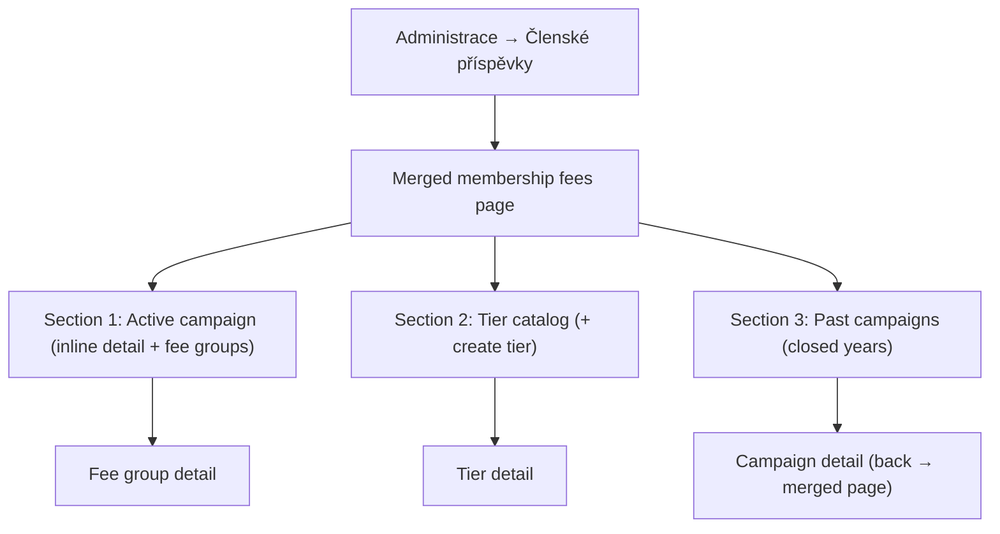

## Why

Membership fee administration is currently split across two separate main-menu destinations — the fee tier catalog and the fee selection campaigns list — even though an administrator manages them as one cohesive task. Merging them into a single "Členské příspěvky" page under the Administrace section gives administrators one place to see the active campaign, the tier catalog, and past campaigns, reducing menu clutter and navigation overhead.

## What Changes

- Introduce a single administrative page **"Členské příspěvky"** that replaces the two existing destinations (tier catalog + fee selection campaigns) and lives in the **Administrace** section of the main menu.
- The page presents three sections:
  1. **Active campaign** — full inline detail of the currently active campaign (year, voting deadline, change-deadline action, and its fee groups) when one exists; hidden when there is no active campaign.
  2. **Tier catalog** — the list of membership fee tiers with the create-tier action and navigation to tier detail (moved unchanged from the current tiers page).
  3. **Past campaigns** — the list of closed (past) campaign years with navigation to campaign detail; the active campaign year is excluded from this list to avoid duplication with section 1.
- Extend the `membership-fee-tiers` API resource so that, for administrators (`MEMBERS:MANAGE`), it carries `activeCampaign` and `pastCampaigns` links, making the tiers resource the entry point for the merged page. The `activeCampaign` link is present only when an active campaign exists.
- **BREAKING (navigation):** Remove the standalone `membership-fee-tiers` and `fee-selection-campaigns` main-menu entries; expose the merged page under a single navigation link in the Administrace section.
- The existing campaign detail page and tier detail page are retained as standalone destinations reached by navigation from the merged page; their "back" navigation targets the merged page.

## Capabilities

### New Capabilities

<!-- none -->

### Modified Capabilities

- `membership-fees`: The fee tier catalog resource gains administrator-only navigation to the active campaign and to past campaigns, so that an administrator can reach the active campaign detail and the closed-campaign list from a single entry point. The set of campaigns offered as "past campaigns" excludes the active campaign.
- `application-navigation`: Replace the two separate membership-fee menu entries with a single "Členské příspěvky" entry placed in the Administrace section.

## Impact

- **Frontend**: New merged page composed of three section components (active campaign, tier catalog, past campaigns); a shared fee-groups table component reused by the active-campaign section and the campaign detail page; navigation/menu mapping updated (new `membership-fees` rel added to the admin section, old rels removed); campaign and tier detail "back" links retargeted; routing updated.
- **Backend**: `membership-fee-tiers` controller/postprocessor adds `activeCampaign` and `pastCampaigns` links gated on `MEMBERS:MANAGE`; root-navigation link postprocessors for the two old destinations replaced by one for the merged page.
- **Specs**: `membership-fees` and `application-navigation`.
- **Out of scope**: The member-facing fee choice page (`MemberFeeChoicePage`) is unchanged. The domain invariant that a published campaign has at least one fee group already holds and is not modified.
