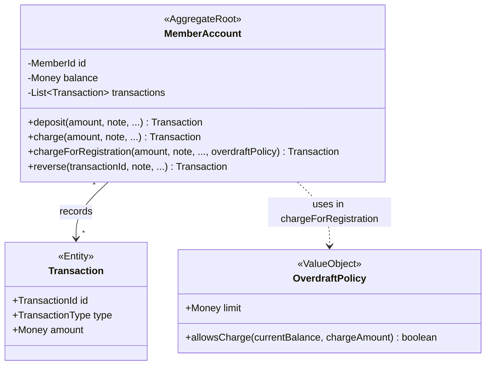

## Context

The `member-accounts` capability (finance module) gives every member a prepaid CZK account. Today, `MemberAccount.charge(...)` always consults an `OverdraftPolicy` and rejects any charge that would push the balance below the globally configured limit (default −500 CZK). `reverse(...)` is already exempt.

Two production callers go through this single limited `charge()` path:

- The manual finance-manager endpoint `POST /api/members/{id}/account/transactions/charge` (`MemberAccountController.charge`).
- The automatic yearly membership-fee charge (`membershipfees.application.CampaignProcessor.chargeYearlyFees`), recorded under the system user.

The proposal repositions the limit so it guards **only** event-registration payments — a self-service flow that does **not** exist in the codebase yet. Both current callers (manual + membership-fee) must become unlimited; the limit must survive only on a new, currently-uncalled path reserved for registration payments.

Constraints: KISS, dependency rule inward, the domain aggregate owns the invariant, and this change must not introduce the registration integration (explicit scope guard from the proposal).

## Goals / Non-Goals

**Goals:**

- Make `MemberAccount.charge(...)` unconditionally succeed (subject only to the existing "amount must be positive" assertion), dropping the overdraft check.
- Introduce a distinct domain operation that records a charge **and** enforces the overdraft limit, semantically reserved for registration payments.
- Keep `reverse(...)` behavior and the overdraft-limit configuration unchanged.
- Leave the manual charge endpoint and the membership-fee charge on the now-unlimited `charge(...)`.

**Non-Goals:**

- No event-registration code: the new limit-enforcing operation has **no production caller** after this change. It exists, is unit-tested, and waits for a future change to wire it to registrations.
- No new REST endpoint, no HAL link/affordance changes, no persistence-schema change.
- No change to how the limit value is configured (`klabis.finance.overdraft-limit`).
- No change to authorization (`FINANCE:MANAGE`).

## Decisions

### Decision 1: Separate domain method `chargeForRegistration(...)` vs. a parameter on `charge(...)`

**Chosen:** Add a second method on `MemberAccount` that records the same kind of debit transaction but enforces the `OverdraftPolicy`. `charge(...)` loses its `OverdraftPolicy` parameter entirely and never checks the limit.

```
charge(amount, note, occurredAt, recordedAt, recordedBy)                       // unlimited
chargeForRegistration(amount, note, occurredAt, recordedAt, recordedBy, policy) // enforces limit
```

**Rationale:** The two operations differ by an invariant, not by data. Encoding the difference as a method makes the limited path unmistakable at every call site and keeps the limit decision out of callers' hands (a caller cannot "forget" a flag). Matches the user's chosen variant.

**Alternatives considered:**

- *Boolean/enum parameter on `charge()`* (`charge(..., enforceLimit)` or a `ChargeReason`): one method, but every caller must pass the right value and the invariant becomes a runtime argument rather than a structural guarantee. Rejected as more error-prone and less readable. (If a future change needs to *persist* the charge's origin, a `Transaction` attribute can be added then — it is not needed to express the invariant now.)
- *Keep the check in `charge()` and add `chargeUnlimited()`*: inverts the safer default. The common, always-allowed administrative path would carry the scarier name, and the limited registration path (which doesn't exist yet) would own the plain name. Rejected.

### Decision 2: Both transactions stay `TransactionType.OTHER`

A registration charge and an administrative charge are both debits stored as a negative-amount `OTHER` transaction (same as today's `Transaction.charge(...)`). This change does **not** introduce a new transaction type or a persisted "origin" marker — distinguishing them is not a current requirement and would be speculative (KISS). The history/append-only and reversal semantics are identical for both.

**Trade-off:** Once registrations exist, the history won't intrinsically tell a registration charge apart from a manual one beyond the note. Accepted for now; revisit if a future requirement needs it.

### Decision 3: Application layer — keep `ChargePort` unlimited, defer a registration port

`ChargeService` / `ChargePort` continue to delegate to the unlimited `charge(...)`, so `CampaignProcessor` and the manual endpoint need no change beyond the dropped policy argument inside `ChargeService`. A dedicated application port for the limited path is **not** added in this change because it would have no adapter/caller (the scope guard). The future registration change introduces that port together with its caller.

**Alternative considered:** Add an unused `RegistrationChargePort` now for symmetry. Rejected — an uncalled port is dead surface area; the domain method alone fully satisfies "prepare the rule".

### Domain model changes



| Element | Change | Notes |
|---|---|---|
| `MemberAccount.charge(...)` | **CHANGED** | Drops the `OverdraftPolicy` parameter and the `allowsCharge` check; always records the debit. Used by manual charges and membership-fee charges. |
| `MemberAccount.chargeForRegistration(...)` | **ADDED** | Records a debit only if `overdraftPolicy.allowsCharge(balance, amount)`; otherwise throws `OverdraftLimitExceededException`. No production caller yet. |
| `MemberAccount.deposit(...)` | unchanged | |
| `MemberAccount.reverse(...)` | unchanged | Still exempt from the limit. |
| `OverdraftPolicy` | unchanged | Value object and `allowsCharge(...)` reused as-is by the new method. |
| `OverdraftLimitExceededException` | unchanged | Now thrown only from `chargeForRegistration(...)`. |
| `Transaction` | unchanged | Both charge paths produce a negative-amount `OTHER` transaction. |

### Application / REST impact

- `finance.application.ChargeService` no longer passes `OverdraftPolicy` to `charge(...)`. `FinanceProperties.overdraftLimit` is still injected only where the limited path needs it (i.e. it remains available for the future registration service; if `ChargeService` becomes its only reader, the policy construction moves out of it).
- **No REST API change.** The existing `POST .../transactions/charge` endpoint, its request body, links, and the `charge` affordance are untouched. No new endpoint is added (the registration path has no caller). Therefore this design includes no API-format chapter.

## Risks / Trade-offs

- **[Behavioral regression — members can now go arbitrarily negative via manual/fee charges]** → Intended per proposal; the limit was never meant to constrain administrative deductions. Documented in the modified `member-accounts` spec so the new behavior is explicit and testable.
- **[Dead code — `chargeForRegistration` has no caller]** → Accepted and explicit (scope guard). Mitigated by unit tests on the aggregate so the method is exercised and won't silently rot before the registration change lands.
- **[Membership-fee tests may have asserted limit rejection]** → Audit `CampaignProcessor`/membership-fee tests and `MemberAccountTest`; move overdraft-rejection assertions onto `chargeForRegistration` and add a test proving `charge()` can breach the limit.
- **[Future divergence of the two charge paths]** → If registration charges later need distinct history/reporting, a `Transaction` origin attribute can be added without touching this design's method split.

## Migration Plan

No data migration. Pure code change — and not a from-scratch implementation: today's `charge(...)` already *is* the limit-enforcing logic, so this is a split, not new behavior.

1. Add `chargeForRegistration(...)` by copying the current `charge(...)` body (the limit check is moved here, not newly written).
2. Remove the `OverdraftPolicy` check and parameter from `charge(...)`; extract the shared debit into a private helper used by both methods; update `ChargeService`.
3. Repoint the existing overdraft tests from `charge(...)` onto `chargeForRegistration(...)`; add a test that `charge()` may breach the limit.

Rollback: revert the commit; no persisted state depends on the change.

## Open Questions

- None. The registration call site, and whether a registration charge needs a distinct transaction marker, are deferred to the future event-registration change by design.

## Glossary

- **Charge (administrative / unlimited)**: A debit recorded by a finance manager or by an automated club process (e.g. yearly membership fee). Always succeeds regardless of balance; may drive the balance below the overdraft limit.
- **Registration charge**: A debit originating from a member's event-registration payment. Enforces the overdraft limit and is rejected if it would breach it. Modeled by `chargeForRegistration(...)`; not yet wired to any caller.
- **Overdraft limit**: The single, globally configured non-positive balance floor (`OverdraftPolicy.limit`) below which a *registration charge* is rejected.
