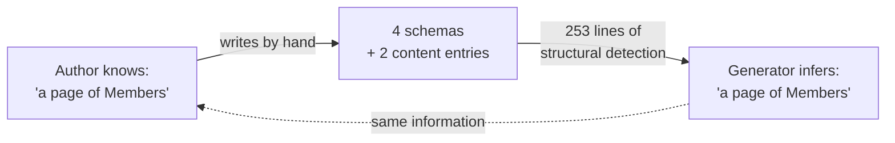
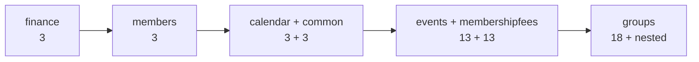

# Derive HAL envelopes in the bundler

## Why

Every HAL response in `docs/openapi/spec/{module}.yaml` is written out by hand — the payload schema,
an `EntityModel*` wrapper around it, a `PagedModel*`/`CollectionModel*` wrapper around that, a
bare-array `*List` sibling for `application/json`, and a second `application/prs.hal-forms+json`
content entry on the operation. All of it is mechanically derivable from the payload plus two facts
the author already states elsewhere: whether the response is a collection, and what the `_embedded`
key is called.

The cost of that redundancy is paid twice. The author writes the same information three to four
times, with the `_embedded` key duplicated between `x-klabis-relation` and the envelope schema and
kept in sync by hand. And the backend generator spends 253 lines (`HalEnvelopeDetector` +
`EnvelopeUnwrap`) plus four test classes structurally re-deriving the payload back out of those
envelopes — the information does a full round trip and returns unchanged.

Deriving the envelopes instead makes the source spec state each fact once, and lets the detector go
away entirely.

## What Changes

**Source specs (`docs/openapi/spec/{module}.yaml`)** — 56 envelope schemas, 15 bare-array `*List`
siblings and 111 `application/prs.hal-forms+json` content entries are deleted. Operations keep only
their `application/json` (or `text/csv`, `text/calendar`) content, referencing the payload schema
directly.

**Two new spec extensions:**

- `x-hal-entity-items: true` — on an array property whose items are independently addressable
  resources carrying their own `_links`. 7 uses, all in `groups.yaml`
  (`FamilyGroupResponse.parents`/`.members`, `GroupResponse.owners`/`.members`/`.pendingInvitations`,
  `TrainingGroupResponse.trainers`/`.members`). Valid only on `type: array` with a `$ref` items
  schema; enforced by `validate.mjs`.
- `x-klabis-hal: false` — operation-level opt-out. HAL is added by **default**; the marker is the
  only way out. 6 operations need it: `getMySchedule` (`text/calendar`), the four pre-auth password
  endpoints in `common.yaml`, and `listOrisEvents` (external passthrough).

**Bundler (`tools/openapi-bundle`)** — `bundle.mjs` gains a deriver that reconstructs the
`EntityModel`/`PagedModel`/`CollectionModel` schemas and the hal-forms content entry into
`klabis-full.json`. It becomes the single place in the repo that knows HAL envelope structure.
`validate.mjs` gains validation for both new extensions.

**Backend codegen (`backend/buildSrc`)** — `KlabisSpringCodegen` reads `x-hal-entity-items` instead
of detecting envelope shapes. Removed: `HalEnvelopeDetector.java` (233 lines), `EnvelopeUnwrap.java`
(20 lines), `HalEnvelopeDetectorShape1Test`, `HalEnvelopeDetectorShape2Test`,
`HalEnvelopeDetectorPropertyItemTest`, `HalEnvelopeFixtures`, and the envelope-detection paths in
`KlabisSpringCodegenFromPropertyTest` / `KlabisSpringCodegenHandleMethodResponseTest`.

**Build config (`backend/build.gradle.kts`)** — the 7 `schemaMappings` + 7 `extraImportMappings`
entries for `groups` are removed; `x-hal-entity-items` carries that information directly.

## No Behavior Change Justification

**Specs reviewed:**

- `openspec/specs/non-functional-requirements/spec.md` — the only spec mentioning HAL, media types
  or OpenAPI. Its requirements (*HAL+FORMS Media Type and Response Structure*, *HATEOAS Link
  Structure*) constrain **runtime responses**: the `Content-Type` header, the presence of
  `_embedded`/`_links`/`page`. Those are produced by Spring HATEOAS at request time
  (`EntityModel.of(...)`, `HalResponseContext`, the link postprocessors) — none of which this change
  touches. Its *Reserved URL Paths* requirement covers serving `/v3/api-docs` and Swagger UI, not
  the document's content.
- The remaining 18 specs — confirmed by grep to contain no reference to HAL, OpenAPI, media types or
  envelope schemas.

**Why no spec update is needed:**

The change is confined to build-time artifacts: how the OpenAPI document is authored and how Java
DTOs are generated from it. Controllers, Spring HATEOAS wiring and the generated DTO records are
unchanged — only the route by which the generator arrives at the same records changes, from
structural detection to reading a declared marker.

The acceptance criterion makes this verifiable rather than merely asserted: **`klabis-full.json` must
stay byte-identical** to a baseline hash recorded before any spec is touched. Since that document is
what the frontend types, `halTypes.ts` and Swagger UI are generated from, an unchanged hash proves no
`Content-Type`, `_embedded` key, `page` block or link relation could have shifted. A second
criterion covers the other half: the generated Java under `build/generated/openapi/` must be
identical before and after, per module, comparing with the `@Generated` timestamp stripped.

If either check fails at any point during the migration, the change has altered observable behavior
and must stop.

**One deliberate exception**, taken before the migration began: the accommodation-list endpoint was
the only collection whose `_embedded` items were bare payloads rather than `EntityModel`s. It was
brought in line with the other 15 (each row now carries a `self` link to its registration) so the
deriver needs no special case. This adds a `_links` object per accommodation row in the runtime JSON
— hypermedia metadata on the infrastructure envelope, not a change to the row's data fields. The
baseline hash was re-recorded after that fix.

## Impact

**Code:**
- `docs/openapi/spec/*.yaml` — 9 module files; ~56 schemas and ~111 content entries removed
- `tools/openapi-bundle/lib/` — new deriver module; `validate.mjs` extended
- `backend/buildSrc/.../codegen/` — 253 lines + 4 test classes removed, `KlabisSpringCodegen` simplified
- `backend/build.gradle.kts` — 14 mapping entries removed
- `.claude/skills/klabis-api-spec/SKILL.md` — documents the authoring rules, needs updating
- `docs/openapi/spec/README.md` — same

**Not changed:** `backend/src/main/java` (controllers, mappers, HAL postprocessors),
`frontend/src` (consumes the unchanged `klabis-full.json`), database, runtime configuration.

**Developer workflow:** authoring a new HAL endpoint drops from "payload schema + 2-3 envelope
schemas + 2 content entries" to "payload schema + 1 content entry". The `groups.yaml` header comment
explaining the `schemaMapping`/Category-C interaction (~20 lines) becomes obsolete.

**Migration order** — one module per step, each independently verifiable by the byte-identical
criterion, ordered by envelope count so the mechanism is proven on small modules first:

`groups` is last: it is the only module with `x-hal-entity-items` cases and the only one carrying
manual `schemaMappings`.

**Risk:** the `_embedded` key fallback for schemas without `x-klabis-relation` (8 of ~56 declare it)
assumes Spring HATEOAS's default `uncapitalize(schemaName) + "List"`. No custom `LinkRelationProvider`
or evo-inflector dependency exists in the backend, so the default should hold — but it must be
verified against live responses before the deriver relies on it. That verification is the first task.
