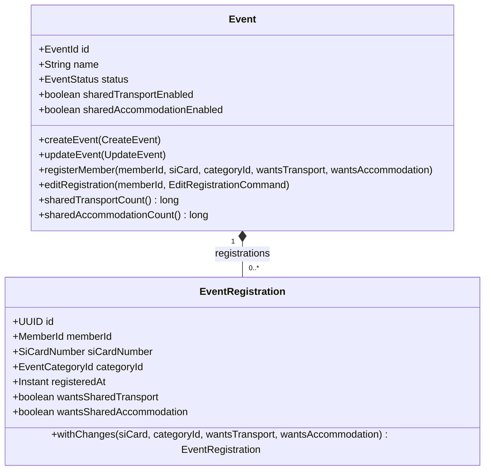

## Context

The `events` bounded context already has an `Event` aggregate root that owns a list of `EventRegistration` value objects. The event detail page (`getEvent`) returns an `EventDto` with the registrations riding along in `_embedded`. A coordinator-only "accommodation list" page (`getAccommodationList` + a CSV variant) already exists and today lists **every** registered member.

This change adds two independent, opt-in offers to an event — shared transport and shared accommodation — and lets a registering member say whether they want to use each. The event coordinator sees per-offer counts on the detail page, and the accommodation list is narrowed to the members who chose shared accommodation.

The broad, configurable "supplementary services" model (`gh-112-event-supplementary-services`) is explicitly out of scope; this is the minimal two-flag version.

Constraints:
- Spec-first: the OpenAPI YAML in `docs/openapi/spec/events.yaml` is the source of truth; controllers implement generated `*Api` interfaces.
- Flyway migrations, versioned `V00N__*.sql`.
- Persistence uses the memento pattern (`EventMemento`, `EventRegistrationMemento`); the domain aggregate stays annotation-free.
- KISS — no new module, no read-model infrastructure.

## Goals / Non-Goals

**Goals:**
- Two boolean offer flags on `Event`, editable in create / update / inline-edit, in DRAFT and ACTIVE only.
- Two boolean choice flags on `EventRegistration`, settable at registration and editable afterwards, each surfaced only when the event enables the matching offer.
- Per-offer registered-member counts on the event detail response, visible to coordinator + `EVENTS:REGISTRATIONS`, ACTIVE events only.
- Accommodation list filtered to members with `wantsSharedAccommodation = true`; the endpoint and its HAL link are gated on the event's `sharedAccommodationEnabled` flag.
- Turning an offer off is non-destructive: registration choices are retained and reappear if the offer is turned back on.

**Non-Goals:**
- Names, prices, capacities, per-service deadlines, drag-to-reorder (that is `gh-112`).
- Any ORIS import/sync of these flags.
- A per-member breakdown of who chose what (only counts; the registrations list is unchanged).
- Notifications or finance integration.
- Capacity enforcement (a member can always choose an offer that is enabled).

## Decisions

### Decision 1: Two named boolean fields, not an enum/set

**Choice:** `Event` gets `sharedTransportEnabled` and `sharedAccommodationEnabled` (both `boolean`, default `false`). `EventRegistration` gets `wantsSharedTransport` and `wantsSharedAccommodation` (both `boolean`, default `false`).

**Alternative considered:** an `EventServiceType {TRANSPORT, ACCOMMODATION}` enum with a `Set<EventServiceType>` of enabled offers on the event and chosen offers on the registration. Rejected: it is a step toward the `gh-112` general model, which this change deliberately is not; two booleans are the KISS fit and the migration, DTOs, and form metadata are trivial.

### Decision 2: Choice retained when the offer is turned off

**Choice:** `Event.updateEvent` / inline edit may set `sharedAccommodationEnabled = false` unconditionally. `EventRegistration` keeps `wantsSharedAccommodation` as stored. Every place that *reads* a choice for display (count summary, accommodation list, form field presence) first checks the event flag; when the flag is off the choice is simply not consulted.

**Alternatives considered:**
- Reject the toggle-off while selections exist — more code, worse UX, and asymmetric with "toggle on".
- Clear the choices on toggle-off — destructive and irreversible; a mis-click loses data.

**Consequence:** re-enabling the offer resurfaces the earlier choices automatically. No cleanup job.

### Decision 3: Registration commands carry the two flags; the aggregate ignores a flag whose offer is off

**Choice:** `registerMember` and `editRegistration` take `wantsSharedTransport` / `wantsSharedAccommodation`. Inside the aggregate, a `true` for an offer that is currently disabled is coerced to `false` before it is stored (mirrors how `resolveCategoryId` normalizes category input). This keeps the invariant "a stored `true` always corresponds to an offer that was enabled at write time" — though Decision 2 means a later toggle-off can still leave a stored `true` that is merely hidden.

Actually, to keep Decision 2 coherent (a toggled-off-then-on offer must resurface choices), the aggregate MUST NOT coerce on the basis of the *current* flag at write time in a way that would erase a genuine choice. Resolution: coerce `true → false` only when the offer has **never** been enabled is over-complex. Simpler rule adopted: **the aggregate stores what the caller sent**; the API layer omits the form field when the offer is off, so a well-behaved client never sends `true` for a disabled offer, and all *readers* gate on the event flag anyway. The aggregate does no coercion.

**Alternative considered:** aggregate-side coercion. Rejected as above — it fights Decision 2 and adds a rule with no user-visible benefit given readers already gate.

### Decision 4: Counts computed on the fly from the loaded aggregate

**Choice:** `getEvent` already loads the full `Event` with its `registrations`. The controller computes `sharedTransportCount = registrations.stream().filter(EventRegistration::wantsSharedTransport).count()` and likewise for accommodation, and puts them on the response only when (a) the matching offer is enabled, (b) the event is ACTIVE, and (c) the caller is coordinator or has `EVENTS:REGISTRATIONS` (the same `EventAffordanceSupport.isCoordinatorOrHasRegistrationsAuthority` check the accommodation link already uses).

**Alternative considered:** a dedicated read model / SQL `COUNT`. Rejected: registrations are already in memory, event sizes are small (tens to low hundreds), and the target is <500ms with 10+ concurrent users — a stream filter is nothing.

**Wire shape:** `x-hal-embedded` is reserved for nested *collections*; a count summary is not one. Instead the counts are a single READ_ONLY object property `sharedServicesSummary` on `EventDto` itself — the same treatment `deadlines` / `ranking` already get (declared on the schema, `x-klabis-halforms-access: READ_ONLY`, populated by the controller). The controller sets it to non-null only when the caller is coordinator / `EVENTS:REGISTRATIONS`, the event is ACTIVE, and ≥1 offer is enabled; otherwise it is omitted (`@JsonInclude(NON_NULL)`). Each of the two sub-fields (`sharedTransport`, `sharedAccommodation`) is present only when its offer is enabled. The frontend renders the section iff `sharedServicesSummary` (resp. each sub-object) is present.

### Decision 5: Accommodation list filters in the controller, gates on the flag

**Choice:** `assembleAccommodationItems` filters `event.getRegistrations()` to `wantsSharedAccommodation`. `loadAuthorizedEventForAccommodation` additionally throws `AccessDeniedException` (or a 404-style "not offered") when `!event.sharedAccommodationEnabled()`. The `accommodation-list` HAL link in `getEvent` is emitted only when the flag is on **and** the caller is authorized.

**Alternative considered:** keep listing everyone and add a "wants accommodation" column. Rejected — the proposal explicitly removes the "all registered members" semantics; the list is for the accommodation provider and must contain only real bookings.

### Decision 6: Persistence — four NOT NULL boolean columns, edited into the existing schema migration

**Choice:** the project runs on an in-memory database recreated from Flyway on every start, and there is no deployed instance with real data. Rather than adding a `V004__…` migration, the four columns are added directly to the existing `V001__initial_schema.sql`:
- `events.events`: `shared_transport_enabled BOOLEAN NOT NULL DEFAULT FALSE`, `shared_accommodation_enabled BOOLEAN NOT NULL DEFAULT FALSE` (plus `COMMENT ON COLUMN` entries alongside the neighbouring ones).
- `events.event_registrations`: `wants_shared_transport BOOLEAN NOT NULL DEFAULT FALSE`, `wants_shared_accommodation BOOLEAN NOT NULL DEFAULT FALSE` (plus comments).

The `DEFAULT FALSE` keeps inserts from code paths that don't yet set the column working during the incremental build; it also matches "offers are off by default".

`EventMemento` and `EventRegistrationMemento` gain the four `@Column` fields and copy them in `from` / `toEvent` / `toEventRegistration`. `Event.reconstruct` and `EventRegistration.reconstruct` signatures grow by two booleans each.

**Alternative considered:** a new `V004__add_shared_transport_accommodation.sql`. Standard for a migrated production DB, but unnecessary overhead here — no data to preserve, schema is rebuilt each run. Revisit if/when a persistent environment exists.

## Domain Model Changes



| Element | Change | Notes |
|---|---|---|
| `Event.sharedTransportEnabled` | **added** field, `boolean`, default `false` | set by `CreateEvent` / `UpdateEvent`; mutable only in DRAFT/ACTIVE (reuses existing `assertModifiable` guard) |
| `Event.sharedAccommodationEnabled` | **added** field, `boolean`, default `false` | as above |
| `Event.CreateEvent` | **modified** record — two optional `Boolean` components (null ⇒ `false`) | builder-based, so additive |
| `Event.UpdateEvent` | **modified** record — two `Boolean` components; absent ⇒ unchanged, per existing partial-update semantics | |
| `Event.registerMember(...)` | **modified** signature — two `boolean` params appended | |
| `Event.EditRegistrationCommand` | **modified** record — `wantsSharedTransport`, `wantsSharedAccommodation` added | |
| `Event.editRegistration(...)` | **modified** — passes the two flags into `EventRegistration.withChanges` | |
| `Event.sharedTransportCount()` / `sharedAccommodationCount()` | **added** query methods returning `long` | pure count over `registrations`; no auth logic in the domain |
| `EventRegistration.wantsSharedTransport` | **added** field, `boolean`, default `false` | |
| `EventRegistration.wantsSharedAccommodation` | **added** field, `boolean`, default `false` | |
| `EventRegistration.CreateEventRegistration` | **modified** record — two `boolean` components | |
| `EventRegistration.create` / `reconstruct` / `withChanges` | **modified** signatures | |
| `MemberRegisteredForEventEvent`, `RegistrationEditedEvent` | unchanged wire; carry the registration, so consumers can read the new flags if needed | no new domain events |

No aggregates removed. No new value objects (a `boolean` is sufficient; a `SharedServices` VO would be premature).

## API Changes

All paths under `docs/openapi/spec/events.yaml`. Media types, status codes, and `_links` envelope mechanics per `non-functional-requirements`.

### `EventDto` (response of `getEvent`, body of inline edit)

Add two properties:

| Property | Type | HAL-FORMS access | Notes |
|---|---|---|---|
| `sharedTransportEnabled` | `boolean` | editable | default `false` |
| `sharedAccommodationEnabled` | `boolean` | editable | default `false` |

### `CreateEventRequest` (`createEvent`)

Add optional `sharedTransportEnabled: boolean`, `sharedAccommodationEnabled: boolean` (absent ⇒ `false`).

### `UpdateEventRequest` (`updateEvent`)

Add `sharedTransportEnabled: [boolean, 'null']`, `sharedAccommodationEnabled: [boolean, 'null']` — JsonNullable partial-update wrappers; absent ⇒ untouched.

### `getEvent` response — count summary

A READ_ONLY object property `sharedServicesSummary` on `EventDto`, populated by `EventController.getEvent` and omitted (`@JsonInclude(NON_NULL)`) unless the caller is coordinator / `EVENTS:REGISTRATIONS`, the event is ACTIVE, and at least one offer is enabled:

```
sharedServicesSummary:            # SharedServicesSummaryDto, x-klabis-halforms-access: READ_ONLY
  sharedTransport:   { count: 12 }   # SharedServiceCountDto — present only if sharedTransportEnabled
  sharedAccommodation: { count: 8 }  # present only if sharedAccommodationEnabled
```

(`enabled` is dropped from the sub-object: presence of the sub-object *is* "enabled".) Frontend renders "Společná doprava: N členů" / "Společné ubytování: M členů" iff the corresponding sub-object is present. When `sharedServicesSummary` is absent, no summary section.

### `RegisterEventRequest` (`registerForEvent`)

Add optional `wantsSharedTransport: boolean`, `wantsSharedAccommodation: boolean` (default `false`). The **HAL-FORMS template** for `registerForEvent` on the event detail response includes the `wantsSharedTransport` property only when `sharedTransportEnabled`, and `wantsSharedAccommodation` only when `sharedAccommodationEnabled` — this is how the React form conditionally renders the checkboxes.

### `EditRegistrationRequest` (`editRegistration`)

Add `wantsSharedTransport: boolean`, `wantsSharedAccommodation: boolean`. Same conditional-property rule in the `updateRegistration` HAL-FORMS template.

### `RegistrationDto` (own-registration view / edit form body)

Add `wantsSharedTransport` / `wantsSharedAccommodation` (`boolean`). Fields present in the payload only when the event offers them (assembled server-side).

### `getAccommodationList` + CSV variant

- New precondition: `event.sharedAccommodationEnabled` must be `true`, else `AccessDeniedException` (403) for both the HAL and `text/csv` variants.
- `AccommodationListItemDto` unchanged; the **row set** is filtered to registrations with `wantsSharedAccommodation = true`.
- `accommodation-list` HAL link in `getEvent`'s `x-hal-links`: description updated to "Present only when the event offers shared accommodation and the caller is the event coordinator or has EVENTS:REGISTRATIONS".

### HAL link / template name summary

| Name | Location | Change |
|---|---|---|
| `accommodation-list` (link) | `getEvent` | gated additionally on `sharedAccommodationEnabled` |
| `registerForEvent` (template) | `getEvent` | conditionally includes `wantsSharedTransport` / `wantsSharedAccommodation` properties |
| `updateRegistration` (template) | `getRegistration` | same conditional properties |
| `updateEvent` (template) | `getEvent` | includes `sharedTransportEnabled` / `sharedAccommodationEnabled` |

No new endpoints, no renamed operations.

## Risks / Trade-offs

- **[Stored `true` for a since-disabled offer leaks via a naive reader]** → every reader (count, accommodation list, DTO field, form template) MUST gate on the event flag. Covered by spec scenarios "Turning off an offer…" and "…back on restores earlier choices"; add a controller-level test that a disabled offer yields no count and an empty accommodation filter even with `wants…=true` rows present.
- **[Frontend renders a checkbox for a disabled offer]** → the checkbox presence is driven purely by the HAL-FORMS template properties, which the server omits when the offer is off. No client-side flag logic. Test via `frontend-qa-testing` on an event that toggles the offer.
- **[Accommodation list behavioural break surprises existing users]** → documented as BREAKING in the proposal; the list was MVP-stage and not yet relied upon in production. Release note required.
- **[`reconstruct` signature growth ripples through tests/fixtures]** → mechanical; keep parameter order (new booleans last) and update the aggregate test builders in one pass.
- **[Count summary shape (nested object vs. flat fields) not final]** → see Open Questions; both are additive and the frontend contract is "render iff present", so the choice is low-risk and can be settled in implementation review.

## Migration Plan

1. Edit the four new columns into the existing `V001__initial_schema.sql` (`events.events` and `events.event_registrations` `CREATE TABLE` blocks, each `BOOLEAN NOT NULL DEFAULT FALSE`, with matching `COMMENT ON COLUMN`). No new migration file — the DB is in-memory and rebuilt from Flyway on every start; there is no deployed data.
2. Update `docs/openapi/spec/events.yaml` (schemas + template/link descriptions), regenerate the bundle (`openapiBundle`) and the frontend types.
3. Backend: extend `Event`, `EventRegistration`, both mementos, `reconstruct` factories, `EventController` (counts + accommodation gate/filter), `EventRegistrationController` (register/edit pass-through), affordance/template postprocessors for the conditional properties. TDD per aggregate method.
4. Frontend: two checkboxes in the event form + inline edit; two conditional checkboxes in the registration and edit-registration forms (driven by template metadata); count-summary section on the event detail page.
5. Run backend + frontend test suites; QA the toggle-off/on and accommodation-list-hidden paths in the browser.

**Rollback:** revert the `V001` edit and the application code together; the in-memory DB is recreated on next start, so there is nothing to un-migrate.

## Open Questions

1. ~~Count summary wire shape~~ **Resolved:** READ_ONLY `sharedServicesSummary` object property on `EventDto`, populated by the controller, `@JsonInclude(NON_NULL)` — same pattern as `deadlines` / `ranking`. Not `x-hal-embedded` (that is for collections).
2. **403 vs. 404 for the accommodation list when the offer is off** — `AccessDeniedException` (403) is consistent with the existing authorization failure on that endpoint; a 404 ("no such list") is arguably more truthful. Lean 403 for consistency.
3. ~~Does `RegistrationDto` always carry the two boolean fields?~~ **Resolved:** omit them when the event does not offer the matching service — the generated `RegistrationDto` carries record-level `@JsonInclude(NON_NULL)` and the mapper passes `null` for a non-offered service. Mirrors the form-template gating.
