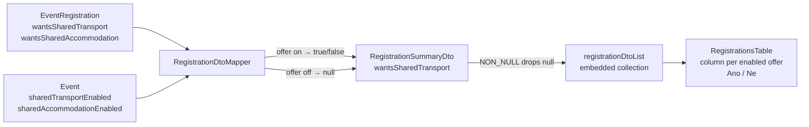

## Context

Events offer shared transport and shared accommodation (`Event.sharedTransportEnabled` / `sharedAccommodationEnabled`); each `EventRegistration` already records the member's choices (`wantsSharedTransport` / `wantsSharedAccommodation`). The event detail page embeds a registrations list (`registrationDtoList` of `RegistrationSummaryDto`) rendered by `RegistrationsTable` in `EventDetailPage.tsx`.

The list row contract (`RegistrationSummaryDto` in `docs/openapi/spec/events.yaml`) does not carry the shared-service choices — they exist only on the single-registration `RegistrationDto`. The mapper (`RegistrationDtoMapper.toDto`) already receives the `Event`, so offer flags are available where the rows are built.

`RegistrationSummaryDto` is generated with class-level `@JsonInclude(NON_NULL)` (see the `category` property precedent, which forces `JsonInclude(ALWAYS)` to survive it).

## Goals / Non-Goals

**Goals:**

- Members viewing the event detail registrations list can see, per registration, whether the member asked for shared transport and/or shared accommodation ("Ano"/"Ne").
- Columns appear only for the offers the event has enabled.
- Wire contract consistent with the existing per-offer inclusion rule used by `registerForEvent` / `editRegistration` affordances.

**Non-Goals:**

- No change to the event detail "enabled for event" rows or the shared-services count summary.
- No sorting on the new columns.
- No change to the accommodation list page (it remains the detailed coordinator view).
- No new permissions or field-level protection for the choices.

## Decisions

### Decision 1: Per-offer inclusion via `NON_NULL` + `null`, mirroring `RegistrationDto`

The spec adds both properties to `RegistrationSummaryDto` as plain `boolean` fields with a description stating they are included only when the event has the matching offer enabled. The mapper sets `null` when the offer is disabled — the DTO's class-level `JsonInclude(NON_NULL)` then drops the property from the payload. When the offer is enabled, the mapper always sets the real value (`true`/`false`), so the column shows "Ano"/"Ne" for every row.

- Alternative considered: always include both booleans and let the frontend decide. Rejected — it would put meaningless default-`false` values on the wire for events with the offer off, contradicting the established "included only for the offers the event has enabled" contract documented on the `registerForEvent`/`editRegistration` affordances.
- Alternative considered: omitting the property when `false` too. Rejected — the requirement is an explicit "Ne" for every registration of an enabled offer, and an always-absent-when-false field would collide with `hideEmptyColumns`.

No domain change: `EventRegistration` already holds both choices; only the REST layer maps them.



### Decision 2: Choices visible to all authenticated members — no field-level security

Unlike `registrationTime` (`x-klabis-authority` + `x-klabis-owner-visible`), the new properties carry no security annotations. Knowing who asked to share a ride or a room is useful to ordinary members (carpool coordination) and was confirmed as the intended visibility. Field-level protection would also require the `NullDeniedHandler`/ownership machinery for no privacy gain.

### Decision 3: Frontend gates columns on the event's offer flags

`RegistrationsTable` already receives the `event` detail and `event.sharedTransportEnabled` / `event.sharedAccommodationEnabled` are on the wire. Each `TableCell` is rendered conditionally on its flag and maps the value through `labels.ui.yes` / `labels.ui.no`; column headers reuse `labels.fields.sharedTransportEnabled` / `labels.fields.sharedAccommodationEnabled`. The table's existing `hideEmptyColumns` remains a safety net for stale rows lacking the new properties.

### Decision 4: No sorting on the new columns

The table sorts server-side and the backend sort-field allowlist would need to include the new properties. Sorting registrations by a yes/no column has no stated need — columns render unsortable until a requirement exists.

## REST API

Single operation affected — `getEvent` (`GET /events/{id}`), embedded collection `registrationDtoList`; nothing else on the endpoint changes (paths, parameters, templates, links unchanged).

`RegistrationSummaryDto` (wire contract addition):

| Property | Type | Inclusion | Security |
|---|---|---|---|
| `wantsSharedTransport` | boolean | present with `true`/`false` when the event has shared transport enabled; omitted otherwise | none (all authenticated viewers of the list) |
| `wantsSharedAccommodation` | boolean | present with `true`/`false` when the event has shared accommodation enabled; omitted otherwise | none (all authenticated viewers of the list) |

Example row, event with both offers enabled:

```json
{
  "firstName": "Jan", "lastName": "Novák",
  "category": {"id": "...", "name": "H40", "fee": null},
  "registrationTime": "2026-08-30T10:15:00Z",
  "wantsSharedTransport": true,
  "wantsSharedAccommodation": false,
  "_links": {"self": {...}}
}
```

Same event with both offers disabled: neither property appears.

## Risks / Trade-offs

- [Jackson `NON_NULL` silently drops the property when the mapper forgets to set it] → controller/mapper tests assert presence-and-value per offer combination (both on / transport only / accommodation only / none).
- [Generated `Boolean` wrapper vs primitive mismatch] → codegen maps spec `boolean` to `Boolean` on records; assert the regenerated record compiles and `RegistrationSummaryDtoBuilder` accepts `null` before wiring the mapper.
- [Members see other members' service choices] → accepted deliberately (Decision 2); no identity-card-level sensitive data involved.
- [`hideEmptyColumns` could hide a legitimately all-"Ne" column if the wire ever sent `null`s] → column visibility is gated on the event flag, not on row values; `hideEmptyColumns` is only a fallback.

## Glossary

No new domain terms. Reused existing ubiquitous language: *Shared Transport Offer*, *Shared Accommodation Offer* (event-level enablement), *Shared Transport Choice* / *Shared Accommodation Choice* (the registration-level `wantsSharedTransport` / `wantsSharedAccommodation` values).
