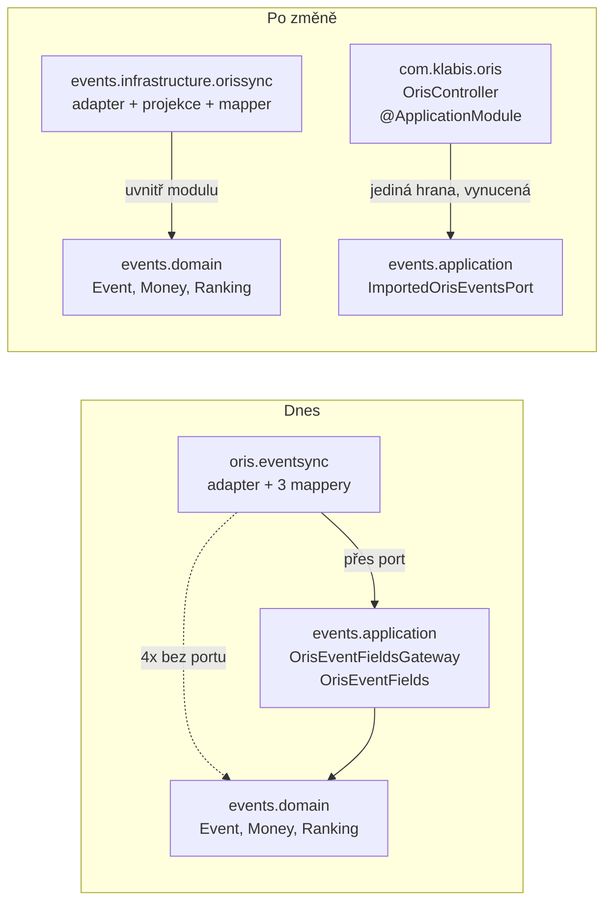

## Why

`OrisEventSyncAdapter` lives in `com.klabis.oris.eventsync`, outside the `events`
module, so it may not touch `Event.syncFromOris` or `EventRepository` directly.
`OrisEventFieldsGateway` exists to open a public door for it, and its javadoc justifies
itself as cycle avoidance: *"this gateway never reaches `com.klabis.sync`, so wiring it
into the engine's adapters is eager and acyclic."*

Measuring the imports shows that reasoning does not hold. `com.klabis.sync` imports
nothing from `com.klabis.events` — zero occurrences — so the `sync ↔ events` cycle the
gateway guards against cannot form. The real constraint is only the adapter's package,
and four classes next to it cross the very same boundary with no port at all, reaching
straight into `events.domain` for `Event`, `Money`, `EventRanking` and
`RegistrationDeadlines`. Because `com.klabis.oris` carries no `@ApplicationModule` and
module detection runs as `explicitly-annotated`, `ModuleStructureVerificationTest` never
sees those four edges.

So the module pays for an abstraction — a port, a parallel field record, and two
mappers between two shapes of the same data — to respect a boundary its neighbours
ignore, in the name of a cycle that does not exist.

## What Changes

- **`com.klabis.oris.eventsync` moves to `com.klabis.events.infrastructure.orissync`.**
  `OrisEventSyncAdapter`, `OrisEventProjection` and `OrisEventProjectionMapper` move as
  they are; the adapter then reaches `EventRepository` and `Event.syncFromOris` as a
  module-internal collaborator rather than through a primary port.
- **`OrisEventFieldsToProjectionMapper` and `OrisEventProjectionToFieldsMapper` are
  deleted.** They translate between two shapes of the same ORIS data and exist only
  because the adapter could not see the domain types. `readExternal` maps ORIS
  `EventDetails` onto `OrisEventProjection` directly; `applyToLocal` builds
  `EventSyncFromOrisBuilder` from the projection directly.
- **`OrisEventFieldsGateway` and `OrisEventFieldsGatewayService` are deleted.**
  `readOrisFields` folds into the adapter's `readExternal`; `applyOrisSync` — including
  the warning it logs when a sync would drop categories that still carry registrations —
  folds into `applyToLocal`.
- **`OrisEventFields` stays, demoted to a module-internal type.**
  `OrisEventImportService.importEventFromOris` still needs it for `Event.createFromOris`,
  and the ORIS discipline → event-type resolution it carries is shared with the adapter.
  It is no longer part of any port's signature.
- **`com.klabis.oris` keeps `OrisController`.** `/api/oris/events` is a passthrough
  listing of the external ORIS catalogue (`x-klabis-hal: false`, *"these are not Klabis
  resources"*) driving the UI's "Import from ORIS" dialog, not an events resource, so it
  does not move. Its single edge into `events` stays `ImportedOrisEventsPort`.
- **`OrisIntegrationComponent` moves to `com.klabis.common`.** It is a meta-annotation
  wrapping `@Profile("oris")` with no ORIS-specific content, applied by seven classes of
  which five already sit in `events`. Moving it deletes the `events → com.klabis.oris`
  dependency rather than leaving it behind.
- **`com.klabis.oris` gains `@ApplicationModule`.** With the annotation relocated, its
  only edge into `events` is `ImportedOrisEventsPort`, so the boundary can finally be
  enforced by `ModuleStructureVerificationTest` rather than relied upon.
- **No REST endpoint moves.** The ORIS event operations (`importEvent`,
  `syncEventFromOris`, `syncAllUpcomingFromOris`, `importEventsBatch`) are already
  implemented by `OrisEventController` inside `events.infrastructure.restapi`, under the
  `OrisEvents` tag in `events.yaml`.

## No Behavior Change Justification

**Specs reviewed:**

- `openspec/specs/data-synchronization/spec.md` — unaffected. It describes when records
  are kept in step, how conflicts surface and what is recorded; it names no adapter,
  package or class. The adapter keeps the same `SynchronizationAdapter` contract,
  the same `pullOnly` capabilities, the same `SyncEntityType.EVENT` and
  `ExternalSystem.ORIS`, and the same empty `externalVersion`.
- `openspec/specs/events/spec.md` — unaffected. The ORIS import requirements
  (*"ORIS Import Includes Registration Deadlines"*, *"ORIS Import Tolerates Missing
  Location"*, *"Multi-Event ORIS Import"*) constrain what an imported event ends up
  containing. The mapping logic is carried over verbatim; only the class it lives in
  changes.
- `openspec/specs/event-categories/spec.md` — unaffected. Category merge behaviour stays
  in `Event.syncFromOris`, which this change does not touch.
- `openspec/specs/event-types/spec.md` — unaffected. ORIS discipline → event-type
  auto-mapping keeps resolving through `EventTypeRepository.findByOrisDisciplineId` and
  keeps travelling on the projection to `applyToLocal`.

**Why no spec update is needed:**

This is a package move plus deletion of two mapper pairs and one port that exist solely
to bridge a package boundary. Every externally observable element is fixed: REST paths
and payloads (no controller moves, no generated `*Api` interface changes), the
`SyncProjection` JSON shape persisted by `SyncProjectionCodec` — `OrisEventProjection`
keeps its exact field set, field order and `@JsonIgnore` on `resolvedEventTypeId` — the
`@Profile("oris")` gating, and the domain writes performed on `Event`. An API consumer,
a database row and an integration test all see the same thing before and after.

## Impact

**Affected code (backend):**

- `com.klabis.oris.eventsync.*` — 5 classes; 3 move, 2 are deleted.
- `com.klabis.events.application.OrisEventFieldsGateway` /
  `OrisEventFieldsGatewayService` — deleted, their bodies redistributed.
- `com.klabis.events.application.OrisEventFields` — stays; loses its port-facing role.
  The `EventDetails` → `OrisEventFields` mapping (`OrisEventDetailsMapper`) and the
  discipline resolution currently in the gateway service need a module-internal home
  shared by the import path and the adapter.
- `com.klabis.events.application.OrisEventImportService` — unchanged in behaviour;
  its gateway dependency is replaced by whatever internal collaborator takes over the
  mapping.
- `com.klabis.oris.OrisIntegrationComponent` → `com.klabis.common` — the move itself is
  trivial, but it rewrites the import in all seven applying classes (five in `events`,
  plus `OrisController` and the moved adapter).
- `com.klabis.oris.package-info` — new file carrying `@ApplicationModule`.
- Tests: `OrisEventSyncAdapterTest`, `OrisEventProjectionMapperTest`,
  `OrisEventSyncAdapterIntegrationTest`, `OrisEventSyncScenarioIntegrationTest` follow
  the moved classes; `OrisEventImportServiceTest`, `OrisEventTypeAutoMappingTest` and
  `OrisControllerTest` follow the annotation's import.
- `ModuleStructureVerificationTest` — gains a module to verify. Its javadoc lists the
  known boundary violations as technical debt and should be updated, since this change
  removes a class of them.

**Module structure:**

- `oris → events.domain`: 4 edges → 0.
- `oris → events.application`: 3 edges → 1 (`ImportedOrisEventsPort`, from
  `OrisController`).
- `events → com.klabis.oris`: 6 edges → 0. All six are the `OrisIntegrationComponent`
  import, which follows the annotation into `common`.
- `events → sync`: unchanged in direction, grows by the adapter's own imports.
- `sync → events`: stays at 0.
- `com.klabis.oris` becomes a Modulith module, so all of the above are enforced from
  here on rather than conventional.

**APIs (REST):** none. **Frontend:** none. **Data:** none — the persisted projection
shape is preserved deliberately. **Dependencies:** none.

**Testing:** the projection's serialised form is the one thing a package move could
silently break, since `SyncProjectionCodec` writes it to `sync_record` and a stored
projection written before the change must still deserialise after it. A test pinning the
serialised JSON is worth having before the move rather than after.

## What `com.klabis.oris` Retains

The move empties the `eventsync` sub-package but leaves the ORIS package itself
populated and load-bearing:

- **`OrisController`** — the `/api/oris/events` passthrough listing of the external ORIS
  catalogue, called by the UI's "Import from ORIS" dialog. It stays: these are not
  Klabis resources (`x-klabis-hal: false`), and its only edge into `events` is the narrow
  `ImportedOrisEventsPort` used to filter out already-imported events.
- **Generated sources: `OrisImportApi`, `OrisEventSummary`, `OrisEventSummaryBuilder`.**
  `build.gradle` pins `openApiModule(module = "oris", pkg = "com.klabis.oris")`, so this
  package is where the `oris.yaml` codegen emits. It cannot be vacated without editing
  the spec-first build.
- **Two configuration bindings on the package name:** the springdoc group *"ORIS proxy
  API"* (`application.yml`, `packages-to-scan: com.klabis.oris`) and the
  `oris.client.*` property prefix.

### `@OrisIntegrationComponent` moves to `com.klabis.common`

The annotation is a meta-annotation wrapping `@Profile("oris")` and `@Component` — it
carries no ORIS knowledge beyond the profile name, so `com.klabis.oris` was never its
natural home. Today **seven** classes apply it, **five of them inside `events`**:
`OrisEventImportService`, `OrisEventBulkImportService`, `OrisBulkSyncService`,
`EventsSyncListener` and `OrisEventController`, alongside
`OrisEventFieldsGatewayService` (deleted here) and the adapter being moved.

It moves to `com.klabis.common` directly, beside `ClockConfiguration` and
`ClubProperties` rather than into a sub-package — it is a single cross-cutting
annotation with no natural sub-package, and `common` is declared
`@ApplicationModule(type = OPEN)` precisely so its types can be applied from any module
without non-exposed-type violations.

This deletes the `events → com.klabis.oris` edge outright rather than shifting it.

### `com.klabis.oris` becomes a real Modulith module

With the annotation gone, the ORIS package's only remaining outbound edge into `events`
is `ImportedOrisEventsPort`, a `@PrimaryPort` in `events.application`. Adding
`@ApplicationModule` to `com.klabis.oris` then makes that single edge enforced by
`ModuleStructureVerificationTest` instead of merely conventional — and, more to the
point, makes the boundary this proposal restores impossible to breach again silently.
The four `oris → events.domain` imports that motivated this change would have failed the
build had the module been declared.

**Note for implementation:** the generated `OrisImportApi` and `OrisEventSummary` land in
the module's root package, so they are exposed by default; the package must be declared
in a way that keeps the generated API visible to Spring MVC while the `@ApplicationModule`
annotation goes on `com.klabis.oris`'s own `package-info.java`, which does not exist yet.

## Open Questions

1. **Does a bean cycle appear?** The adapter registers into the sync engine while
   `OrisEventImportService`, in the same module, calls `SynchronizationPort`. The
   package move does not change Spring's view of this, but whether the current wiring
   survives the adapter gaining an `EventRepository` dependency should be confirmed by
   running the context, not reasoned about.

2. **Does `OrisEventFields` survive at all?** If the adapter maps `EventDetails` to
   `OrisEventProjection` directly and the import path is the only remaining consumer,
   `OrisEventFields` and `OrisEventProjection` come close to being one type with two
   names. Worth settling in design rather than discovering mid-implementation.
