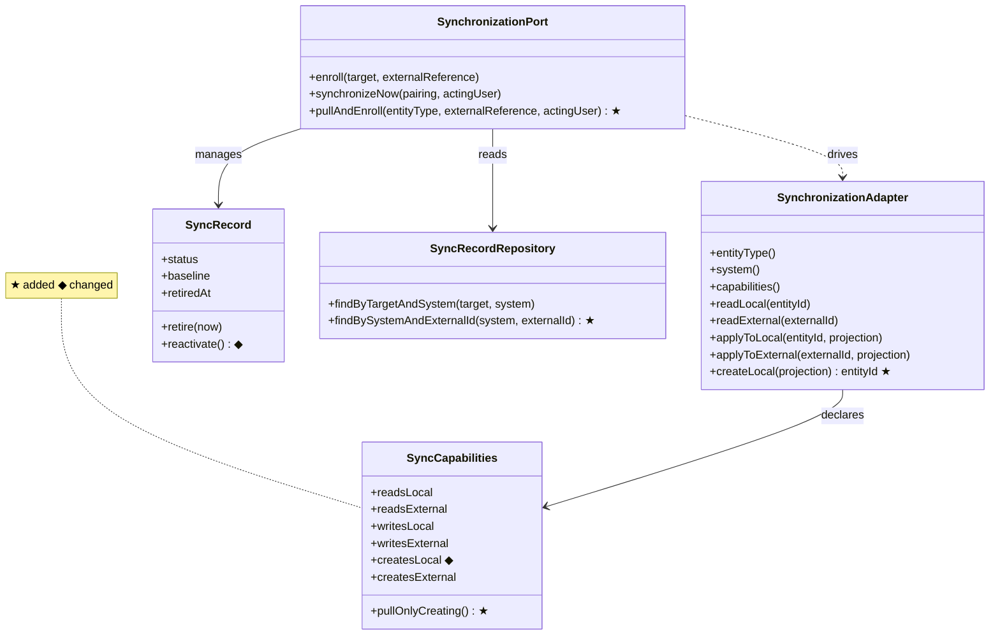
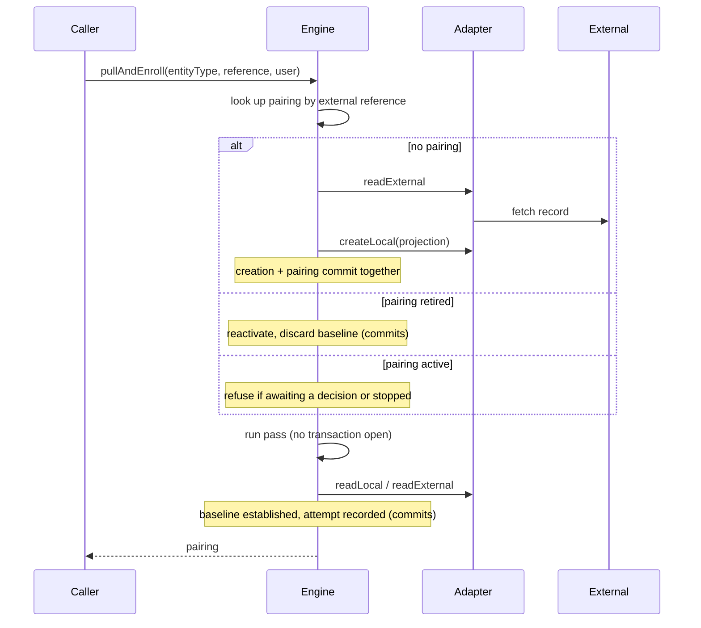

## Context

The synchronisation engine pairs a Klabis entity with a counterpart in an external system and keeps the two in step. Every pairing today starts from an entity that already exists: a caller builds the entity, then asks the engine to enrol it. The engine's adapter contract reflects that — an integration can read and write both sides, but has no way to bring a local entity into existence.

The ORIS events integration is the only consumer, and it does the stitching by hand. Its import path reads the ORIS event, builds the Klabis Event itself, saves it, converts a database unique-constraint violation into a duplicate error, and finally enrols the pair. The pairing is left with no baseline until a later scheduled pass picks it up, and nothing about the import appears in the synchronisation history.

The engine already carries a declared but unused capability for creating the local side. Two of its concepts are also already in place and unchanged by this design: the initial pass that takes the external system's values when no baseline exists, and retirement, which removes a pairing from scheduled runs while keeping its history.

**Constraint that shapes everything below:** the engine never calls an external system with a transaction open. A pass runs in three phases — claim in a short transaction, call the external system with none open, persist the outcome in a second short transaction. Any new operation that both creates an entity and runs a pass inherits this split and cannot be made atomic.

## Goals / Non-Goals

**Goals:**

- One engine operation that takes an external reference and leaves behind: a local entity, a pairing, a baseline, and one recorded attempt.
- An adapter contract for creating the local side, gated by the capability that already exists for it.
- A repeated import of the same external record does something sensible rather than failing.
- A retired pairing can be deliberately brought back.
- The ORIS import path stops duplicating engine logic.

**Non-Goals:**

- Automatic discovery of new external records. Bulk ORIS scanning has its own rules about what to skip and is handled separately.
- Creating a record in the external system (`createsExternal` stays unused).
- Changing the shape of any REST endpoint. Behaviour behind `POST /api/events/import` changes; its request and response do not.
- Batching. The adapter still handles one entity at a time.

## Glossary

| Term | Meaning |
|---|---|
| **Pairing** | The link between one Klabis entity and its counterpart in an external system, together with everything the engine knows about keeping them in step. Called a *synchronisation record* in existing specs. |
| **External Reference** | The counterpart's identity: which external system, and an opaque identifier within it. |
| **Projection** | The shared shape both sides are mapped into so they can be compared. Carries only the fields the external system owns. |
| **Baseline** | The last state both sides were known to agree on. Until one exists, the engine cannot tell which side changed. |
| **Initial Pass** | The first synchronisation after a pairing is created, which takes the external system's values and establishes the baseline. |
| **Pull And Enrol** | The new operation: create the local entity from an external record, pair it, and run the initial pass. |
| **Reactivation** | Returning a retired pairing to service, discarding the baseline it held when it was retired. |

## Domain Changes

| Element | Change | Description |
|---|---|---|
| `SynchronizationPort.pullAndEnroll` | **Added** | Takes an entity type, an external reference and the acting user; returns the pairing. Three branches: create, reactivate, or synchronise an existing pairing. |
| `SynchronizationAdapter.createLocal` | **Added** | Builds a local entity from an external projection and returns its identifier. Called only when `createsLocal` is declared. |
| `SyncCapabilities.createsLocal` | **Changed** | Already declared, never read. Now gates `createLocal`. |
| `SyncCapabilities.pullOnlyCreating()` | **Added** | A pull-only integration that can also create the local side. What ORIS events declare. |
| `SyncRecord.reactivate()` | **Added** | Retired pairing returns to service: status back to the pre-baseline state, retirement cleared, baseline discarded, schedule restored so the pairing is due again. |
| `SyncRecordRepository.findBySystemAndExternalId` | **Added** | Looks a pairing up from the external side, retired ones included. Already backed by the existing uniqueness constraint on external system, external identifier and entity type — no new index, no migration. |
| `SyncRecord.retire` | Unchanged | Still one-way in itself; reactivation is a separate, deliberate act. |

## Decisions

### D1: The operation resolves the adapter from an explicit entity type

An external reference names a system and an identifier but not what kind of thing it points at, and the adapter registry is keyed on entity type and system together. The operation therefore takes the entity type as an explicit argument.

*Alternative considered:* deriving the entity type by asking every adapter registered for the system whether it recognises the identifier. Rejected — it turns a lookup into a round of external calls and is ambiguous the moment two entity types share a system.

### D2: `createLocal` returns the new identifier rather than the created entity

The engine deliberately knows no module's identifier type; it holds entity identity as an opaque string. Returning the entity itself would drag a domain type across the boundary and give the engine something it has no use for. Returning the identifier keeps the contract exactly as wide as the engine's need — it has to pair the new entity, nothing more.

### D3: The initial pass is an ordinary pass, not a special path

After creating the entity and pairing it, the operation runs the same pass every other caller runs. With no baseline yet, the decision table takes the external system's values and establishes the baseline, exactly as it does after an ordinary enrolment.

*Cost accepted:* the pass immediately writes the same projection the entity was just created from, then reads it back. Two redundant round trips and one no-op write, on an operation a person triggers by hand.

*Alternative considered:* setting the baseline directly from the creating projection and skipping the pass. Rejected — it would bypass the concurrent-edit guard and the failure classification, and would leave the engine with a baseline never confirmed by reading the entity back. An adapter may transform what it writes; only a read-back tells the truth.

### D4: One recorded attempt, from the initial pass

Enrolment records no attempt today, and this operation does not add one. The single attempt the initial pass produces documents the import: when it ran, which direction it went, how it ended, and who triggered it.

*Alternative considered:* a second attempt marking the import itself. Rejected as noise — a pairing that exists is evidence enough that it was created, and the pass's attempt already carries the acting user.

### D5: An existing pairing is synchronised, not refused — and the direction is not forced

When the pairing already exists, the operation runs an ordinary synchronisation and lets the decision table resolve the direction.

This is the decision most worth stating plainly, because the operation's name suggests otherwise. "Pull" reads as *the external system wins*. Forcing the external values in would discard any local edit without telling anyone — precisely what the engine exists to prevent, and precisely the behaviour the old ORIS import had before it was routed through the engine. A person who edits an ORIS-owned field must see a conflict, not lose their work to someone re-running an import.

A pairing already waiting for a decision, or stopped after repeated failures, is refused: it needs a person, and an import must not step over them.

*Alternatives considered:* forcing the external values in (rejected, above); reporting a duplicate error (rejected — it makes re-import useless and pushes the caller into tracking what it has already imported).

### D6: Reactivation discards the baseline

A retired pairing keeps the baseline it held when it was retired. That baseline describes agreement at a moment that may be long past; both sides could have moved since, independently. Trusting it would manufacture a conflict where the right answer is simply to start again from the external system's values.

Reactivation therefore discards it, putting the pairing back into the pre-baseline state — so the pass that follows takes the external values, exactly like a fresh pairing.

*Alternative considered:* keeping the baseline and letting the decision table sort it out. Rejected — it makes the outcome depend on how long the pairing sat retired.

### D7: Reactivation is available only to the deliberate import path

Retirement of an ORIS event is triggered by the event finishing or being cancelled. Reactivating such a pairing from an automated scan would resurrect pairings for events that are over, and they would stay in the nightly run indefinitely because the event that retired them will not fire again.

A person importing a specific external record is asking for exactly that record, so reactivation is right there. Automatic discovery has its own rules and does not reach for this operation.

*Risk this leaves standing:* a person can still reactivate a finished event's pairing by importing it. Accepted — it is deliberate, visible, and reversible by retiring again.

### D8: The operation cannot be transactional as a whole

The external system is called with no transaction open, by design. Creation and pairing commit first; the pass runs after and commits its own outcome.

A failure in the pass therefore leaves a created entity with a pairing that has no baseline yet. This is what a failed import leaves behind today, and the next scheduled pass completes it. Making it atomic would mean holding a transaction open across external calls, which the engine's phase split exists to prevent.

### D9: A refused creation stops the pairing rather than being retried

A database constraint refusing the creation — the local side already holds that external identifier through some path the lookup did not see — is not a transient fault. Retrying it repeats the same rejection. The failure classifier must treat it as terminal.

This is a second line of defence behind the external-reference lookup. The two can disagree: the lookup is the engine's view, the constraint is the module's, and a pairing removed outside the engine would be visible to one and not the other.

### D10: The ORIS import path keeps its REST contract

`POST /api/events/import` keeps its request, its `201 Created`, and its `Location` header. `POST /api/events/{id}/sync-from-oris` and the bulk endpoints are untouched in shape.

What changes behind them: a repeated import no longer produces `409 Conflict` for a duplicate — it synchronises and returns the existing event. An import of an event awaiting a decision is refused with the same problem detail the single-event sync endpoint already returns, pointing at the synchronisation resource.

| Endpoint | Shape | Behaviour change |
|---|---|---|
| `POST /api/events/import` | unchanged | Duplicate no longer `409`; returns the existing event. Event awaiting a decision → refused, pointing at the synchronisation resource. |
| `POST /api/events/import/batch` | unchanged | A previously-imported event now counts as imported rather than failed, and is not distinguished from a newly created one. |
| `POST /api/events/{id}/sync-from-oris` | unchanged | None. |
| `GET /api/events/{id}` and list views | unchanged | None. HAL links and affordances are untouched. |

**A repeat import still answers `201 Created`.** Nothing was created, so this is a small untruth, and `200 OK` would be more honest. It is not worth it: the caller wants the same thing either way — the event, at a known location — and both the status and the `Location` header remain accurate about where that event lives. Splitting one operation into two response shapes would push a distinction onto the frontend that the frontend has no use for.

**The bulk import does not distinguish a newly created event from a re-imported one.** Both count as imported. A third outcome — "already present, synchronised" — would be more precise, but the import dialog already hides events that are present, so the case is rare by construction, and the manager's question is only ever whether each selected event ended up in Klabis. It did.

## Risks / Trade-offs

| Risk | Mitigation |
|---|---|
| A failed initial pass leaves an entity paired without a baseline. | Same as today's failed import. The next scheduled pass completes it; the pairing's state shows it is not yet in step. |
| `createLocal` followed immediately by writing the same projection back is wasteful. | Accepted. A hand-triggered operation; correctness of the read-back baseline (D3) is worth more than two round trips. |
| The external-reference lookup and the module's own uniqueness constraint can disagree. | The constraint stays as a second line of defence and its violation stops the pairing rather than being retried (D9). |
| Reactivating a finished event's pairing puts it back in the nightly run permanently. | Only reachable deliberately (D7); reversible by retiring again. Automatic discovery does not use this operation. |
| A repeat import returns `201 Created` having created nothing. | Accepted (D10). Harmless to callers, who get the event at its location either way. |
| The behaviour change is invisible to existing tests that assert a duplicate is rejected. | Those tests encode the old contract and must be rewritten to the new one, not deleted. |

## Migration Plan

The engine additions come first and stand alone: the new adapter method needs a default that refuses when `createsLocal` is not declared, so existing adapters compile and behave unchanged.

1. Adapter contract, capability gate, reactivation, and the external-reference lookup. Nothing calls the new operation yet. No schema change is needed — the lookup rides the uniqueness constraint that already exists.
2. The operation itself, with the three branches.
3. ORIS events declare `createsLocal` and implement `createLocal` by moving the event-creation logic out of the import service.
4. The import service delegates; its hand-rolled enrolment and duplicate detection go away. Tests asserting the old duplicate contract are rewritten.

Rollback is per step. Steps 1 and 2 are additive and dormant until step 3. Reverting step 4 alone restores the old import path while leaving the engine's new capability in place unused.

## Open Questions

- **Does `DuplicateOrisImportException` survive at all?** Once the engine handles repeats, the only thing left that can raise it is the constraint violation of D9, which is an internal fault rather than something a caller did wrong. Its `409` handler may need to become a plain server error.
