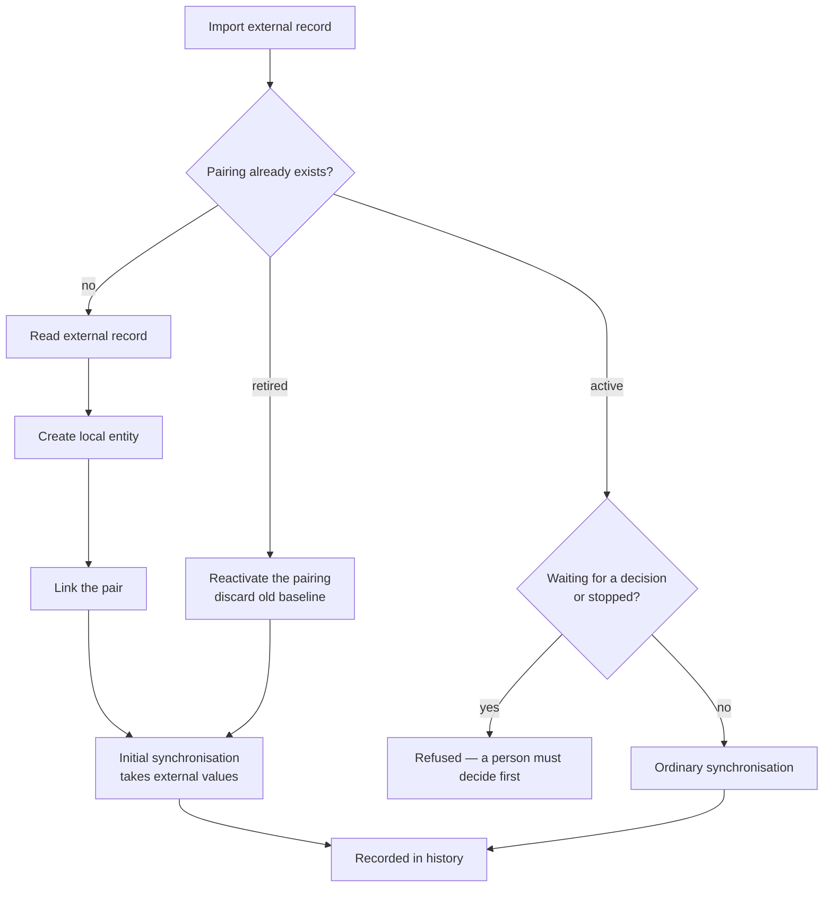

## Why

Importing an external record into Klabis and putting it under synchronisation are today two separate things stitched together by hand in the ORIS integration: the events module builds the local event itself, then asks the engine to enrol it. The pair is left without a baseline until some later scheduled pass happens to pick it up, the import leaves no trace in the synchronisation history, and every future integration would have to repeat the same stitching.

The synchronisation engine already reserves a capability for creating the local side (`SyncCapabilities.createsLocal`) but nothing uses it. This change turns "import an external record so that it is synchronised from then on" into a single, first-class engine operation.

## What Changes

- **New engine operation** `pullAndEnroll(entityType, externalReference, actingUser)`: reads the external record, creates the local entity from it, enrols the pair, and runs the initial synchronisation pass — leaving a baseline and one attempt in the history.
- **New adapter contract** `createLocal(projection)`: an integration says how a local entity is built from an external record and returns its identifier. Guarded by the `createsLocal` capability, which is declared for ORIS events.
- **Repeated import of the same external record** no longer fails. It runs an ordinary synchronisation instead, resolving the direction from the decision table like any other pass. An entity whose record is waiting for a decision (a conflict) or has stopped after repeated failures is refused — that record needs a person, and an import must not step over them.
- **Retired records can be brought back.** Importing an external record whose pairing was previously retired reactivates it and starts over from the external system's values, rather than reporting a duplicate.
- **BREAKING (behaviour)**: importing an ORIS event now goes through the engine end to end. The event is under synchronisation with a baseline the moment the import returns, instead of on some later scheduled pass, and the import itself is recorded in the synchronisation history.

Automatic bulk discovery of new ORIS events is deliberately out of scope: it needs its own rules about what to skip and what to leave alone, and is covered separately by the ORIS auto-sync work.

## Capabilities

### New Capabilities

_None._ The operation belongs to the existing synchronisation capability.

### Modified Capabilities

- `data-synchronization`: adds the requirement that an external record can be imported and put under synchronisation in one operation, including what happens when the pairing already exists or was previously retired; extends "Finished Entities Stop Being Synchronised" with the case of a retired pairing being deliberately brought back.
- `events`: importing an event from ORIS is now synchronised from the moment the import returns, a repeated import of the same ORIS event synchronises instead of being reported as a duplicate, and an event waiting for a decision about a difference against ORIS is not re-imported over.

## Impact

**Synchronisation engine** (`com.klabis.sync`)

- `SynchronizationPort` / `SynchronizationService`: the new operation.
- `SynchronizationAdapter`: `createLocal`.
- `SyncCapabilities`: `createsLocal` put to use; a factory for a pull-only integration that also creates.
- `SyncRecord`: reactivation of a retired record, discarding its stale baseline.
- `SyncRecordRepository`: lookup by external system and external identifier, retired records included; served by the uniqueness constraint that already exists, so no schema change.
- `FailureClassifier`: a rejected creation (a duplicate the database refuses) must stop the record rather than be retried.

**ORIS events integration** (`com.klabis.events`)

- `OrisEventSyncAdapter`: implements `createLocal` with the event-creation logic that lives in `OrisEventImportService` today, including the auto-mapped event type.
- `OrisEventImportService`: delegates to the engine; hand-rolled enrolment and duplicate detection go away.

**Boundaries.** The operation cannot run inside a single transaction: the external system is called with no transaction open, by design. Creating the entity and linking the pair commit first, then the initial pass runs — so a failed initial pass leaves a created entity whose pairing has no baseline yet. This matches what a failed import does today and is picked up by the next scheduled pass.

**Not addressed.** `createsExternal` stays unused — creating a record in the external system is not part of this change.
