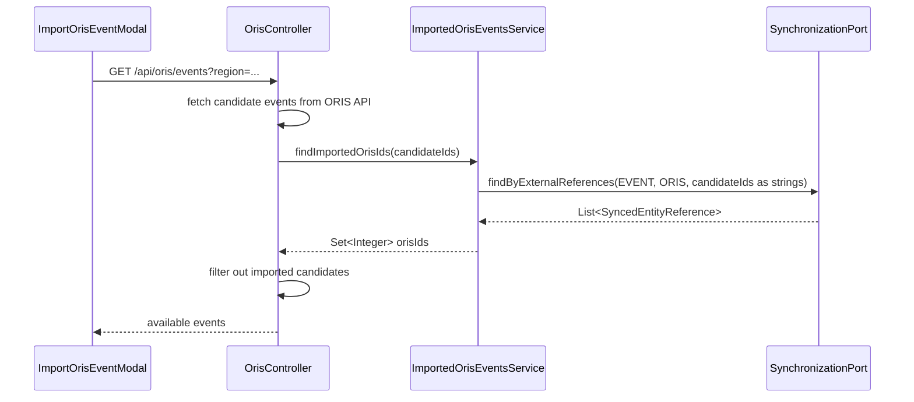
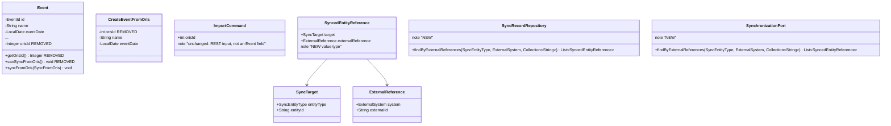

## Context

`Event` (the `events` module aggregate) carries an `orisId` field that predates the synchronisation engine (`sync` module). Today, ORIS pairing identity lives in two places:

1. `events.events.oris_id` — a column on `Event` itself, set at creation and read by a handful of callers.
2. `sync.sync_record` — the engine's own pairing table, keyed by `(entity_type, entity_id, external_system)` with a unique `(external_system, external_id, entity_type)` constraint (`uq_sync_record_external`), already the operative source of truth for `syncEventFromOris`, `pullAndEnroll`, and bulk sync.

`Event.orisId` is read in exactly three places today (traced via full-codebase grep):

- `EventController.addManagementAffordances` — gates the `syncEventFromOris` HAL affordance on `event.getOrisId() != null`. Redundant: `EventController.getEvent` already computes an equivalent `isEnrolled` flag via `synchronizationPort.findByTarget(...)` a few lines above, for `EventSyncEnrolment`.
- `Event.canSyncFromOris()` — a domain invariant guarding `syncFromOris()`. Its only caller, `OrisEventSyncAdapter.applyToLocal`, is reached exclusively for entities the engine has already resolved a `SyncRecord` for — enrolment is already the real gate.
- `ImportedOrisEventsService.findImportedOrisIds` (→ `EventRepository.findImportedOrisIds`, raw SQL `SELECT oris_id FROM events.events WHERE oris_id IN (:ids)`) — the one **live, user-facing** consumer: it excludes already-imported ORIS events from the "Import from ORIS" candidate list.

A fourth reader, `EventRepository.existsByOrisId`, is dead code (not called from any production path — `OrisEventImportService.importEventFromOris` delegates to `synchronizationPort.pullAndEnroll`, which is already idempotent for a repeat import).

## Goals / Non-Goals

**Goals:**
- Make `sync_record` the single source of truth for "is this Klabis event paired with an ORIS event, and with which one."
- Preserve the exact current behavior of the "already imported events are excluded from the ORIS import list" filter, including that a `RETIRED` pairing still counts as imported (matches today's behavior, since the old query had no status concept at all — any row in `events.events` with a matching `oris_id` counted).
- Remove `Event.orisId`, its column, and every reader/writer of it.

**Non-Goals:**
- Changing sync engine behavior, conflict handling, or retry logic.
- Changing `EventCategory.orisId` (a distinct concept: the ORIS `EventClass` id used to match categories during a sync merge — stays as-is).
- Any API, HAL affordance, or UI-visible change.

## Decisions

### D1 — New batch lookup on the sync engine, not a cross-module read of `sync_record`

`events` module code must not read `sync.sync_record` directly (module boundary, hexagonal dependency rule). The replacement for `findImportedOrisIds` needs a new capability on `SynchronizationPort` since none of the existing methods support "which of these N external ids already have *any* record (including `RETIRED`) for this entity type + system."

New method on `SyncRecordRepository` (secondary port, `sync.domain`), returning both sides of the pairing rather than just the external id — a caller matching candidates against results needs the external id, and a caller wanting to jump straight to the paired Klabis entity (a plausible near-future need) gets it for free instead of a second round trip. Reuses the engine's own value types instead of bare strings, so the pairing already carries its `SyncTarget` (entity type + entity id) and `ExternalReference` (system + external id) — the same two types every other `SynchronizationPort` method already speaks:

```java
record SyncedEntityReference(SyncTarget target, ExternalReference externalReference) {}

List<SyncedEntityReference> findByExternalReferences(SyncEntityType entityType, ExternalSystem system, Collection<String> externalIds);
```

Exposed on `SynchronizationPort` (primary port, `sync.application`) with the same signature, delegating straight through — no extra logic needed at that layer since "already imported" is exactly "a `sync_record` row exists for this external id," full stop, no status filter.

JDBC implementation (`SyncRecordJdbcRepository`) rides the existing `uq_sync_record_external (external_system, external_id, entity_type)` index — same shape as `findImportedOrisIds`'s old query, just against `sync.sync_record` instead of `events.events`, projecting both columns and assembling them into `SyncTarget`/`ExternalReference` in the adapter (`SyncRecordRepositoryAdapter`), consistent with how every other method on this port returns its results:

```sql
SELECT external_id, entity_id FROM sync.sync_record
WHERE entity_type = :entityType AND external_system = :system AND external_id IN (:externalIds)
```

No `retired_at IS NULL` predicate — deliberately includes `RETIRED` records, per the proposal's behavior-preservation requirement.

`ImportedOrisEventsService` only needs `externalReference().externalId()` from each result to build its `Set<Integer>` — it discards the paired `target()`.

### D2 — `ImportedOrisEventsService` becomes a thin adapter over `SynchronizationPort`



`ImportedOrisEventsService` converts `Integer` ORIS ids to/from `String` external ids at its boundary (the only place this module needs to know `sync`'s external ids are strings) and keeps its existing public contract (`Set<Integer> findImportedOrisIds(Collection<Integer> candidateOrisIds)`) unchanged — no caller of `ImportedOrisEventsPort` needs to change.

### D3 — `EventController` reuses the enrolment flag it already computes

`addManagementAffordances(Link, Event, boolean orisIntegrationActive, Authentication)` gains a fourth boolean parameter, `boolean orisEnrolled`, replacing the `event.getOrisId() != null` check at both call sites (DRAFT and ACTIVE branches). The caller (`EventController.getEvent`) passes the `isEnrolled` value it already derives from `synchronizationPort.findByTarget(...)` for `EventSyncEnrolment` — one HAL-affecting fact computed once, not twice from two different sources.

### D4 — Domain invariant `canSyncFromOris()` is deleted, not replaced

Once `Event.orisId` is gone, "can this event be synced from ORIS" has no domain-level meaning left to guard — enrolment (a `sync` module concern) is what decides whether `syncFromOris()` is ever invoked. `OrisEventSyncAdapter.applyToLocal` calls `event.syncFromOris(...)` only for events the engine resolved a `SyncRecord` for, so the invariant's job is already done upstream. Deleting it removes a check that can no longer fail (no `orisId` left to be null).

## Domain Model Changes



| Element | Change |
|---|---|
| `Event.orisId` field + `getOrisId()` | Removed |
| `Event.canSyncFromOris()` | Removed |
| `Event` private constructor / `reconstruct(...)` | `Integer orisId` parameter removed |
| `Event.CreateEventFromOris` record | `int orisId` component removed; dead `from(Event)` factory removed |
| `Event.ImportCommand` | Unchanged as a type (REST input DTO for "import this ORIS id"); only its dead `from(Event)` factory (which read `event.orisId`) is removed |
| `EventMemento.orisId` | Removed, along with its mapping in `from(Event)`/`toEvent()` |
| `events.events.oris_id` column | Dropped (edit `V001` migration script) |
| `EventRepository.existsByOrisId` (+ JDBC + adapter) | Removed (dead code) |
| `EventRepository.findImportedOrisIds` (+ JDBC + adapter) | Removed; replaced by `ImportedOrisEventsService` calling `SynchronizationPort.findByExternalReferences` |
| `SyncRecordRepository.SyncedEntityReference` | **New** value type, pairing `SyncTarget` with `ExternalReference` (both pre-existing `sync.domain` types) |
| `SyncRecordRepository.findByExternalReferences` | **New** secondary port method |
| `SynchronizationPort.findByExternalReferences` | **New** primary port method, thin delegation |
| `SyncRecordJdbcRepository` | New `@Query` backing the above, riding the existing `uq_sync_record_external` index |

No REST API, DTO, or HAL representation changes — this table covers domain/persistence/sync-engine internals only.

## Risks / Trade-offs

- **[Risk]** A test or fixture builds an `Event` via the private constructor/`reconstruct` with a positional `orisId` argument that gets silently misaligned after removal (compile-time parameter list shift). → **Mitigation:** the compiler catches every call site immediately since `RecordBuilder`-generated builders and positional constructors both fail to compile on a changed arity; no risk of a silent runtime bug.
- **[Risk]** The new `findByExternalReferences` query, if it accidentally added `retired_at IS NULL`, would silently start re-offering previously-imported-then-retired events for import — a real behavior regression. → **Mitigation:** explicit test scenario in `tasks.md` asserting a `RETIRED` sync record still excludes its external id from the "available to import" set.
- **[Trade-off]** `ImportedOrisEventsService` now does an `Integer↔String` conversion at its boundary that didn't exist before. → Accepted: it's the same boundary conversion `OrisEventSyncAdapter.toOrisId`/`ExternalReference` already perform elsewhere for the same reason (the `sync` module's external id is deliberately an opaque `String`).

## Migration Plan

1. Add `SyncRecordRepository.findByExternalReferences` + `SyncedEntityReference` + JDBC query + `SynchronizationPort` delegation (additive, no behavior change yet).
2. Repoint `ImportedOrisEventsService` at the new port method; delete `EventRepository.findImportedOrisIds` (+ JDBC + adapter) once nothing calls it.
3. Delete `EventRepository.existsByOrisId` (+ JDBC + adapter) — dead code, no caller to repoint.
4. Thread `orisEnrolled` into `EventController.addManagementAffordances`; remove the `event.getOrisId() != null` checks.
5. Remove `Event.canSyncFromOris()` and its call site guard (if any remains after `applyToLocal` review).
6. Remove `Event.orisId` field, getter, constructor/`reconstruct` parameter, `CreateEventFromOris.orisId`, both dead `from(Event)` factories, `EventMemento.orisId`.
7. Drop `oris_id` from the `V001` migration's `events.events` table definition.
8. Run full backend test suite; update/remove tests that asserted on the old field or query.

No rollback complexity: this is a same-deployment, single-PR-sized change with no data migration (the column is dropped, not backfilled — `sync_record` already holds every pairing that matters, since it has been the operative source for all sync flows since the engine's introduction).

## Open Questions

None outstanding — scope, behavior-preservation requirement (`RETIRED` still counts as imported), and the new port method's shape were confirmed during exploration.
