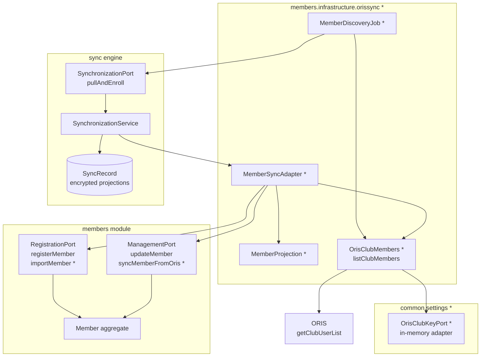
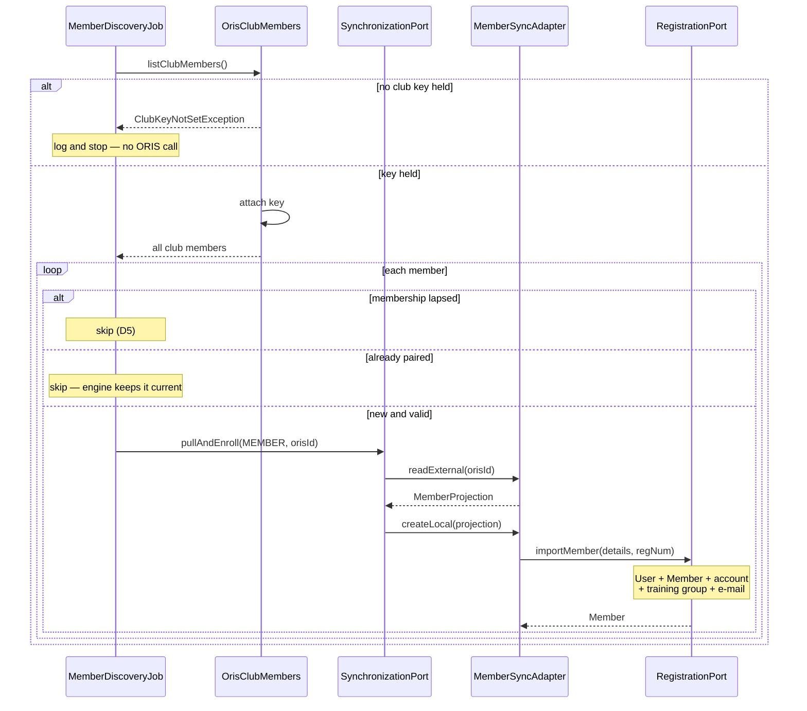
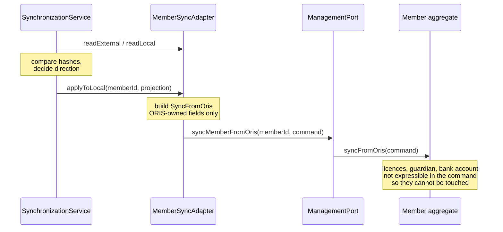

# Design

## Context

`com.klabis.sync` is a generic synchronisation engine (ADR-005). It has two integrations today: `OrisEventSyncAdapter` (`Event`, driven by an admin naming a specific ORIS id) and `DisciplineSyncAdapter` (`Discipline`, driven by `DisciplineDiscoveryJob` on a cron). Both are `SyncCapabilities.pullOnlyCreating()`. Per ADR-005/D2, a synced entity carries no `orisId` column — the pairing lives entirely in the engine's own `SyncRecord`.

`Member` (`com.klabis.members.domain.Member`) is registered through `RegistrationPort.registerMember(RegisterNewMember)`, which creates a `User` first (to share the id), generates a registration number via `RegistrationNumberGenerator`, and saves the `Member`. Editing goes through `ManagementPort.updateMember(memberId, UpdateMember)`, where `UpdateMember` is a **full snapshot** of the intended end state — callers take `prefilledUpdateCommand(memberId)` as a baseline and overlay only what changed — and `Member.update` publishes a birth-number audit event naming the user who made the change.

`Event` already distinguishes a synchronised write from a manual one: `Event.syncFromOris(SyncFromOris)` is a separate command from `Event.update(...)`, and the two publish `EventUpdatedEvent` with `UpdateOrigin.SYNCHRONISATION` and `UpdateOrigin.MANUAL` respectively. `Member` has no equivalent today.

`oris-client` exposes `getClubUserList(String clubKey)` returning `Map<String, ClubMember>` for the whole club. It is the only one of the client's eleven methods that needs a secret, it is deliberately not cached (it carries personal data), and the library explicitly leaves storing the key to the consuming application. Klabis holds no such key anywhere today.

See proposal.md — Why / What Changes for the motivation.

### What this change adds

New components are marked `*`; everything else already exists and is reused unchanged.



### Bringing one member in



### Applying a later ORIS change

Klabis-owned fields are protected by the shape of the command (D3): they are not expressible in it.



## API Changes

All four require the synchronisation permission; links and affordances are absent without it.

| Operation | Purpose | Notes |
|---|---|---|
| `GET /api/oris/club-key` | whether a key is held | returns `isSet` only, never the value |
| `PUT /api/oris/club-key` | supply a key | affordance offered only while `isSet` is false; blank refused |
| `DELETE /api/oris/club-key` | discard the held key | affordance offered only while `isSet` is true |
| `POST /api/members/oris-import` | run the import once, by hand | affordance on `GET /api/members`, only while a key is held |

A member representation additionally gains a `sync` link to the engine's **existing** `GET /api/members/{id}/sync` resource (D12) — no new endpoint, and the link is absent for a member never brought in from ORIS.

The club-key resource is reached by a link added to the API root by a postprocessor (D10); the import trigger is an affordance on the existing member-list response (D11). No existing response shape changes — every addition is an extra `_links`/`_templates` entry, so clients that ignore them are unaffected.

Per the project's spec-first workflow these are authored in `docs/openapi/spec/` before any controller is written, and the field-level security extensions carry the permission requirement.

## Goals / Non-Goals

**Goals:**
- Bring the club's ORIS membership into Klabis and keep the ORIS-owned personal details in step, reusing the existing engine and adapter contract unchanged.
- Give importing and synchronising each their own named entry point on the aggregate, so a machine-driven change is distinguishable from a human one — while every consequence of registering a member stays identical either way.
- Hold the ORIS club key without ever disclosing it, behind an interface that can later gain a persistent store without touching callers.
- Protect every Klabis-owned member field from being touched by synchronisation, by construction rather than by special-casing.

**Non-Goals:**
- No outward (Klabis → ORIS) writes. ORIS offers no member write API yet. When it does, the direction reverses and this design's `pullOnlyCreating` becomes `bidirectional`.
- No automatic pairing of a member who already exists in Klabis (see D8 — accepted limitation).
- No synchronisation of club membership validity (`memberFrom`/`memberTo`/`valid`) into Klabis's suspension model — the two are different concepts (D5).
- No persistent storage of the club key in this change (D9).
- No change to `Event` or `Discipline` synchronisation.

## Decisions

### D1: `MemberSyncAdapter`, capabilities `pullOnlyCreating()`, in `com.klabis.members.infrastructure.orissync`

Mirrors the two existing adapters exactly: new `SyncEntityType.MEMBER("members")`, `ExternalSystem.ORIS`, `SyncCapabilities.pullOnlyCreating()`. Lives in the module owning the entity, per ADR-005. The external id is the ORIS `ClubMember.id` (its internal club-membership id), as a string.

Alternative considered: keying the external reference on `regNum` instead, since it is human-readable and stable across the sport. Rejected — `regNum` is a value the projection itself synchronises (D3), and an external reference must be an identity that does not change when the data does.

### D2: `MemberProjection` carries only ORIS-owned fields

```java
record MemberProjection(
    String registrationNumber, String firstName, String lastName,
    LocalDate dateOfBirth, Gender gender, String nationality,
    String birthNumber, String email, String phone,
    String street, String city, String postalCode, String country,
    String chipNumber
) implements SyncProjection
```

Everything else `Member` holds — `identityCard`, `drivingLicenseGroup`, `medicalCourse`, `trainerLicense`, `refereeLicense`, `dietaryRestrictions`, `guardian`, `bankAccountNumber`, and the whole suspension block — is **absent from the record**. Per `SyncProjection`'s own contract, fields a Klabis module owns exclusively are invisible to synchronisation by construction, not by special-casing. There is nothing to `@JsonIgnore` here, unlike `OrisEventProjection`: no value needs smuggling from `readExternal` to `applyToLocal`.

Address is flattened into four strings rather than carrying the `Address` value object, matching `OrisEventProjection`'s reasoning: projections are plain data carriers serialised directly by `SyncProjectionCodec`, and value objects serialise unpredictably without Jackson wiring the codec deliberately does not carry.

### D3: An inward write goes through `Member.syncFromOris(...)`, a dedicated domain command

Just as creating gets its own entry point (D4), so does synchronising. `Member` gains a command mirroring what `Event` already has:

```java
record SyncFromOris(
    RegistrationNumber registrationNumber, String firstName, String lastName,
    LocalDate dateOfBirth, Gender gender, Nationality nationality,
    BirthNumber birthNumber, EmailAddress email, PhoneNumber phone,
    Address address, String chipNumber
) {}

public void syncFromOris(SyncFromOris command) { … }
```

The command carries **exactly the ORIS-owned fields and nothing else**, so field ownership is stated once, in a type. Licences, guardian, bank account and dietary requirements are not expressible in the command at all — they cannot be cleared by a synchronisation even by mistake, which is a stronger guarantee than remembering to copy the right baseline values across.

Three reasons this beats routing through `ManagementPort.updateMember`:

**The aggregate can tell the two apart.** `Event.syncFromOris` publishes `EventUpdatedEvent` with `UpdateOrigin.SYNCHRONISATION`, while a manual edit publishes `UpdateOrigin.MANUAL`. Members have no such distinction today because they have no update event at all — but the moment one is wanted (an audit trail, "changed by ORIS" in the UI, a notification suppressed for machine edits), the information has to exist at the point of the write. Going through `updateMember` erases it irrecoverably.

**`updateMember` wants a human.** `Member.update` publishes `BirthNumberAccessedEvent.modified(command.updatedBy(), …)` when the birth number changes. A synchronisation has no `UserId` to put there: it would either pass `null` — silently skipping an audit entry the method promises to write — or invent a synthetic user, recording a person who did nothing. `syncFromOris` sidesteps the question instead of answering it dishonestly. (This is the same audit gap noted in D13, now confined to one clearly-named method rather than smuggled through the manual-edit path.)

**The overlay was fragile.** The earlier draft of this design took `prefilledUpdateCommand` as a baseline and overlaid the ORIS-owned fields onto it. That works, but it protects Klabis-owned fields only for as long as everyone remembers *not* to touch them: `UpdateMember` is a full snapshot, so a future field added to it is silently nulled by every sync pass until someone notices. The command type makes the same guarantee structurally.

**What `syncFromOris` does and does not protect.** It cannot touch fields absent from its command — that is the protection. It does *not* make the ORIS-owned fields conditional: each is written from the command unconditionally, including when the command holds `null`. Protecting a Klabis-entered value against an empty ORIS field is the engine's job, not the aggregate's, and happens before `syncFromOris` is ever reached — see D6.

The adapter calls it through a port on `ManagementPort` (`syncMemberFromOris(memberId, command)`) rather than reaching for the repository directly, keeping the application-service boundary the other adapters respect.

Alternative considered: routing through `ManagementPort.updateMember` with an overlay, as an earlier draft did. Rejected for the three reasons above — chiefly that it discards the distinction between a human edit and a machine one at exactly the point where that distinction is cheapest to keep.

### D4: Importing is its own port method, composing the existing registration command

An imported member differs from a hand-registered one in exactly one respect: the registration number arrives with it instead of being issued. That difference is made explicit as a second method on `RegistrationPort` rather than as an optional parameter on the existing one:

```java
record ImportMember(RegisterNewMember details, RegistrationNumber registrationNumber) {}

Member importMember(ImportMember command);
```

`RegisterNewMember` is left exactly as it is. The import command **composes** it, so the caller still assembles one ordinary registration command and states the number alongside it.

Both methods converge immediately onto one private path in `RegistrationService` — the only branch is where the number comes from:

```
registerMember(cmd) ──→ number = generator.generate(...) ──┐
                                                           ├──→ register(details, number)
importMember(cmd)   ──→ number = cmd.registrationNumber() ─┘        │
                                                                    ▼
                                            User created → Member.RegisterMember → save
```

So user creation, the shared-id invariant, validation and every published event stay in one place; nothing below `register(...)` knows which entry point it came from. A member brought in from ORIS therefore gets a `User`, a financial account, age-based training-group assignment and a password-setup invitation — every consequence of a normal registration, because below the first line it *is* a normal registration.

Alternative considered: adding an optional `registrationNumber` to `RegisterNewMember`. Rejected — every existing caller would have to pass `null` for a field that is meaningless to them, and a nullable field silently expresses "sometimes issued, sometimes given" at a spot where the two cases are worth naming. A distinct method makes the import path greppable and lets it carry import-specific preconditions later without disturbing hand registration.

The `UNIQUE` constraint on `members.registration_number` is what enforces the "already in use" scenario in the spec — no extra check is needed, and adding one would be a race anyway.

### D5: Membership validity gates the import; it is never synchronised

`ClubMember.valid` is read in `MemberDiscoveryJob` to decide whether to bring a member in at all. It is **not** part of `MemberProjection`, so once a member is paired, ORIS membership lapsing has no effect on Klabis.

ORIS models membership as an interval plus a flag; Klabis models it as suspension with a reason, a note and the user who suspended. Mapping `valid=false` onto suspension would require inventing a `DeactivationReason` and a synthetic `suspendedBy`, fabricating an accountable human action from a data flag. Ending a membership stays a decision a person makes.

### D6: ORIS field mapping

Formats below are taken from a captured ORIS response (`oris-client`'s `getClubUserList.json` / `clubMember.json`), not assumed. Note that ORIS sends several numeric-looking fields as JSON **strings** (`"ID": "33630"`, `"SI": "1000001"`); `oris-client`'s `ClubMember` record already coerces them to `int`.

| ORIS `ClubMember` | ORIS format | Klabis | Transformation |
|---|---|---|---|
| `id` | `"33630"` → `int` | external reference | `String.valueOf`; not in projection |
| `regNum` | `"ZBM0001"` | `RegistrationNumber` | none — same `XXXYYSS` shape |
| `firstName` / `lastName` | `"Jan"` / `"Novák"` | `PersonalInformation.name` | none; UTF-8 throughout |
| `birthday` | `"1990-01-15"` → `LocalDate` | `dateOfBirth` (`LocalDate`) | none — parsed by `oris-client` |
| `gender` | `"M"` / `"F"` | `Gender` | `"M"`→`MALE`, `"F"`→`FEMALE`, else `null` |
| `nationality` | `"CZ"` | `Nationality` | none — both ISO 3166-1 alpha-2; upper-case defensively |
| `persNum` | `"900115/0000"` | `BirthNumber` | none — Klabis accepts `RRMMDD/XXXX`; **encrypted both sides** |
| `email` | `"jan@example.com"` | `EmailAddress` | blank → `null` |
| `phone` | `"700000001"` | `PhoneNumber` | **`+` prefix required** — see below |
| `street` / `city` | `"Testovací 1"` / `"Brno"` | `Address.street` / `.city` | none |
| `zip` | `"600 00"` (with space) | `Address.postalCode` | none — Klabis's pattern permits inner spaces |
| `country` | `"CZ"` | `Address.country` | none — ISO 3166-1 alpha-2 both sides |
| `si` | `"1000001"` → `int` | `chipNumber` (`String`) | `0` → `null`, else decimal string |
| `memberFrom` / `memberTo` | `"2019-08-07"` | — | gate only (D5) |
| `valid` | `1` / `0` → `Boolean` | — | gate only (D5); `oris-client` deserialises int→boolean |
| `userId`, `username` | `"49207"` / `"testuser1"` | — | ORIS-internal, ignored |

Two transformations are not merely renames:

**Telephone.** Klabis's `PhoneNumber` requires E.164 — a leading `+` — while ORIS holds bare national numbers (`"700000001"`). A number without `+` must therefore be normalised before it can be stored at all. The country to assume comes from the member's postal address (`ClubMember.country`), not their nationality — a phone number belongs to wherever the member can be reached, which their citizenship does not reliably indicate; for `CZ` that is `+420`. A number that already starts with `+` is taken as-is. A number that cannot be normalised confidently is mapped to `null` rather than guessed — an unreachable wrong number is worse than a missing one. **This is the mapping most likely to need adjusting against real club data** (foreign members, numbers stored with `00` prefixes, extensions).

**SI chip.** `si == 0` maps to `null`, not `"0"`: chip number zero does not exist, and treating it as a value would make "no chip" and "chip 0" hash differently on the two sides, producing a permanent phantom difference.

Blank strings from ORIS (`""`) are normalised to `null` across all optional text fields, so that "absent" has one representation on both sides of the hash.

**What happens when ORIS holds nothing for a field Klabis has** (the spec scenario "A detail ORIS does not hold is not cleared") deserves stating precisely, because the protection does *not* come from `syncFromOris` in D3.

`applyToLocal` receives the whole external projection and passes it on unconditionally — neither it nor `syncFromOris` does field-by-field merging. The protection comes one level up, from **when the engine calls it at all**:

- The member's chip number was set in Klabis after the last agreed baseline → the local side has changed. The engine reaches `CONFLICT`, writes nothing, and asks for a decision. The chip number survives.
- Nobody touched the member in Klabis and ORIS simply never held a chip number → nothing has changed on either side since the baseline, so no write happens at all.
- The member was brought in from ORIS without a chip, and a chip is later entered in Klabis → first case above.

The only way a `null` from ORIS reaches the member is `ADOPT_EXTERNAL`, which the engine chooses exclusively when the local side is unchanged since the baseline — i.e. when there is no local value anyone would lose. This is the engine's existing "a local change is never silently overwritten" requirement doing the work; the adapter needs no condition of its own, and adding one would fight the engine's direction resolution rather than help it.

### D7: `MemberDiscoveryJob` mirrors `DisciplineDiscoveryJob`

Same shape as the discipline job: read the whole club once, subtract already-paired external ids via `SynchronizationPort.findByExternalReferences`, call `pullAndEnroll` per new id, catch per-member failures so one bad record cannot stop the run. Runs on its own cron, separate from the engine's scan — already-paired members are kept current by the engine regardless.

Two differences from the discipline job:
- It filters on `valid` before enrolling (D5).
- It does nothing at all when no club key is held (D9), logging that fact rather than surfacing an ORIS failure.

### D8: Accepted — a member already in Klabis is not paired automatically

`SynchronizationPort.pullAndEnroll(entityType, externalReference, actingUser)` either creates a local entity or finds an existing *pairing*. Its third parameter is the acting user, not a target id: there is no way to say "pair this external record with that existing member". Adding one is a change to the engine's primary port and belongs to its own proposal.

Consequence in production: a member who exists in Klabis and also in ORIS will fail to be brought in, rejected by the `UNIQUE` registration-number constraint, and logged once per run. Accepted for first deployment. It is self-limiting — the failure is loud, bounded, and creates nothing.

### D9: Club key behind a port, with an in-memory adapter and a narrow ORIS facade

Two pieces:

**Storage.** A `OrisClubKeyPort` in `com.klabis.common.settings` with `store(String)`, `isSet()`, `clear()` — and deliberately **no getter for callers**. It lives in `common.settings` rather than the members module because the concept (a cluster-wide secret held only in memory) is not specific to ORIS and other modules can hold their own secrets behind the same contract. An in-memory adapter holds it in a field. The value is never returned through the port, so no REST path can disclose it, by construction rather than by remembering to mask it.

**Access.** A narrow `OrisClubMembers` interface with `listClubMembers()` — no key parameter. The implementation injects the separate `OrisClubKeyAccessor` (the read side, kept out of `OrisClubKeyPort`) and throws `ClubKeyNotSetException` when none is held. Callers of the port never see the key, so they cannot leak it or be tempted to log it; only a component that attaches the key to an outgoing request injects the accessor explicitly.

This wraps only key-bearing operations, not all eleven `OrisApiClient` methods. Wrapping the whole client would mean delegating ten methods unchanged forever and re-delegating each new one. The interface is shaped to gain further key-bearing operations (entry submission is the expected next one) without becoming a general-purpose client proxy.

Alternative considered: keeping `clubKey` a method parameter and having the facade merely validate. Rejected — the caller would then have to obtain the key from somewhere, which defeats the point of hiding it.

The in-memory store means the key does not survive a restart and synchronisation silently stops until someone re-enters it. See Risks.

### D10: The club key hangs off the root resource, with mutually exclusive affordances

The club key is a club-wide administrative setting belonging to no single entity, so it is reached from the API root rather than from any member or event. A postprocessor on `EntityModel<RootModel>` adds it, exactly as `RootAdminLinkProcessor` already adds the `admin` link — the root controller itself stays untouched, per its own comment that links are contributed by the modules that own them.

The resource reports only whether a key is held, and carries **one** of two affordances, never both:

```
GET /api/oris/club-key            (requires the synchronisation permission)

  { "isSet": false }                 { "isSet": true }
  _templates:                        _templates:
    set    → PUT  …/club-key           clear → DELETE …/club-key
```

The state therefore *is* the affordance: a client never has to decide which action applies, and an unset key offers no "clear" that would do nothing. This is the same hypermedia-driven pattern the frontend already relies on for conditional actions.

The read returns a boolean and nothing else — not a masked or truncated value, since even a prefix narrows a brute-force search. Both the link and its affordances are absent for a user without the synchronisation permission, which is how the spec's "the action is not offered" scenarios are satisfied.

Clearing is its own operation rather than "set to empty", because the spec requires a blank value to be refused; overloading the setter would make an accidental empty submission indistinguishable from a deliberate discard.

In the UI this lives in the Admin section, reached from the existing `admin` link on the root.

### D11: The first import is triggered by hand, from the member list

Bringing in the whole club at once sends a burst of password-setup e-mails (see Risks), so the first run should happen when someone is watching rather than whenever the cron next fires. The trigger is an affordance on the member list response — the page where the consequences will appear:

```
GET /api/members                  (requires the synchronisation permission)

  _templates:
    importFromOris → POST /api/members/oris-import
```

The affordance appears only for a user with the synchronisation permission **and** only while a club key is held: without a key the action could not do anything, so offering it would be a dead end. The scheduled job (D7) performs the same work; this only lets a human start it once, deliberately, before the schedule is relied upon.

Placing it on the member list rather than on a settings page keeps cause and effect together: the administrator triggers the import and is already looking at the list that is about to fill up.

### D12: A member response carries a `sync` link, but only when it is actually paired

The member representation gains a `sync` link pointing at the engine's existing sync-state resource, so a client can navigate from a member to how that member stands against ORIS. This reuses the pattern `EventController` and `DisciplineController` already share:

```java
if (isEnrolled(memberId)) {
    klabisLinkTo(methodOn(SyncApi.class).getSyncState(SyncEntityTypeParam.MEMBERS, memberId.toString()))
            .ifPresent(link -> dtoModel.add(link.withRel("sync")));
}
```

where enrolment is established through `synchronizationPort.findByTarget(...)`, exactly as the event controller does.

The link is **absent for a member who was never brought in from ORIS** — which is how the spec's "A member not linked to ORIS" scenario is satisfied: no way to reach a synchronisation state is offered, rather than a link leading to an empty one. Members registered by hand therefore look exactly as they do today.

No new endpoint is introduced. Everything behind the link — the state, the affordances, the per-side data and the permission that gates it — is the engine's existing `getSyncState`, which already restricts detail to users holding the synchronisation permission (`data-synchronization`'s own requirement). Consequently the birth number visible through that resource (D13) is governed by the engine's rules, not by the member module's field-level security.

`SyncEntityTypeParam` gains a `MEMBERS` value alongside `EVENTS`/`DISCIPLINES`, matching the new `SyncEntityType.MEMBER("members")` from D1.

### D13: `containsSensitiveData` is set, and what it does not do

`MemberSyncAdapter` is the first adapter to declare `containsSensitiveData = true` — the projection carries a birth number. Today nothing in the engine reads this flag; projection columns are already encrypted at rest for every adapter via `EncryptedString`, the same mechanism protecting `members.birth_number`. The flag is therefore declaratively correct and currently inert.

The engine's REST layer returns **decrypted** projections, restricted by the existing `data-synchronization` requirement that only a user with the synchronisation permission sees the data held on either side. That is the protection; the flag is not.

### D14: The collision with sample data is prevented on the sample-data side, not the ORIS side

Sample members (`ZBM9000`, `ZBM9500`) and ORIS-sourced members must not both populate the same database, or the import trips over registration numbers it did not create. Rather than gating every ORIS entry point on the absence of `example-data`, the **sample data stands down when ORIS is active**: the four `@Profile("example-data")` bootstrap initialisers (`MembersDataBootstrap`, `TrainingGroupDataBootstrap`, `EventsDataBootstrap`, `MembershipFeeTiersDataBootstrap`) become `@Profile("example-data & !oris")` — the expression form, not the array form; Spring's array-form `@Profile` is OR semantics and would not stand down when both profiles are active.

This puts the condition in one place instead of three. Gating the ORIS side would mean remembering it on the discovery job, on the manual trigger, and on every future entry point — and forgetting it on one of them is a silent collision. Sample data has exactly one way in, so that is where the gate belongs. The `oris` profile then remains the **only** gate on anything ORIS-related, as it already is for the rest of the integration (`@OrisIntegrationComponent`).

**Consequence for local development**: the default profile set is `h2,ssl,debug,metrics,oris,example-data` — both profiles at once. After this change a developer running the defaults gets **no demo data**, because `oris` is active. Getting demo data back means dropping `oris` from the active profiles. This is the intended reading of "sample data and real data are alternatives", but it does change what `./runLocalEnvironment.sh` produces out of the box, so it needs calling out in the backend `CLAUDE.md` alongside the profile table.

## Risks / Trade-offs

- **The club key is forgotten on every restart** → synchronisation stops silently until someone notices and re-enters it. Mitigation: the discovery job logs the missing key on each run, and `isSet()` is queryable so a future settings page can show it plainly. A persistent encrypted store is the obvious follow-up.
- **The first run registers the entire club at once** → a burst of password-setup e-mails to every member who has an address in ORIS, risking SMTP rate limits or reputation damage. Accepted deliberately. The blast radius is bounded by how many members have e-mail addresses in ORIS, which is typically well under the full roster.
- **The first run also fills training groups and creates financial accounts** for every imported member, via the existing `MemberCreatedEvent` listeners. Intended, but not reversible with one action.
- **Members already in Klabis fail every run** (D8) → repeated identical errors in the log. Bounded and creates nothing, but noisy until the engine can pair with an existing entity.
- **Synchronisation reads and writes birth numbers without audit entries**, unlike `getMemberAndRecordView` and `Member.update`. Accepted: the alternative is either flooding the audit log on every scan or recording a human who did nothing. Confined to `syncFromOris` (D3), so the gap is one named method rather than a hole in the manual-edit path, and the data stays behind the synchronisation permission.
- **ORIS `gender` values beyond `M`/`F`** map to `null`, which then reads as a difference against a member who has a gender set in Klabis. Low likelihood; surfaces as a normal conflict rather than data loss.

## Migration Plan

No schema migration. `Member` gains no column — the pairing lives in the engine's tables, as for `Event` and `Discipline`. `SyncEntityType.MEMBER` is a new enum value; existing sync records are unaffected.

Deployment order: upgrade `oris-client` to 1.2.0 (it carries `getClubUserList`) → deploy → an administrator supplies the club key → the discovery job brings the club in on its next run.

Rollback: clear the club key. The job stops, nothing further is imported, and already-imported members remain as ordinary Klabis members whose sync records simply stop being acted on.

## Resolved Questions

- **Lapsed ORIS members are not surfaced anywhere.** D5 makes it a non-event by design; no notification, no report.
- **The club key lives in the Admin section**, reached from the root resource (D10).
- **The first import is triggered manually**, from the member list (D11), so the e-mail burst happens under supervision. The cron then keeps it current.

## Open Questions

- Telephone normalisation (D6) is the one mapping likely to need tuning against real club data — foreign members, numbers stored with a `00` prefix, or extensions. Worth checking against an actual `getClubUserList` response for the club before relying on it.
- Should the manual import report what it did (how many brought in, skipped, failed), or is the member list filling up feedback enough? The scheduled job only logs.
