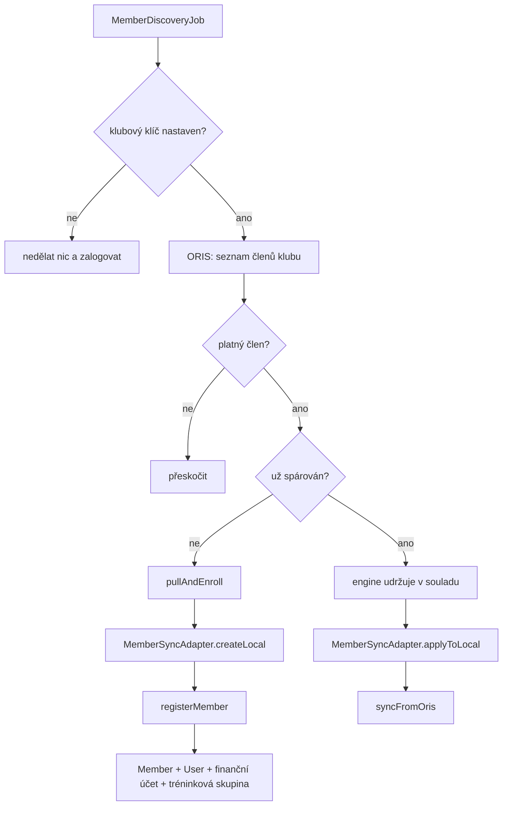

# Proposal

## Why

Členská základna klubu je dnes vedená dvakrát: v ORISu, kde je zdrojem pravdy pro celý český orientační sport, a v Klabisu, kam ji musí administrátor přepsat ručně. Každý nový člen se tak zakládá dvakrát a každá změna adresy, telefonu nebo čipu se musí provést na obou místech — nebo se neprovede nikde a data se rozejdou.

Klub už má na tenhle druh problému hotový nástroj: generický synchronizační engine (`com.klabis.sync`, ADR-005), který právě podruhé prokázal svůj návrh na disciplínách. Napojit na něj členy znamená především napsat adaptér, ne stavět integraci od nuly.

## What Changes

- Zavést `MemberSyncAdapter` — pull-only adaptér se schopností zakládat lokální stranu (`SyncCapabilities.pullOnlyCreating()`), který čte ORIS `getClubUserList` a udržuje osobní údaje člena v souladu.
- Zavést `MemberDiscoveryJob` — plánovaná úloha, která projde seznam členů klubu v ORISu a každého dosud nespárovaného zaeviduje. Stejný vzor jako `DisciplineDiscoveryJob`: členy nikdo nejmenuje jednotlivě, systém si je najde sám.
- Nový člen z ORISu vzniká **registrací**, která se od ruční liší jediným: registrační číslo přichází s ním místo aby se vygenerovalo. Vzniká tím i uživatelský účet, finanční účet a zařazení do tréninkové skupiny podle věku — všechny obvyklé důsledky registrace.
- Změna člena v ORISu se promítne **vlastním doménovým příkazem `Member.syncFromOris()`** — obdobou toho, co už má událost. Příkaz nese výhradně pole, která ORIS vlastní, takže se synchronizace ostatních nemůže dotknout ani omylem. Zároveň tím aplikace ví, že změnu provedl stroj, a ne člověk — což ruční cesta přes úpravu členy nedokáže rozlišit.
- **Registrační číslo se přebírá z ORISu**, negeneruje se. ORIS je jeho vlastníkem; formát `ZBM9000` z něj ostatně pochází. Import proto dostane **vlastní metodu** `RegistrationPort.importMember()`, která skládá stávající registrační příkaz s daným registračním číslem — `RegisterNewMember` zůstává nedotčený, aby stávající volající nemuseli předávat hodnotu, která je pro ně bezvýznamná.
- Synchronizují se **jen údaje, které ORIS skutečně vlastní**: registrační číslo, jméno, datum narození, pohlaví, státní příslušnost, rodné číslo, e-mail, telefon, adresa a číslo SI čipu. Pole, která ORIS nezná (průkaz, řidičské oprávnění, licence, zákonný zástupce, bankovní účet, dietní omezení), zůstávají plně v režii Klabisu a synchronizace se jich nesmí dotknout.
- **Členství se nesynchronizuje.** ORIS vede členství jako časový interval (`memberFrom`/`memberTo`/`valid`), Klabis jako pozastavení s důvodem a odpovědnou osobou — nejsou to tytéž pojmy a mechanicky se nepřevádějí. Místo toho se členové, kteří v ORISu neplatí, vůbec neimportují.
- Zavést správu klubového klíče k ORISu. Dnes ho Klabis nemá nikde; `oris-client` ho vědomě nespravuje a nechává na konzumující aplikaci. Konkrétně:
  - Uživatel s oprávněním k synchronizaci klíč nastaví, může ho **zahodit**, a systém umí odpovědět, **zda je nastaven** — ale nikdy nevrátí jeho hodnotu, ani zamaskovanou. Jednou zadaný klíč se dá jen přepsat nebo zahodit, nikdy přečíst.
  - Klíč se zatím drží jen v paměti běžící aplikace, takže ho restart zapomene a musí se zadat znovu. Rozhraní se ale navrhne tak, aby za ním šlo později vyměnit trvalé šifrované úložiště bez zásahu do volajících.
  - Operace vůči ORISu, které klíč vyžadují, se schovají za vlastní rozhraní, které klíč **samo doplňuje** — volající o něm vůbec neví. Není-li klíč nastaven, volání skončí srozumitelnou chybou místo odmítnutí z ORISu. Dnes takovou operací je jen načtení členů klubu; rozhraní počítá s tím, že další přibydou (například zápis přihlášek). Zbývající volání ORISu, která klíč nepotřebují, zůstávají beze změny.
- **První import se spustí ručně.** Zavedení celého klubu najednou rozešle dávku výzev k nastavení hesla, takže to má proběhnout pod dohledem, ne až když se poprvé probudí plánovaná úloha. Akce se nabídne v seznamu členů — tedy na stránce, kde se výsledek vzápětí projeví — a jen tomu, kdo má oprávnění k synchronizaci a zároveň je nastaven klubový klíč.
- Člen v odpovědi API dostane **odkaz na stav své synchronizace** s ORISem. U člena, který z ORISu nepřišel, odkaz chybí.
- **Ukázková data a data z ORISu se vylučují** — ale podmínka se obrací: místo aby se import vypínal při ukázkových datech, přestanou se ukázková data zakládat, když je aktivní ORIS integrace. Podmínka tak leží na jediném místě (ukázková data mají jedinou cestu dovnitř) namísto na každém vstupním bodě importu. Praktický dopad: ve výchozím nastavení pro vývoj jsou dnes aktivní oba profily zároveň, takže po této změně vývojář bez úpravy profilů **demo data nedostane**.

## Capabilities

### New Capabilities
- `member-synchronization`: průběžné udržování členů Klabisu v souladu s jejich protějšky v ORISu — automatické zavedení nového člena, promítnutí změny osobních údajů a viditelnost stavu synchronizace u konkrétního člena.
- `oris-club-key`: nastavení, zahození a zjištění přítomnosti klubového klíče k ORISu uživatelem s oprávněním k synchronizaci, aniž by systém kdy prozradil jeho hodnotu.

### Modified Capabilities
- `members`: registrace člena může nově převzít registrační číslo zvenčí místo toho, aby si ho systém vždy vygeneroval sám.

## Impact

- **Backend members**: `RegistrationPort` dostává druhou metodu `importMember()`, která skládá stávající `RegisterNewMember` s daným registračním číslem; obě metody se v `RegistrationService` sbíhají do jedné společné cesty. `Member` dostává příkaz `SyncFromOris` a metodu `syncFromOris()`, zpřístupněnou přes `ManagementPort`. `RegisterNewMember`, `UpdateMember` ani doménový příkaz `Member.RegisterMember` se nemění.
- **Backend sync**: nová hodnota `SyncEntityType.MEMBER`; nový `MemberSyncAdapter`, `MemberProjection` a `MemberDiscoveryJob` v novém balíčku `com.klabis.members.infrastructure.orissync`.
- **Citlivé údaje**: `MemberSyncAdapter` jako první adaptér deklaruje `containsSensitiveData` — projekce nese rodné číslo. Šifrování projekcí v úložišti už engine má (`EncryptedString`, stejně jako `members.birth_number`), takže jde o nastavení příznaku, ne o novou infrastrukturu.
- **Audit**: synchronizace čte rodná čísla bez zápisu do `VIEW_BIRTH_NUMBER` auditu. Vědomě přijato — spec `data-synchronization` už detail synchronizace zpřístupňuje jen držiteli oprávnění k synchronizaci.
- **Klubový klíč**: nový port ve `common.settings` s in-memory adaptérem (klíč nepřežije restart) a tři REST operace — zjistit zda je nastaven, nastavit ho a zahodit. Port žije ve `common.settings`, protože jde o obecný koncept tajemství drženého jen v paměti, který využijí i další moduly. Čtecí operace vrací výhradně ano/ne, nikdy hodnotu; nabízená akce se řídí stavem (nastavit když chybí, zahodit když je). Zdroj visí na kořeni API a v UI patří do administrační sekce. Nové rozhraní zastřešující klíčem chráněná volání ORISu, s vlastní výjimkou pro nenastavený klíč.
- **API členů**: nová operace pro ruční spuštění importu, nabízená jako akce v seznamu členů; odkaz na stav synchronizace v odpovědi člena, přítomný jen u členů spárovaných s ORISem. Žádná stávající odpověď nemění tvar — jde o přidané odkazy a akce.
- **Telefonní čísla vyžadují převod**: Klabis ukládá telefon v mezinárodním tvaru s předvolbou, ORIS drží holá národní čísla. Číslo, které nelze převést spolehlivě, se raději nepřevezme vůbec, než aby se uhádlo špatně. Je to nejpravděpodobnější místo k doladění proti skutečným datům klubu.
- **Ukázková data**: čtyři bootstrap třídy (členové, tréninkové skupiny, události, tarify příspěvků) se přestanou spouštět při aktivní ORIS integraci; je třeba to popsat v profilové tabulce v `backend/CLAUDE.md`.
- **Konfigurace**: cron výrazy pro discovery job.
- **Databáze**: žádná změna schématu členů. Párování drží engine ve svých vlastních záznamech, stejně jako u událostí a disciplín (ADR-005).
- **Mimo rozsah**: zápis změn z Klabisu do ORISu. ORIS pro členy zatím nenabízí zapisovací API. Až ho nabídne, směr se otočí — administrátor založí člena v Klabisu a ten se propíše do ORISu.
- **Přijaté omezení**: člen, který už v Klabisu existuje a zároveň je v ORISu, se automaticky nespáruje — engine dnes umí jen „založit nový", ne „napojit na tenhle existující". V produkci to skončí odmítnutím kvůli jedinečnosti registračního čísla a záznamem v logu. Přijato vědomě pro první nasazení.
