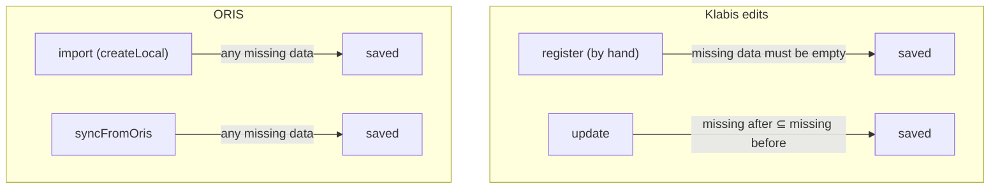
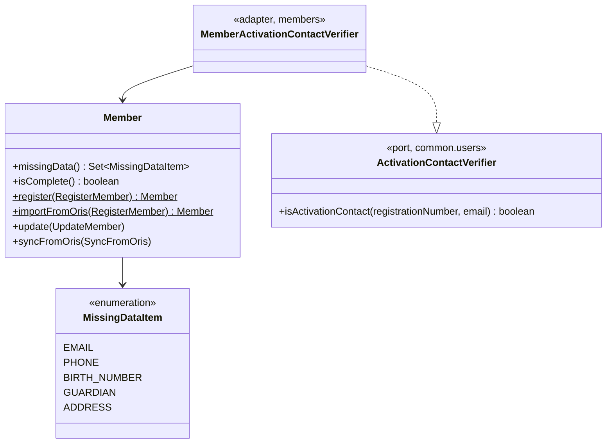

## Context

Importing the real ZBM club from ORIS (archived change `2026-09-24-import-oris-members`) brings in only 24 of 273 current members. `MemberDiscoveryJob` → `SynchronizationPort.pullAndEnroll` → `MemberSyncAdapter.createLocal` → `RegistrationPort.importMember` → `Member.register` rejects the rest through three domain invariants:

| Invariant (in `Member`) | Called from | Why ORIS data fails it |
|---|---|---|
| `validateContactInformation`: e-mail and phone of the member or their guardian | `register`, `update`, `syncFromOris` | ORIS records without a phone or e-mail |
| `validateGuardianForMinors` | `register`, `update` | ORIS never holds a guardian; `MemberSyncAdapter.buildImportMember` always passes `null` |
| `validateBirthNumberNationality`: required for CZ, forbidden otherwise | `register`, `update`, `syncFromOris` | missing, malformed, or present for non-CZ nationals |

The failures are thrown inside the per-member `try/catch` of `MemberDiscoveryJob`, so they are only logged.

Two further defects were found while auditing where e-mail, phone, guardian and birth number are used:

1. **NPE:** `RegistrationService.register` calls `userService.createUser(regNo, command.email().value(), …)`. A minor with only a guardian's e-mail passes `Member` validation and then fails on this line. `User.createdUserWithEmail` also requires an e-mail.
2. **Account takeover:** `PasswordSetupServiceImpl.requestNewToken(registrationNumber, email)` sends a fresh activation link to *whatever* e-mail the caller supplies. Registration numbers are guessable (`ZBM0002`), so anyone can take over any `PENDING_ACTIVATION` account. `User` does not store an e-mail; the address only travels in `UserCreatedEvent` for the one-off welcome e-mail.

Outside `Member` itself and its mappers, nothing depends functionally on phone, guardian or birth number. E-mail matters only for account activation. So relaxing the invariants is a contained domain change.

## Goals / Non-Goals

**Goals:**
- Every current ORIS club member can be imported, whatever their data quality.
- Members registered by hand stay exactly as strict as today; no Klabis edit can make any member less complete.
- Administrators can find incomplete members and see what is missing.
- Close the activation-link takeover before the import runs on real data (first iteration).
- Fix the guardian-only-e-mail NPE.

**Non-Goals:**
- A queue or review step for failed imports. The per-member failure log stays as is; failures should now be rare.
- Notifying members to activate, or a bulk "invite" action. Clubs tell members out of band.
- Letting members complete their own missing data through a dedicated prompt.
- A nightly job to recompute incompleteness when a minor turns 18 (see D3).
- Filtering by a specific missing item.

## Glossary

| Term | Meaning |
|---|---|
| **Missing data item** | One of `EMAIL`, `PHONE`, `BIRTH_NUMBER`, `GUARDIAN`, `ADDRESS`: a detail Klabis requires of a complete member that this member lacks. |
| **Missing data** | The set of missing data items of a member, derived from its current state and today's date. |
| **Complete / incomplete member** | A member whose missing data is empty / non-empty. |
| **Never worsen** | The rule that an edit made in Klabis may not add an item to a member's missing data. |
| **Activation contact** | An e-mail address that may receive a member's activation link: the member's own e-mail or their guardian's e-mail. |

## Decisions

### D1: Security fix first: activation links go only to the member's own or guardian's e-mail

`requestNewToken` keeps its signature (registration number + e-mail), but sends the link only when the e-mail matches an activation contact of the member with that registration number. Matching trims and ignores case. Every outcome except rate limiting and "already active" returns the same neutral response. The existing `TokenRequestResponse` message already says "If your account is pending activation, you will receive an email…". A mismatch is logged at INFO without the supplied address.

This ships as the first, independently releasable iteration, because the account takeover exists today and the import would multiply its targets.

*Alternative considered:* sending to the stored e-mail regardless of what was typed, which means asking for the registration number only. Rejected: it lets anyone trigger mails to arbitrary members, and it changes the public form.

### D2: The check goes through a port owned by `common.users`, implemented by `members`

`common` is a shared kernel that `members` depends on, never the reverse. `common.users` declares a secondary port:

```
ActivationContactVerifier
  isActivationContact(registrationNumber, email) : boolean
```

`members` implements it as an adapter (`members.infrastructure`). It looks the member up by registration number and compares the address with `Member.email` and `Member.guardian.email`. The e-mail stays stored only on `Member`, so an e-mail changed by an admin edit or an ORIS synchronisation takes effect immediately.

*Alternative considered:* storing the e-mail on `User`. Rejected: the two copies would have to be kept in sync on every member edit and synchronisation.

### D3: Incompleteness is derived in the domain, never set by hand

`Member` gains `missingData() : Set<MissingDataItem>`, computed from its state:

| Item | Missing when |
|---|---|
| `EMAIL` | neither member nor guardian has an e-mail |
| `PHONE` | neither member nor guardian has a phone |
| `BIRTH_NUMBER` | nationality is CZ and birth number is absent |
| `GUARDIAN` | member is a minor today and has no guardian |
| `ADDRESS` | member has no address (only possible for an imported member whose ORIS address was incomplete) |

`isComplete()` means `missingData().isEmpty()`. The three existing `validate*` methods split into two kinds of rule:

- **Completeness rules.** These become the computation above.
- **Consistency rules.** These still always throw: a birth number is *forbidden* for non-CZ nationals, and value objects validate their own format.

`GUARDIAN` depends on today's date, so a minor imported without a guardian becomes complete on their 18th birthday without any write. The detail page and the badge are computed from the domain and are therefore always right. The stored flag (D4) goes stale until the next save. This is accepted: it affects a handful of people a year, and only the list filter.

### D4: `data_incomplete` is materialised by the memento for filtering only

`members.members` gains `data_incomplete BOOLEAN NOT NULL DEFAULT FALSE`, added to V001 per the project rule of no new migrations. `MemberMemento` writes `!member.isComplete()` on every save and never reads it back into the aggregate. Its only consumer is the member list query (`MemberFilter.incompleteOnly`).

*Alternative considered:* storing the set of missing items. Rejected: nothing needs to filter by a specific item yet (YAGNI), and a boolean column does not need a new value whenever an item type is added.

### D5: Which operation may produce which completeness



- **`Member.register`** (hand registration): throws if `missingData()` is non-empty. The exceptions and messages stay the same as today, so the registration form behaves identically.
- **`Member.importFromOris`** (a new factory used only by `RegistrationPort.importMember`): same as `register`, but completeness rules are not enforced. Consistency rules still are.
- **`Member.update`**: computes missing data before and after the change. It throws the same field error as today for any item that is *newly* missing, and accepts the change otherwise. This is the never-worsen rule. For complete members it behaves exactly as today.
- **`Member.syncFromOris`**: completeness rules are dropped entirely. ORIS is the authority for the fields it owns, so a member may become incomplete (spec "Synchronisation May Leave A Member Incomplete"). Consistency rules remain.

*Alternative considered:* a flag stored on the aggregate that switches validation off. Rejected: the flag could drift from the actual data and would become an escape hatch for skipping validation.

### D6: ORIS values Klabis cannot accept are dropped in the mapper

`MemberProjectionMapper.fromOrisClubMember` already maps a phone that cannot be normalised to `null` (import-oris-members D6). The same principle now applies to the birth number, e-mail and address:

- a malformed birth number, phone or e-mail (one its value object would reject) becomes `null`;
- a birth number for a non-CZ nationality becomes `null`;
- an address lacking street, city, postal code or country becomes `null` as a whole, and `Member.address` is then absent (`ADDRESS` missing). Registration by hand still requires a complete address.

*Added during implementation:* a run against real club data left 7 of 273 members out on phone/e-mail format and a missing street, so these were brought under the same rule.

Each drop is logged at WARN with the ORIS id and the field name only, never the value (it is personal data). Because dropped values never reach the projection, the synchronisation diff never sees them either, so an unacceptable ORIS birth number does not show up as a permanent difference.

### D7: No e-mail on account creation; every member gets an account

`RegistrationService` always creates the user through `User.createdUser(username)`, the existing variant without an e-mail. It stays in `PENDING_ACTIVATION` and no `UserCreatedEvent` e-mail is sent. Consequences:

- `UserService.createUser(username, email, authorities)` loses its `email` parameter.
- `User.createdUserWithEmail`, the e-mail branch of `UserCreatedEventHandler`, and `UserCreatedEvent`'s e-mail field become unused and are removed.
- The NPE disappears, because nothing dereferences `command.email()` any more.

A token is generated only on request (D1). The frontend login page gains an "Aktivovat účet" link to the existing `/password-setup/request` page.

### D8: Domain model changes



| Element | Change | Description |
|---|---|---|
| `Member.missingData()` / `isComplete()` | added | derived completeness (D3) |
| `MissingDataItem` | added | enumeration of completeness items |
| `Member.importFromOris` | added | registration that tolerates incompleteness, used by the ORIS import (D5) |
| `Member.register` | changed | completeness is checked through `missingData()`; behaviour is unchanged |
| `Member.update` | changed | never-worsen rule instead of full completeness (D5) |
| `Member.syncFromOris` | changed | completeness rules removed, consistency rules kept (D5) |
| `ActivationContactVerifier` | added | port in `common.users` (D2) |
| `MemberActivationContactVerifier` | added | `members` adapter implementing the port |
| `User.createdUserWithEmail`, `UserCreatedEvent.email` | removed | no e-mail on creation (D7) |
| `MemberMemento.dataIncomplete` | added | materialised flag (D4) |
| `MemberFilter.incompleteOnly` | added | list filter |

## API Changes

Spec-first in `docs/openapi/spec/members.yaml`. Regenerate the backend interfaces and the frontend types afterwards.

| Endpoint | Change |
|---|---|
| `GET /api/members` | New query parameter `incomplete` (boolean, optional). When `true`, only incomplete members are returned. It combines with `q` and `status` using AND. Like `status`, it is silently ignored for callers without MEMBERS:MANAGE. |
| `GET /api/members`: `MemberSummaryResponse` | New property `dataIncomplete: boolean`, `x-klabis-authority: MEMBERS_MANAGE`. Not owner-visible. |
| `GET /api/members/{id}`: `MemberDetailsResponse` | New property `missingData: array of MissingDataItem` (`EMAIL`, `PHONE`, `BIRTH_NUMBER`, `GUARDIAN`, `ADDRESS`), `x-klabis-authority: MEMBERS_MANAGE`, not owner-visible. Empty for a complete member. |
| `POST /api/auth/password-setup/request` (`TokenRequestRequest`) | Request and response shapes unchanged; only the behaviour changes (D1). |

No new HAL links or affordances. The existing `updateMember` affordance is the way to complete a member. The `self`, `first` and `next` links of the member list keep the `incomplete` parameter, in the same way they keep `status`.

## Risks / Trade-offs

- **[Members never activate because no e-mail arrives]** → The login page link (D7) plus the club telling members out of band. Members without any e-mail in Klabis cannot self-activate until an admin adds one, which the missing-data warning prompts.
- **[Stale `data_incomplete` after an 18th birthday]** → Accepted (D3). Only the list filter over-reports, and saving the member corrects it.
- **[Relaxed `syncFromOris` lets ORIS degrade a complete member]** → Intended (ORIS is the authority). The member shows up under the incomplete filter.
- **[Changing `update` validation regresses hand edits]** → For complete members the never-worsen rule is identical to the current full validation. Guard this with tests that run the existing `update` validation scenarios unchanged.
- **[Neutral response hides typos from genuine members]** → Accepted as the cost of preventing enumeration. The confirmation text tells them to check the address they entered.
- **[Existing rows get `data_incomplete = FALSE` by default]** → H2 resets on every start and there is no production yet. The column is recomputed on the next save of each member.

## Migration Plan

1. Iteration 1 (D1, D2) can ship on its own.
2. The remaining iterations ship together, before the ORIS import is enabled against the real club.
3. Rollback: revert the change. Because the V001 schema is edited in place, dev and test databases are simply recreated.

## Open Questions

None. All decisions were taken during exploration (2026-09-24).
