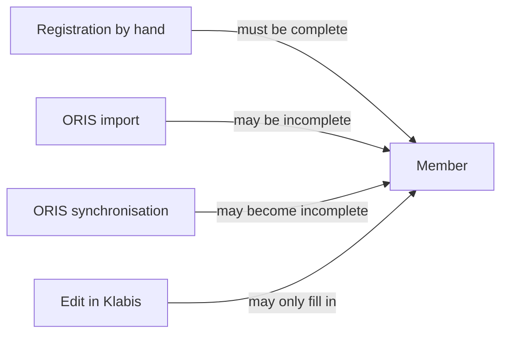

## Why

Importing the real ZBM club from ORIS brings in only 24 of its 273 current members. The others fail Klabis's registration rules: ORIS never holds a legal guardian, and many records have no telephone or birth number. We want every current member in Klabis without relaxing the data-quality rules for members registered or edited by hand.

Two defects surfaced along the way that this change also fixes. The first is a crash when a member has only a guardian's e-mail. The second is a security hole: a new activation link can be sent to any e-mail address for any account still waiting for activation. The ORIS import would create hundreds of such accounts, so this hole has to be closed before the import runs on real data.

## What Changes

- **Security fix (first iteration):** a new activation link is sent only when the e-mail address the person enters matches the member's e-mail or their guardian's e-mail. The response is the same either way, so the form cannot be used to discover which addresses belong to members.
- **BREAKING (behavioural):** creating a user account no longer sends a welcome or activation e-mail, whether the member was registered by hand or imported. Members activate their account themselves from a "request activation link" entry point reachable from the login page.
- Every member gets a user account, including members with no e-mail address at all. This fixes the crash when a minor has only a guardian's e-mail.
- A member may now have **incomplete data**: missing contact details, a missing birth number (Czech nationals only) or a missing guardian (minors only). How complete a member is gets worked out from their data, never set by hand.
- **Never worsen:** a member registered by hand must still be complete, and a Klabis edit may fill in missing details but never remove more. Only the ORIS import and ORIS synchronisation may produce or deepen incompleteness, because ORIS is the authority for the details it owns.
- ORIS values Klabis cannot accept, such as a malformed birth number or a birth number for a non-Czech national, are dropped on import. The member is still brought in, as incomplete.
- Users with MEMBERS:MANAGE see an "incomplete" badge and an "only incomplete" filter in the member list, and a warning listing the missing items on the member detail page.

## Capabilities

### New Capabilities

None.

### Modified Capabilities

- `members`: members may exist with incomplete data. The never-worsen rule applies to edits. No welcome e-mail is sent on registration. Administrators get an incomplete badge, a filter and a detail warning.
- `member-synchronization`: members with incomplete or unacceptable ORIS data are still brought in. Synchronisation may leave a member incomplete. The manual import no longer triggers a burst of invitations.
- `users`: no activation e-mail is sent when an account is created. Reissuing an activation link checks the entered e-mail against the member's contact details. Self-activation is reachable from the login page.

## Impact

- **Backend `members`:** the `Member` invariants in `register`, `update` and `syncFromOris` change and a new `missingData()` is added. `RegistrationService` gets an import path and a user-creation fix. `MemberProjectionMapper` handles invalid values. The `members.members` table gains a `data_incomplete` column (in the V001 schema) and `MemberMemento` writes it. A list filter is added. A verifier implementing the new port from `common.users` is added.
- **Backend `common.users`:** `PasswordSetupServiceImpl.requestNewToken` gains e-mail verification through a new port. `UserCreatedEventHandler` no longer sends the setup e-mail on creation.
- **API (spec-first, `docs/openapi/spec/`):** the member list gains an incompleteness filter parameter and an incompleteness flag per member. Member detail gains the list of missing items. Both are visible only with MEMBERS:MANAGE.
- **Frontend:** badge and filter on the member list, a warning on the member detail page, and a link from the login page to the "request activation link" page.
- **Operational:** no mass e-mail is sent on the first ORIS import. Members must be told to activate their accounts themselves.
