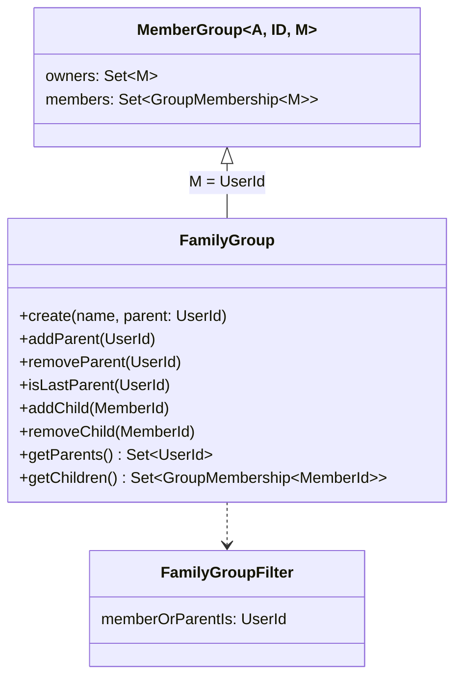

## Context

`FamilyGroup` je dnes `MemberGroup<FamilyGroup, FamilyGroupId, MemberId>` – rodiče (vlastníci) i děti (členové) jsou `MemberId`. Zákonný zástupce nemusí mít členský profil, proto musí být rodičem libovolný uživatel (`UserId`). Identita člena a uživatele je totožná (`MemberId` a `UserId` sdílejí stejné UUID, `MemberId.toUserId()` / `MemberId.fromUserId()`). Tabulky skupin (`groups.user_group_owners`, `groups.user_group_members`) jsou sdílené pro Free/Training/Family a nemají cizí klíč do `members`, takže schéma nečlenského vlastníka nebrání.

Navazuje `proposal.md` (motivace) a delta spec `user-groups` (požadavky).

## Goals / Non-Goals

**Goals:**
- Rodič rodinné skupiny je `UserId`, děti zůstávají `MemberId` na veřejném API domény a REST.
- `MemberGroup` zůstává s jedním typovým parametrem pro id účastníka skupiny.
- Rodič bez členského profilu vidí detail své skupiny.
- Neutrální název sloupce vlastníka v sdílené tabulce.

**Non-Goals:**
- Výběr nečlenských uživatelů v UI (nový users-options endpoint / lookup port) – přijde s krokem o zákonných zástupcích.
- Změna Free/Training skupin (zůstávají `MemberId`).
- Změna suspendace členů; nečlenský rodič se jako člen nesuspenduje.
- Nový zákonný zástupce jako samostatný doménový koncept.

## Decisions

### D1: Celá rodinná skupina je vnitřně na `UserId`

`FamilyGroup extends MemberGroup<FamilyGroup, FamilyGroupId, UserId>` – vlastníci i členové jsou `UserId`. Dětské operace na veřejném API agregátu přijímají `MemberId` a převádějí je přes `toUserId()`; čtení dětí vrací `MemberId` (`MemberId.fromUserId`).

*Proč:* zachová jeden typový parametr (`MemberGroup` beze změny), rodič zůstává i členem skupiny (beze změny modelu „rodič je vlastník i člen“), a kontrola výlučnosti rolí a jedné skupiny porovnává hodnoty jednoho typu.
*Alternativy:* (a) `MemberGroup<A, ID, O, M>` se dvěma typy – zbytečně invazivní pro Free/Training; (b) FamilyGroup mimo `MemberGroup` – duplikace logiky vlastníků.

### D2: Trvalé uložení zůstává UUID, přejmenuje se sloupec vlastníka

`groups.user_group_owners.member_id` → `owner_id` (včetně primárního klíče a indexu) se upraví přímo v `V001__initial_schema.sql` bez nové migrace – aplikace zatím běží na in-memory DB, neexistuje perzistentní stav. `user_group_members.member_id` beze změny (děti jsou členové). Memento zůstává nezávislé na typu id (funkce `Function<M, UUID>`); adaptér Family používá `UserId::uuid` / `UserId::new`.

*Alternativa:* sloupec ponechat – odmítnuto (zavádějící název pro nečlenského vlastníka).

### D3: Filtr a výlučnost přes `UserId`

`FamilyGroupFilter.memberOrParentIs` nese `UserId`. Servisní kontrola „osoba už je v rodinné skupině“ hledá přes `UserId`; členy z ostatních modulů převádí `MemberId.toUserId()` (`MemberFamilyGroupLinkProcessor`, `FamilyGroupSuspensionBlockersAdapter`).

### D4: Autorizace detailu podle `userId` z tokenu

`getFamilyGroup` povolí `MEMBERS:MANAGE` nebo `group.hasMember(currentUser.userId())`. Nečlenský rodič má `memberId == null`, ale vždy `userId`; jedna kontrola pokrývá rodiče i děti.

### D5: REST kontrakt – rodič `userId`, dítě `memberId`

Viz kapitola API. Pole rodiče se přejmenuje (BREAKING), dětská pole zůstávají. Vstupní pole pro výběr rodiče zatím používá `listMemberOptions` (UUID shodné); `x-hal-input-type` se mění na `UserId`.

### D6: Rodič nemá odkaz `member`

`ParentResponse` odkaz `member` již neobsahuje (rodič nemusí být člen). Odkaz `user` na základní detaily uživatele se přidá v další fázi s novým users API.

*Mezikročí, které je nutné vědět:* bez odkazu `user` nemá řádek rodiče nic, co by šlo zobrazit ani kam navigovat — rozlišovací znak `userId` odkazuje na uživatele, ne na člena, takže odkaz `member` by u nečlenského rodiče vedl na 404. Frontend proto řádek rodiče renderuje jako samotné UUID (`UserIdRowWithRemove`), místo aby se pokoušel členovou vazbu rozřesit. To je zhoršení oproti předchozímu stavu, kdy se rodič zobrazoval jako člen se jménem, a je to vědomý ústupek do doby, než dorazí users API s odkazem `user`. Bezpečnostně je to v pořádku — jméno člena je osobní údaj a nečlenský rodič ho nemá.

## Domain model

| Prvek | Změna |
|---|---|
| `FamilyGroup` | typ id účastníka `MemberId` → `UserId`; rodičovské operace berou `UserId`; dětské operace berou `MemberId` a převádějí na `UserId` |
| `FamilyGroupFilter` | `memberOrParentIs` typu `UserId` |
| `MemberAlreadyInFamilyGroupException` | nese `UserId` |
| `FamilyGroupManagementPort` | `addParent/removeParent` berou `UserId`; `addChild/removeChild` beze změny (`MemberId`) |
| `MemberGroup`, Free/Training | beze změny |

## Glosář

- **Rodič (Parent)** – vlastník rodinné skupiny; libovolný uživatel (`UserId`), nemusí být členem klubu.
- **Dítě (Child)** – člen rodinné skupiny, který není rodič; vždy plnohodnotný člen (`MemberId`).
- **Účastník skupiny** – identifikátor vlastníka/člena skupiny v `MemberGroup` (pro Family `UserId`).

## API (změny)

| Endpoint | Změna |
|---|---|
| `POST /api/family-groups` | request: `{name, parent}` – `parent` je `userId` (`x-hal-input-type: UserId`) |
| `GET /api/family-groups/{id}` | response: `parents[]` = `{userId}` bez odkazu `member` (dříve `{memberId}` s odkazem `member`), `members[]`/děti = `{memberId, joinedAt}` beze změny |
| `POST /api/family-groups/{id}/parents` | request: nový `AddParentRequest{userId}` (dříve sdílený `AddMemberRequest{memberId}`) |
| `DELETE /api/family-groups/{id}/parents/{userId}` | path parametr `{memberId}` → `{userId}` |
| `POST /api/family-groups/{id}/children` | request `AddMemberRequest{memberId}` beze změny |
| `DELETE /api/family-groups/{id}/children/{memberId}` | beze změny |

HAL odkazy: `self`, `collection`, `family-groups` (root) beze změny; položka rodiče nemá odkaz `member` (odkaz `user` přijde v další fázi) a nese `self` s DELETE affordancí (`removeFamilyGroupParent`) při MEMBERS:MANAGE. Affordance skupiny: `deleteFamilyGroup`, `addFamilyGroupParent` (pole `userId`, options `listMemberOptions`), `addFamilyGroupChild` (pole `memberId`), `createFamilyGroup` na kolekci (pole `parent`, options `listMemberOptions`). Odkaz `familyGroup` na detailu člena zůstává (hledá se podle `UserId` člena).

## Risks / Trade-offs

- [BREAKING změna API polí rodiče] → frontend a přegenerované typy se upraví ve stejné změně; API nemá externí konzumenty mimo Klabis FE.
- [Předpoklad `MemberId` ≡ `UserId`] → už je dokumentovaný invariant (`UserId` javadoc, `Member.getUserId()`); převody jsou centralizované v `MemberId.toUserId()` / `fromUserId()`.
- [Přejmenování sloupce v sdílené tabulce zasahuje Free/Training] → jen názvy sloupců v mementu a dotazech; pokrývá `GroupsCoexistenceTest`.
- [Výběr rodiče stále nabízí jen členy] → vědomě odloženo (Non-Goal); nečlenského rodiče zatím přidá jen klient znající `userId`.
- [`userId` bez odkazu `user` proti HATEOAS pravidlu "ID jiného objektu ⇒ `_links` na něj"] → vědomá výjimka: odkaz `member` by na nečlenského rodiče vedl na 404. Řádek rodiče proto zatím nese jen `userId` a v UI se zobrazí jako surové UUID (viz D6); odkaz `user` doplní users API.
- [`UserId` v HAL-FORMS vykresluje členský picker] → dnes bezpečné, protože `x-hal-input-type: UserId` má zatím jen rodičská pole rodinné skupiny a možnosti stále pocházejí z `listMemberOptions` (stejné UUID). Zkontrolovat, až přibude users-options endpoint.

## Migration Plan

1. Přímá úprava `V001__initial_schema.sql` (sloupec, PK, index `idx_user_group_owners_member_id`) – bez nové verze migrace, protože neexistuje perzistentní stav.
2. Nasazení jedním releasem backend + frontend (BREAKING pole API). Rollback = revert release.

## Open Questions

Žádné.
