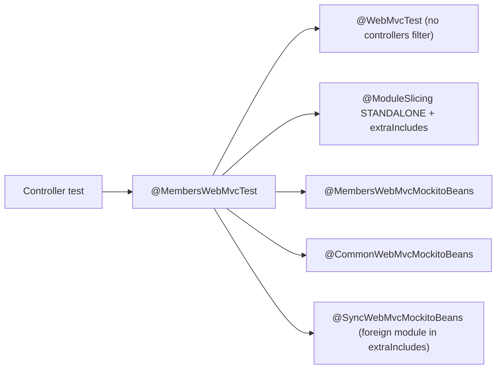

## Context

Current state in the modules not yet migrated:

- Controller tests use `@WebMvcTest(controllers = X.class)` plus `@WithPostprocessors` (a hand-maintained list of HAL postprocessors and mocks in `com.klabis.common`) plus per-class `@MockitoBean`s. Every distinct combination creates a new Spring context.
- Behavior of one controller is spread over controller, `*SecurityTest`, `*IntegrationTest` and link-processor/postprocessor unit tests.
- Some tests mock things that are not primary ports (adapter-package beans, repositories, helpers).

The `members` PoC established the target form (see `.claude/skills/backend-patterns/references/testing-guide.md`):

PoC result on `members`: contexts 16 → 8, test time 121 s → 97 s, tests 930 → 926 (duplicates merged). The gain comes from the shared context; `STANDALONE` itself gave only a few seconds.

## Goals / Non-Goals

**Goals:**
- One shared Spring context per module for all REST adapter `@WebMvcTest`s.
- Only primary ports are mocked in REST adapter tests; each type is mocked in exactly one `*WebMvcMockitoBeans` (owned by the module that defines it).
- Optional/feature-flag beans are mocked locally and have a "disabled" variant test.
- Authorization (403) tests prove enforcement of the authorization mechanism, not only the happy path.
- Remove the legacy `@WithPostprocessors` form.

**Non-Goals:**
- No change to E2E tests, JDBC tests, full `@SpringBootTest` integration tests, or domain/application unit tests (except tests for newly added port methods).
- No change to REST contracts, security rules, or HAL output.
- No speed target beyond fewer contexts; no parallel-fork tuning.

## Decisions

### D1: One meta-annotation per module, shared context
`@<Module>WebMvcTest` combines `@WebMvcTest` (no `controllers`), `@ModuleSlicing(module, mode = STANDALONE, extraIncludes, verifyAutomatically = false)`, `@ActiveProfiles("test")`, shared `@Import`s and the group mocks. Without a `controllers` filter all controllers of the module load, and Spring's context cache returns the same context for every test using it.
*Alternative:* keep `controllers=` per test — rejected, every controller then needs its own context.

### D2: `STANDALONE` + `extraIncludes` only where responses need it
`extraIncludes` loads all web beans of the included module. Include a module only when its HAL postprocessors affect the responses of the tested controllers, or when its port is injected into the tested controllers (e.g. `sync` for `SynchronizationPort`). The included module's group mock annotation is composed in.

### D3: Mock ownership
`<Module>WebMvcMockitoBeans` lives in the owning module's test sources and mocks all of that module's primary ports. A type is mocked in exactly one of them. Tests receive mocks through `@Autowired` (never a second `@MockitoBean` — a duplicate fails bootstrap).

### D4: REST adapters depend only on primary ports
Fixes made in production code (no behavior change):

| Module | Finding (verified 2026-10-02) | Fix |
|---|---|---|
| events | `AccommodationListCsvRenderer` is a package-private `@Component` in `restapi` with no dependencies, injected by `EventController`; mocked in `EventsWebMvcMockitoBeans`, `EventControllerTest`, `OrisEventControllerTest` | Load the real bean (see D9); remove all three mocks |
| finance | `MemberAccountController` injects `MemberAccountRepository` (`findBalanceById`, `findReversalOf`); mocked in `FinanceWebMvcMockitoBeans` | Add the two queries to the finance primary ports (e.g. `TransactionQueryPort`); controller uses the port; remove the repository mock |
| finance | `FinanceAccountLinkSupport` is an interface in `finance.application` (no `@PrimaryPort`), implemented by `@MvcComponent FinanceAccountLinkSupportImpl` in `restapi`; consumed only by `events.RegistrationRecordTransactionLinkProcessor`; mocked in `FinanceWebMvcMockitoBeans` | Add `finance` to events `extraIncludes` so the real impl loads (it only wraps static `FinanceLinks`); remove the mock (see D9) |
| sync | `SynchronizationController` injects `SyncProjectionFieldReader` (`sync.domain` port) and builds `SyncStateResponseConverter` (not a bean) from it; the converter also passes it to `SyncRecord.changedSides(...)`; mocked in `SyncWebMvcMockitoBeans` | New primary port `SyncProjectionFieldsPort` in `sync.application` with `fields(SyncProjection)`, implemented by a service delegating to the domain reader; converter passes `port::fields` to `changedSides` |
| membershipfees | `EventTypeOptionsPort` and `RankingOptionsPort` are `@Port`, but implemented by `@SecondaryAdapter` classes (`EventTypeOptionsAdapter`, `OrisRankingOptionsAdapter`) - they are secondary ports, so marking them `@PrimaryPort` is wrong | New primary port `MembershipFeeTierOptionsPort` (`listRankingOptions`, `listEventTypeOptions`) implemented in `application`, delegating to the two secondary ports; `MembershipFeeTierController` uses it; both secondary ports stay |
| common.settings | `OrisClubKeyPort` is a secondary port (its implementation `InMemoryOrisClubKeyAdapter` is `@SecondaryAdapter`), injected by `oris.OrisClubKeyController` and also by `members.MemberController` (`isSet()`); already mocked in `CommonWebMvcMockitoBeans` | New primary port `OrisClubKeyManagementPort` (`store`, `isSet`, `clear`) in `common.settings`, delegating to `OrisClubKeyPort`; both controllers use it; `CommonWebMvcMockitoBeans` mocks the new port (members tests are affected, see D9) |
| oris | `OrisController` injects `OrisApiClient` (external client `com.dpolach.api.orisclient`) next to `ImportedOrisEventsPort` (`@PrimaryPort`, owned by `oris.application`, implemented in `events`) | Justified exception for `OrisApiClient`, documented in the skill |
| calendar | `ICalendarRenderer` (adapter-package bean) is loaded for real via package-private `CalendarInfrastructureConfiguration`; no mock | No production change; coupling resolved in D9 |
| common | `RootController`, `DashboardController`, `PermissionController` (`PermissionService`), `PasswordSetupController` (`PasswordSetupService`) - all `@PrimaryPort`; `PasswordChangeController` is already `@E2ETest` | No finding |
| groups | controllers and `MemberTrainingGroupLinkProcessor` use only `FreeGroupManagementPort`, `TrainingGroupManagementPort` | No finding |
| membershipfees (rest) | other controllers/link processor use only `@PrimaryPort`s (+ `Clock`, `Members`) | No finding |

Each finding is re-verified in the code before the change; the table is the starting hypothesis from the PoC review.

### D5: Optional beans are mocked locally
A bean injected as `Optional<T>` (feature flag, profile-gated e.g. `oris`) never goes into a group mock or into the module annotation. The test that needs it mocks it in its own class (separate Spring context, deliberately named class); sibling tests in the shared context verify the "disabled" behavior (absent affordance, 404). Rule: at most a handful of such extra contexts per module. Where an `Optional` exists only because of historical module wiring (e.g. `SynchronizationPort`, `FeeSelectionCampaignManagementPort` in the PoC), it becomes a required dependency and is provided through `extraIncludes` and the owning module's group mock.

### D6: Merge security/integration/link-processor tests into the controller test
They become `@Nested` groups in the same class; expectations move from "processor adds link X" to "response of endpoint contains link X". The link-processor branch not reachable from a controller response (e.g. "no link without context") gets a small unit test instead of being dropped.

### D7: 403 verification by one-time mutation
`@HasAuthority` is generated into the `*Api` interfaces from `backend/src/main/openapi-templates/api.mustache` (source: `x-klabis-authority` in `docs/openapi/spec/*.yaml`). The mechanism itself is already confirmed by the `members` PoC, so it is not re-checked per module. What needs checking is that each 403 test fails for the right reason. During migration, 403 tests stub the port returns, so that without the annotation the controller body runs and the test fails on the status assertion instead of an NPE. After all modules are migrated, a single mutation run covers everything: rename the `x-klabis-authority` section in the template (open and close tag together), run all REST adapter tests of the migrated modules, and require every 403 test to fail on the status assertion. Tests that still pass are enforced by another mechanism (ownership rule, field-level security) and are documented as such. The template is restored with `git checkout`.

### D8: Order — modules first, legacy removal last
`@WithPostprocessors` is used by 32 test classes; it stays until the last module is migrated, so each module is an independently committable and testable slice.

## Risks / Trade-offs

- **Shared context hides missing wiring** (a test no longer fails because its own controller lacks a bean) → the shared context is built from the real module, so missing production beans still fail bootstrap; the architecture tests remain green.
- **Mutation check relies on the generated annotation** → covers only `x-klabis-authority` endpoints; endpoints with other mechanisms are listed explicitly in the final report.
- **Modulith skips unchanged tests** (results look green with fewer tests) → run with `SPRING_MODULITH_TEST_SKIP_OPTIMIZATIONS=true --rerun-tasks` and verify skipped counts in the XML results.
- **`STANDALONE` leaves out postprocessors of foreign modules** → include them via `extraIncludes` only when asserted in responses; otherwise their absence is intended.
- **Package-private `@Import(CalendarInfrastructureConfiguration)`** in `CalendarWebMvcMockitoBeans` forces the annotation into one package → decide: make the configuration public in test scope, or replace with a test configuration.
- **Test count drops** (merged duplicates) → compare per-module test counts before/after and explain every difference.
- **Extra contexts for feature-flag variants** → at most one extra context per variant, listed in the module summary.

## Migration Plan

1. Preparation: record baseline (profiler, contexts, test counts) per module with `SKIP_OPTIMIZATIONS`.
2. Per module, one vertical slice (production port fixes → group mocks → module annotation → merged tests with stubbed 403 tests → module test run → review → commit): `groups`, `calendar`, `sync`, `finance`, `membershipfees`, `events`, `oris`, `common`.
3. Remove `@WithPostprocessors`; update `backend-patterns` skill.
4. Final full-suite verification, one-time 403 mutation check across all modules, comparison with the baseline.

Rollback: each module slice is a separate commit and can be reverted independently; the legacy form keeps working next to the migrated one until step 3.

### D9: Resolved open questions and inventories (task group 1)

**Optional / profile-gated beans in REST adapters** (inventory; all injected into `restapi` beans of the migrated modules):

| Bean | Gate | Injected by | Decision |
|---|---|---|---|
| `OrisEventImportPort` | `@OrisIntegrationComponent` (profile `oris`), injected as `Optional` | `EventController`, `EventController.EventListPostprocessor` | Feature flag: never in group mocks; the "ORIS on" variant is the dedicated `OrisEventControllerTest` (mock + `@ActiveProfiles("oris")`), the "ORIS off" variant (no import affordance, no `/api/oris/...` endpoint 404) is nested in the shared `EventsWebMvcTest` class |
| `OrisEventBulkImportPort`, `OrisBulkSyncPort` | profile `oris` (`OrisEventController` is `@OrisIntegrationComponent`) | `OrisEventController` | Same dedicated class: local `@MockitoBean`s |
| `OrisController` | profile `oris` | itself | Dedicated class in `oris` with `@ActiveProfiles("oris")` + local `OrisApiClient` mock; `ImportedOrisEventsPort` is an always-available primary port, mocked in `OrisWebMvcMockitoBeans` |
| `MemberDiscoveryPort` | profile `oris`, `Optional` | `members.MemberController` | Already handled in the PoC (local mock) |
| `OrisApiClient` | `Optional` in `OrisRankingOptionsAdapter` (secondary adapter, not loaded in web slices) | not a REST adapter | Not relevant to REST slices |
| `MemberFinancialStatePort` | `Optional` in `ManagementService` (application layer) | not a REST adapter | Not relevant |
| `SynchronizationPort`, `FeeSelectionCampaignManagementPort` | required (PoC already made them required) | `EventController`, `DisciplineController`, `SyncStatePostprocessor`, `MemberFeeSummaryLinkProcessor` | Required dependency, provided via `extraIncludes` + owning `*WebMvcMockitoBeans` |
| `ObjectProvider<OwnershipResolver>`, `ObjectProvider<ActivationContactVerifier>` etc. | lazy resolution in `common` | `common` internals | Not feature flags; no action |

No other `Optional<port>` or `@Profile` bean is injected into the REST adapters of `events`, `finance`, `membershipfees`, `groups`, `calendar`, `sync`, `oris`, `common`.

**`OrisClubKeyPort` primary port.** Name `OrisClubKeyManagementPort` (same `*ManagementPort` convention as `EventManagementPort`, `FreeGroupManagementPort`), `@PrimaryPort` in `com.klabis.common.settings`, implemented by a small `@Service` that delegates to `OrisClubKeyPort`. `OrisClubKeyPort` stays a secondary port with its adapter, `OrisClubKeyAccessor` unchanged. `members.MemberController` and `oris.OrisClubKeyController` switch to the new port (so `members` mocks change too). `members.MemberOrisImportAffordancePostprocessor` and `DefaultOrisClubMembers` are not REST adapter controllers and keep using the secondary port/accessor. `InMemoryOrisClubKeyAdapterTest` stays; add a unit test for the delegating service first.

**`AccommodationListCsvRenderer` loading.** Real bean, no mock. `WebMvcTest` filters out a plain `@Component`, so it is not picked up automatically. Preferred: make it an `@MvcComponent` (the stereotype `MvcConfiguration` uses to include `restapi` beans in web slices; it is a plain `@Component` today). It is a one-word production change with no behavior change, and the existing `AccommodationListCsvRendererTest` stays valid. To be confirmed in 7.1 by checking that `MvcComponent` is included by the slice filter (as it is for postprocessors).

**`CalendarInfrastructureConfiguration` coupling.** Same fix as the renderer: `ICalendarRenderer` is a stateless adapter bean; make it `@MvcComponent` (or give it the same stereotype) so the slice loads it, and drop `@Import(CalendarInfrastructureConfiguration)` from `CalendarWebMvcMockitoBeans`. Keeps the annotation free from a package-private class and from `com.klabis.calendar.infrastructure.restapi` placement.

**`common` test classification** (13 classes with class-level `@WebMvcTest`; all use `@WithPostprocessors`):

| Class | Form |
|---|---|
| `PermissionControllerTest`, `PasswordSetupControllerTest`, `DashboardControllerTest`, `RootControllerTest` | migrate to `@CommonWebMvcTest` (real controllers of `common`) |
| `RootProfileLinkProcessorTest`, `OrisClubKeyRootLinkProcessorTest` | merge into `RootControllerTest` as `@Nested` link groups; `OrisClubKeyRootLinkProcessor` lives in `members.infrastructure.orissync` so its expectation needs `members` in `extraIncludes` or stays a members-owned test (decided in 9.2) |
| `AffordanceAuthorizationTest`, `HalResponseBodyAdviceTest`, `HalResponseBodyAdviceCollectionTest`, `HalResponseContextLeakTest` | infrastructure tests with their own inner test controllers: keep a dedicated setup, but drop `@WithPostprocessors` (replace by a minimal local equivalent) |
| `FieldLevelAuthorizationTest`, `AccountStatusValidationFilterTest`, `RateLimitExceptionHandlerTest` | infrastructure/filter/advice tests with inner test controllers: keep dedicated setup, drop `@WithPostprocessors` |
| `HalCollectionCrossModuleLeakIntegrationTest`, `HasAuthorityAspectTest`, `PasswordChangeControllerTest` (`@E2ETest`) | not `@WebMvcTest`; untouched |

Out of `common` but also using `@WithPostprocessors`: `members/.../CurrentUserIntegrationTest` (task group 10/11 must cover it).

**Test count remark.** `common` has 715 tests (10 skipped, all pre-existing `@Disabled`/conditional).

## Open Questions

- Decision for the user (not made here): the 7 infrastructure tests in `common` each use their own inner test controller, so they stay at one context each (7 contexts). They could be consolidated into one shared "common infrastructure" context by registering all inner test controllers in a single test configuration; this lowers contexts further but couples unrelated test controllers. Proposed default: keep them dedicated, only remove `@WithPostprocessors`.
- Decision for the user: `FinanceAccountLinkSupport` through `extraIncludes = "finance"` in the events slice (proposed) pulls all finance web beans (and `FinanceWebMvcMockitoBeans`) into the events context. Alternative: make the interface a `@PrimaryPort` and mock it in the events annotation (one-line change, but the helper is mocked again, contradicting "load real adapter helpers").

### D7 mutation check result (task 12.3)

Mutation: opening and closing tag `vendorExtensions.x-klabis-authority` in `api.mustache` renamed; regenerated interfaces carried no interface-level `@HasAuthority` (only model-field annotations remained). Run: `SPRING_MODULITH_TEST_SKIP_OPTIMIZATIONS=true ./gradlew test --rerun-tasks --tests '*.restapi.*' --tests 'com.klabis.members.infrastructure.mvc.*'` (1042 test cases, fresh XML). The template was restored with `git checkout`.

**Result:** all 403 tests in the REST adapter test classes (counted as unique class + display name: 41 fail under mutation, 41 pass) were inspected. Every failing 403 test failed on the status assertion (`Status expected:<403> but was:<2xx>`), except one that failed with an NPE in the controller (group b).

**(b) Failed for a reason other than status — fixed:**
- `calendar`: `CalendarControllerTest$CreateCalendarItemTests` `should return 403 without CALENDAR:MANAGE authority` - `createCalendarItem` returned null (unstubbed port, NPE in `CalendarController.createCalendarItem`). Now stubs `calendarManagementService.createCalendarItem(...)`; re-verified under mutation: fails with `expected:<403> but was:<201>`, green after restoring the template.

**(a) 403 tests that still pass without the generated `@HasAuthority`** (enforced by another mechanism: ownership / principal==memberId / feature flag / missing member profile / `@PreAuthorize` or service-level checks):

- `events`:
  - `EventControllerTest` - coordinator of event A cannot update event B — returns 403
  - `EventControllerTest` - member without EVENTS:MANAGE who is not a coordinator is rejected — returns 403
  - `EventControllerTest` - should return 403 without EVENTS:MANAGE authority
  - `EventControllerTest` - unauthorized member gets 403
  - `EventControllerTest` - 2.5: unauthorized user gets 403 for text/csv request — existing authorization check covers CSV path
  - `EventControllerTest` - 5.3 CSV: authorized caller gets 403 when sharedAccommodationEnabled is false
  - `EventControllerTest` - 5.3 HAL: authorized caller gets 403 when sharedAccommodationEnabled is false
  - `EventControllerTest` - 5.3 unauthorized caller still gets 403 when offer is off (auth check runs first)
  - `EventRegistrationControllerTest` - new=true for admin with EVENTS:REGISTRATIONS authority but different memberId returns 403 — authority must not bypass principal==memberId check
  - `EventRegistrationControllerTest` - new=true for different memberId (not the principal) returns 403
  - `EventRegistrationControllerTest` - should return 403 Forbidden when user has no member profile
  - `EventRegistrationControllerTest` - 1.3 non-owner without any special authority gets 403
  - `EventRegistrationControllerTest` - 2.2 user with only EVENTS:MANAGE (not owner, not EVENTS:REGISTRATIONS) gets 403
  - `EventRegistrationControllerTest` - 3.2 user without EVENTS:REGISTRATIONS (and not the owner) receives 403 on PUT
  - `EventRegistrationControllerTest` - 4.2 PUT by different member returns 403
  - `EventRegistrationE2ETest` - 5.3 Member cannot edit another member's registration (403)
- `finance`:
  - `MemberAccountControllerTest` - 5.2 non-owner without FINANCE:MANAGE gets 403
  - `MemberAccountControllerTest` - 5.5 returns 403 for non-owner without FINANCE:MANAGE
- `groups`:
  - `FreeGroupControllerTest` - should return 403 when acting member is not owner
  - `FreeGroupControllerTest` - should return 403 when caller is not a current owner
  - `FreeGroupControllerTest` - should return 403 when user has no member profile
  - `FreeGroupControllerTest` - should return 403 when user is neither owner nor member of the group
  - `TrainingGroupControllerTest` - should return 403 when user is not a member of the training group and lacks GROUPS:TRAINING
- `members`:
  - `MemberControllerApiTest` - authenticated user without a member record should get 403 Forbidden
  - `MemberControllerApiTest` - member attempting to edit another member's profile should get 403 Forbidden
  - `UpdateMemberApiTest` - minor updating own profile should return 403 and save nothing
  - `UpdateMemberApiTest` - non-admin editing another member should return 403
  - `UpdateMemberApiTest` - updating admin-only fields without MEMBERS:MANAGE authority should return 403
  - `UpdateMemberApiTest` - updating items editable only by member himself without beeing that member should return 403 Forbidden
  - `UpdateMemberApiTest` - updating own gender should return 403 — it needs MEMBERS:MANAGE
  - `LegalGuardianGroupControllerTest` - returns 403 to a member who is not a minor of the group and lacks MEMBERS:MANAGE
  - `LegalGuardianControllerTest` - returns 403 for a stranger
- `membershipfees`:
  - `MemberFeeChoiceControllerTest` - should return 403 for another member's choice even with MEMBERS:MANAGE
  - `MemberFeeChoiceControllerTest` - should return 403 choosing for another member even with MEMBERS:MANAGE
  - `MemberFeeChoiceControllerTest` - should return 403 removing another member's choice even with MEMBERS:MANAGE
  - `MemberFeeChoiceControllerTest` - should return 403 when member accesses another member's choice
  - `MemberFeeChoiceControllerTest` - should return 403 when member acts as another member
  - `MemberFeeSummaryControllerTest` - should return 403 for another member's history even with MEMBERS:MANAGE
  - `MemberFeeSummaryControllerTest` - should return 403 for another member's summary even with MEMBERS:MANAGE
  - `MemberFeeSummaryControllerTest` - should return 403 when member accesses another member's history
  - `MemberFeeSummaryControllerTest` - should return 403 when member accesses another member's summary
- `members` (`CurrentUserIntegrationTest.shouldReturn403WhenActingMemberHasNoMemberProfile`): enforced by the test's own `TestController` / acting-member resolution, not by a generated API interface.

Out of the mutation scope (not generated REST adapter tests; mechanism is not `x-klabis-authority`): `AccountStatusValidationFilterTest`, `OidcUserInfoEndpointTest`, `FieldLevelAuthorizationTest`, `MemberLifecycleE2ETest`.

Note: under mutation, affordance tests (HAL-FORMS `_templates` / `_links` present or absent per authority) also fail, since affordances are derived from the same annotation; this is expected collateral and not a 403 test.
