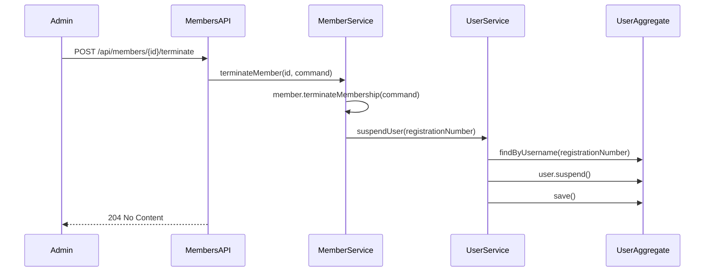

## Why

When a member's membership is terminated, the corresponding User account remains active and can still authenticate to the system. This is a security gap - terminated members should not be able to log in or use the application API. Currently, the `MemberLifecycleE2ETest` test (STEP 11) expects terminated users to be denied access with `403 Forbidden`, but this test fails because User accounts are not automatically suspended when Members are terminated.

## What Changes

- Add `suspend()` and `reactivate()` methods to User aggregate for account status changes
- Add `suspendUser()` and `reactivateUser()` methods to UserService
- Modify MemberService to call UserService when Member is terminated/reactivated
- Add `ReactivateMembership` command to Member aggregate
- Update `users` specification to document suspension and reactivation operations
- Update `member-termination` specification to reference User suspension behavior

## Capabilities

### New Capabilities

- `user-suspension`: User account suspension and reactivation via UserService
- `member-user-suspension`: Automatic User account suspension when Member is terminated

### Modified Capabilities

- `users`: Add User suspension/reactivation state machine operations
- `member-termination`: Extend to include automatic User suspension as a side-effect

## Impact

- **Affected modules**: `users` (new methods), `members` (calls UserService)
- **API behavior**: No breaking changes to REST API
- **Database**: User.accountStatus now set to SUSPENDED upon member termination
- **Security**: Terminated members cannot authenticate or access protected endpoints
- **Authentication**: Spring Security will deny authentication for suspended users (isAuthenticatable() returns false)
- **Test coverage**: Existing `MemberLifecycleE2ETest` STEP 11 will pass after implementation

## Architecture Decision

Direct service call integration is used instead of event-driven approach:
- Members module (already depends on users) calls UserService methods directly
- UserService provides `suspendUser(String username)` and `reactivateUser(String username)` methods
- User lookup uses `username` field which matches `Member.registrationNumber` value
- This maintains bounded context isolation - users module doesn't depend on members
- Simpler than event-driven approach, no cross-module event handlers needed

**Rationale for Direct Service Call:**
- Members module already depends on UserService (no new dependency created)
- Simpler than event-driven cross-module integration
- Atomic operation within same transaction
- Easier to test and reason about
- No event delivery failures to handle
