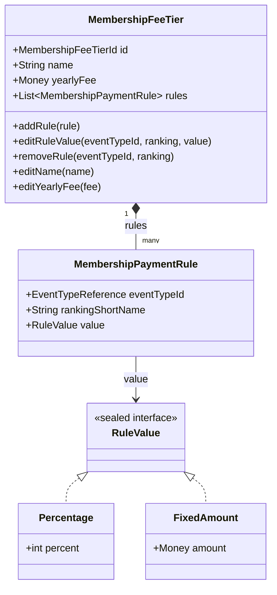

## Context

The membership-fees module lets administrators maintain a catalog of fee categories, each carrying a yearly fee and a set of co-participation rules (how much a member contributes to an event entry). Today this concept is called a "fee level". The name reads as a numeric rank, which it is not — it is a named membership category.

Two things are in tension with the current implementation:

1. **Terminology**: the domain uses `MembershipFeeLevel` (~195 references across backend, plus DB columns, REST URLs, frontend, labels and the spec).
2. **Rule management is half-built**: the frontend tier-detail page already renders per-rule add/delete affordances, but the backend only exposes whole-catalog create/edit (`CreateLevelCommand`/`EditLevelCommand` carrying the full `rules[]` list, persisted via `replaceRules`). There is no endpoint to add, edit, or remove a single rule. The ranking field is a free-text input, although valid rankings come from the ORIS code list (`OrisApiClient.listLevels()`), which is already used elsewhere for the discipline dropdown.

The application is pre-production, so breaking URL and request-shape changes are acceptable with no deprecation window.

## Goals / Non-Goals

**Goals:**

- Rename the "fee level" concept to "fee **tier**" consistently across domain, persistence, REST, frontend, labels and spec.
- Expose per-rule management on a catalog tier: add a rule, edit a rule's value, remove a rule.
- Source the ranking value from the ORIS code list as a dropdown instead of free text.
- Simplify tier creation to name + yearly fee only (rules are added afterwards).

**Non-Goals:**

- No change to publishing, member choice, sanctions, yearly-fee generation, or snapshot-freezing behaviour — only terminology is touched there.
- No change to how a published tier's frozen snapshot stores rules (it keeps its own `MembershipPaymentRuleSnapshotMemento`).
- The frontend keeps resolving the event-type display name itself via `useEventTypes()`; the API is not asked to denormalize the event-type name into the rule payload.

## Decisions

### D1: Rename `Level` → `Tier` via IDE refactoring

The rename touches ~195 backend references plus DB DDL, REST mappings, frontend and spec. To keep every reference consistent (including Spring Data JDBC column derivation, MapStruct mappers, HATEOAS link builders, and test fixtures), the rename MUST be done with **IntelliJ MCP rename-refactoring tools**, not manual find-and-replace. Renaming symbol by symbol lets the IDE update all usages atomically and catches references that a textual replace would miss (or wrongly hit, e.g. the unrelated ORIS `listLevels()` / `LevelListEntry`).

The DB table/column rename goes into the existing migration script **V001** (per project convention — no new migration scripts; H2 resets on restart in dev, and there is no production data yet).

**Alternative considered**: textual search-replace across the repo. Rejected — too error-prone given the `Level` collision with ORIS ranking types and the breadth of generated/derived names.

### D2: Per-rule endpoints with composite key in the URL

Rules are managed one at a time through a rule sub-resource of a tier:

- `POST /api/membership-fee-tiers/{id}/rules` — add a rule (rejects a duplicate event-type + ranking combination)
- `PATCH /api/membership-fee-tiers/{id}/rules/{eventTypeId}/{ranking}` — edit the rule's value only
- `DELETE /api/membership-fee-tiers/{id}/rules/{eventTypeId}/{ranking}` — remove the rule

The rule's identity is its business key `(eventTypeId, rankingShortName)`, which the domain already enforces as unique within a tier. No synthetic rule id is introduced — `MembershipPaymentRule` stays a value object.

**Edit changes the value only**; the key is immutable. Changing the event type or ranking means delete + add. This avoids URL identity churn (a key change would change the resource URL) and keeps the edit operation a plain in-place update.

**Alternatives considered:**
- *Synthetic UUID per rule* (rule → entity): rejected — adds an id to a value object and a persistence column for no business need; the composite key is already a meaningful identifier.
- *Whole-list replace* (keep `replaceRules`): rejected — does not match the per-row add/edit/delete UI and risks lost updates when two edits race on the full list.
- *Single `PUT /rules/{key}` upsert*: considered and rejected — the add form does not know the key URL until the user fills it in, so it cannot target a keyed URL; keeping separate `POST` (key in body) and `PATCH` (key in URL) is clearer.

The `addRule`/`editRule`/`deleteRule` operations are surfaced as HAL-FORMS affordances on the tier-detail representation, so the frontend drives them by hypermedia rather than hard-coded URLs.

### D3: Tier creation without rules

`CreateTierCommand` carries only `name` + `yearlyFee`. The `rules[]` argument is removed from the create request (**BREAKING**, but the frontend create form never sent rules). Rules are added afterwards via the per-rule endpoints. This removes the duplicate rule-creation path and makes the create API match what the UI actually needs.

### D4: Ranking from the ORIS code list

The add-rule affordance carries the available rankings as HAL-FORMS inline options, built from `OrisApiClient.listLevels()` (`id` = ranking short name, `descriptionCZ` = label). This reuses the exact pattern `EventTypeManagementService.listDisciplineOptions()` already uses for the discipline dropdown — including the graceful-degradation behaviour (empty option list when ORIS is unavailable, logged as a warning). The membership-fees module reads this through a small port rather than depending on `OrisApiClient` directly, keeping the dependency direction clean.

**Alternative considered**: store a ranking code list locally. Rejected — ORIS is the source of truth and the events module already consumes it live.

### D5: Typed event-type id in the rule payload

The rule response carries the event-type reference as a proper typed id value object rather than a bare `UUID` string, for consistency with the rest of the API (other ids serialize through their own type-safe wrapper). The frontend still maps the id to a display name itself via `useEventTypes()` — the API is not asked to denormalize the name.

## Domain Model Changes

The domain change is predominantly a **rename**; the structure of the aggregate and its value objects is unchanged. The create/edit surface of the aggregate root changes to support per-rule mutation.

| Element | Change | Notes |
|---|---|---|
| `MembershipFeeLevel` → `MembershipFeeTier` | **RENAMED** | Aggregate root; same identity and fields |
| `MembershipFeeLevelId` → `MembershipFeeTierId` | **RENAMED** | Type-safe id |
| `MembershipFeeTier.addRule(rule)` | **CHANGED** | Already exists; stays, used by the new add endpoint |
| `MembershipFeeTier.editRuleValue(eventTypeId, ranking, value)` | **ADDED** | In-place value update for an existing rule, keeping the key |
| `MembershipFeeTier.removeRule(eventTypeId, ranking)` | **ADDED** | Remove a single rule by its business key |
| `MembershipFeeTier.create(name, yearlyFee)` | **CHANGED** | No longer takes `rules`; tier starts empty |
| `MembershipFeeTier.replaceRules(...)` | **REMOVED** | Whole-list replace no longer needed |
| `MembershipPaymentRule` | unchanged | Value object; `(eventTypeId, rankingShortName)` is its business key |
| `RuleValue` (`Percentage`, `FixedAmount`) | unchanged | Sealed hierarchy kept as-is |
| `EventTypeReference` | unchanged | Opaque event-type reference inside the module |
| `DuplicatePaymentRuleException` | unchanged | Raised by `addRule` on a duplicate key |
| Ranking-options port (new) | **ADDED** | Reads ORIS ranking list for the add-rule dropdown |

## Risks / Trade-offs

- **[Wide rename can miss/over-hit references]** → Use IntelliJ MCP rename refactoring per symbol, not textual replace; build + full test suite after each batch. Watch the `Level` collision with ORIS `listLevels()` / `LevelListEntry` — those MUST NOT be renamed.
- **[Breaking URL + request-shape changes]** → Acceptable: pre-production, no external consumers. Frontend is updated in the same change.
- **[ORIS unavailable when opening the add-rule form]** → Reuse the existing graceful-degradation pattern: return an empty option list and log a warning, so the form still renders.
- **[Composite key in URL with awkward ranking values]** → Ranking short names come from the ORIS code list (short codes like `A`, `WRE`); path-variable encoding is straightforward. Edit cannot change the key, so no URL-identity churn.
- **[DB rename in V001 vs. existing data]** → No production data; H2 resets in dev. PostgreSQL deployments do not exist yet.

## Migration Plan

1. Rename domain + persistence + REST + frontend symbols via IntelliJ MCP refactoring (batched, build + tests after each batch).
2. Update the V001 migration DDL (table/column rename).
3. Replace `replaceRules` create/edit flow with `create(name, yearlyFee)` + per-rule `addRule`/`editRuleValue`/`removeRule`.
4. Add the rule sub-resource controller with HAL-FORMS affordances and ORIS ranking inline options.
5. Update the frontend tier-detail page to call the per-rule endpoints and render the ranking dropdown.
6. Update Czech labels and the spec.

Rollback: revert the change set; no data migration is involved (no production data).

## Glossary

| Term | Meaning |
|---|---|
| **Fee tier** | A named membership category (e.g. "Adult competitor", "Junior") carrying a yearly fee and a set of payment rules. Formerly "fee level". |
| **Catalog tier** | A tier in the working catalog, freely editable, reused as a template when publishing a year. |
| **Published tier** | A frozen-on-demand snapshot of a catalog tier for a specific year; independent of the catalog once published. |
| **Payment rule** | How much a member on a tier contributes to an event entry, for a given event type + ranking; either a percentage of the base entry price or a fixed amount. |
| **Ranking** | The event's ranking level from the ORIS code list (short name + description), e.g. `A`, `WRE`. |
| **Rule key** | The business identity of a payment rule within a tier: `(eventTypeId, rankingShortName)`. Unique per tier; immutable once the rule exists. |

## Open Questions

None outstanding — all design decisions were resolved during exploration.
