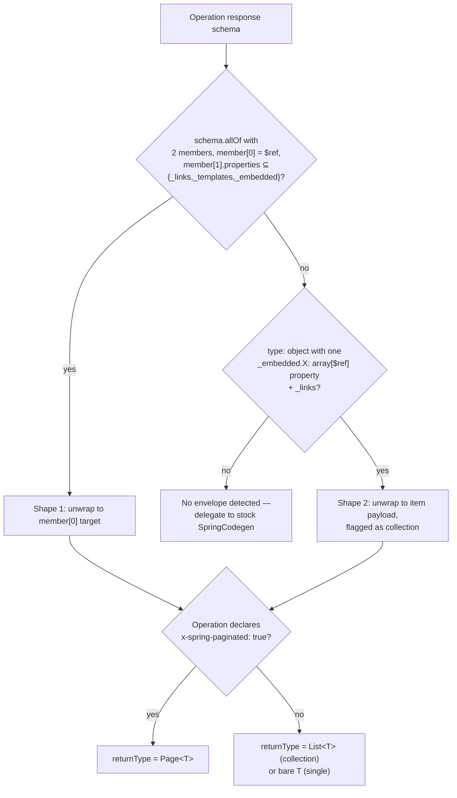

## Context

Backend REST DTOs and `*Api` interfaces are generated per-module by `openApiModule(...)` in
`backend/build.gradle.kts`, using the stock `spring` generator (`org.openapitools.codegen.
languages.SpringCodegen`, from `openapi-generator` 7.18.0) with custom mustache templates in
`backend/src/main/openapi-templates/`. Four mechanisms compensate for capabilities the stock
generator does not have:

1. **`models`/`apis` whitelists** — the generator's `models`/`apis` global properties treat an
   *empty* value as "generate everything," so every module must enumerate its schemas and tags
   explicitly (see the `oris` module's `_NoGeneratedModelsForOris` placeholder, needed only to
   keep the list non-empty).
2. **`schemaMappings`/`extraImportMappings`** — HAL envelope schemas (`EntityModel<T>`,
   `PagedModel<T>`, `CollectionModel<T>`) have no generator-native "unwrap to payload" behavior,
   so each envelope→payload redirection is a hand-written `mappings` entry, duplicated into
   `extraImportMappings` whenever the target type carries generics (a Java `import` statement
   cannot repeat type arguments).
3. **`--strip-hal` pre-process** (`tools/openapi-bundle/lib/stripHal.mjs`, wired through a
   dedicated `bundleSpecForCodegen` Gradle task) — produces a second, codegen-only spec bundle
   with HAL/HAL+FORMS response *content* blanked out, so the generator's response-type resolution
   falls back to each response's `application/json` sibling schema instead of the envelope.
4. **`doLast` regex post-process** on generated `*Api.java` (`build.gradle.kts`, ~15 lines) —
   strips `@Schema(implementation = Page<X>.class)` blocks that springdoc's mustache emits for
   any `mappings` target carrying type arguments, because a generic class literal
   (`Page<X>.class`) is not legal Java (JLS 15.8.2).

All four exist to compensate for one missing capability: **the generator has no notion of a HAL
envelope schema and cannot resolve one to its real payload type on its own.** This design
introduces `KlabisSpringCodegen`, a `CodegenConfig` subclass, to give the generator that notion
natively — collapsing pre-process, mapping, and post-process into one in-process resolution step.

Investigated during design and confirmed via `openapi-generator-7.18.0-sources.jar`:
`DefaultCodegen.handleMethodResponse()` computes `returnType`/`returnContainer`/`returnBaseType`
in Java, *before* `op.vendorExtensions.putAll(operation.getExtensions())` runs (later in
`fromOperation()`). Mustache templates only render already-computed fields — there is no
mustache-only way to make this decision. `SpringCodegen`'s own handling of `x-spring-paginated`
(adds a `Pageable` method parameter, strips `page`/`size`/`sort` query params) is the existing
precedent for exactly this kind of override: a subclass calling `super.fromOperation(...)` then
adjusting the result.

## Goals / Non-Goals

**Goals:**
- Resolve HAL envelope schemas (`EntityModel<T>`, `PagedModel<T>`/`CollectionModel<T>`) to their
  real payload/`Page<T>`/`List<T>` return type by inspecting schema *structure*, with no
  per-envelope `mappings` entry and no new `x-klabis-*` spec extension.
- ~~Discover generated models/APIs by tag reachability instead of explicit `models` whitelists, so
  a new request/response DTO on an already-covered tag needs no `build.gradle.kts` edit.~~
  **Dropped — see Decision 5.** Adding a new endpoint to an existing module still needs its
  schemas listed in that module's `models`; everything else in this goal list holds.
- Emit only `@Schema` annotations that are legal Java, eliminating the need for any post-process
  patch.
- Generate directly from `docs/openapi/klabis-full.json` (the same bundle the frontend consumes)
  — no separate `--strip-hal` bundle or `bundleSpecForCodegen` task.
- Byte-for-byte (or import-order-only) identical generated Java sources to what the current
  four-mechanism pipeline produces today, across all existing modules.

**Non-Goals:**
- Changing any REST endpoint's wire contract, status code, validation rule, authorization check,
  or HAL/HAL+FORMS structure. The generated *Java* changes; the generated *API* does not.
- Auto-resolving hand-written Java DTO overrides (nested classes, domain enum redirection,
  cross-module application types) — these stay explicit `mappings` entries; see proposal.md's
  "What Changes" for the list of what stays.
- Multi-package module routing (`groups` module's 3-package split), tag substring-collision
  fixes, or runtime `_embedded` composition — all explicitly out of scope per proposal.md.
- Touching frontend codegen (`openapi-typescript`) — unaffected, different tool.
- A generic, reusable-outside-Klabis codegen plugin. This is a project-internal tool scoped to
  Klabis's own HAL conventions (`_links`/`_templates`/`_embedded`/`page` naming), not a
  general-purpose HAL-aware SpringCodegen for external use.

## Decisions

### Decision 1: Subclass `SpringCodegen`, override `handleMethodResponse()`

`KlabisSpringCodegen extends SpringCodegen`, registered via
`META-INF/services/org.openapitools.codegen.CodegenConfig` so `generatorName.set("klabis-spring")`
in `openApiModule(...)` is the only Gradle-side change needed to switch generators.

```java
public class KlabisSpringCodegen extends SpringCodegen {

    @Override
    public String getName() {
        return "klabis-spring";
    }

    @Override
    protected void handleMethodResponse(Operation operation,
                                         Map<String, Schema> schemas,
                                         CodegenOperation op,
                                         ApiResponse methodResponse,
                                         Map<String, String> schemaMappings) {
        Schema<?> responseSchema = resolveResponseSchema(methodResponse); // see Decision 2
        Optional<EnvelopeUnwrap> unwrap = HalEnvelopeDetector.detect(responseSchema, schemas);

        // When an envelope is detected, synthesize an ApiResponse whose schema is the unwrapped
        // payload; otherwise pass the response through untouched. Either way the stock logic
        // computes op.returnType/returnContainer/imports — no type resolution is duplicated here.
        ApiResponse resolved = unwrap
                .map(u -> withSchema(methodResponse, u.targetSchema()))
                .orElse(methodResponse);
        super.handleMethodResponse(operation, schemas, op, resolved, schemaMappings);

        // Pagination comes from the operation, not from the response representation — see
        // Decision 2. Applied whether or not an envelope was detected, so an operation serving
        // only application/json still gets Page<T>.
        if (isPaginated(operation)) {
            op.returnContainer = "Page";
            op.returnType = "org.springframework.data.domain.Page<" + op.returnBaseType + ">";
            op.isArray = false;
            op.imports.add("Page");
        }
    }
}
```

**Why override `handleMethodResponse()` specifically** (vs. `fromOperation()` or a
post-processing hook): it is the exact method that computes `returnType`/`returnContainer`
today, it is `protected` (designed for override), and re-delegating to `super` after rewriting
the input schema reuses all of the stock generator's existing type-resolution machinery
(imports, discriminators, container detection) instead of reimplementing it.

**Alternatives considered:**
- *Post-process the generated `.java` with a smarter patch* — rejected; this is what the project
  already does (mechanism #4) and the proposal's explicit goal is removing post-processing, not
  making it smarter.
- *Pre-process the OpenAPI document to rewrite envelope schemas away before handing it to the
  stock generator* — rejected; this is what mechanism #3 (`--strip-hal`) already does in a
  cruder form (blanking content wholesale rather than resolving structurally), and keeping any
  pre-process step means two spec bundles (frontend-facing vs. codegen-facing) stay in sync only
  by convention. Structural resolution inside the generator needs exactly one input document.
- *Express the HAL shapes as a `schemaMapping`-generating script that regenerates
  `build.gradle.kts`'s `mappings` map automatically* — rejected; still couples generation to a
  Gradle-side artifact that must be regenerated and reviewed on every spec change, which is the
  exact friction this proposal removes.

### Decision 2: pagination from `x-spring-paginated`, payload from schema structure

Return-type resolution splits into two independent questions, resolved from two different
signals:

1. **Payload type** — resolved from the response schema. Content selection stays stock (the
   first content entry, per `ModelUtils.getSchemaFromContent`; the bundler already sorts
   `application/json` first wherever it exists), with `HalEnvelopeDetector` unwrapping the
   selected schema when it is a HAL envelope. Where a response declares both content types, the
   two agree on the payload type in all 37 cases in the spec; where only HAL is declared (68
   responses), the detector unwraps it. This is what lets `--strip-hal` disappear: today's
   blanking-based workaround and this structural unwrap select the same payload, but the
   structural version needs no second document.
2. **Container** — `Page<T>` if and only if the operation declares `x-spring-paginated: true`;
   otherwise `List<T>` for an array/collection shape, or the bare payload type.

**Why the container comes from the extension, not from the envelope's `page` property:**
pagination is a property of the *operation*, not of one of its response representations. Reading
it off the HAL envelope would make `Page<T>` conditional on a HAL response existing, so an
operation serving only `application/json` would generate `List<T>` and lose its pagination
metadata. `x-spring-paginated` already drives the `Pageable` method parameter, so a single
signal governs both halves of pagination and the two cannot drift apart.

This reverses proposal.md's note that "the `page` property's presence is a more direct signal
than the operation-level `x-spring-paginated` extension." That holds only for HAL responses.
The extension stays in its existing role and gains one more.

Critically, content selection drives *only* return-type resolution; the full response `content`
map (including `application/prs.hal-forms+json`) is still passed to the `produces` clause
computation, which is unrelated code (`api.mustache`'s `{{#produces}}` loop reading
`op.produces`, unaffected by this change).

**Known spec defect surfaced by this decision (out of scope here):** the `application/json`
siblings of the three paginated operations — `MemberSummaryResponseList`, `EventSummaryDtoList`,
`TransactionResourcePage` — declare a bare array, but `HalResponseBodyAdvice` deliberately does
not wrap a `Page` for a non-HAL media type, so Jackson serializes the Spring `Page` object
directly. Measured against the running application (`GET /api/members` with
`Accept: application/json`, empty result):

```json
{"content":[],"empty":true,"first":true,"last":true,"number":0,"numberOfElements":0,
 "pageable":"INSTANCE","size":0,"sort":{...},"totalElements":0,"totalPages":1}
```

That is `PageSerializationMode.DIRECT` (spring-data-commons 4.0.4, no explicit
`@EnableSpringDataWebSupport` setting in the project), not the `VIA_DTO` `{content, page}` shape
and not the bare array the spec declares. The spec therefore describes those three
`application/json` responses incorrectly today. Fixing them changes the published wire contract
— and `pageable: "INSTANCE"` suggests the honest fix is to settle the serialization mode first
— so it belongs in its own spec-driven proposal, not in this refactor, which promises no
behavior change. This decision is unaffected either way: the container comes from
`x-spring-paginated`, so `Page<T>` is generated regardless of how the payload schema is spelled.

### Decision 3: Shape detection — `HalEnvelopeDetector`

A pure function operating on the already-`$ref`-resolved schema tree (available via the
`schemas` map `handleMethodResponse()` receives), independent of `SpringCodegen` internals so it
is unit-testable in isolation against `Schema` objects built from real spec fixtures.

**Shape 1 — single entity (`EntityModel<T>`):**

```
schema.allOf has exactly 2 members, AND
member[0] is a $ref, AND
member[1] is `type: object` whose `properties` keys ⊆ {_links, _templates, _embedded}
  → unwrap to member[0]'s $ref target
```

Matches `EntityModelEventDtoWithRegistrations` (`allOf: [EventDto, {_links, _templates,
_embedded}]` → `EventDto`), `EntityModelPaymentRuleResponse` (`allOf: [PaymentRuleResponse,
{_links, _templates}]` → `PaymentRuleResponse`), and every other `EntityModelX` envelope in the
spec, without needing to match on schema *name* at all — this is why no `x-klabis-*` extension
or naming convention is required: the shape itself is the signal, exactly as verified against
`docs/openapi/spec/events.yaml` and `membershipfees.yaml` during investigation.

**Shape 2 — collection (`PagedModel<T>`/`CollectionModel<T>`):**

```
schema.type == "object" (not allOf), AND
schema.properties has exactly one property whose value is
  `type: object` with exactly one property that is `type: array, items: {$ref}`
  (this is the `_embedded.<pluralName>` property — key name is NOT matched, only shape), AND
schema.properties contains `_links`
  → unwrap to the item $ref target, flagged as a collection
```

The detector reports only *what the payload is* and *that it is a collection*. Whether the
container is `Page<T>` or `List<T>` is decided by the caller from `x-spring-paginated`
(Decision 2), not by the detector.

Matches `PagedModelEntityModelMemberSummaryResponse` (`_embedded.memberSummaryResponseList` +
`_links` + `page` → payload `MemberSummaryResponse`, collection) and every named
`CollectionModel*`/`PagedModel*` schema with this shape. A `page` property may be present or
absent; the detector ignores it, because an operation's pagination is not a property of one of
its response representations (see Decision 2).

The detector composes with itself: when the array's item `$ref` points at a Shape 1 envelope
(`EntityModelMemberSummaryResponse`), the payload is that envelope's own unwrap target
(`MemberSummaryResponse`), not the intermediate envelope.

**Matching by shape, not by name or `x-` extension, is deliberate:** it is the only approach
that requires zero spec changes (no new extension to add across ~15 existing envelope schemas)
and zero naming convention enforcement (a new module's author does not need to know the
`EntityModelX`/`PagedModelEntityModelX` naming pattern for the detector to work — any schema
with the right shape is recognized).



### Decision 4: No `@Schema(implementation = Generic<X>.class)` is ever emitted

Because `op.returnType` is resolved to `Page<X>`/`List<X>`/`X` *before* any mustache template
renders `@Schema`, `api.mustache`'s existing `{{#returnBaseType}}...{{/returnBaseType}}` block
(which drives the `@ApiResponse` `@Schema(implementation = ...)`) receives `op.returnBaseType`
already set to the unwrapped element type (`X`, never `Page<X>`) by the reused
`super.handleMethodResponse(...)` call in Decision 1 — this is the same field the stock generator
populates from `ModelUtils.getSchemaItems(...)` for a plain array response today, so no template
change is needed. The illegal generic class-literal never exists in the first place, and the
`doLast` regex patch in `build.gradle.kts` is deleted outright rather than replaced.

### Decision 5: Tag-scoped model discovery — WITHDRAWN

Originally: "`KlabisSpringCodegen` overrides model/schema discovery to include every schema
transitively reachable from the operations whose tags are in the module's `apis` list." Withdrawn
during implementation — **the generator exposes no such override point.**

Model filtering lives entirely in `DefaultGenerator`, not in `CodegenConfig`: `modelKeys()`
(private, line 646 of the 7.18.0 sources) reads the `models` global property and is called from
`generateModels()`. `KlabisSpringCodegen` is a `CodegenConfig` — the object the generator consults
about *how* to render, not *what* to select — and the Gradle plugin instantiates `DefaultGenerator`
itself. There is nothing to override.

The stock `generateRecursiveDependentModels` global property was evaluated as a substitute and
rejected: it walks model *properties* (`generateModelsForVariable`), so it never reaches a request
DTO referenced only from an operation's `requestBody`. Measured on `event-types` with `models` cut
to a single root — `EventTypeDto` was generated, `CreateEventTypeRequest` and
`UpdateEventTypeRequest` were not.

Delivering this would mean subclassing `DefaultGenerator` and replacing the Gradle plugin's
`GenerateTask` — a larger permanent maintenance surface than the `models` lists it would remove,
and a much bigger commitment than the two narrow `CodegenConfig` overrides the rest of this design
rests on. Per-module `models` lists stay; the `oris` module keeps its
`_NoGeneratedModelsForOris` placeholder.

The other three compensating mechanisms are unaffected and still go away: `--strip-hal`, the
`doLast` regex patch, and per-envelope `mappings` entries. One incidental confirmation: a schema
consumed by `mappings` is already excluded from generation by stock `DefaultGenerator`, which
checks `config.schemaMapping().containsKey(name)` at both of its generation sites — that half of
the original decision needed no code at all.

## Risks / Trade-offs

- **[Risk] `SpringCodegen`'s `handleMethodResponse()` signature or semantics change on an
  `openapi-generator` version bump, silently breaking the override.** → Mitigation: pin the
  `openapi-generator` version (already the practice — 7.18.0 is pinned today); add a build-time
  smoke test that fails loudly (missing method, wrong signature) rather than silently falling
  back to stock behavior; document the override point in `KlabisSpringCodegen`'s class Javadoc
  with a pointer to this design doc, mirroring the existing "vendor fork, diff on upgrade" note
  already present in `api.mustache`.
- **[Risk] Shape detection is a heuristic — a future hand-written schema might accidentally match
  Shape 1 or Shape 2 without being a HAL envelope**, silently unwrapping something that should
  stay as-is. → Mitigation: shapes are narrow (exact property-set match, not "contains at least
  these properties"), and the migration plan's parity check (below) catches any such
  misclassification as a generated-code diff before merge. If it recurs post-migration, add an
  explicit opt-out (`x-klabis-no-envelope-unwrap` on the schema) rather than loosening the
  detector.
- **[Risk] Losing institutional knowledge captured in today's `mappings` comments** — several
  existing `mappings` entries carry multi-line comments explaining *why* a particular envelope
  needed manual redirection (e.g. the `EntityModelEventDtoWithRegistrations` comment about
  `_embedded` assembled at runtime). → Mitigation: the reasoning transfers to this design doc's
  Decision 3 (shape-based, not case-by-case) rather than being lost; genuinely case-specific
  comments (nested-class, domain-enum) stay attached to the smaller `mappings` map that remains.
- **[Trade-off] A new Gradle-buildable module (or `buildSrc` addition) is a permanent maintenance
  surface that today's pure-configuration approach did not have.** Accepted: the proposal's
  motivation is that the *current* approach (whitelist + mapping + pre-process + post-process)
  already has comparable-or-greater maintenance surface, just spread across four uncorrelated
  mechanisms instead of one class with two documented rules.
- **[Trade-off] Debugging a generation problem now requires stepping into Java (`CodegenConfig`
  override) rather than reading a Gradle `mappings` map or a `.mjs` script.** Accepted as a
  reasonable cost for developers already working in the Java/Spring backend day-to-day; mitigated
  by the shape-detection flowchart above and by keeping `HalEnvelopeDetector` as a small,
  independently unit-testable class rather than logic buried inside the codegen override.

## Migration Plan

1. Build `KlabisSpringCodegen` + `HalEnvelopeDetector` with unit tests against schema fixtures
   extracted from the real spec (both Shape 1 and Shape 2 cases, plus negative cases: a plain
   object that happens to have a `_links`-named property but wrong shape, a hand-written
   nested-class override that must NOT be auto-unwrapped).
2. Migrate one module first (`membershipfees` — has both Shape 1 examples and the nested-class
   `mappings` case that must keep working unchanged) by switching its `openApiModule(...)` call
   to `generatorName = "klabis-spring"` and removing its envelope `mappings` entries.
3. **Parity check**: diff the generated `.java` output for that module against the current
   (`spring` generator + `--strip-hal` + regex patch) output. Only import-order or whitespace
   differences are acceptable; any type/annotation/structural difference is a bug in
   `KlabisSpringCodegen`, not an intentional change (per proposal.md's acceptance bar).
4. Repeat per-module (`events`, `members`, `finance`, `groups*`, `common`, `oris`,
   `calendar`, `event-types`), each with its own parity check, since each module exercises
   different corners (paginated collections, nested-class overrides, cross-module application
   types, the `oris` "no generatable models" case).
5. Once every module is migrated and passing parity, remove `--strip-hal`, `stripHalForCodegen()`
   and its test file, and the `bundleSpecForCodegen` Gradle task in one commit — deferred to last
   so the old pipeline stays available as a fallback/diff baseline throughout the migration.
6. Run the full backend test suite (unit + Modulith integration) after the final module migrates
   — no test should need to change, since generated DTO shapes are unchanged by construction.

**Rollback:** each module's migration is an independent, single-module Gradle config change
(`generatorName` + shrinking its `mappings`); reverting one module back to `generatorName =
"spring"` with its prior `mappings`/`models` restored is a self-contained revert that does not
affect other already-migrated modules, as long as step 5 (removing `--strip-hal`) has not yet
run. After step 5, a full rollback needs restoring `--strip-hal` alongside any reverted module.

## Open Questions

Resolved:

- **`HalEnvelopeDetector` location:** co-located with `KlabisSpringCodegen`, Java-only. Not
  ported to `tools/openapi-bundle` — that tool's remaining consumers (`haltypes.mjs`) have no
  need for HAL-envelope-shape knowledge once `stripHal.mjs` is removed.
- **Gradle wiring:** `buildSrc`. Simplest fit for the project's existing single-Gradle-project
  structure, and puts `KlabisSpringCodegen` on the same classpath `openapi-generator-gradle-plugin`
  already resolves from, with no separate included-build or published-artifact indirection.
