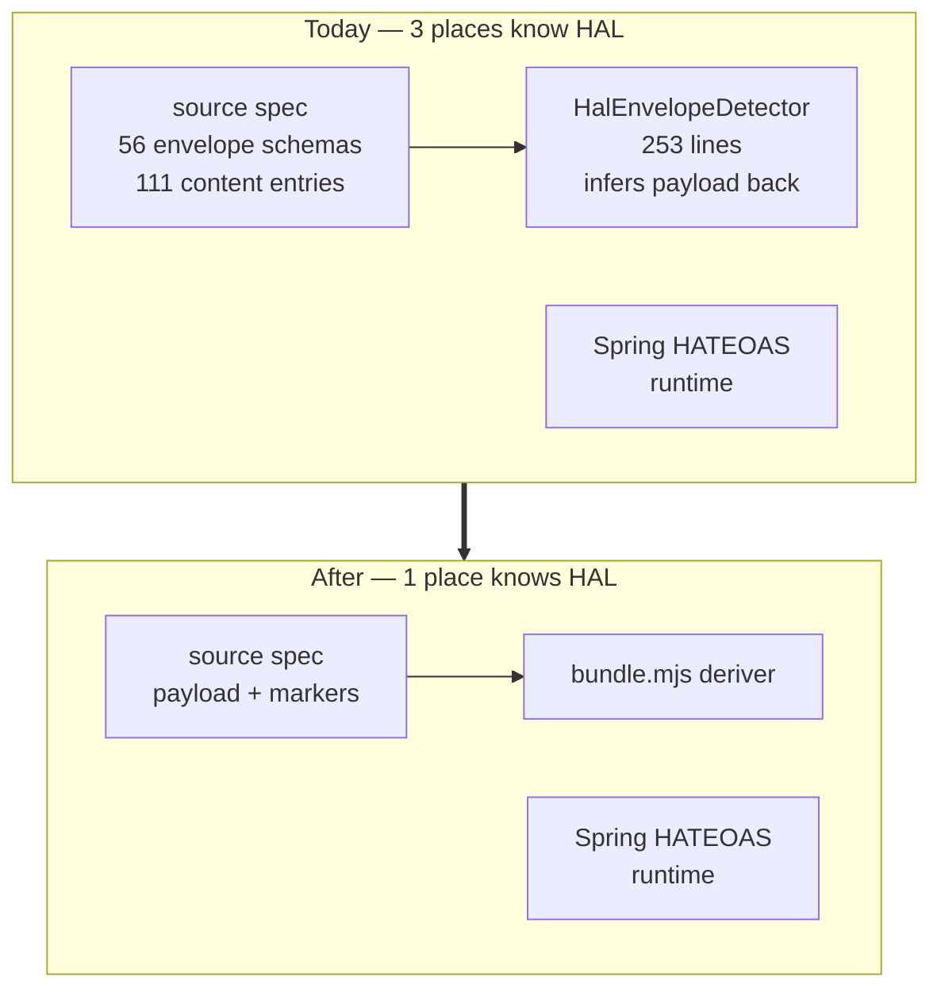
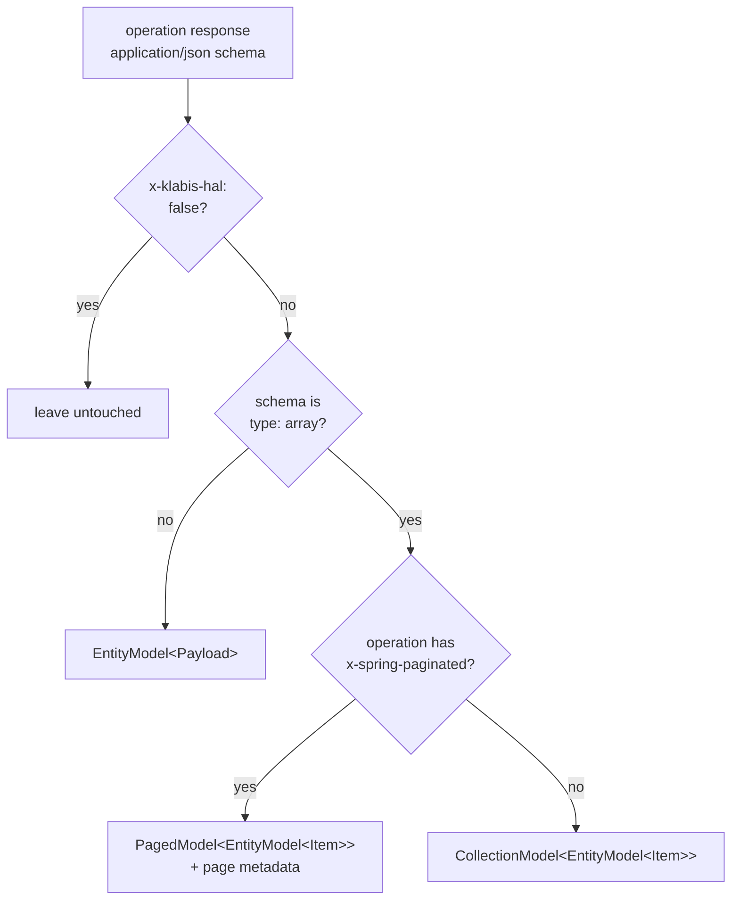
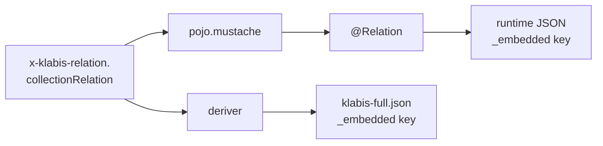

# Design — Derive HAL envelopes in the bundler

## Context

HAL envelope structure is currently known in three places: the hand-written source specs (which
spell it out), `HalEnvelopeDetector` in `backend/buildSrc` (which infers the payload back out of it),
and Spring HATEOAS at runtime (which actually produces it). The first two exist only to cancel each
other out.



Two facts make the derivation possible without new information. `x-spring-paginated` already
distinguishes paged from unpaged collections at operation level — 3 uses, matching exactly the 3
`PagedModel*` schemas against 13 `CollectionModel*`. And `x-klabis-relation` already declares the
`_embedded` key, consumed by `pojo.mustache:30` to emit `@Relation` — so spec and runtime read the
same value and cannot drift.

Relevant counts: 111 operations (105 HAL, 6 not), 56 envelope schemas, 15 bare-array `*List`
siblings, 8 `x-klabis-relation`, 7 nested-EntityModel array properties (all in `groups.yaml`).

## Goals / Non-Goals

**Goals:**

- Source specs state each fact once: payload schema, plus a marker where the fact is not derivable.
- `bundle.mjs` becomes the only place in the repo encoding HAL envelope structure.
- `KlabisSpringCodegen` reads declarations instead of detecting shapes; `HalEnvelopeDetector` and
  `EnvelopeUnwrap` are deleted along with their tests.
- Every migration step is provable by byte-identical output, not by review.

**Non-Goals:**

- Changing any runtime response. Controllers, mappers and HAL postprocessors are untouched.
- Changing the generated Java DTO records — they must come out identical.
- Redesigning `x-hal-links` / `x-hal-templates`, which describe *which* links a response carries and
  are orthogonal to envelope structure.
- Supporting non-array HAL-wrapped properties (see Decision 3).
- Changing how `problem+json` error responses are declared.

## Decisions

### Decision 1 — Derive in the bundler, not in the generator

`bundle.mjs` reconstructs the envelopes into `klabis-full.json`; `KlabisSpringCodegen` reads the raw
module YAML and never sees an envelope at all.

This works because **the backend never needs envelope types**. Spring HATEOAS builds them at runtime
from `EntityModel.of(...)`; the generated Java records are payloads. Envelope schemas exist in the
document purely for the frontend's TypeScript types and Swagger UI — and it is exactly that mismatch
which forced 253 lines of detection to strip them back off.

*Alternative considered:* derive in both, so the generator sees the same document as the frontend.
Rejected — two implementations of one rule, free to drift, for no benefit to the Java side.

### Decision 2 — Collection vs. item, paged vs. unpaged

The deriver's rule, in order:



Collection items are always themselves wrapped in `EntityModel` — that is uniformly true across all
16 existing collection envelopes.

Pagination is deliberately read from the **operation**, not inferred from the presence of a `page`
property. This follows the rule `HalEnvelopeDetector` already established (its Shape 2 check
explicitly refuses to inspect `page`), keeping one source of truth for "is this paged".

### Decision 3 — `x-hal-entity-items: true`, arrays only

An array property whose items are independently addressable resources is not derivable — it is an
API design choice. It gets a marker on the property:

```yaml
trainers:
  type: array
  x-hal-entity-items: true
  items:
    $ref: '#/components/schemas/TrainerResponse'
```

The marker sits on the **array**, not beside the `$ref`. A sibling of `$ref` is ignored outright in
OpenAPI 3.0 and, while permitted in 3.1, is inconsistently honoured across tooling — `openapi-typescript`,
openapi-generator and `haltypes.mjs` would each have to be trusted separately. Placing it on the
array schema avoids that class of problem entirely. The name says *items*, not *entity*, because it
is each item that gains `_links`.

Restricted to `type: array` with a `$ref` items schema, enforced in `validate.mjs`. All 7 real cases
are arrays; a singular HAL-wrapped property would need the fragile `$ref`-sibling placement, so it is
refused until a real case appears.

The deriver emits `EntityModel` + payload schema name (matching today's names exactly), rewrites the
items `$ref` to it, and the generator maps the property to `List<EntityModel<T>>` — replacing the 7
`schemaMappings` + 7 `extraImportMappings` entries in `build.gradle.kts`.

*Alternative considered:* keep structural detection for this one case. Rejected — it is the reason
`detectPropertyItemUnwrap` exists, so keeping it keeps the whole detector.

### Decision 4 — `x-klabis-hal: false` as opt-out, HAL by default

105 of 111 operations are HAL. Opt-in would mean 105 markers to add and one silent failure mode per
forgotten marker; opt-out means 6.

The 6 exceptions are coherent rather than arbitrary: `getMySchedule` (`text/calendar`), the four
pre-auth password endpoints in `common.yaml` (called without a token, outside hypermedia navigation),
and `listOrisEvents` (external ORIS passthrough). The marker sits on the **operation**: all 6 opt out
wholesale, and no current endpoint needs HAL on some responses but not others. Per-response
granularity is deliberately deferred until a mixed case exists.

*Alternative considered:* treat the presence of `x-hal-links` as the signal. Rejected on the data —
only 44 of 105 HAL operations carry it, so over 60 would silently lose HAL. `x-hal-links` answers
"which links", not "is this hypermedia".

### Decision 5 — `_embedded` key from `x-klabis-relation`, with a derived fallback



One value feeds both paths, so spec and runtime cannot disagree — a structural guarantee, not a test.
Today the same key is written twice (once as `x-klabis-relation`, once inside the envelope schema)
and kept in sync by hand.

For the ~48 schemas without the extension, the deriver reproduces Spring HATEOAS's default:
`uncapitalize(schemaName) + "List"`. No custom `LinkRelationProvider` bean and no evo-inflector
dependency exist in the backend, so the default applies — but this is verified against live responses
before anything depends on it (task 1).

### Decision 6 — Byte-identical output as the acceptance test

`klabis-full.json` is committed. After rewriting a module's source spec, `git diff` on it must report
nothing; likewise the generated Java under `build/generated/openapi/<module>/` must be unchanged.

This turns each migration step into a proof rather than a review. It also constrains the deriver:
it must reproduce today's schema names, property order and `_embedded` keys exactly — which is why
naming follows the existing convention rather than being improved in the same change.

## Risks / Trade-offs

**[The `_embedded` fallback is wrong for some schema]** → Verified against live responses before the
deriver is written (task 1). If any endpoint disagrees with `uncapitalize + "List"`, that schema gets
an explicit `x-klabis-relation` rather than the deriver growing a special case.

**[Complexity moves rather than disappearing]** → ~250 lines of Java detection are replaced by a
comparable amount of JS derivation. The win is not lines of code: it is that the source specs shrink
by ~180 schemas and content entries, and that HAL knowledge collapses from three places to one.
Stated plainly so nobody expects a net-negative diff.

**[JSON key ordering breaks byte-identity for reasons unrelated to correctness]** → If the deriver
produces semantically identical but differently ordered output, the criterion fails loudly and early
— on `finance`, the first and smallest module. Resolve by matching insertion order there; do not
weaken the criterion.

**[`groups` proves harder than the small modules]** → It is scheduled last precisely because it is
the only module with `x-hal-entity-items` cases and manual mappings. By then the mechanism is proven
on 6 modules. If it still resists, `groups` can retain its hand-written envelopes indefinitely — the
deriver skips schemas already shaped as envelopes — at the cost of keeping `HalEnvelopeDetector`.

**[Long-lived branch conflicts with concurrent spec edits]** → Each module is an independently
committable step, so the change never needs to hold all 9 files open at once.

## Migration Plan

1. Verify the `_embedded` fallback against a running backend (2-3 endpoints, both `x-klabis-relation`
   and default cases).
2. Build the deriver + `validate.mjs` rules, with unit tests, while all specs stay as they are —
   the deriver must be a no-op on already-enveloped input.
3. Migrate `finance` (3 envelopes). Assert both diffs empty. This step validates the whole approach.
4. `members` → `calendar` → `common` → `events` → `membershipfees`, one commit each.
5. `groups` (18 envelopes + 7 `x-hal-entity-items` + 14 mappings).
6. Delete `HalEnvelopeDetector`, `EnvelopeUnwrap` and their tests; simplify `KlabisSpringCodegen`.
7. Update `.claude/skills/klabis-api-spec/SKILL.md`, `docs/openapi/spec/README.md`, and drop the
   obsolete `groups.yaml` header comment.

**Rollback:** each step is one commit touching one module's spec; reverting restores the hand-written
envelopes, and the deriver's no-op-on-enveloped-input property means it keeps working for
not-yet-migrated modules throughout.

## Open Questions

- ~~Does any endpoint's live `_embedded` key disagree with `uncapitalize(schemaName) + "List"`?~~
  **Resolved (task 1).** Verified against live responses: `accommodation-list` returns its declared
  `accommodationList`; `members` returns `memberSummaryResponseList` and `events` returns
  `eventSummaryDtoList`, both matching the fallback. `EventSummaryDto` → `eventSummaryDtoList` shows
  the rule is purely lexical — the `Dto` suffix passes through unchanged — so it does not depend on
  schemas being named `*Response`. The deriver may rely on the fallback as specified.
- Do the two `*ForInvitationsList` schemas in `groups.yaml`
  (`CollectionModelEntityModelPendingInvitationResponseForInvitationsList` and its item) follow the
  standard naming convention, or do they need an explicit override to stay byte-identical? To be
  answered when `groups` is reached.
