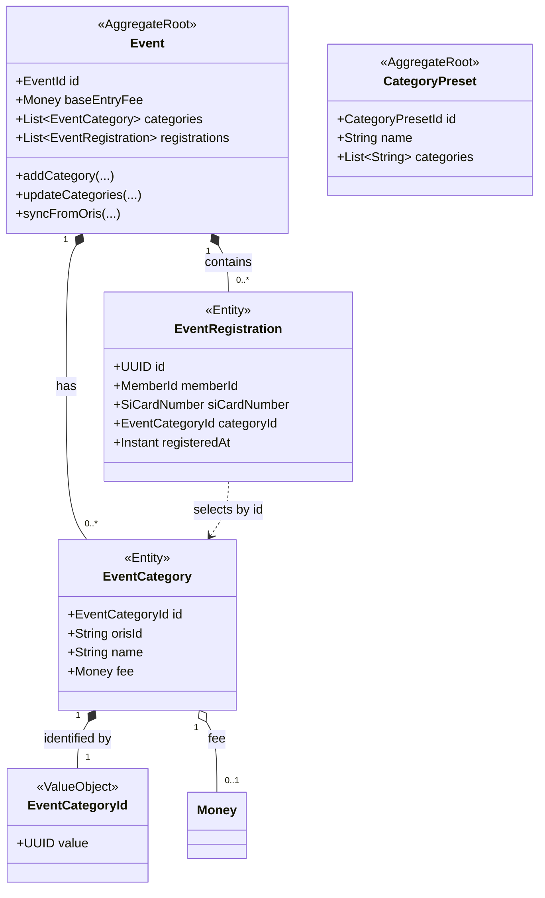

## Context

Kategorie eventu jsou dnes `List<String>` na agregátu `Event` a `EventRegistration` na ně odkazuje polem `category: String`. Název je tedy zároveň identitou i zobrazovanou hodnotou.

Důsledky jsou v kódu vidět:

- `OrisEventImportService.warnIfSyncRemovesCategoriesWithRegistrations()` existuje výhradně proto, aby zalogoval, že sync odebral kategorii, na kterou někdo má registraci.
- Spec `event-categories` obsahuje scénář „Sync removes a category that has registrations", kde registrace zůstanou, ale odkazují na neexistující kategorii.
- Přejmenování kategorie ručně (edit eventu) má tentýž efekt, jen bez varování.

ORIS přitom stabilní identitu poskytuje. Ověřeno v `com.dpolach.api:oris-client`:

```java
record EventClass(String id, String name, String distance, String climbing,
                  ClassDefinition classDefinition, String fee,
                  String manualFee, String manualFeeEntryDate2, String manualFeeEntryDate3,
                  String ranking, String entryLimit, String wave, …) {}
```

`EventDetails.classes()` je `Map<String, EventClass>` klíčovaná `id`, a registrace v ORIS odkazuje kategorii číselně přes `EventEntry.classId`. Náš import z celého objektu vytáhne pouze `name()`. Name-based model je tedy volba našeho importu, ne omezení zdroje.

Souběžný change `event-registration-pricing` zavádí `SupplementaryService` se stabilním lokálním ID a volitelným `orisId`. Kategorie mají mít stejný tvar — jinak vznikne bezdůvodná asymetrie mezi dvěma volitelnými položkami registrace.

## Goals / Non-Goals

**Goals:**

- Kategorie má stabilní identitu nezávislou na názvu; přejmenování nerozváže registrace.
- ORIS sync páruje kategorie podle `orisId`, takže přejmenování v ORIS kategorii neodebere.
- Kategorie nese volitelnou cenu (`fee`) — tento change vlastní celý tvar `EventCategory`.
- Struktura je konzistentní se `SupplementaryService` z changi `event-registration-pricing`.
- Migrace zachová existující data i vazby registrací.

**Non-Goals:**

- `CategoryPreset` — zůstává `List<String>`; je to šablona názvů bez registrací a bez ORIS vazby.
- Import cen kategorií z ORIS (`EventClass.fee` a `manualFee*` odstupňované podle termínu přihlášky).
- Kapacita kategorie (`EventClass.entryLimit`) a vlny (`wave`).
- Atributy `ClassDefinition` (`ageFrom`, `ageTo`, `gender`) — kategorie zůstává z pohledu Klabisu název, ne věkově-genderová definice.
- Samotný výpočet ceny registrace — ten řeší `event-registration-pricing`.

## Decisions

### D1: Kategorie má lokální UUID a volitelný `orisId`

`EventCategory` dostává `EventCategoryId` (UUID generované Klabisem) jako identitu a nullable `orisId: String` jako párovací klíč vůči ORIS.

- **Proč lokální UUID jako primární:** Kategorie vznikají i u eventů bez ORIS napojení, kde externí ID neexistuje. Lokální ID je tedy vždy přítomné a odkaz z registrace na něj může být nepodmíněný.
- **Proč `orisId` zvlášť, a ne jako primární klíč:** ORIS `EventClass.id` je unikátní v rámci eventu, ne globálně; jako primární klíč by kolidovalo napříč eventy a neexistovalo by u ručně založených kategorií.
- **Alternativy:** Ponechat name-based a jen zpřísnit varování — zamítnuto, neřeší příčinu. Použít složený klíč (event + název) — zamítnuto, název zůstává měnitelný.

### D2: Registrace odkazuje kategorii přes `categoryId`

`EventRegistration.category: String` se mění na `categoryId: EventCategoryId` (nullable — event nemusí mít kategorie).

- **Proč:** Bez toho by identita na kategorii nic nevyřešila; vazba, kterou přejmenování rozbíjí, je právě tady.
- **Zobrazení názvu:** Název se dohledá z `Event.categories` podle ID při čtení. Registrace tedy nedrží cenový ani jmenný snapshot — konzistentní s rozhodnutím D2 v `event-registration-pricing`.
- **Osiřelý odkaz:** Pokud kategorie zmizí (sync ji skutečně odebral), `categoryId` na registraci zůstane a při čtení se název nedohledá. API v takovém případě vrátí kategorii jako `null` a registrace je označená jako vyžadující pozornost organizátora. Data se nemažou.
- **Alternativy:** Držet na registraci ID i název (snapshot) — zamítnuto, zavádí dva zdroje pravdy a invalidaci.

### D3: ORIS sync páruje podle `orisId`, ne podle názvu

Import naplní `orisId` z `EventClass.id`. Při syncu se příchozí kategorie páruje s existující podle `orisId`:

- shoda → aktualizuje se název (a případně další atributy), **ID i vazby registrací zůstávají**,
- žádná shoda → nová kategorie s novým lokálním ID,
- existující kategorie s `orisId`, která v příchozích datech chybí → odebírá se; pokud na ni existují registrace, zaloguje se varování (dnešní chování).

Kategorie s `orisId = null` (ručně přidané na ORIS eventu) sync **nemaže** — nejsou ve zdroji, tak o nich ORIS nemůže rozhodovat.

- **Proč:** Tohle je jádro přínosu. Přejmenování kategorie v ORIS dnes znamená „stará zmizela, nová přibyla"; po změně jde o prostý update názvu.
- **Alternativy:** Párovat podle názvu s fallbackem na ID — zamítnuto, zbytečně dvojí cesta s horším chováním.

### D4: `fee` je součástí této struktury

`EventCategory` nese `Optional<Money> fee`, které přepisuje `baseEntryFee` eventu.

- **Proč tady, a ne v pricing changi:** Obě změny by jinak měnily tvar téže struktury a jejich migrace by se překrývaly. Tento change vlastní `EventCategory` celý; `event-registration-pricing` na něj navazuje a jeho rozhodnutí o kategoriích se zjednoduší na odkaz sem.
- **Důsledek pro pořadí:** Tento change je vhodné implementovat jako první.

### D5: `CategoryPreset` zůstává name-based

Beze změny (`List<String> categories`).

- **Proč:** Preset slouží jen k předvyplnění formuláře názvy. Nemá registrace, nemá ORIS vazbu — identita by tam neřešila žádný existující problém a rozšířila by rozsah o vlastní API a migraci. KISS.

### D6: Migrace přiřadí ID a napáruje registrace podle dnešního názvu

Jednorázová migrace: každému názvu v `categories` se přidělí UUID a `orisId = null`; každé registraci se `category` (název) přeloží na odpovídající `categoryId`.

- **Registrace, jejíž název kategorie na eventu neexistuje** (dnes už osiřelá): `categoryId = null`, událost se zaloguje. Původní název se nezahazuje tiše — migrace vypíše přehled dotčených registrací.
- **`orisId` se zpětně nedoplňuje.** Naplní se až prvním syncem po nasazení. Do té doby se ORIS eventy chovají jako dnes (párování názvem při prvním syncu vytvoří nové kategorie) — proto migrace u ORIS eventů zaloguje doporučení sync spustit.

## Doménový model



| Prvek | Typ | Změna | Popis |
|-------|-----|-------|-------|
| `EventCategory` | Entity | **Přidáno** | Nahrazuje `String` v `Event.categories`. Identita, volitelný `orisId`, název, volitelná cena. |
| `EventCategoryId` | Value object | **Přidáno** | UUID identita kategorie, stabilní vůči přejmenování. |
| `EventCategory.orisId` | Pole entity | **Přidáno** | Identifikátor `EventClass.id` z ORIS; `null` u ručně založených kategorií. |
| `EventCategory.fee` | Pole entity | **Přidáno** | Volitelná cena přepisující `baseEntryFee` (D4). |
| `Event.categories` | Pole agregátu | **Změněno** | `List<String>` → `List<EventCategory>`. **BREAKING.** |
| `Event` (validace) | Agregát | **Změněno** | Unikátní název i ID kategorie v rámci eventu; unikátní `orisId`, pokud je vyplněn. |
| `EventRegistration.category` | Pole entity | **Odstraněno** | Nahrazeno `categoryId`. **BREAKING.** |
| `EventRegistration.categoryId` | Pole entity | **Přidáno** | Odkaz na kategorii přes stabilní ID (D2). |
| `EventCreatedEvent.categories` | Domain event | **Změněno** | `List<String>` → strukturované položky. |
| `EventUpdatedEvent.categories` | Domain event | **Změněno** | `List<String>` → strukturované položky. |
| `RegistrationEditedEvent` | Domain event | **Změněno** | Nese `categoryId` místo názvu kategorie. |
| `CategoryPreset.categories` | Pole agregátu | Beze změny | Zůstává `List<String>` (D5). |

## REST API

### Event — kategorie ve vytvoření a editaci

**`POST /api/events`**, **`PUT /api/events/{eventId}`** — pole `categories` mění tvar:

```jsonc
{
  "name": "…",
  "baseEntryFee": { "amount": 150, "currency": "CZK" },
  "categories": [
    // s id → update existující (vazby registrací zůstanou)
    { "id": "3f9a…", "name": "H21", "fee": { "amount": 200, "currency": "CZK" } },
    // bez id → nová kategorie, server přidělí UUID
    {                "name": "D21" }
  ]
}
```

- Seznam určuje výsledný stav: **s `id`** = update, **bez `id`** = nová, **chybějící `id`** = odebraná.
- `orisId` se přes API **nenastavuje** — plní ho výhradně ORIS import/sync.
- Validace: unikátní název v rámci eventu; `id` musí patřit tomuto eventu.
- Odebrání kategorie s existujícími registracemi je povoleno; odpověď obsahuje počet dotčených registrací a událost se zaloguje.

**`GET /api/events/{eventId}`** — `categories` vrací plné položky:

```jsonc
{
  "categories": [
    { "id": "3f9a…", "name": "H21", "fee": { "amount": 200, "currency": "CZK" } },
    { "id": "7c1b…", "name": "D21", "fee": null }
  ],
  "_links": { "self": { "href": "…" } }
}
```

- HAL+FORMS afordance: `createEvent` / `updateEvent` — pole `categories` je nyní pole objektů (`id`, `name`, `fee`).

### Registrace — výběr kategorie

**`POST /api/events/{eventId}/registrations`**, **`PUT …/registrations/{memberId}`**:

```jsonc
{
  "siCardNumber": "12345",
  "categoryId": "3f9a…"
}
```

**`GET /api/events/{eventId}/registrations/{memberId}`** — response nese ID i dohledaný název:

```jsonc
{
  "memberId": "…",
  "siCardNumber": "12345",
  "category": { "id": "3f9a…", "name": "H21" },
  "_links": { "self": { "href": "…" } }
}
```

- Osiřelý odkaz (kategorie odebrána): `"category": null`.
- HAL+FORMS afordance `register` / `editRegistration`: pole `categoryId` s inline options z `event.categories` (`value` = id, `prompt` = název).
- Řazení registrací podle kategorie (`RegistrationSortApplier`) nadále řadí podle **názvu** dohledaného z ID, ne podle ID.

## Glosář nových doménových pojmů

| Pojem | Význam |
|-------|--------|
| **EventCategory** | Kategorie (třída) eventu — stabilní identita, název, volitelná cena a volitelná vazba na ORIS. |
| **EventCategoryId** | Lokální identifikátor kategorie (UUID), neměnný po celou dobu její existence. |
| **orisId** | Identifikátor kategorie v ORIS (`EventClass.id`), párovací klíč při syncu. `null` u ručně založených kategorií. |
| **osiřelá registrace** | Registrace, jejíž `categoryId` už na eventu neexistuje (kategorie byla odebrána). Data zůstávají, kategorie se zobrazí jako nevyplněná. |

## Risks / Trade-offs

- **[Široký breaking change napříč vrstvami]** → Dotýká se domény, persistence, domain eventů, REST i ~21 souborů frontendu. Zmírněno tím, že jde o mechanickou záměnu s jasným vzorem, a implementací po vertikálních řezech (doména → persistence → API → frontend) s testy po každém.
- **[Migrace může narazit na už osiřelé registrace]** → Nastaví `categoryId = null` a vypíše přehled dotčených registrací; žádná data se nemažou. Osiření vzniklo dřívějším chováním, migrace ho jen zviditelní.
- **[`orisId` se zpětně nedoplní]** → První sync po nasazení u ORIS eventů založí kategorie znovu (s ID) a staré odebere, což může rozvázat registrace stejně jako dnes. Zmírnění: migrace u ORIS eventů zaloguje doporučení; volitelně lze v migraci naplnit `orisId` dohledáním v ORIS, pokud je integrace dostupná — rozhodne se při implementaci.
- **[Souběh s `event-registration-pricing`]** → Oba changey mění `EventCategory`. Vyřešeno tím, že tvar vlastní tento change a pricing na něj navazuje; nutno implementovat v tomto pořadí a pricing proposal upravit.
- **[Rozšíření agregátu `Event`]** → `Event` už nese kategorie, služby (z pricing changi) i registrace. Zůstává v mezích, ale je to signál sledovat velikost agregátu při dalších změnách.

## Migration Plan

1. **Doména:** `EventCategoryId`, `EventCategory`, změna `Event.categories`, validace unikátnosti; `EventRegistration.categoryId`.
2. **Persistence:** `EventMemento`, `EventRegistrationMemento`, DDL pro kategorie a odkaz registrace (úprava V001 dle konvence projektu).
3. **Datová migrace:** přidělení UUID existujícím názvům, přepis odkazů registrací, log osiřelých.
4. **ORIS import/sync:** naplnění `orisId`, párování podle něj, přepis `warnIfSyncRemovesCategoriesWithRegistrations` na ID-based.
5. **Domain eventy:** nový tvar `EventCreatedEvent`, `EventUpdatedEvent`, `RegistrationEditedEvent`.
6. **REST + HAL-FORMS:** request/response DTO, afordance, `RegistrationSortApplier`.
7. **Frontend:** formuláře eventu, výběr kategorie při registraci, zobrazení a řazení.

**Rollback:** Změna je dopředná. Zpětný převod by znamenal zploštění `EventCategory` na názvy — ztratí se `orisId` a `fee`, a registrace by se vrátily k name-based odkazu. Protože se žádná data nemažou, rollback je proveditelný, ale ztrátový.

## Open Questions

- Má datová migrace u ORIS eventů **dohledat `orisId` z ORIS API**, pokud je integrace dostupná (odstraní riziko rozvázání při prvním syncu), nebo stačí zalogovat doporučení sync spustit? Rozhodnout při implementaci kroku 3.
- Jak v UI označit registraci s osiřelou kategorií — samostatný stav, nebo prostě prázdná hodnota s tooltipem? Řeší se ve fázi frontendu.
