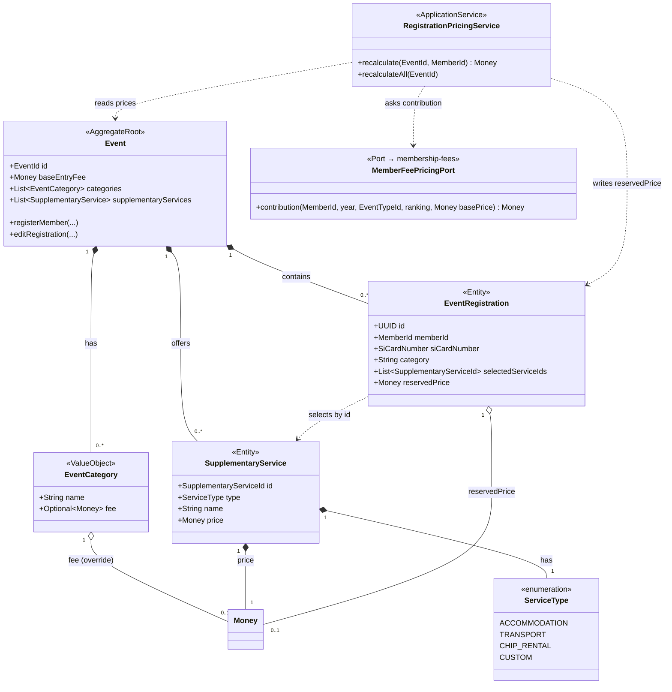

## Context

Event v současnosti nese jedno paušální vstupné (`baseEntryFee: Money`) a kategorie jako prostý `List<String>`. Registrace (`EventRegistration`) drží jen vybranou kategorii (název), SI číslo čipu a čas registrace — žádnou cenu. Modul membership-fees už zná koncept členské úrovně (`MembershipFeeTier`) s pravidly `MembershipPaymentRule`, která určují, kolik člen dané úrovně přispívá na vstupné podle kombinace event type + ranking (procentem nebo pevnou částkou). Tato pravidla se zatím nikde nepoužívají pro výpočet ceny registrace.

Cílem je umožnit spočítat orientační cenu registrace, aby na ni mohla navázat budoucí rezervace a vyúčtování plateb. Cena má vzniknout ze tří zdrojů: základní vstupné (případně přepsané cenou kategorie), příspěvek dle členské úrovně a součet zvolených doplňkových služeb.

Tento design vychází z rozhodnutí učiněných v grill-me session (viz `events-domain-model.md` v této change složce, tabulka „Rozhodnutí z grill-me session" — zdroj pravdy).

## Goals / Non-Goals

**Goals:**
- Kategorie eventu může mít vlastní cenu, která přepisuje `baseEntryFee`.
- Event může nabídnout doplňkové služby (předdefinované i vlastní) s cenou; člen si je při registraci volitelně vybírá.
- Cena za vstupné se modifikuje příspěvkem dle členské úrovně člena pro rok konání eventu.
- Každá registrace nese spočtenou orientační cenu (`reservedPrice`).
- Skladba ceny (kategorie, služby, součet) zůstává doménou events; membership-fees vystavuje jen úzký port pro příspěvek za vstupné.

**Non-Goals:**
- Skutečná rezervace/blokace plateb ani vyúčtování eventu (samostatná navazující změna). `reservedPrice` je pouze informativní.
- Množství u služeb (vícekrát ubytování apod.) — výběr je binární ano/ne.
- Modifikace ceny služeb dle členské úrovně — tier zatím ovlivňuje jen vstupné.
- Přepočet `reservedPrice` při změně členské úrovně člena ve fee kampani.
- Globální katalog doplňkových služeb sdílený napříč eventy.

## Decisions

### D1: Cena kategorie přepisuje baseEntryFee (override, ne příplatek)

`baseEntryFee` zůstává výchozí cenou eventu. Kategorie může mít volitelnou vlastní cenu, která **nahrazuje** `baseEntryFee` pro registrace v té kategorii. Event bez kategorií i kategorie bez vlastní ceny používají `baseEntryFee`.

- **Proč:** Některé eventy budou bez kategorií — override je zpětně kompatibilní a nejflexibilnější. ORIS dodává cenu typicky jako jednu základní hodnotu.
- **Alternativy:** Příplatek (`base + categoryFee`) — zamítnuto, méně přirozené pro klubové závody. Povinná cena per kategorie bez `baseEntryFee` — zamítnuto, rozbíjí eventy bez kategorií.

### D2: Registrace drží jen název kategorie, cena se dopočítává (ne snapshot)

`EventRegistration` ukládá název kategorie (jako dnes). Cena kategorie se dopočítá lookupem do `Event.categories` podle názvu — žádný cenový snapshot na registraci.

- **Proč:** Rezervace ceny je informativní; závazná cena vzniká až při vyúčtování eventu. Snapshot není potřeba.
- **Alternativy:** Snapshot ceny při registraci — zamítnuto, zbytečné u informativní ceny, přidává invalidaci.

### D3: Doplňkové služby žijí na eventu (ne globální katalog)

Služby jsou součástí agregátu `Event` jako `List<SupplementaryService>` (vlastní data eventu). Tři předdefinované typy (ubytování, doprava, půjčení čipu) jsou **hardcoded šablona** v kódu — UI z nich předvyplní název, cenu vždy zadá organizátor (liší se per event). Lze nadefinovat i vlastní službu (`type = CUSTOM`). Každá služba nese `ServiceType` enum kvůli budoucímu reportingu.

- **Proč:** Cena ubytování/dopravy je u každého závodu jiná, takže cena musí žít na eventu. Globální aggregate je overkill, pokud se nic nesdílí. Preset CRUD (jako `CategoryPreset`) je u tří fixních typů zbytečný.
- **Alternativy:** Globální `SupplementaryServiceCatalog` aggregate — zamítnuto (overkill). Preset aggregate analogický `CategoryPreset` — zamítnuto (tři fixní typy nepotřebují CRUD).

### D4: Registrace odkazuje na služby přes stabilní ID

Služba na eventu má vlastní `SupplementaryServiceId`. Registrace drží `List<SupplementaryServiceId>`. (Asymetrie vůči kategorii, která je name-based — služeb si člen vybírá víc a jsou to diskrétní položky.)

- **Proč:** Přejmenování služby na eventu nesmí rozbít vazbu existujících registrací.
- **Alternativy:** Name-based reference (jako kategorie) — zamítnuto, křehké vůči přejmenování diskrétních položek.

### D5: Příspěvek dle členské úrovně přes úzký port do membership-fees

Membership-fees vystaví port `MemberFeePricingPort.contribution(memberId, year, eventTypeId, ranking, basePrice) → Money`. Port zapouzdřuje aplikaci `MembershipPaymentRule` (Percentage / FixedAmount) a vrací výslednou částku za vstupné. Events nezná strukturu pravidel — konzumuje příspěvek jako black-box.

- **Proč:** Pravidlová logika (procento vs. pevná částka) je doménová znalost membership-fees. Čistá hexagonální hranice. Rok = rok konání eventu (`eventDate.getYear()`), protože fee kampaně jsou roční.
- **Alternativy:** Events čte `MembershipPaymentRule` přímo a počítá — zamítnuto, prosakuje doménu membership-fees do events.

### D6: Tier modifikuje jen base/kategorii, ne ceny služeb

Příspěvek dle členské úrovně se aplikuje na **base cenu registrace** = cena kategorie (pokud override), jinak `baseEntryFee`. Ceny doplňkových služeb se přičítají v plné výši.

- **Proč:** Aktuální požadavek. (Budoucí potřeba modifikace služeb existuje, ale teď mimo rozsah.)

### D7: reservedPrice se ukládá jako total, počítá ho application service

`EventRegistration` nese uloženou `reservedPrice: Money` (jen total, žádný rozpad — ten se dopočítá pro UI). Výpočet dělá nový application service `RegistrationPricingService` v events (ne agregát — agregát nevolá porty).

```
base = registration.category.fee ?? event.baseEntryFee
entryContribution = MemberFeePricingPort.contribution(memberId, eventDate.year, eventTypeId, ranking, base)
servicesTotal = Σ price zvolených služeb (plná cena)
reservedPrice = entryContribution + servicesTotal
```

- **Proč ukládat (a ne počítat on-the-fly):** Výpočet závisí na příspěvku z portu (cross-module, nemusí být při čtení levně dostupný a může se měnit nezávisle). Ukládá se jen total, protože rozpad jde dopočítat z dat na eventu.
- **Proč application service:** Agregát nevolá porty (anti-pattern). Skladba ceny je events doména, ale orchestrace s cross-module portem patří do aplikační vrstvy.
- **Kdy se přepočítává:** (a) registrace člena, (b) editace registrace (změna kategorie/služeb), (c) změna cen na eventu (update / sync z ORIS) → přepočet všech registrací eventu v téže transakci. **Vědomě NE** při změně členské úrovně člena ve fee kampani — informativní hodnota smí být lehce zastaralá.

### D8: Jedna měna na celý event

Všechny ceny na eventu (`baseEntryFee`, ceny kategorií, ceny služeb) musí být ve stejné měně. Validace na agregátu `Event`. Pokud `baseEntryFee` chybí, měnu určí první nastavená cena, jinak default CZK.

- **Proč:** Klubový závod má jednu měnu (CZK). Mix měn nedává reálný smysl a otevíral by konverzní problémy.

### D9: Domain events se zatím nemění

`MemberRegisteredForEventEvent` ani `RegistrationEditedEvent` nově nenesou cenu. Budoucí finance integrace si tvar událostí doplní, až bude známý její přesný požadavek (YAGNI).

## Cílový doménový model



| Prvek | Typ | Změna | Popis |
|-------|-----|-------|-------|
| `EventCategory` | Value object | **Přidáno** | Nahrazuje `String` v `Event.categories`. Název + volitelná cena (override `baseEntryFee`). |
| `SupplementaryService` | Entity | **Přidáno** | Doplňková služba na eventu: id, typ, název, cena. |
| `SupplementaryServiceId` | Value object | **Přidáno** | Stabilní identita služby pro odkaz z registrace. |
| `ServiceType` | Enum | **Přidáno** | `ACCOMMODATION`, `TRANSPORT`, `CHIP_RENTAL`, `CUSTOM`. |
| `RegistrationPricingService` | Application service | **Přidáno** | Počítá `reservedPrice` ze základu/kategorie, příspěvku tier a služeb. |
| `MemberFeePricingPort` | Port (do membership-fees) | **Přidáno** | `contribution(...)` — vrací částku za vstupné dle členské úrovně. |
| `Event.categories` | Pole agregátu | **Změněno** | `List<String>` → `List<EventCategory>`. **BREAKING.** |
| `Event.supplementaryServices` | Pole agregátu | **Přidáno** | Seznam nabízených služeb. |
| `Event` (validace) | Agregát | **Změněno** | Vynucena jednotná měna napříč cenami eventu. |
| `EventRegistration.selectedServiceIds` | Pole entity | **Přidáno** | Členem zvolené služby (0..N). |
| `EventRegistration.reservedPrice` | Pole entity | **Přidáno** | Uložená orientační cena registrace (total). |
| `MembershipPaymentRule` | Value object (membership-fees) | Beze změny | Konzumováno přes nový port; logika se nemění. |

## REST API

### Správa eventu — služby a ceny kategorií

Doplňkové služby a ceny kategorií se nastavují v create/update afordancích eventu (rozšíření existujících HAL-FORMS šablon).

**`POST /api/events`** a **`PUT /api/events/{eventId}`** — request body rozšířen:

```jsonc
{
  "name": "...",
  "baseEntryFee": { "amount": 150, "currency": "CZK" },
  "categories": [
    { "name": "H21", "fee": { "amount": 200, "currency": "CZK" } },
    { "name": "D21" }                          // bez fee → použije baseEntryFee
  ],
  "supplementaryServices": [
    { "type": "ACCOMMODATION", "name": "Ubytování pá-ne", "price": { "amount": 300, "currency": "CZK" } },
    { "type": "CHIP_RENTAL",   "name": "Půjčení čipu",     "price": { "amount": 50,  "currency": "CZK" } },
    { "type": "CUSTOM",        "name": "Oběd",             "price": { "amount": 120, "currency": "CZK" } }
  ]
}
```

- Response: služby v odpovědi nesou přidělené `id`.
- HAL-FORMS afordance: existující `createEvent` / `updateEvent` se rozšiřují o pole `supplementaryServices` a strukturované `categories`.
- Validace: všechny ceny stejná měna; cena kategorie ≤ není omezena vůči base (override).

### Registrace — výběr služeb a cena

**`POST /api/events/{eventId}/registrations`** — request body rozšířen o výběr služeb:

```jsonc
{
  "siCardNumber": "12345",
  "category": "H21",
  "selectedServiceIds": ["<uuid-accommodation>", "<uuid-chip>"]
}
```

**`GET /api/events/{eventId}/registrations/{memberId}`** — response rozšířen o cenu (rozpad dopočítán):

```jsonc
{
  "memberId": "...",
  "category": "H21",
  "siCardNumber": "12345",
  "selectedServices": [
    { "id": "<uuid>", "name": "Ubytování pá-ne", "price": { "amount": 300, "currency": "CZK" } }
  ],
  "price": {
    "entryFee":   { "amount": 100, "currency": "CZK" },  // po příspěvku tier (např. 50 % z 200)
    "services":   { "amount": 300, "currency": "CZK" },
    "total":      { "amount": 400, "currency": "CZK" }    // = reservedPrice
  },
  "_links": { "self": { "href": "..." } }
}
```

- HAL-FORMS afordance `register` / `editRegistration` rozšířena o pole `selectedServiceIds` (inline options z `event.supplementaryServices`).
- Rozpad `price` (entryFee / services / total) se dopočítává při čtení; ukládá se jen `total` jako `reservedPrice`.

## Glosář nových doménových pojmů

| Pojem | Význam |
|-------|--------|
| **EventCategory** | Kategorie eventu s názvem a volitelnou cenou, která přepisuje základní vstupné. |
| **SupplementaryService** | Doplňková služba nabízená eventem (ubytování, doprava, půjčení čipu nebo vlastní) s vlastní cenou. |
| **ServiceType** | Typ doplňkové služby — tři předdefinované (`ACCOMMODATION`, `TRANSPORT`, `CHIP_RENTAL`) plus `CUSTOM`. |
| **reservedPrice** | Orientační (informativní) cena registrace = příspěvek za vstupné + součet zvolených služeb. Závazná cena vzniká až při vyúčtování. |
| **entry contribution (příspěvek za vstupné)** | Částka, kterou člen reálně platí za vstupné po aplikaci pravidel jeho členské úrovně na base cenu. |
| **base cena registrace** | Cena kategorie (pokud má override), jinak `baseEntryFee` eventu — vstup do výpočtu příspěvku. |

## Risks / Trade-offs

- **[Migrace `categories` string → struktura]** → Migrační skript převede existující názvy na `EventCategory` bez ceny (fee = empty). Žádná data se neztratí; ceny se doplní ručně.
- **[reservedPrice může být zastaralá]** (po změně tier nebo cen eventu mezi přepočty) → Akceptováno vědomě — hodnota je informativní, závazná cena se počítá při vyúčtování. Dokumentováno v UI.
- **[Cross-module závislost events → membership-fees]** → Úzký port `contribution(...)` minimalizuje vazbu; events nezná strukturu pravidel. Respektuje Spring Modulith hranice.
- **[Přepočet všech registrací při změně cen eventu]** → Při 10+ uživatelích a běžné velikosti eventu (desítky registrací) je přepočet v transakci přijatelný (<500 ms). Pokud by event narostl, lze přepočet zlenivět/dávkovat.
- **[Name-based lookup kategorie vs. ID služby]** → Přejmenování kategorie na eventu rozváže cenu existujících registrací (akceptováno, konzistentní s dnešním chováním kategorií). Služby chráněné stabilním ID.

## Migration Plan

1. Rozšířit doménový model (value objects, entity, enum) a persistenci (memento) — backward-compatible čtení starých `categories`.
2. Datová migrace: existující `categories` (seznam stringů) → `EventCategory` bez ceny.
3. Přidat `MemberFeePricingPort` v membership-fees + adaptér konzumující `MembershipPaymentRule`.
4. Implementovat `RegistrationPricingService` a napojit na registraci/editaci/změnu cen eventu.
5. Rozšířit REST API a HAL-FORMS afordance.
6. Frontend: správa služeb, výběr při registraci, zobrazení rozpadu ceny.

**Rollback:** Změna je aditivní kromě tvaru `categories`. Migrace je dopředná; rollback by vyžadoval zploštění `EventCategory` zpět na názvy (ztráta cen kategorií).

## Open Questions

- Žádné otevřené otázky z doménového návrhu — všech 15 rozhodnutí vyřešeno v grill-me session.
- K dořešení až ve fázi tasks/implementace: přesný formát datové migrace `categories` a zda zachovat dočasně oba formáty v persistenci.
