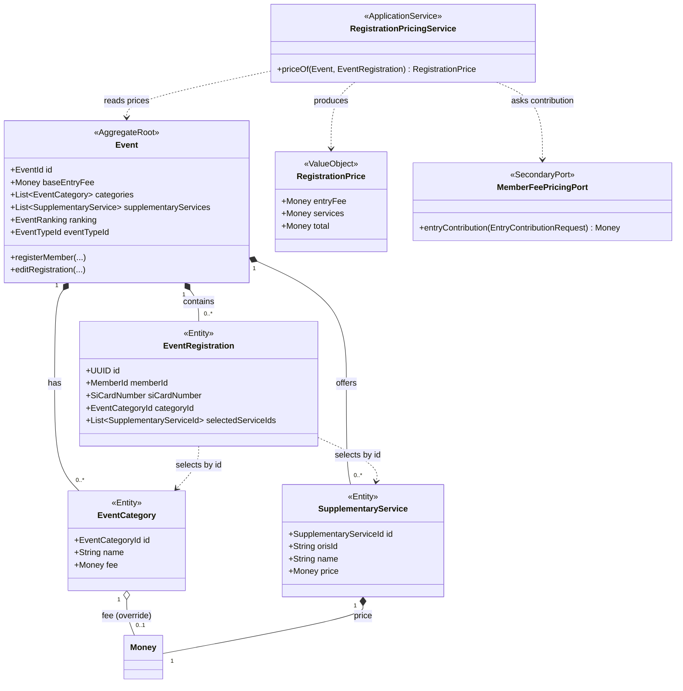

## Context

Event nese jedno paušální vstupné (`baseEntryFee: Money`). Registrace (`EventRegistration`) drží vybranou kategorii, SI číslo čipu a čas registrace — žádnou cenu. Modul membership-fees už zná koncept členské úrovně (`MembershipFeeTier`) s pravidly `MembershipPaymentRule`, která určují, kolik člen dané úrovně přispívá na vstupné podle kombinace event type + ranking (procentem nebo pevnou částkou). Tato pravidla se zatím nikde nepoužívají pro výpočet ceny registrace.

> **Předpoklad:** Tento design staví na changi **`event-category-identity`**, který se implementuje **před** ním. Ten mění kategorie z `List<String>` na `EventCategory` (stabilní `EventCategoryId`, volitelný `orisId`, název a **volitelná `fee`**) a registraci přepíná na `categoryId`. Kategorie s cenou tedy v okamžiku implementace tohoto changu **už existují** — pricing je pouze konzumuje.

Cílem je umožnit spočítat orientační cenu registrace, aby na ni mohla navázat budoucí rezervace a vyúčtování plateb. Cena má vzniknout ze tří zdrojů: základní vstupné (případně přepsané cenou kategorie), příspěvek dle členské úrovně a součet zvolených doplňkových služeb.

## Goals / Non-Goals

**Goals:**
- Cena kategorie (zavedená v `event-category-identity`) se promítne do ceny registrace jako override `baseEntryFee`.
- Event může nabídnout doplňkové služby s cenou; člen si je při registraci volitelně vybírá.
- Cena za vstupné se modifikuje příspěvkem dle členské úrovně, kterou má člen v době konání eventu.
- Cena registrace je odvoditelná (počítá se při čtení) a zobrazitelná v rozpadu.
- Skladba ceny (kategorie, služby, součet) zůstává doménou events; membership-fees vystavuje jen úzký port pro příspěvek za vstupné.

**Non-Goals:**
- Skutečná rezervace/blokace plateb ani vyúčtování eventu (samostatná navazující změna). Cena je pouze informativní.
- Ukládání ceny (snapshotu) na registraci — viz D7.
- Množství u služeb (vícekrát ubytování apod.) — výběr je binární ano/ne.
- Modifikace ceny služeb dle členské úrovně — tier zatím ovlivňuje jen vstupné.
- Změna tvaru `EventCategory` a `EventRegistration.categoryId` — vlastní je change `event-category-identity`.
- Kategorizace/typologie služeb pro reporting — viz D3.
- Import doplňkových služeb z ORIS (`EventDetails.services()`) — model je připraven přes `orisId`, ale import zůstává na pozdější změnu (D4).
- Kapacita služby (`qtyAvailable`/`qtyRemaining`) a deadline objednání (`lastBookingDateTime`), které ORIS zná.
- Globální katalog doplňkových služeb sdílený napříč eventy.

## Decisions

### D1: Cena kategorie přepisuje `baseEntryFee` (override, ne příplatek)

`baseEntryFee` zůstává výchozí cenou eventu. `EventCategory.fee` (definovaná v `event-category-identity`) ji **nahrazuje** pro registrace v dané kategorii. Event bez kategorií i kategorie bez vlastní ceny používají `baseEntryFee`.

Struktura kategorie ani její persistence se v tomto changi nemění — pouze se její `fee` poprvé konzumuje pro výpočet ceny.

- **Proč override, a ne příplatek:** Některé eventy jsou bez kategorií — override je zpětně kompatibilní a nejflexibilnější. ORIS dodává cenu typicky jako jednu základní hodnotu.
- **Alternativy:** Příplatek (`base + categoryFee`) — zamítnuto, méně přirozené pro klubové závody. Povinná cena per kategorie bez `baseEntryFee` — zamítnuto, rozbíjí eventy bez kategorií.

### D2: Cena kategorie se dohledává přes `categoryId`, neukládá se snapshot

Base cena registrace vzniká lookupem `Event.categories` podle `registration.categoryId`. Žádný cenový ani jmenný snapshot na registraci.

- **Proč bez snapshotu:** Cena registrace je informativní; závazná cena vzniká až při vyúčtování eventu (D7). Snapshot by zavedl druhý zdroj pravdy a nutnost invalidace.
- **Osiřelý `categoryId`** (kategorie byla z eventu odebrána): base cena spadne zpět na `baseEntryFee`, výpočet nespadne. Tento stav i jeho prezentaci definuje `event-category-identity`.
- **Symetrie se službami:** Po `event-category-identity` jsou kategorie i služby odkazované stabilním ID, takže přejmenování ani úprava ceny nerozváže existující registrace. Dřívější asymetrie (kategorie name-based, služby ID-based) tím zaniká.
- **Alternativy:** Snapshot ceny při registraci — zamítnuto, zbytečné u informativní ceny.

### D3: Doplňkové služby žijí na eventu, bez typologie

Služby jsou součástí agregátu `Event` jako `List<SupplementaryService>` (vlastní data eventu). Služba nese **název a cenu** (plus identitu — viz D4); doména **nerozlišuje typ** — ubytování je pro ni totéž co oběd. Tři obvyklé služby (ubytování, doprava, půjčení čipu) nabízí **frontend** jako předvyplněné názvy v formuláři; jde o čistě prezentační konstanty, ne doménový koncept.

- **Proč:** Cena ubytování/dopravy je u každého závodu jiná, takže cena musí žít na eventu. Globální aggregate je overkill, pokud se nic nesdílí. `ServiceType` enum by nenesl žádné chování (tier služby neovlivňuje — viz D6) a jeho hodnota `CUSTOM` prozrazuje, že výčet stejně není úplný. Doplnit enum s defaultem je později triviální migrace.
- **Alternativy:** Globální `SupplementaryServiceCatalog` aggregate — zamítnuto (overkill). Preset aggregate analogický `CategoryPreset` — zamítnuto (žádný CRUD není potřeba). `ServiceType` enum kvůli budoucímu reportingu — zamítnuto jako spekulativní (YAGNI).

### D4: Služba má stabilní lokální ID; `orisId` slouží k párování při syncu

Služba nese **`SupplementaryServiceId` (UUID generované klubem)** jako stabilní lokální identitu a volitelný **`orisId: String`** jako párovací klíč vůči ORIS. Registrace drží `List<SupplementaryServiceId> selectedServiceIds`.

```java
record SupplementaryService(
    SupplementaryServiceId id,   // UUID, vždy — lokální identita
    @Nullable String orisId,     // párovací klíč pro ORIS sync; null u ručně založených
    String name,
    Money price
) {}
```

- **Proč ID, a ne název:** ORIS služby **mají stabilní `id`** (viz „Podklad z ORIS API" níže) a název (`nameCZ`) pořadatelé mezi syncy běžně mění. Name-based párování by při každém syncu rozvázalo výběr existujících registrací. Služby jsou navíc diskrétní placené položky, u nichž tichá ztráta výběru znamená chybu ve vyúčtování. Stejný závěr vedl k identitě kategorií v `event-category-identity` — obě položky registrace tedy sdílí jeden vzor.
- **Proč zvlášť `orisId`, a ne použít ORIS id jako primární:** Služby vznikají i ručně u eventů bez ORIS napojení, kde žádné externí ID neexistuje. Lokální UUID je tedy vždy přítomné; `orisId` je jen nullable párovací atribut. Zabraňuje to i kolizi, kdyby ORIS ID nebyla napříč eventy unikátní.
- **Sémantika `PUT /api/events/{id}`:** Seznam služeb se posílá jako celek. Položka **bez `id` = nová** (server přidělí UUID), **s `id` = update existující**, **chybějící = smazaná**. Smazání služby, kterou má někdo vybranou, je popsáno v REST sekci.
- **Konzistence s kategoriemi:** Po `event-category-identity` mají kategorie tentýž tvar (lokální ID + volitelný `orisId` + název + volitelná cena). Registrace tak odkazuje obě své volitelné položky stabilním ID a model je symetrický.
- **Alternativy:** Name-based reference — zamítnuto po zjištění, že ORIS `Service.id` existuje a názvy jsou nestabilní. Použít ORIS `id` přímo jako primární klíč — zamítnuto, nefunguje pro ručně založené služby.

#### Podklad z ORIS API

Ověřeno v `com.dpolach.api:oris-client` (JAR, který projekt už používá):

```java
// com.dpolach.api.orisclient.dto.Service
record Service(String id, String nameCZ, String nameEN, String lastBookingDateTime,
               String unitPrice, String qtyAvailable,
               Integer qtyAlreadyOrdered, Integer qtyRemaining) {}
```

- Na eventu visí jako `EventDetails.services()` typu `Map<String, Service>` — klíčem je `id`, stejně jako u `classes()`.
- **Půjčení čipu je v ORIS jinde:** `EventDetails.entryRentSIFee` je samostatné pole eventu a v registraci mu odpovídá `EventEntry.rentSi: Boolean` — není to položka v `services`. Náš model ho reprezentuje jako běžnou službu; při případném budoucím importu půjde o zvláštní mapování, ne o 1:1 převod.
- **ORIS zná množství a kapacitu** (`qtyAvailable`, `qtyRemaining`) a deadline objednání (`lastBookingDateTime`). Náš model je vědomě zjednodušuje na binární výběr bez kapacity (viz Non-Goals) — při budoucím importu to znamená ztrátu části informace.
- **Import služeb z ORIS je mimo rozsah této změny.** `OrisEventImportService` dnes `services()` vůbec nečte (importuje jen `classes()` a odvozuje `baseEntryFee` jako maximum z `EventClass.fee`). Pole `orisId` se v této změně zavádí připravené, ale zůstává vždy `null`; import ho naplní později bez breaking change.

### D5: Příspěvek dle členské úrovně přes úzký port do membership-fees

Membership-fees vystaví port:

```java
public interface MemberFeePricingPort {
    Money entryContribution(EntryContributionRequest request);

    record EntryContributionRequest(
        MemberId memberId,
        LocalDate eventDate,
        EventTypeId eventTypeId,
        String rankingShortName,
        Money basePrice
    ) {}
}
```

Port zapouzdřuje aplikaci `MembershipPaymentRule` (Percentage / FixedAmount) a vrací výslednou částku za vstupné. Events nezná strukturu pravidel — konzumuje příspěvek jako black-box.

- **Proč:** Pravidlová logika (procento vs. pevná částka) je doménová znalost membership-fees. Čistá hexagonální hranice.
- **Proč `eventDate`, a ne `year`:** Events předává **datum konání** a nechává membership-fees rozhodnout, do kterého fee období event spadá. Mapování data na fee rok je doménová znalost membership-fees — kampaně (`FeeSelectionCampaign`) i skupiny (`MembershipFeeGroup`) drží `year` spolu s `votingDeadline` a pravidla pro přiřazení se mohou vyvíjet (přechodová období, kampaň publikovaná na přelomu roku). Kdyby events posílal `eventDate.getYear()`, zabetonoval by tento předpoklad na špatné straně hranice. Dnešní chování adaptéru: fee rok = kalendářní rok `eventDate` — ale je to rozhodnutí membership-fees, které lze změnit bez dotyku events.
- **Typy na hranici:** `Money` je `com.klabis.common.domain.Money` (viz D10). `rankingShortName` je `String` — odpovídá tvaru `MembershipPaymentRule.rankingShortName`; events ho získá z `EventRanking.shortName()`. `EventTypeId` je events-owned identifikátor; adaptér v membership-fees ho mapuje na svůj `EventTypeReference`.
- **Fallback:** Pokud pro `eventDate` neexistuje fee období, člen v něm nemá přiřazený tier, nebo tier nemá pravidlo pro kombinaci `eventTypeId + rankingShortName`, port vrací **`basePrice` beze změny** (žádná sleva). Nevyhazuje výjimku — chybějící pravidlo je běžný stav, ne chyba. Týká se to i eventů mimo pokrytá období (historické i budoucí ročníky).
- **Alternativy:** Events čte `MembershipPaymentRule` přímo a počítá — zamítnuto, prosakuje doménu membership-fees do events. Port vracející pravidlo k aplikaci v events — zamítnuto ze stejného důvodu.

### D6: Tier modifikuje jen base/kategorii, ne ceny služeb

Příspěvek dle členské úrovně se aplikuje na **base cenu registrace** = cena kategorie (pokud override), jinak `baseEntryFee`. Ceny doplňkových služeb se přičítají v plné výši.

- **Proč:** Aktuální požadavek. (Budoucí potřeba modifikace služeb existuje, ale teď mimo rozsah.)

### D7: Cena registrace se počítá on-the-fly, neukládá se

`EventRegistration` **nenese** žádné cenové pole. Cenu počítá application service `RegistrationPricingService` v events při čtení registrace a vrací ji rovnou v rozpadu (`entryFee` / `services` / `total`).

```
base              = event.categories[registration.categoryId].fee ?? event.baseEntryFee
entryContribution = MemberFeePricingPort.entryContribution(
                        memberId, event.eventDate, eventTypeId, ranking.shortName, base)
servicesTotal     = Σ price služeb, jejichž id je v registration.selectedServiceIds
total             = entryContribution + servicesTotal
```

- **Proč neukládat:** Hodnota je čistě informativní a nikdo ji nekonzumuje — finance jsou mimo scope a domain eventy ji nenesou (D9). Rozpad ceny se pro UI stejně počítá při čtení, takže uložený `total` by byl redundantní cache jejich součtu. Uložením by naopak vznikla celá přepočtová mašinerie: přepočet při editaci registrace, přepočet **všech** registrací při změně cen eventu / ORIS sync, transakční a výkonové úvahy, backfill při migraci — a k tomu vědomě akceptovaná zastaralost hodnoty.
- **Kdy snapshot přijde:** Až s vyúčtováním eventu, kde bude cena **závazná**. Takový snapshot bude potřebovat víc než jen total (použité pravidlo, datum, důvod) — dnešní `reservedPrice` by pro něj stejně nestačila. YAGNI.
- **Proč application service:** Agregát nevolá porty (anti-pattern). Skladba ceny je events doména, ale orchestrace s cross-module portem patří do aplikační vrstvy.
- **Výkon:** Výpis registrací eventu volá port pro každou registraci. Tier člena a jeho pravidla se v rámci jednoho požadavku cachují (adaptér v membership-fees), takže výpis desítek registrací znamená jednotky dotazů do DB.

### D8: Jedna měna na celý event

Všechny ceny na eventu (`baseEntryFee`, ceny kategorií, ceny služeb) musí mít shodnou `currency`. Validace na agregátu `Event` je prostá kontrola shody napříč přítomnými `Money` — žádné odvozování „hlavní" měny eventu. Každá `Money` si svou měnu nese sama a `Money.ofCzk` / `Money.parseCurrency` už defaultují na CZK.

- **Proč:** Klubový závod má jednu měnu (CZK). Mix měn nedává reálný smysl a otevíral by konverzní problémy. Odvozovací pravidlo pro chybějící `baseEntryFee` bylo zbytečně chytré — není co odvozovat, jen porovnávat.

### D9: Domain events se zatím nemění

`MemberRegisteredForEventEvent` ani `RegistrationEditedEvent` nově nenesou cenu. Budoucí finance integrace si tvar událostí doplní, až bude známý její přesný požadavek (YAGNI).

### D10: Sjednocení `Money` do `com.klabis.common.domain.Money`

V kódu dnes existují dvě prakticky identické třídy `Money` — `com.klabis.events.domain.Money` a `com.klabis.finance.domain.Money`. Obě se nahrazují jedinou implementací v **`com.klabis.common.domain.Money`**; obě dosavadní kopie se odstraňují.

- **Proč sjednotit:** Port `MemberFeePricingPort` by jinak musel mezi oběma typy mapovat tam i zpět. Navíc `finance` verze už má aritmetiku (`add`, `zero`), kterou tato změna pro součet služeb potřebuje, zatímco events verze ji nemá.
- **Proč `common.domain` a ne `finance.domain`:** `Money` je sdílený doménový primitiv, ne koncept vlastněný financemi — dnes ho nezávisle používají `finance`, `membershipfees` i `events`. Kdyby žil ve `finance`, každý další modul s cenou by musel na `finance` závist, přestože s účty a transakcemi nemá nic společného. `common` je Spring Modulith `Type.OPEN` shared kernel právě pro tenhle případ a `common.domain` už hostí `AuditMetadata` a `KlabisAggregateRoot`.
- **Tvar sjednocené třídy:** základ = dnešní `finance.domain.Money` (má `add`, `zero`), doplněný o `parseCurrency(String)` z events verze, kterou používá REST mapování. Chování se nemění.
- **Rozsah:** Mechanická náhrada importů — ~41 souborů dnes odkazuje na `finance.domain.Money` (finance + membershipfees, main i test), ~9 na events verzi. Dotýká se i mement/persistence a REST mapování; samotné SQL sloupce beze změny.
- **Poznámka pro tasks:** Podle `backend/CLAUDE.md` je změna v `common` důvodem aktualizovat skill `backend-patterns`.

## Cílový doménový model


```mermaid
classDiagram
    direction TB

    class Event {
        <<AggregateRoot>>
        +EventId id
        +Money baseEntryFee
        +List~EventCategory~ categories
        +List~SupplementaryService~ supplementaryServices
        +EventRanking ranking
        +EventTypeId eventTypeId
        +registerMember(...)
        +editRegistration(...)
    }

    class EventCategory {
        <<Entity>>
        +EventCategoryId id
        +String name
        +Money fee
    }

    class SupplementaryService {
        <<Entity>>
        +SupplementaryServiceId id
        +String orisId
        +String name
        +Money price
    }

    class EventRegistration {
        <<Entity>>
        +UUID id
        +MemberId memberId
        +SiCardNumber siCardNumber
        +EventCategoryId categoryId
        +List~SupplementaryServiceId~ selectedServiceIds
    }

    class RegistrationPricingService {
        <<ApplicationService>>
        +priceOf(Event, EventRegistration) RegistrationPrice
    }

    class RegistrationPrice {
        <<ValueObject>>
        +Money entryFee
        +Money services
        +Money total
    }

    class MemberFeePricingPort {
        <<SecondaryPort>>
        +entryContribution(EntryContributionRequest) Money
    }

    Event "1" *-- "0..*" EventCategory : has
    Event "1" *-- "0..*" SupplementaryService : offers
    Event "1" *-- "0..*" EventRegistration : contains
    EventCategory "1" o-- "0..1" Money : fee (override)
    SupplementaryService "1" *-- "1" Money : price
    EventRegistration ..> SupplementaryService : selects by id
    EventRegistration ..> EventCategory : selects by id
    RegistrationPricingService ..> Event : reads prices
    RegistrationPricingService ..> MemberFeePricingPort : asks contribution
    RegistrationPricingService ..> RegistrationPrice : produces
```

| Prvek | Typ | Změna | Popis |
|-------|-----|-------|-------|
| `EventCategory` | Entity | Beze změny | Zavedena v `event-category-identity` (id, orisId, název, volitelná cena). Tento change její `fee` pouze konzumuje. |
| `SupplementaryService` | Entity | **Přidáno** | Doplňková služba na eventu: lokální ID, volitelný `orisId`, název, cena. |
| `SupplementaryServiceId` | Value object | **Přidáno** | UUID identita služby pro stabilní odkaz z registrace. |
| `RegistrationPricingService` | Application service | **Přidáno** | Počítá cenu registrace ze základu/kategorie, příspěvku tier a služeb. Nic neukládá. |
| `RegistrationPrice` | Value object | **Přidáno** | Rozpad ceny pro UI: `entryFee` / `services` / `total`. |
| `MemberFeePricingPort` | Port (do membership-fees) | **Přidáno** | `entryContribution(...)` — vrací částku za vstupné dle členské úrovně. |
| `Event.categories` | Pole agregátu | Beze změny | Tvar `List<EventCategory>` zavádí `event-category-identity`. |
| `Event.supplementaryServices` | Pole agregátu | **Přidáno** | Seznam nabízených služeb. |
| `Event` (validace) | Agregát | **Změněno** | Vynucena shodná měna napříč cenami eventu; unikátní názvy kategorií i služeb. |
| `EventRegistration.selectedServiceIds` | Pole entity | **Přidáno** | Členem zvolené služby podle ID (0..N). |
| `common.domain.Money` | Value object | **Přidáno** | Sjednocený sdílený primitiv pro peněžní částky (D10). |
| `events.domain.Money` | Value object | **Odstraněno** | Nahrazeno `common.domain.Money` (D10). |
| `finance.domain.Money` | Value object | **Odstraněno** | Nahrazeno `common.domain.Money` (D10). |
| `MembershipPaymentRule` | Value object (membership-fees) | Beze změny | Konzumováno přes nový port; logika se nemění. |

## REST API

### Správa eventu — doplňkové služby

Doplňkové služby se nastavují v create/update afordancích eventu (rozšíření existujících HAL-FORMS šablon). Ceny kategorií se přes totéž API nastavují už po changi `event-category-identity` a tento change je nemění.

**`POST /api/events`** a **`PUT /api/events/{eventId}`** — request body rozšířen:

```jsonc
{
  "name": "...",
  "baseEntryFee": { "amount": 150, "currency": "CZK" },
  // categories beze změny — tvar zavádí event-category-identity
  "supplementaryServices": [
    // s id → update existující služby (výběr v registracích zůstane zachován)
    { "id": "a3f1…", "name": "Ubytování pá-ne", "price": { "amount": 300, "currency": "CZK" } },
    // bez id → nová služba, server přidělí UUID
    {                "name": "Oběd",            "price": { "amount": 120, "currency": "CZK" } }
  ]
}
```

- **Seznam služeb se posílá jako celek** a určuje výsledný stav: položka **s `id`** aktualizuje existující službu, **bez `id`** zakládá novou, a služba, jejíž `id` v seznamu **chybí, se smaže**.
- **Smazání služby, kterou má někdo vybranou:** odkaz z registrací se tiše zahodí (`selectedServiceIds` se pročistí) a cena se při dalším čtení spočítá bez ní. Odpověď to nesignalizuje chybou — analogicky k dnešnímu chování kategorií, kde `OrisEventImportService` jen zaloguje varování. Pro UI je vhodné před uložením upozornit, kolik registrací se změny dotkne.
- `orisId` se přes toto API **nenastavuje** — je vyhrazené budoucímu ORIS importu (D4).
- Response vrací služby včetně přidělených `id`.
- Frontend nabízí tlačítka pro předvyplnění obvyklých názvů (ubytování, doprava, půjčení čipu); jde o konstanty ve frontendu, backend je nezná.
- HAL-FORMS afordance: existující `createEvent` / `updateEvent` se rozšiřují o pole `supplementaryServices`. Pole `categories` už strukturované je (`event-category-identity`).
- Validace: všechny ceny stejná měna (včetně cen kategorií); unikátní názvy služeb v rámci eventu; `id` v seznamu musí patřit tomuto eventu.

### Registrace — výběr služeb a cena

**`POST /api/events/{eventId}/registrations`** — request body rozšířen o výběr služeb:

```jsonc
{
  "siCardNumber": "12345",
  "categoryId": "3f9a…",
  "selectedServiceIds": ["a3f1…", "b7c2…"]
}
```

**`GET /api/events/{eventId}/registrations/{memberId}`** — response rozšířen o cenu:

```jsonc
{
  "memberId": "...",
  "category": { "id": "3f9a…", "name": "H21" },
  "siCardNumber": "12345",
  "selectedServices": [
    { "id": "a3f1…", "name": "Ubytování pá-ne", "price": { "amount": 300, "currency": "CZK" } }
  ],
  "price": {
    "entryFee":   { "amount": 100, "currency": "CZK" },  // po příspěvku tier (např. 50 % z 200)
    "services":   { "amount": 300, "currency": "CZK" },
    "total":      { "amount": 400, "currency": "CZK" }
  },
  "_links": { "self": { "href": "..." } }
}
```

- HAL-FORMS afordance `register` / `editRegistration` rozšířena o pole `selectedServiceIds` (inline options z `event.supplementaryServices` — `value` = id, `prompt` = název s cenou).
- Celý blok `price` se počítá při čtení; nic z něj se neukládá.

## Glosář nových doménových pojmů

| Pojem | Význam |
|-------|--------|
| **EventCategory** | Kategorie eventu (zavedená v `event-category-identity`); její volitelná cena přepisuje základní vstupné. |
| **SupplementaryService** | Doplňková služba nabízená eventem (název + cena, se stabilním ID), volitelně vybíraná při registraci. |
| **orisId** | Identifikátor služby v ORIS (`Service.id`), sloužící k párování při budoucím importu. U ručně založených služeb `null`. |
| **RegistrationPrice** | Vypočtený rozpad ceny registrace: příspěvek za vstupné, součet služeb, celkem. Informativní, neukládá se. |
| **entry contribution (příspěvek za vstupné)** | Částka, kterou člen reálně platí za vstupné po aplikaci pravidel jeho členské úrovně na base cenu. |
| **base cena registrace** | Cena kategorie (pokud má override), jinak `baseEntryFee` eventu — vstup do výpočtu příspěvku. |

## Risks / Trade-offs

- **[Závislost na `event-category-identity`]** → Tento change předpokládá, že kategorie už mají strukturu s `fee` a registrace odkazuje `categoryId`. Musí se implementovat až po něm. Zmírnění: závislost je jednosměrná a explicitní; pokud by se pořadí obrátilo, pricing by musel dočasně převzít migraci kategorií.
- **[Cena se počítá při každém čtení]** → Výpis registrací volá port per registrace. Zmírněno cachováním tieru a pravidel v rámci požadavku; u běžné velikosti eventu (desítky registrací) zanedbatelné. Pokud by to nestačilo, lze přidat batch variantu portu — bez dopadu na doménový model.
- **[Cross-module závislost events → membership-fees]** → Úzký port `entryContribution(...)` minimalizuje vazbu; events nezná strukturu pravidel. Respektuje Spring Modulith hranice.
- **[Osiřelý `categoryId` na registraci]** → Pokud byla kategorie z eventu odebrána, base cena spadne zpět na `baseEntryFee`. Výpočet nespadne a data se neztrácejí; prezentaci tohoto stavu definuje `event-category-identity`.
- **[Smazání služby s existujícími výběry]** → Odkaz se tiše zahodí a cena se přepočítá bez ní. Zmírněno tím, že UI před uložením ukáže dopad. Riziko je nižší než u name-based varianty, kde totéž nastávalo i při pouhém přejmenování.
- **[Sjednocení `Money` do `common.domain`]** → Nejširší mechanický zásah této změny: ~50 souborů napříč `finance`, `membershipfees` a `events` (main i test), včetně mement a REST mapování. Jde ale čistě o náhradu importů — chování ani SQL schéma se nemění, takže regrese odhalí stávající testy. Zmírněno tím, že jde o samostatný krok 1 migračního plánu s vlastním commitem a plným testovacím během **před** jakoukoli funkční změnou. Doporučeno provést IDE refaktoringem (move class), ne ručně.

## Migration Plan

1. Sjednotit `Money` do `common.domain.Money` — sloučit obě dosavadní implementace (základ z `finance`, doplnit `parseCurrency`), přesměrovat `finance`, `membershipfees` i `events`, odstranit `events.domain.Money` a `finance.domain.Money` (D10). Samostatný commit, plný test run před krokem 2; aktualizovat skill `backend-patterns`.
2. **Předpoklad:** dokončený change `event-category-identity` (kategorie s `fee`, registrace s `categoryId`).
3. Přidat `SupplementaryService` + `SupplementaryServiceId` do domény a persistence (memento); validace jednotné měny na `Event`.
4. Přidat `MemberFeePricingPort` v membership-fees + adaptér konzumující `MembershipPaymentRule` (včetně fallbacku na `basePrice`).
5. Implementovat `RegistrationPricingService` a napojit na čtení registrací; rozšířit `EventRegistration` o `selectedServiceIds`.
6. Rozšířit REST API a HAL-FORMS afordance (služby na eventu, výběr při registraci, rozpad ceny).
7. Frontend: správa služeb, výběr při registraci, zobrazení rozpadu ceny.

**Rollback:** Změna je čistě aditivní — nemění tvar žádné existující struktury (kategorie vlastní předchozí change) a žádnou cenu neukládá. Rollback tedy nevyžaduje datovou migraci ani nezanechává osiřelá cenová data; odpadnou jen doplňkové služby a zobrazený rozpad ceny.

## Open Questions

- Žádné otevřené otázky. (Dřívější otázka k migraci `categories` odpadla — tvar kategorií i jejich migraci vlastní change `event-category-identity`.)
