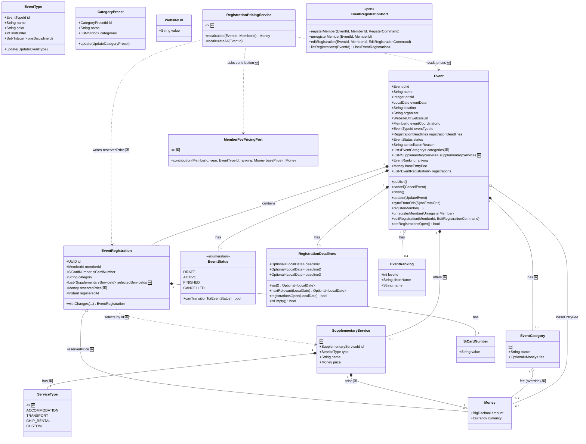
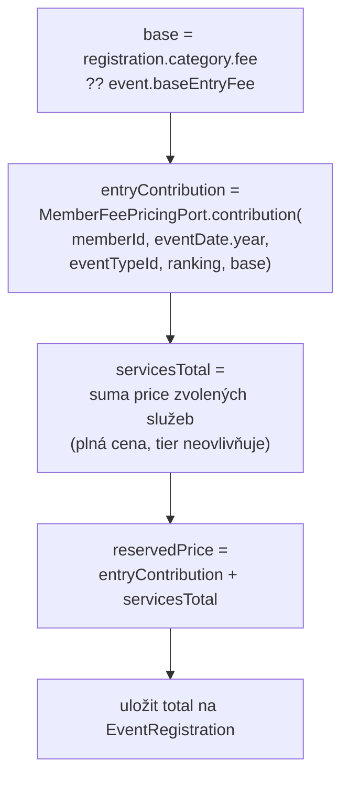

# Events Domain Model

Živý diagram doménového modelu events modulu. Postupně aktualizován při diskuzi o nových features.

> **Legenda novinek:** Prvky označené `🆕` jsou navrhované změny pro cenotvorbu registrací (kategorie s cenou, doplňkové služby, příspěvek dle membership tier). Zatím neimplementováno.

## Class diagram

## Výpočet ceny registrace (reservedPrice)

> **Pozn.:** `reservedPrice` je **informativní** rezervace. Závazná cena se počítá až při vyúčtování eventu (samostatná feature). Smí být lehce zastaralá (viz „kdy se přepočítává").

**Pravidla:**
- `base` cena = cena kategorie (pokud má override), jinak `event.baseEntryFee`.
- Membership tier (z membershipfees, dle roku konání eventu) modifikuje **jen base/kategorii**, ne ceny služeb (budoucí potřeba — zatím ne).
- Skladbu ceny vlastní **events** (kategorie, služby, součet). Membershipfees vystavuje jen úzký port `contribution(...)`, který zná pravidla tier a vrací výslednou částku za vstupné.
- Výpočet dělá **application service** `RegistrationPricingService` (ne agregát — agregát nevolá porty).
- Ukládá se jen **total** `reservedPrice`. Rozpad pro UI se dopočítá on-the-fly.
- Všechny ceny na eventu jsou v **jedné měně** (validace na agregátu).

**Kdy se přepočítává:**
- ✅ registrace člena
- ✅ editace registrace (změna kategorie / služeb)
- ✅ změna cen na eventu (update / sync z ORIS) → přepočet všech registrací eventu v téže transakci
- ❌ změna membership tier člena ve fee kampani (vědomě vynecháno — informativní hodnota smí být zastaralá)

## Doplňkové služby (SupplementaryService)

- Žijí **na eventu** jako `List<SupplementaryService>` (vlastní data eventu, ne globální katalog).
- „Předdefinované" služby (ubytování, doprava, půjčení čipu) = **hardcoded šablona** v kódu; UI z ní předvyplní název, cenu zadá organizátor (liší se per event). Lze nadefinovat i **vlastní** službu (`type = CUSTOM`).
- `ServiceType` enum (`ACCOMMODATION | TRANSPORT | CHIP_RENTAL | CUSTOM`) drží službu kategorizovanou kvůli budoucímu reportingu.
- Výběr služby při registraci je **volitelný** (0..N), **binární** ano/ne (žádné množství — zatím).
- Registrace odkazuje na služby přes **stabilní `SupplementaryServiceId`** (přejmenování služby na eventu nerozbije vazbu).

## Rozhodnutí z grill-me session

| # | Téma | Rozhodnutí |
|---|------|-----------|
| 1 | baseEntryFee vs. cena kategorie | baseEntryFee = default, kategorie ho **override**-ne |
| 2 | Cena na registraci | **Lookup** podle názvu kategorie, ne snapshot (rezervace informativní) |
| 3 | Kde žijí služby | **Na eventu**, „předdefinované" = šablona |
| 4 | Reference registrace → služba | **`SupplementaryServiceId`** (stabilní ID) |
| 5 | Výběr služeb | Volitelný (0..N), binární ano/ne |
| 6 | Měna | **Jedna měna** na celý event |
| 7 | Finance integrace | **Mimo scope** — jen výpočet/uložení ceny v events |
| 8 | reservedPrice | **Ukládá se** (kvůli tier příspěvku) |
| 9 | Membership tier | **Odvozuje se** z členství pro rok, nevolí se při registraci |
| 10 | Co tier modifikuje | **base/kategorie cenu**, ne služby (zatím) |
| 11 | Hranice modulů | membershipfees port `contribution(...)`, events orchestruje výpočet |
| 12 | Kdy přepočet | registrace, editace, změna cen eventu (NE změna tier) |
| 13 | Skladba ceny | Uložit jen **total**, rozpad dopočítat |
| 14 | Předdefinované služby | **Hardcoded** šablona + `ServiceType` enum |
| 15 | Domain events | **Beze změny** teď |

## Plánované features (z openspec/changes a GitHub issues)

| Issue | Název | Dopad na model |
|-------|-------|----------------|
| gh-112 | Supplementary Services | **Pokryto výše** — `SupplementaryService` na eventu |
| gh-83 | Event Deputy Coordinator | Nový field `deputyCoordinatorId: MemberId` na `Event` |
| gh-113 | ORIS Auto-sync | Scheduler, žádná změna doménového modelu |
| gh-87 | Out-of-competition Registration | Nový flag `outOfCompetition: bool` na `EventRegistration` |
| gh-89 | Deadline Reminder Notifications | Doménová událost nebo scheduler, žádná změna agregátu |
| gh-106 | Registration ID Card for Accommodation | Pole `identityCardNumber` na `EventRegistration` nebo separátní entita |
| gh-240 | Member Group Assignment on Registration | Propojení s members modulem při registraci |
| gh-67 | Event Coordinator Contact | Zobrazení kontaktu koordinátora, žádná změna modelu events |
| gh-66 | Event Cancellation Reason (advanced) | Rozšíření `cancellationReason` nebo nová value object |
