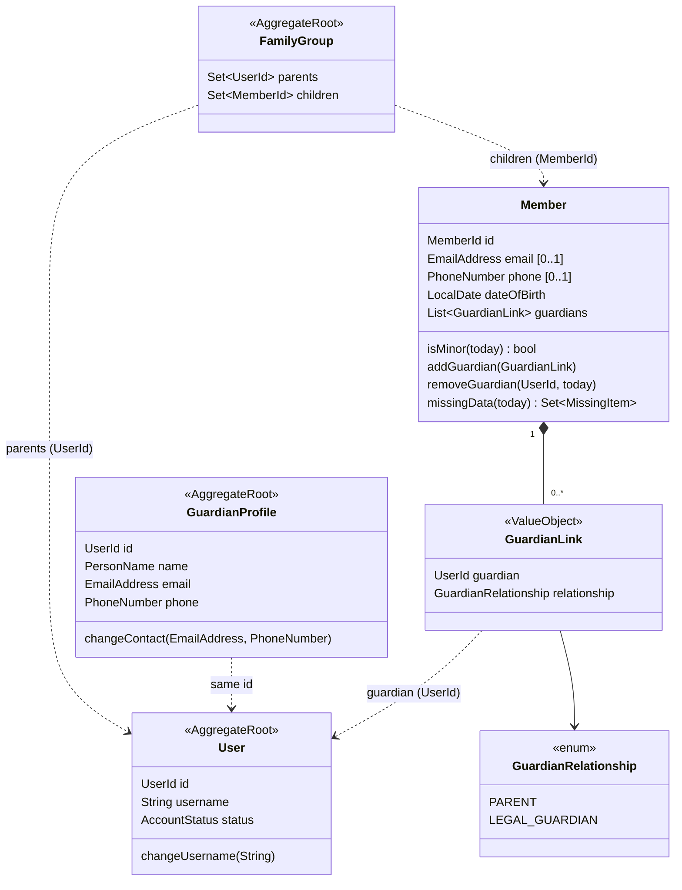
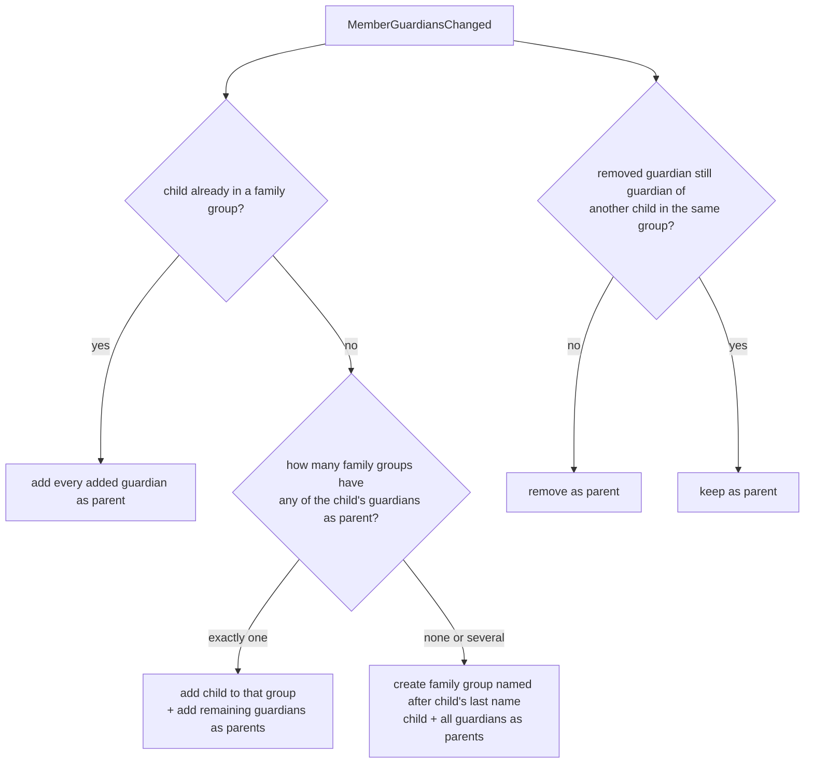

# Design

## Context

See proposal.md — Why. Current state that shapes the approach:

- A minor's guardian is the `GuardianInformation` value object embedded in `Member` (name, relationship, e-mail, phone). It has no identity and no user account. Exactly one guardian is possible.
- Every `User` has a `username`; for members it is the registration number. `KlabisUserDetailsService` loads users by username. `MemberId` and `UserId` share the same UUID value.
- `FamilyGroup` (module `groups`) extends `MemberGroup`; owners ("parents") and memberships are keyed by `MemberId`. A member may be in at most one family group, as parent or child.
- `import-incomplete-members` (implemented, not yet archived) already removed e-mails on registration, added self-service activation (`requestNewToken` checks the e-mail against the member's own or guardian's e-mail via `MemberActivationContactVerifier`), and introduced computed member completeness (`missingData()`, stored `data_incomplete` flag). **It must be archived before this change is archived**, because this change modifies requirements that change adds (`Incomplete Member Data`) or rewrites (`Member Registration Flow`, `Password Setup Token Reissuance`).
- The application has no persistent production data yet (H2 only), so schema changes go straight into the V001 schema without migration.

## Goals / Non-Goals

**Goals:**
- Guardian becomes an identified person with a user account, linked to any number of minors.
- A minor's family group follows the minor's guardians automatically.
- A minor's own account cannot be activated until an admin or guardian starts it.

**Non-Goals:**
- Guardians acting on behalf of the minor outside the member profile (e.g. registering the child to events, paying fees). The guardian relationship introduced here is the foundation for that, but those flows stay unchanged.
- Self-service editing of a non-member guardian's own contact details (admin edits them from the minor's detail). A guardian profile page can come later.
- Automatic removal of guardians when a minor turns 18.
- ORIS: ORIS holds no guardian; import and synchronisation keep not touching guardians.
- Nightly recomputation of the stored `data_incomplete` flag (see Risks).

## Glossary

| Term | Meaning |
|---|---|
| **Guardian** (zákonný zástupce) | A person legally responsible for a minor member. Identified by their `UserId`. Either a *member guardian* or a *non-member guardian*. |
| **Member guardian** | A guardian who is also a club member; name and contacts come from their `Member` profile. |
| **Non-member guardian** | A guardian who is not a club member; name and contacts are held in a `GuardianProfile`. Logs in with their e-mail address. |
| **GuardianProfile** | Aggregate holding the name, e-mail and phone of a non-member guardian. Shares its identity with the guardian's `UserId`. |
| **GuardianLink** | Value object on `Member`: which guardian (`UserId`) and in what `GuardianRelationship` (PARENT, LEGAL_GUARDIAN) to this minor. |
| **Starting an account** ("Založit účet") | Sending an activation link to a minor's own e-mail on explicit request of an admin or guardian. |

## Decisions

### D1 — Domain model: guardian references on `Member`, contacts in `GuardianProfile`

`GuardianInformation` is removed. `Member` holds `List<GuardianLink>`; each link references a guardian by `UserId` and carries the relationship (relationship is per child — the same person can be "parent" of one child and "legal guardian" of another). Contacts of a non-member guardian live in a new `GuardianProfile` aggregate in the `members` module; contacts of a member guardian come from their `Member`.



| Element | Change | Notes |
|---|---|---|
| `GuardianInformation` | **removed** | Replaced by `GuardianLink` + `GuardianProfile`. |
| `GuardianLink` | **added** | Value object; `UserId` + `GuardianRelationship`. Unique per `UserId` within one member; a member cannot link themselves. |
| `GuardianRelationship` | **added** | Enum replacing the free-text `relationship` string. |
| `GuardianProfile` | **added** | Aggregate in `members`; invariant: name, e-mail and phone are all required. Id equals the guardian's `UserId`. |
| `Member.guardians` | **changed** | Was a single optional `GuardianInformation`; now a list. Invariant on registration by hand: minor ⇒ at least one guardian; adult ⇒ no guardians. `removeGuardian` refuses to remove the last guardian of a minor. |
| `Member.missingData` | **changed** | Contact items check the member's own e-mail/phone for adults only. For minors the only guardian-related item is "no guardian". Because every guardian must have e-mail and phone when linked, a minor with a guardian always satisfies the contact rule and `Member` needs no cross-aggregate lookup. |
| `User.username` | **changed** | For non-member guardians the username is the e-mail address; new `changeUsername` used when an admin changes a guardian's e-mail. |
| `FamilyGroup` parents | **changed** | Keyed by `UserId` instead of `MemberId` (see D4). |

*Alternatives considered:*
- *Keep guardian contacts as value objects copied onto each child* — rejected: two children of the same guardian would diverge on the first edit, and there would be nothing to hang the user account on.
- *Create a `Member` for every guardian* — rejected: guardians would appear in the member list, get registration numbers, finance accounts and fee obligations.

### D2 — Non-member guardians log in with e-mail as username

The non-member guardian's `User.username` is their e-mail address (lower-cased, trimmed). Registration numbers never contain `@`, so the two namespaces never collide and `KlabisUserDetailsService` needs no change. Membership detection already treats usernames that are not in registration-number format as non-members without a repository lookup.

Guardian matching: when an admin enters a new non-member guardian, the application service looks up an existing `GuardianProfile` by e-mail; if found, it links it (and ignores the entered name/phone — the form shows the existing guardian's data). When an admin picks an existing member, the guardian is that member's `UserId`.

A member guardian is always referenced by the member's `UserId`; if a non-member guardian later becomes a member, merging the two accounts is out of scope (Open Questions).

*Alternative considered:* generated login names — rejected by product decision; guardians remember their e-mail.

### D3 — Minor's account is created but only started explicitly

A `User` is still created for every member (unchanged), in PENDING_ACTIVATION. The `MemberActivationContactVerifier` port (from `import-incomplete-members`) changes so that:
- for a member who is a minor today, no e-mail matches (self-service never starts a minor's account);
- for an adult, only the member's own e-mail matches (guardian e-mails no longer match).

Non-member guardian activation: `requestNewToken` accepts an e-mail-only request. When the identifier contains `@`, the service looks up the user by username = e-mail and, if pending, sends the link to that address. Rate limiting keys on the identifier.

"Založit účet" is a new member-scoped action (`startMemberAccount`) available when the member's user is pending activation and the member has an own e-mail. It issues a password setup token through the existing `PasswordSetupService` and sends it to the member's own e-mail. It is authorised for MEMBERS:UPDATE holders and guardians of the member (D6), and it respects the same rate limit.

### D4 — Family group parents are referenced by `UserId`

`FamilyGroup` stores parents as `UserId` and children as `MemberId`. `MemberGroup` is kept for training and free groups; `FamilyGroup` gets its own participant sets (or `MemberGroup` is generalised over the owner id type — decided during implementation, both keep behaviour identical). Because `MemberId` and `UserId` share the UUID, existing member parents map one-to-one.

Exclusivity changes: the "at most one family group" check applies to children only. The "parent and child roles are exclusive within one family group" rule stays.

The family group detail resolves parent names through a members-module primary port that returns a display name for a `UserId` (member → member name; non-member guardian → `GuardianProfile` name).

*Alternative considered:* keep `MemberId` for parents and give non-member guardians a fake `MemberId` — rejected: the type would lie and member-only features (profile link, fees) would resolve to nothing.

### D5 — Family group follows guardians through domain events

`members` publishes `MemberGuardiansChanged(memberId, addedGuardians, removedGuardians)` — also on registration of a minor (added = all guardians). A listener in `groups` applies:



Removing a guardian never removes the last parent of a family group — the members-side rule (minor keeps at least one guardian) guarantees another guardian remains; for an adult child whose last guardian is removed, the parent is kept and the admin resolves it manually (existing "last parent" rule).

Manually adding a parent on the family group page does **not** create a guardian relationship; family group parents are a superset of the children's guardians.

The listener runs after commit in the same way as other cross-module listeners (Spring Modulith `@ApplicationModuleListener`), querying `members` through a primary port for "guardians of the other children" (ADR-001).

### D6 — Authorisation: guardian of the member

A new authorisation predicate "caller is a guardian of the member" is added next to the existing ownership check (`@OwnerVisible`). It grants on the minor's detail and edit the same rights as the minor has on their own profile, plus the guardian management and "Založit účet" actions. Non-member guardians have no authorities; they reach the member detail only through this predicate. Navigation for non-members already hides member-only items (`is_member: false`).

### D7 — Minor vs. adult is decided by the backend using `Clock`

The frontend computes the age from the entered date of birth only to switch sections; the backend decides with the injected `Clock` at the time of the request. The registration request is rejected when an adult carries guardians or a minor has none.

## API

All changes are spec-first in `docs/openapi/spec/` (see the `klabis-api-spec` skill for `x-klabis-*` / `x-hal-*` extensions).

### Member registration — `POST /api/members` (`registerMember`)

`guardian: GuardianDTO` is replaced by `guardians: GuardianInput[]`.

```yaml
GuardianInput:            # exactly one of memberId / newGuardian
  relationship: PARENT | LEGAL_GUARDIAN      # required
  memberId: uuid                              # existing member as guardian
  newGuardian:                                # non-member guardian
    firstName: string
    lastName: string
    email: string
    phone: string
```

Validation errors (422): minor without guardians, adult with guardians, guardian without e-mail/phone, duplicate guardian, self as guardian.

### Member detail — `GET /api/members/{id}` (`getMember`)

`guardian` is replaced by:

```yaml
guardians:
  - id: uuid                 # guardian's UserId
    firstName, lastName, email, phone: string
    relationship: PARENT | LEGAL_GUARDIAN
    _links:
      member: { href: /api/members/{memberId} }   # only for member guardians
```

New HAL links / templates on the member detail:

| Name | Kind | Operation | Present when |
|---|---|---|---|
| `addGuardian` | template | `addMemberGuardian` | caller has MEMBERS:UPDATE or is a guardian |
| `removeGuardian` | template (per guardian, on the embedded guardian item) | `removeMemberGuardian` | same, and removal would not leave a minor without a guardian |
| `startAccount` | template | `startMemberAccount` | member's account is pending, member has own e-mail, caller has MEMBERS:UPDATE or is a guardian |

`updateMember` (PATCH) no longer accepts `guardian`. The missing-data enum keeps its values; `EMAIL`/`PHONE` now mean "adult without own e-mail/phone" and `GUARDIAN` means "minor without any guardian".

### New endpoints

| Method & path | operationId | Body | Result |
|---|---|---|---|
| `POST /api/members/{id}/guardians` | `addMemberGuardian` | `GuardianInput` | 204, `Location` of member |
| `DELETE /api/members/{id}/guardians/{guardianId}` | `removeMemberGuardian` | — | 204 |
| `PATCH /api/guardians/{guardianId}` | `updateGuardianProfile` | `{ firstName?, lastName?, email?, phone? }` (MEMBERS:UPDATE only; non-member guardians only) | 204 |
| `POST /api/members/{id}/account-start` | `startMemberAccount` | — | 204 |

### Password setup request — `POST /api/auth/password-setup/request`

`TokenRequestRequest.registrationNumber` is generalised to `loginName` (registration number or guardian e-mail); `email` stays required for member requests and is ignored/optional when `loginName` is an e-mail address.

### Family groups — `GET /api/family-groups/{id}`

Parent items carry `id` (UserId), `firstName`, `lastName`; the `member` link is present only for member parents. `POST /api/family-groups/{id}/parents` and `DELETE …/parents/{memberId}` keep accepting member ids (manual parent management stays member-only); the path variable is renamed to `{parentId}` to also allow removing a non-member parent.

## Risks / Trade-offs

- **[Stored `data_incomplete` goes stale when a minor turns 18 without own contacts]** → Same trade-off already accepted by `import-incomplete-members` D3, now in the opposite direction (the filter under-reports). Detail page and badge are computed and correct; saving the member refreshes the flag. A nightly recompute can be added with the Quartz scheduler change.
- **[Member guardian later loses own e-mail/phone]** → Only possible through ORIS sync for incomplete adults; the guardian then shows empty contacts. Accepted; the admin sees the guardian member as incomplete.
- **[E-mail as username enables account enumeration on the login page]** → Login errors are already generic; activation request response stays uniform (D3).
- **[FamilyGroup id-type refactor touches shared `MemberGroup`]** → Keep training/free group behaviour covered by existing tests; do the refactor as its own phase before behaviour changes.
- **[Automatic family group creation surprises admins]** → Groups are named after the child's last name and can be renamed/deleted by MEMBERS:MANAGE as today.

## Migration Plan

No data migration — no persistent production data exists. Schema changes are made in the V001 schema. Rollout order: archive `import-incomplete-members` → implement this change → archive.

## Open Questions

- A non-member guardian who later becomes a club member ends up with two user accounts (e-mail login and registration-number login). Merging them can be designed later without changing this proposal's behaviour.
