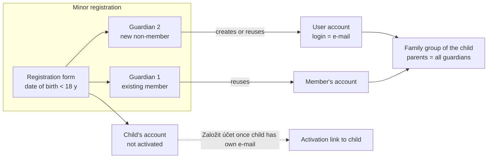

# Proposal

Covers GitHub issues #332, #333 and #334.

## Why

Registering a minor today treats the legal guardian as a single set of contact details stored on the child's profile. The guardian cannot log in, only one guardian can be recorded, and the registration form does not tell adults and minors apart. In practice a child has one or two guardians, the guardians are the ones who act for the child in the club, and the child should not receive login credentials until someone deliberately gives them.

This change builds on the archived `import-incomplete-members` change (no welcome e-mail on registration, self-service activation, incomplete member data).

## What Changes

- **Minor vs. adult registration form (#332).** Whether a member is a minor is worked out from the date of birth. For a minor the form asks for at least one legal guardian and does not ask for the minor's own contact details or bank account. For an adult the guardian section is hidden and the member's own e-mail and phone are required.
- **Multiple guardians (#334).** A minor may have any number of legal guardians (typically one or two). Every guardian must have an e-mail and a phone. The contact requirement is satisfied by any guardian.
- **Guardian is a person with a user account (#333, #334).** A guardian is either an existing club member picked from the member list, or a new non-member guardian entered with name, e-mail and phone. A non-member guardian gets a user account that logs in with the guardian's e-mail address. Entering the e-mail of an existing guardian (for example for a sibling) reuses that guardian's account instead of creating a second one.
- **Guardians become parents in the child's family group.** Each guardian becomes a parent of the child's family group. A family group is created automatically when the child has none. Family group parents may be non-member guardians, and one guardian may be a parent in several family groups (e.g. separated parents). A child still belongs to at most one family group.
- **Minor's own account stays closed (#333).** The minor's user account is still created, but it is not activated and cannot be activated with a guardian's e-mail. Once the minor has an e-mail of their own, an admin or a guardian can start it with a manual "Založit účet" action, which sends an activation link to the minor's e-mail.
- **Guardian account activation** is self-service only: a guardian requests an activation link from the login page by entering their e-mail address. No e-mail is sent automatically on registration.
- **Notifications** addressed to a minor's guardian are sent to all guardians.
- **Managing guardians after registration.** Admins (MEMBERS:UPDATE) and any existing guardian of the minor can add or remove guardians. The last guardian of a minor cannot be removed.
- **Turning 18.** Guardians remain linked until an admin removes them. A member who is an adult without an e-mail and phone of their own is shown as incomplete (existing incomplete-data mechanism) until their own contacts are filled in.
- **BREAKING (data model):** the single embedded guardian on a member is replaced by a list of guardian references. No data migration is needed — the application has no persistent production data yet.

## Capabilities

### New Capabilities

- `guardians`: legal guardians of minor members — who can be a guardian, the guardian's user account and login, guardian account activation, managing the list of a minor's guardians, notifications addressed to guardians (sent to all of them) and the minor's own account start ("Založit účet").

### Modified Capabilities

- `members`: registration form distinguishes minors and adults; contact information requirement counts contacts of any guardian; member detail and edit show a list of guardians instead of a single guardian contact; incomplete-data rules account for adults without own contacts.
- `user-groups`: family group parents may be non-member guardians; a guardian may be a parent in more than one family group; family groups are created and parents added automatically from a minor's guardians.
- `users`: a non-member guardian's account logs in with an e-mail address; activation requests for a minor's account match only the minor's own e-mail; guardians request activation with their e-mail.

## Impact

- **Backend `members`:** `GuardianInformation` value object replaced by a list of guardian references (member id or guardian account id); registration and update commands, `MemberMemento`, completeness rules, `MemberActivationContactVerifier` and the ORIS projection (ORIS holds no guardian) change. New guardian management use cases and "Založit účet" action.
- **Backend `common.users`:** user accounts without a member profile (non-member guardians) with e-mail as username; login lookup by e-mail for such accounts; activation request by e-mail.
- **Backend `groups`:** `FamilyGroup` parents keyed by user id instead of member id; relaxed exclusivity for parents; listener creating/updating the child's family group when guardians change.
- **API (spec-first, `docs/openapi/spec/`):** registration and member PATCH requests carry a list of guardians; member detail returns guardians; new guardian add/remove and "Založit účet" affordances; family group parent representation for non-member parents.
- **Frontend:** registration form switches sections by date of birth; guardian picker (existing member or new person) with repeatable entries; guardians section on member detail and edit; "Založit účet" button; activation request page accepts e-mail for guardians; login page hint that guardians log in with e-mail.
- **Database:** new tables for member guardians and guardian profiles in the V001 schema (no migration needed).
