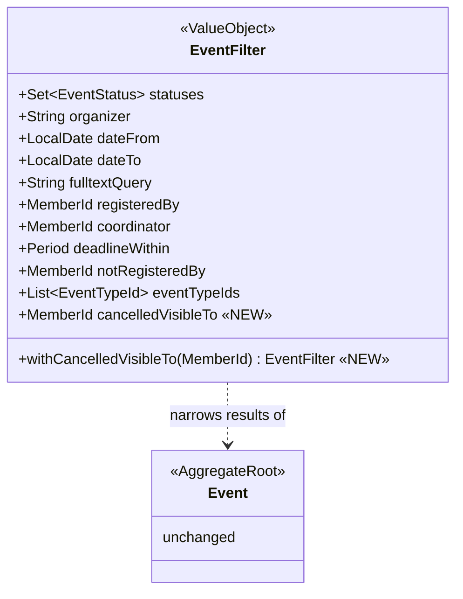

# Design — Event cancellation visibility & marking (gh-66, parts A+B)

## Context

Cancelling an event with an optional reason (max 500 chars) is already implemented end-to-end: `Event.cancel(CancelEvent)` stores `cancellationReason`, `events.cancellation_reason` persists it, `EventDto`/`EventSummaryDto` expose it, and the detail page shows it in a bottom "AKCE BYLA ZRUŠENA" banner.

What is missing (and what this change delivers):

- **Visibility.** `EventManagementService.listEvents` hides only DRAFT from non-managers; CANCELLED events are returned to everybody. There is no notion of "registered members still see their cancelled events".
- **Marking.** The list shows the reason as a tooltip on the status cell — but `status` is gated to `EVENTS:MANAGE` in `EventSummaryDto` (`x-klabis-authority`), so a regular member sees a cancelled row that looks completely normal. The detail shows the reason in a bottom banner instead of next to the name, and the name is not struck through.

Decisions already locked in the proposal: detail access stays open for every authenticated user; the list signal is the struck-through name; strikethrough applies to the name only.

## Goals / Non-Goals

**Goals:**
- CANCELLED events appear in the list only for `EVENTS:MANAGE` holders and for members registered for the event.
- Struck-through event name in the list for cancelled rows (for every viewer who can see the row).
- Detail page: struck-through name, prominent "Zrušeno" badge (already exists), reason directly under the name.
- Remove the list tooltip and the bottom detail banner (superseded).
- Drop `cancellationReason` from `EventSummaryDto` once the tooltip is gone — the reason is a detail-page signal, and leaving it on every list row would keep shipping a field no consumer can act on.
- Ungate `status` on `EventSummaryDto` (review decision) so every viewer can tell a cancelled row apart. Visibility of the status *column* is unchanged — still `EVENTS:MANAGE` only — but the frontend must now gate it explicitly (D5).

**Non-Goals:**
- No change to cancel command, reason capture, persistence, or the 500-char limit (all done).
- No change to detail-page access rules (DRAFT stays blocked for non-managers; CANCELLED stays open).
- No e-mail notifications, no post-cancellation reason editing, no calendar changes.
- No new derived API fields (a `cancelled` boolean was drafted and dropped in review — see D4).
- No change to status-column visibility in the list (still manager-only).

## Glossary

| Term | Meaning |
|---|---|
| **viewer** | The authenticated caller of the events list: a manager (`EVENTS:MANAGE`), a member (has a `MemberId`), or a user without a member profile. |
| **cancelled visibility** | The rule deciding whether a CANCELLED event is part of a viewer's list result: managers → all; members → only those they are registered for; users without a member profile → none. |
| **struck name** | Event name rendered with a strikethrough; the sole cancellation marker in the list. |

## Decisions

### D1: Visibility policy lives in `EventManagementService.listEvents`, driven by the viewer

The DRAFT-hiding policy already lives in the service, so the cancelled rule joins it there — one place, applied regardless of which status filter the caller requested. The port gains the viewer's member id:

```java
Page<Event> listEvents(EventFilter filter, Pageable pageable,
                       boolean canManageEvents, MemberId viewerMemberId); // viewerMemberId nullable, ignored for managers
```

Service policy for `!canManageEvents`:

```java
if (filter.requestsOnlyStatus(DRAFT))      return Page.empty(pageable);   // existing guard
filter = filter.withExcludedStatus(DRAFT);                                 // existing rule
if (viewerMemberId == null) {
    if (filter.requestsOnlyStatus(CANCELLED)) return Page.empty(pageable); // new guard, see below
    filter = filter.withExcludedStatus(CANCELLED);
} else {
    filter = filter.withCancelledVisibleTo(viewerMemberId);                // new dimension (D2)
}
```

The `requestsOnlyStatus(CANCELLED)` guard is required because `withExcludedStatus` on a single-status filter collapses to an *empty* status set, which means "no restriction" — a viewer without a member profile filtering by CANCELLED would otherwise see **all** events. (Same trap the existing DRAFT guard handles.) With `cancelledVisibleTo` set, no collapse happens: the status set is untouched and the registration condition (D3) narrows it, correctly yielding "only their own cancelled events" — and an empty page for a member registered for none.

`EventController.listEvents` already has both inputs: `EventAffordanceSupport.hasAuthority(auth, EVENTS_MANAGE)` and `CurrentUserData` (`isMember()` / `memberId()`).

**Alternative considered:** applying the rule in the controller via `EventFilter` composition — rejected: splits the visibility policy across two layers (DRAFT rule is in the service).

### D2: `EventFilter` gains one dimension — `cancelledVisibleTo: MemberId` (nullable)

Semantics: *events with status CANCELLED match only if this member is registered for them*. Null (default) = no restriction, i.e. every existing `EventFilter` consumer (auto-finish, bulk sync, ORIS import checks, tests) keeps today's behaviour untouched. "Cancelled hidden completely" needs no new dimension — the existing `withExcludedStatus(CANCELLED)` expresses it.

**Alternative considered:** a sealed `CancelledVisibility { All, Hidden, RegisteredBy(MemberId) }` value object — more explicit, but two of its three cases are already expressible (`All` = null dimension, `Hidden` = `withExcludedStatus`); KISS wins.

### D3: Repository — OR-condition via pre-fetched cancelled-and-registered ids

`EventRepositoryAdapter` already pre-fetches id sets for constraints Criteria cannot express (fulltext, registeredBy, deadlineWithin, …) and ANDs them. The new condition is a **disjunction** — `(status ≠ CANCELLED) OR (id ∈ cancelledRegisteredIds)` — so it cannot join the intersection; it becomes its own Criteria condition:

```java
// when filter.cancelledVisibleTo() != null && !filter.excludesStatus(CANCELLED)
List<UUID> cancelledRegisteredIds = findIdsByCancelledAndRegistered(filter.cancelledVisibleTo());
// SQL: SELECT id FROM events.events e WHERE e.status = 'CANCELLED'
//        AND EXISTS (SELECT 1 FROM events.event_registrations er
//                    WHERE er.event_id = e.id AND er.member_id = :memberId)

Criteria visibility = ids.isEmpty()
        ? Criteria.where("status").isNot("CANCELLED")
        : Criteria.where("status").isNot("CANCELLED").or(Criteria.where("id").in(ids));
```

The empty-list branch avoids generating `id IN ()` (invalid SQL). The pre-fetch is skipped entirely when the filter already excludes CANCELLED (e.g. explicit `status=ACTIVE`), so the common case pays nothing. The set is tiny in practice — a member's cancelled registrations.

Pagination/counting keep working because the condition is part of the same Criteria query (`buildCriteriaQuery` / `findAllWithMatchingIds`), which `executeQuery` reuses for the count.

**Alternative considered:** raw SQL for the whole list query — rejected: the adapter's Criteria+pre-fetch pattern already covers every other dimension; rewriting the query is invasive and loses the shared count logic.

### D4: API — ungated `status` on `EventSummaryDto` (no derived duplicate)

**Review decision** (replaces an earlier draft that added a derived `cancelled: boolean`): do not introduce a status-derived duplicate field — remove `x-klabis-authority: EVENTS_MANAGE` from `EventSummaryDto.status` instead. Event status is not a secret: users already know it from other displayed information (open/closed registration, past/upcoming time windows, and — after this change — the struck-through name). Showing it directly uncovers nothing new.

```yaml
EventSummaryDto:
  properties:
    # …
    status:
      allOf:
        - $ref: '#/components/schemas/EventStatus'
      # x-klabis-authority: EVENTS_MANAGE   ← REMOVED
      x-klabis-halforms-access: READ_ONLY
```

Consequences:

- Every viewer of a row can tell a cancelled row apart — the frontend keys off `status === 'CANCELLED'` uniformly, for managers and registered members alike. No converter/mapper change: `status` is already mapped; the regenerated DTO simply loses `@HasAuthority`.
- The status **column** keeps its manager-only visibility, but the mechanism behind it changes. Today `EventsPage` hides it implicitly: `HalEmbeddedTable hideEmptyColumns` drops any column whose field is absent from the payload, and field-level security omits `status` for non-managers. With the field ungated, that implicit hiding stops working — the column would leak to every viewer unless the frontend gates it explicitly (D5).
- Nothing about DRAFT leaks: non-managers never receive DRAFT rows at all (existing rule, unchanged), so the ungated field can never show them a DRAFT status. And under D1 a non-manager receives a CANCELLED row only when registered for it.

**Alternatives considered:**
- *Derived ungated `cancelled: boolean`* — rejected in review: duplicates status-derived state on the wire, in the spec, and in a converter mapping, for zero information gain.
- *Keeping `status` gated* — rejected: a registered member without `EVENTS:MANAGE` would have no summary signal to render the strikethrough (`cancellationReason` cannot serve — the reason is optional and may be null).

`EventDto` (detail) already has an ungated `status` — nothing changes there.

### D5: Frontend list — strike the name cell, drop the status tooltip, gate the status column explicitly

`EventsPage.tsx`:
- The `name` column gains a `dataRender`: when `item.status === 'CANCELLED'`, render `<span className="line-through …">{name}</span>`; otherwise the plain value. Sorting stays on the column.
- The status-cell tooltip (`title={event.cancellationReason}`, lines ~329–331) is removed — per the delta spec, the reason is no longer surfaced in the list at all; the struck name is the marker.
- The status `TableCell` becomes explicitly `hidden` for non-managers. Today the column is hidden implicitly by `hideEmptyColumns` + field-level security; D4 removes that mechanism, so the gate has to move into the page.

What signal identifies a manager on the list? The collection's own HAL affordances: `createEvent` is added by `EventListPostprocessor` unconditionally, but `HalFormsSupport.isMethodAuthorized` filters the template because `EventsApi.createEvent` carries `@HasAuthority(EVENTS_MANAGE)` (`x-klabis-authority` in `events.yaml`). So `_templates.createEvent` is present exactly for `EVENTS:MANAGE` holders — the same signal that already gates the "Registrovat akci" button, and consistent with the project rule that the frontend renders from HAL metadata.

```tsx
const canManageEvents = Boolean(resourceData?._templates?.createEvent);
…
<TableCell sortable column="status" hidden={!canManageEvents} dataRender={…}>
```

**Alternative considered:** `useIsAdmin()` (presence of the root `admin` link) — rejected: that is System Admin, strictly narrower than `EVENTS:MANAGE`, so a coordinator with manage rights but no system-admin role would lose the column.

### D5a: The struck name carries an accessible, reason-free state label

`line-through` is a purely visual convention, and a non-manager sees no status column — so after D4 the struck name would be the *only* cancellation signal on such a row, and screen-reader users would get none. The struck name therefore repeats the state as visually hidden text:

```tsx
<span className="line-through opacity-60">
    {name}
    <span className="sr-only"> — {getEnumLabel('eventStatus', 'CANCELLED')}</span>
</span>
```

Only the state, never the reason: the reason is a detail-page signal per D5, so a `title`/label carrying it would reintroduce exactly the leak D5 closes. The pattern matches existing `sr-only` usage in the repo (`Spinner.tsx:35`).

**Alternative considered:** `aria-label` on the cell — rejected: it replaces the cell's accessible name rather than extending it, so the name itself would no longer be announced as text.

### D6: Frontend detail — struck name + reason under the name, banner removed

`EventDetailPage.tsx`:
- `<h1>` gains `line-through` when `event.status === 'CANCELLED'`.
- The reason renders directly under the name in the header block (error-coloured text), when present.
- The "Zrušeno" badge already exists and is prominent enough: `STATUS_VARIANT.CANCELLED = 'error'` + enum label — unchanged.
- The bottom "AKCE BYLA ZRUŠENA" `Card` (lines ~378–388) is deleted, together with the now-unused `sections.eventCancelled` label and its test expectations.

### D7: Detail access unchanged (explicit no-op)

`getEvent(eventId, canManageEvents)` keeps blocking only DRAFT for non-managers. The new spec scenario "Any authenticated user can open a cancelled event detail" documents existing behaviour; it is covered by a test, not by a code change.

## Domain model changes

The `Event` aggregate is untouched. The only domain change is the query value object:



| Element | Change | Notes |
|---|---|---|
| `EventFilter.cancelledVisibleTo` | **added** | nullable `MemberId`; null = no restriction |
| `EventFilter.withCancelledVisibleTo(MemberId)` | **added** | copy-factory, same style as the other `with*` methods; every existing `with*`/factory passes the new component through as null |
| `EventManagementPort.listEvents` | **changed** | gains `MemberId viewerMemberId` parameter (D1) |
| `Event`, `EventStatus`, `CancelEvent`, registrations | unchanged | |

## API Changes

No new endpoints, parameters, response fields, HAL links, or HAL+FORMS affordances. One field-security change and one behavioural change:

| Item | Change |
|---|---|
| `GET /api/events` response — `EventSummaryDto.status` | **field-security change** — `x-klabis-authority: EVENTS_MANAGE` removed, so status is returned to every authenticated caller. No new response fields. The status column in the UI stays manager-only (frontend gate, D5) |
| `GET /api/events` response — `EventSummaryDto.cancellationReason` | **field removed** — D5 removes the list tooltip, so nothing reads the reason from a summary row. It stays on `EventDto`, where the detail page shows it under the name (D6). Dropping it keeps the list payload free of a field no consumer can act on, and it is the one place a cancelled row's reason could otherwise leak to any viewer |
| `GET /api/events` result set | **behavioural** — for callers without `EVENTS:MANAGE`: CANCELLED events excluded unless the caller's member has a registration for the event (callers without a member profile never see them) |
| `GET /api/events/{id}` | unchanged (access and payload) |
| `POST /api/events/{id}/cancel` | unchanged |

Spec-first order: edit `docs/openapi/spec/events.yaml` → `./gradlew openapiBundle` (from `backend/`) → `npm run openapi` (from `frontend/`) → implement against the regenerated `EventsApi`/DTOs and `klabisApi.d.ts`.

## Risks / Trade-offs

- **The frontend's implicit column hiding stops working.** Today the status column disappears for non-managers only because the API omits `status` and `hideEmptyColumns` drops empty columns. Ungating the field silently turns that into "column visible to everyone" unless the D5 gate ships with it. Backend and frontend must land together; on :8443 the published bundle is refreshed via `publish-frontend-resources` + backend restart, so a mismatch would show regular members the status column in the interim.
- **Extra SQL pre-fetch per list request** for member viewers (`findIdsByCancelledAndRegistered`). One indexed EXISTS query over the member's registrations, skipped when the filter excludes CANCELLED anyway; negligible next to the existing fulltext/registeredBy pre-fetches.
- **Two-page window for the old frontend.** The published bundle on :8443 lags until `publish-frontend-resources` runs; the change is payload-compatible, so the old UI keeps working (no strikethrough, cancelled rows simply stop appearing for non-registered users — which is the intended behaviour anyway).
- **`withExcludedStatus` empty-set collapse** (D1 guard) is subtle; the tasks must cover the "no member profile + status=CANCELLED filter" case with a test, or the guard will be lost in a future refactor.

## Migration Plan

No data migration: no schema change (`cancellation_reason` already exists; no new columns or fields). H2 in-memory anyway.

Rollout is a single vertical change: backend (filter + service + spec regeneration) and frontend (list + detail) ship together; no feature flag needed — the visibility rule is strictly narrowing, and the field ungating only adds data to payloads.

## Open Questions

None — all proposal questions are resolved (detail stays open; struck name is the list signal; name-only strikethrough).
