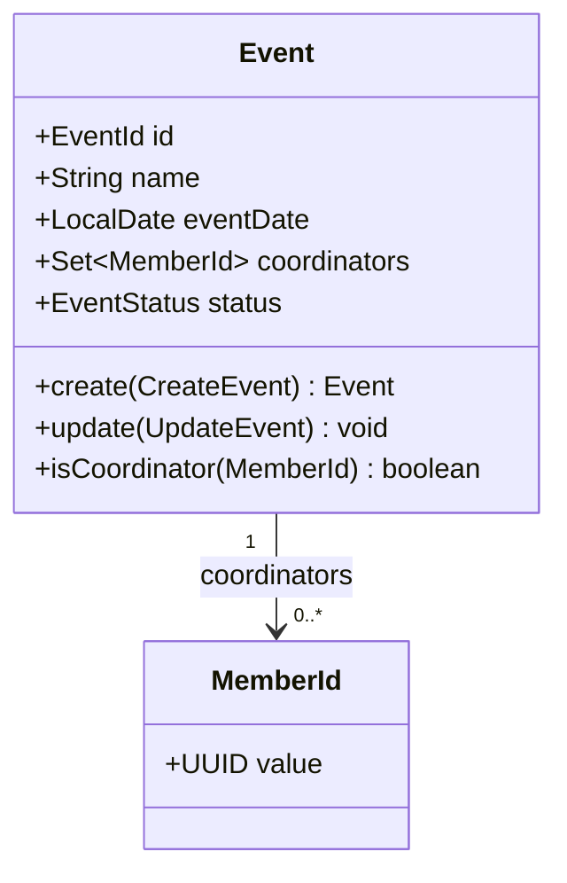

# Design: Event Coordinator Collection

## Context

Currently the `Event` aggregate holds a single `eventCoordinatorId: MemberId?` field. All coordinator authority checks (edit access, accommodation list, registration visibility) compare this single field against the acting user's member ID. The field is persisted as a nullable FK column `event_coordinator_id` in `events.events`.

This change replaces the single field with a collection of coordinators. All members in the collection share identical authority over the event — there is no "primary" vs. "deputy" distinction in the domain.

## Goals / Non-Goals

**Goals:**
- Replace `eventCoordinatorId: MemberId?` with `coordinators: Set<MemberId>` on the `Event` aggregate
- All coordinators have the same implicit edit authority as the current single coordinator
- New join table `event_coordinators(event_id, member_id)` replaces the `event_coordinator_id` column
- API field `eventCoordinatorId` replaced by `coordinators: MemberId[]` (breaking change, no external consumers)
- Each coordinator exposed as its own HAL link under a shared `coordinator` rel (serialized as an array)
- Coordinator filter in `List Events` matches any position in the collection
- ORIS initial import: coordinators left empty; ORIS sync: coordinators left unchanged
- List table: first coordinator name + "+N" badge; detail page: full list

**Non-Goals:**
- Contact information for coordinators (addressed by gh-67)
- Role differentiation within the coordinator collection (e.g. "primary" vs. "deputy" labels)
- Limiting the maximum number of coordinators

## Domain Model



| Element | Change |
|---|---|
| `eventCoordinatorId: MemberId?` | **Removed** |
| `coordinators: Set<MemberId>` | **Added** — ordered set (insertion order preserved for stable list display) |
| `isCoordinator(MemberId): boolean` | **Added** — convenience predicate used in authority checks |

## Decisions

### 1. `LinkedHashSet` as the collection type

Insertion order is preserved so the "first coordinator" shown in the list table is deterministic (the one added first). A plain `Set` would give non-deterministic ordering. A `List` would allow duplicates — rejected by spec.

Alternative considered: ordered by member name — rejected as overly complex and fragile (name changes would silently reorder coordinators).

### 2. Duplicate rejection in the domain, not only in the UI

The `CreateEvent` and `UpdateEvent` commands validate that the provided coordinator IDs form a set with no duplicates. If the caller submits duplicates the command is rejected with a domain error before any persistence. This keeps the invariant in the aggregate, not only in the form.

### 3. Join table `event_coordinators` with position column

```sql
CREATE TABLE events.event_coordinators (
    event_id   UUID NOT NULL REFERENCES events.events(id) ON DELETE CASCADE,
    member_id  UUID NOT NULL REFERENCES members.members(id) ON DELETE CASCADE,
    position   SMALLINT NOT NULL,
    PRIMARY KEY (event_id, member_id)
);
```

`position` preserves insertion order (used for "first coordinator" display) without relying on database row order. The `PRIMARY KEY (event_id, member_id)` constraint enforces uniqueness at the DB level as a safety net.

Alternative considered: store as comma-separated UUIDs in the `events` table — rejected (not queryable for the coordinator filter).

### 4. Authority check: `event.isCoordinator(actingMemberId)`

All existing coordinator authority checks in `EventAffordanceSupport.isCoordinatorOrHasRegistrationsAuthority()` and the controller are updated to call `event.isCoordinator(actingMemberId)` instead of comparing a single field. The method encapsulates the `coordinators.contains(memberId)` logic inside the aggregate.

Edit endpoint (`PATCH /api/events/{id}`) currently requires `EVENTS:MANAGE`. It is updated to also allow access when `event.isCoordinator(actingMemberId)` is true. The authorization check moves from the `@HasAuthority` annotation to an in-method guard (same pattern as the accommodation list endpoint).

### 5. ORIS commands leave coordinators unchanged

`CreateEventFromOris` initializes `coordinators` as an empty set. `SyncFromOris` does not include coordinators in its payload — the field is not overwritten on sync. This is consistent with coordinators being a Klabis-internal concept.

### 6. API field rename: `eventCoordinatorId` → `coordinators`

`EventDto` replaces `MemberId eventCoordinatorId` with `List<MemberId> coordinators`. This is a breaking API change. There are no known external consumers (ORIS integration is outbound-only; the frontend is internal).

`RegistrationSummaryDto` uses `@OwnerId` pointing to the coordinator for field-level security. This annotation must be updated to support a collection — see Risks section.

## API Changes

### `POST /api/events` — Create Event

**Request body changes:**

| Field | Before | After |
|---|---|---|
| `eventCoordinatorId` | `MemberId \| null` | removed |
| `coordinators` | — | `MemberId[]` (optional, may be empty) |

### `PATCH /api/events/{id}` — Update Event

**Authorization change:** previously required `EVENTS:MANAGE`. Now also permitted when the acting user is a coordinator of the event (resolved server-side; no change to the request format).

**Request body changes:** same as Create Event above.

### `GET /api/events/{id}` — Event Detail

**Response body changes:**

| Field | Before | After |
|---|---|---|
| `eventCoordinatorId` | `MemberId \| null` | removed |
| `coordinators` | — | `MemberId[]` |
| `_links.coordinator` | single link object | array of link objects under the same `coordinator` rel (see HAL link handling below) |

### `GET /api/events` — List Events

**Filter parameter change:**

| Parameter | Before | After |
|---|---|---|
| `coordinatorId` | matches single coordinator field | matches any member in coordinators collection |

**Response:** each event summary includes `coordinators: MemberId[]` (replaces `eventCoordinatorId`).

### HAL link handling for coordinators

HAL natively supports multiple links sharing one relation: when more than one link is registered under the same `rel`, the value of that `rel` is serialized as an array of link objects (per the HAL spec). Spring HATEOAS produces this automatically — adding several links with the same rel via `model.add(Link.of(memberHref).withRel("coordinator"))` for each coordinator yields:

```json
{
  "coordinators": ["<memberId-1>", "<memberId-2>"],
  "_links": {
    "coordinator": [
      { "href": "/api/members/<memberId-1>", "name": "<memberId-1>" },
      { "href": "/api/members/<memberId-2>", "name": "<memberId-2>" }
    ]
  }
}
```

Decision: keep a single `coordinator` rel and add one link per coordinator (HAL serializes them as an array). The `name` property on each link disambiguates which member it points to, so the frontend can correlate each link with the corresponding `coordinators[]` entry. This is preferred over inventing indexed rels (`coordinator-0`, `coordinator-1`) which are non-idiomatic and harder to consume generically.

When exactly one coordinator is present, Spring renders it as a single object by default. To keep the frontend handling uniform, the `coordinator` rel SHALL be configured to always render as an array (via `HalConfiguration` array-rendering for that rel pattern), so consumers always see a list.

## Risks / Trade-offs

**`@OwnerId` on `RegistrationSummaryDto` references a single `MemberId`**
→ `@OwnerId` currently compares one coordinator ID to the acting user. With a collection this comparison needs to iterate. Check whether `@OwnerId` supports a `Collection` field or requires a custom `OwnerIdResolver`. Mitigation: implement a custom resolver if the annotation does not natively support collections; fall back to a method-level check if not feasible.

**Breaking API change on `eventCoordinatorId`**
→ All frontend code referencing `eventCoordinatorId` must be updated in the same PR. No external consumers are known. Mitigation: grep the frontend for `eventCoordinatorId` before merging.

**Coordinator filter query performance**
→ Filter by coordinator now requires a JOIN to `event_coordinators`. Add an index on `event_coordinators(member_id)` to keep list queries fast.

## Migration Plan

The project uses an H2 in-memory database that is always empty on startup — there is no existing data to migrate. The schema change is therefore a straight edit of the initial schema:

1. Add the `event_coordinators` join table to the schema.
2. Remove the `event_coordinator_id` column (and its FK) from `events.events`.

No data backfill step is required.

## Glossary

| Term | Definition |
|---|---|
| **Coordinators** | The ordered set of club members responsible for organising an event. All members share equal authority. Replaces the former single "event coordinator". |
| **Coordinator authority** | Implicit permission granted to any member in the coordinators collection to edit the event and access its registrations, scoped to that event only. |
| **Position** | Zero-based integer stored in `event_coordinators.position` that preserves the insertion order of coordinators for stable display (first coordinator shown in list table). |
