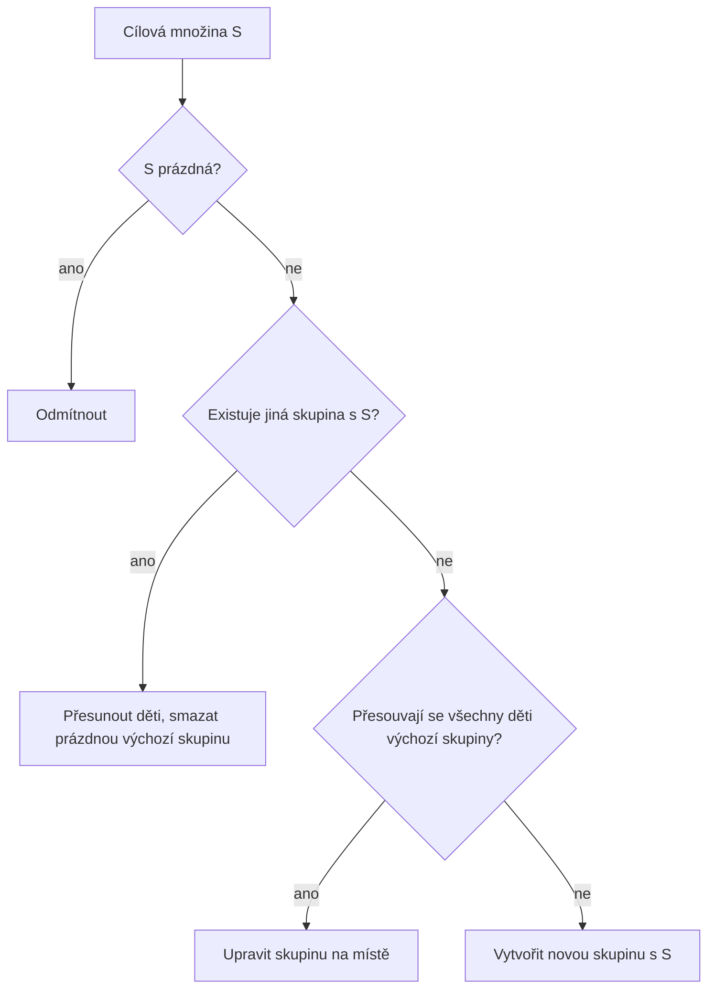
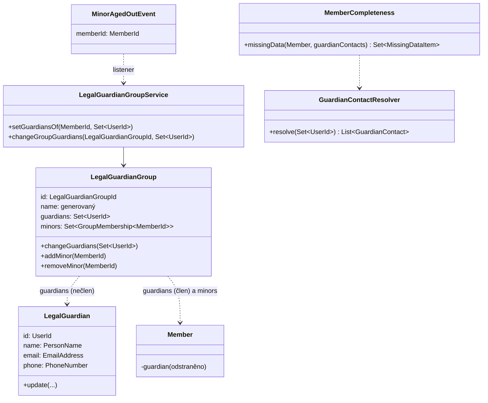

## Context

Dnes nese zákonného zástupce přímo záznam člena (`GuardianInformation`: jméno, vztah, e-mail, telefon; sloupce `members.guardian_*`). Zástupce nemá účet, dítě má nejvýš jednoho zástupce a údaje se u sourozenců opisují. Rodinná skupina (`FamilyGroup`, modul `members`, balíček `familygroup`) po změně `family-group-parents-as-users` už eviduje rodiče jako `UserId` (nemusí být členy) a děti jako `MemberId`, ale platí v ní exkluzivita (uživatel nejvýš v jedné skupině) a rodič je zároveň členem skupiny.

Další výchozí stav, na kterém design staví:
- `common.users.user_name` je `VARCHAR(7)` = registrační číslo; token customizer (`KlabisAuthorizationServerCustomizer`) i `MemberActivationContactVerifier` hledají člena podle registračního čísla.
- Aktivace je self-service (registrační číslo + e-mail); registrace nic neposílá.
- `members.data_incomplete` je zapisovaný (write-only) příznak pro filtr „Jen neúplní“.
- Ukončení členství volá `userService.suspendUser` (zablokuje přihlášení) a `MemberOwnedGroupsPort` blokuje ukončení posledního vlastníka skupiny.
- Aplikace nemá perzistentní stav – schéma se upravuje přímo ve `V001__initial_schema.sql`.

Motivace viz `proposal.md`, požadavky v delta specifikacích.

## Goals / Non-Goals

**Goals:**
- Jediný zdroj pravdy o zástupcích = skupina zákonných zástupců; člen o zástupcích nic neví.
- Více zástupců na dítě, zástupce může zastupovat děti z více skupin.
- Nečlenský zástupce má vlastní účet (login `EXTnnnn`) a profil.
- Registrace nezletilý/dospělý včetně založení zástupců v jednom kroku.
- Logika vytváření/slučování skupin na jednom místě.

**Non-Goals:**
- Oprávnění zástupce nad svěřenci (vidět/upravit jejich údaje, jednat za ně) – přijde později přes oprávnění odvozená ze skupiny; zástupce má nyní jen `MEMBERS:READ`.
- Odesílání notifikací zástupcům (dnes neexistuje žádná notifikace členům) – jen pravidlo ve specifikaci.
- Průběžný přepočet `data_incomplete` při změnách skupin a kontaktů zástupců (akceptované zastarávání, kromě dovršení 18 let).
- Robustní plánovač (výpadek denní úlohy) – řeší změna `introduce-quartz-scheduler`.
- Chování ukončení členství zástupce-člena (viz Open Questions).
- Změna přihlašovacího jména při změně e-mailu zástupce.
- Oprava zastaralé specifikace `email-service` (samostatný úkol).

## Decisions

### D1: Skupina zákonných zástupců místo rodinné skupiny

`FamilyGroup` se přejmenuje na `LegalGuardianGroup` (balíček `members.legalguardiangroup`, discriminator `LEGAL_GUARDIAN`, REST `/api/legal-guardian-groups`). Význam se mění z „domácnost“ na „množina zákonných zástupců“:
- vlastníci = zástupci (`UserId`), členové = nezletilé děti (`MemberId`); vlastník už **není** zároveň členem skupiny;
- zástupce smí být ve více skupinách, dítě nejvýš v jedné;
- dvě skupiny nikdy nemají stejnou množinu zástupců (sourozenci se stejnými zástupci sdílí skupinu, nevlastní sourozenci mají každý svou);
- množina zástupců není prázdná a do skupiny se přidávají jen nezletilí.

*Proč:* zástupcovství je vztah k dítěti, skupina podle přesné množiny zástupců umožní sdílet jej mezi sourozenci bez chyb u rozvedených/nevlastních rodin.
*Alternativy:* (a) vztah zástupce–dítě per dítě bez skupiny – zavrženo, požadavek zachovat skupinu jako místo budoucích oprávnění; (b) ponechat exkluzivitu – neřeší dítě se dvěma zástupci z různých domácností.

### D2: Jediné místo pro find-or-create/merge – `LegalGuardianGroupService`

Aplikační služba skupin nabízí dvě deklarativní operace se společným jádrem:
- `setGuardiansOf(minor, guardians)` – volá registrace a detail nezletilého,
- `changeGroupGuardians(groupId, guardians)` – volá stránka skupin (změna pro všechny děti skupiny).

Jádro pro cílovou množinu S a přesouvané děti:
1. existuje jiná skupina se množinou S → děti se přesunou do ní, výchozí skupina bez dětí se smaže (merge);
2. jinak, pokud se přesouvají všechny děti výchozí skupiny (dítě je ve skupině samo nebo jde o změnu celé skupiny) → skupina se upraví na místě;
3. jinak → vznikne nová skupina se S.

Prázdné S se odmítne („nelze odebrat posledního zástupce“). Členská část zná jen port `LegalGuardianGroupPort` (`setGuardiansOf`, `guardiansOf(minor)`), žádnou logiku skupin.

### D3: Generovaný název skupiny

Název = příjmení zástupců, abecedně, bez duplicit, spojená „ a “ (např. „Novák a Svobodová“); přegeneruje se při každé změně zástupců. Sloupec `groups.user_groups.name` zůstává `NOT NULL`.
*Alternativy:* nullable název (zasahuje `MemberGroup` a Free/Training), konstanta (nevypovídá).

### D4: Nečlenský zástupce jako samostatný agregát `LegalGuardian`

Nová tabulka `members.legal_guardians` (`id` = `common.users.id`, jméno, příjmení, e-mail, telefon, audit), balíček `members.legalguardian`. Invariant: uživatel je buď `Member`, nebo `LegalGuardian`, nikdy obojí. E-mail i telefon jsou povinné a nelze je vymazat. Pole `relationship` se ruší (vztah je per dítě, skupina ho nemůže nést).

Kontakty zástupců pro zbytek systému poskytuje `GuardianContactResolver` (`UserId` → jméno, e-mail, telefon, druh): člen → údaje člena, nečlen → `LegalGuardian`.

*Povýšení na člena:* registrace dospělého může převzít existujícího `LegalGuardian` – vznikne `Member` se stejným `UserId` a novým registračním číslem, řádek `legal_guardians` se smaže, skupiny se nemění, přihlašovací jméno (`EXTnnnn`) zůstává.

### D5: Přihlašovací jméno nečlena = generované číslo `EXTnnnn`, lookup člena podle `UserId`

Nový nečlenský zástupce dostane přihlašovací jméno z jediné průběžné řady s „klubovým“ kódem `EXT`: první `EXT0001`, druhý `EXT0002` atd. (vlastní DB sekvence, bez recyklace čísel). Hodnota odpovídá formátu registračního čísla (`[A-Z0-9]{3}\d{4}`), takže `common.users.user_name VARCHAR(7)`, login formulář i formulář aktivace zůstávají beze změny. Číslo zástupce je vidět na jeho profilu; administrátor mu ho sdělí (registrace nic neposílá).

E-mail už nemusí být unikátní kvůli loginu, ale kvůli duplicitě osob se odmítá nový zástupce, jehož e-mail patří existujícímu zástupci nebo dospělému členovi (normalizace trim + case-insensitive).

Povýšený zástupce (D4) si ponechá login `EXTnnnn`, tedy username ≠ jeho registrační číslo. Token customizer a verifier aktivace proto hledají člena podle `UserId` (sdílené UUID), ne podle username. Lookup `findByRegistrationNumber(EXTnnnn)` nesmí nikde sloužit jako důkaz „není člen“. Profilová jména v tokenu pro nečlena pocházejí z `LegalGuardian`.
*Alternativy:* e-mail jako login (rozšíření sloupce, kolize sdílených e-mailů, změna e-mailu ≠ změna loginu), přidělení registračního čísla při povýšení (změna loginu pro uživatele).

### D6: Zástupci nejsou součástí odpovědi člena – odkaz `legalGuardians`

`Member` ztrácí `guardian` a odpověď detailu člena žádná data zástupců neobsahuje. Detail nezletilého (věk k dnešku < 18), který je ve skupině, nese odkaz `legalGuardians` na `GET /api/legal-guardian-groups/{groupId}/guardians` – seznam zástupců skupiny (jméno, e-mail, telefon, odkaz `member` nebo `legalGuardian`). Dospělý ani nezletilý bez skupiny odkaz nemá; frontend pak sekci zobrazí prázdnou („bez zákonného zástupce“). Odkaz i endpoint jsou dostupné pro `MEMBERS:MANAGE` a pro samotného nezletilého (člen skupiny), tj. stejná viditelnost jako dřív `guardian`. Stejný endpoint používá detail skupiny.

*Proč:* detail člena nemusí načítat cizí agregáty; zástupci patří skupině a jejich seznam má jediný zdroj.
*Alternativa:* vložená data `legalGuardians[]` v detailu člena – zavrženo (duplicitní reprezentace, závislost detailu na skupině a kontaktech).

Úplnost (D7) kontakty zástupců dál potřebuje – načítá je server interně přes port, nikoli přes tento odkaz.

### D7: Úplnost – stejná sémantika, jiný zdroj

Pravidla úplnosti se přesunou z agregátu do doménové služby `MemberCompleteness(member, guardianContacts)`:
- nezletilý: e-mail/telefon z dítěte nebo kteréhokoli zástupce; bez skupiny chybí `GUARDIAN`;
- dospělý: e-mail a telefon jen vlastní, `GUARDIAN` se nehlásí.

„Úprava nesmí zhoršit úplnost“ zůstává s výjimkou změny data narození z dospělého na nezletilého (projde, chybí `GUARDIAN`). `data_incomplete` se zapisuje při uložení člena a v úloze dovršení 18 let; změny skupin a kontaktů zástupců jej nepřepočítávají (akceptované zastarávání). Řádek seznamu i filtr čtou sloupec, detail počítá živě.

### D8: Dovršení 18 let – úloha v `members`, úklid skupiny přes událost

`MinorAgeOutJob` (denně, vzor `EventCompletionScheduler`) vybere členy, jejichž 18. narozeniny připadají na dnešek, přepočítá a uloží jejich `data_incomplete` a publikuje `MinorAgedOutEvent(memberId)`. Listener v `legalguardiangroup` dítě ze skupiny odebere a smaže skupinu bez dětí (idempotentně). Detail kontroluje nezletilost i sám, takže mezi půlnocí a během úlohy nic nevyčnívá.
*Proč tento směr:* fakt „dovršil 18“ vlastní členská část, skupina jen reaguje.

### D9: Aktivace účtů

Verifier aktivačního kontaktu:

| Účet | Přijatý e-mail |
|---|---|
| Nečlenský zástupce | jeho e-mail |
| Dospělý člen | jeho vlastní e-mail |
| Nezletilý člen | žádný |

Akce „Založit účet“ (`MEMBERS:MANAGE`) na detailu nezletilého s účtem čekajícím na aktivaci a s vlastním e-mailem vygeneruje aktivační token a pošle odkaz na e-mail dítěte (obchází verifier). Po dovršení 18 let platí běžná self-service aktivace.

### D10: Oprávnění zástupce a odkaz `profile`

Nečlenský zástupce dostane při založení jen `MEMBERS:READ`. `RootController` vrací `_links.profile` – pro člena na `/api/members/{id}`, pro nečlenského zástupce na `/api/legal-guardians/{userId}`. Frontend „Můj profil“ používá tento odkaz místo `memberId` z tokenu.

### D11: Kandidáti na zástupce

`GET /api/legal-guardian-options` spojí všechny `LegalGuardian` a aktivní členy s věkem ≥ 18 (deduplikace podle `UserId`), s fulltextovým `q`. Vrací i e-mail (přístup jen `MEMBERS:CREATE` / `MEMBERS:MANAGE`). Slouží i jako options pro `x-hal-input-type: UserId`.

### D12: Registrace se zástupci v jedné transakci

`RegisterMemberRequest.legalGuardians[]` – položka je buď `{userId}` (existující kandidát), nebo `{firstName, lastName, email, phone}` (nový). Jedna transakce: noví `User` (login `EXTnnnn`) + `LegalGuardian` → `User` + `Member` → `setGuardiansOf`. Validace: nezletilý ≥ 1 zástupce; dospělý žádné zástupce (odmítnout) a vlastní e-mail + telefon; nový zástupce e-mail i telefon; e-mail nepatří existujícímu zástupci ani dospělému členovi (D5); vybraný člen ≥ 18. Frontend přepíná sekce podle data narození, backend validuje autoritativně. Registrace dospělého může nést `legalGuardianUserId` pro převzetí zástupce (D4).
*Riziko:* HAL-FORMS pole objektů – vlastní komponenta „vybrat nebo založit zástupce“, pokrýt integračním testem.

### D13: Úprava zástupců deklarativním formulářem

Detail nezletilého i detail skupiny nabízí jednu šablonu `PUT …/legal-guardians` s úplným seznamem (stejná položka jako v registraci). Stránka skupin je jen pro `MEMBERS:MANAGE`; ruční vytvoření a smazání skupiny se ruší.

### D14: Doménový model

| Prvek | Změna |
|---|---|
| `LegalGuardianGroup` | přejmenováno z `FamilyGroup`; vlastník ≠ člen; bez exkluzivity zástupců; jen nezletilí; generovaný název |
| `LegalGuardianGroupService` / `LegalGuardianGroupPort` | nové; find-or-create/merge (D2) |
| `LegalGuardian` | nový agregát (nečlenský zástupce) |
| `GuardianContactResolver` | nový; kontakty zástupců z členů i nečlenů |
| `MemberCompleteness` | nová doménová služba (pravidla z `Member.missingData`) |
| `MinorAgedOutEvent`, `MinorAgeOutJob` | nové |
| `Member` | odstraněno `guardian`; `missingData()` přes `MemberCompleteness` |
| `GuardianInformation` | odstraněno |
| `MemberCreatedEvent` | odstraněno `guardian`; `isMinor()` z data narození |
| `FamilyGroupSuspensionBlockersAdapter` | přejmenován, `findAll` místo `findOne` (zástupce ve více skupinách) |

## Glosář

- **Zákonný zástupce (Legal guardian)** – uživatel, který zastupuje nezletilého člena; buď dospělý člen, nebo nečlen s profilem zástupce.
- **Nečlenský zástupce** – zástupce bez členského profilu; přihlašuje se číslem `EXTnnnn`.
- **Číslo zástupce (`EXTnnnn`)** – přihlašovací jméno nečlenského zástupce z průběžné řady `EXT0001`, `EXT0002`, …
- **Skupina zákonných zástupců (LegalGuardianGroup)** – množina zástupců sdílená nezletilými dětmi, které mají přesně tyto zástupce.
- **Nezletilý (Minor)** – člen, kterému k dnešku není 18 let.
- **Kandidát na zástupce** – nečlenský zástupce nebo aktivní člen s věkem ≥ 18.
- **Vyřazení zletilého (age-out)** – odebrání dítěte ze skupiny po dovršení 18 let.

## API (změny)

| Endpoint | Změna |
|---|---|
| `POST /api/members` (`registerMember`) | `guardian` → `legalGuardians[]` (položka `{userId}` nebo `{firstName, lastName, email, phone}`), nové `legalGuardianUserId` (převzetí zástupce u dospělého) |
| `GET /api/members/{id}` | pole `guardian` **odstraněno**, žádná data zástupců; nový odkaz `legalGuardians` → `/api/legal-guardian-groups/{groupId}/guardians` (jen nezletilý ve skupině; `MEMBERS_MANAGE` nebo sám nezletilý); odkaz `familyGroup` → `legalGuardianGroup` (`MEMBERS_MANAGE`); affordance `setMemberLegalGuardians` (nezletilý, `MEMBERS_MANAGE`), `sendMemberAccountActivation` (nezletilý, účet čeká na aktivaci, má e-mail, `MEMBERS_MANAGE`) |
| `PATCH /api/members/{id}` (`updateMember`) | odstraněno `guardian` |
| `PUT /api/members/{id}/legal-guardians` | nový (`setMemberLegalGuardians`): `{legalGuardians[]}` |
| `POST /api/members/{id}/account-activation` | nový (`sendMemberAccountActivation`), bez těla |
| `GET /api/legal-guardians/{userId}` | nový (`getLegalGuardian`): `{userId, loginName, firstName, lastName, email, phone}`, `self`; affordance `updateLegalGuardian`; přístup `MEMBERS_MANAGE` nebo sám zástupce |
| `PATCH /api/legal-guardians/{userId}` | nový (`updateLegalGuardian`): jméno, příjmení, e-mail, telefon (e-mail/telefon nelze vymazat) |
| `GET /api/legal-guardian-options?q=` | nový (`listLegalGuardianOptions`): `{userId, displayName, kind: MEMBER/LEGAL_GUARDIAN, registrationNumber?, email?}`; `MEMBERS_CREATE` nebo `MEMBERS_MANAGE` |
| `GET /api/legal-guardian-groups` | přejmenováno z `/api/family-groups` (`listLegalGuardianGroups`); `MEMBERS_MANAGE`; rel v rootu `legalGuardianGroups` |
| `GET /api/legal-guardian-groups/{id}` | `{name, minors[{memberId, joinedAt, _links.member}]}`, odkaz `legalGuardians`; affordance `setLegalGuardianGroupGuardians`; `MEMBERS_MANAGE` |
| `GET /api/legal-guardian-groups/{id}/guardians` | nový (`listLegalGuardianGroupGuardians`): kolekce `{userId, firstName, lastName, email, phone, _links.member` (člen) nebo `_links.legalGuardian` (nečlen)`}`; `MEMBERS_MANAGE` nebo nezletilý člen skupiny |
| `PUT /api/legal-guardian-groups/{id}/guardians` | nový (`setLegalGuardianGroupGuardians`): `{legalGuardians[]}` |
| `POST /api/family-groups`, `DELETE /api/family-groups/{id}`, `/parents…`, `/children…` | **odstraněno** |
| `GET /api` (root) | nový `_links.profile` (člen i nečlenský zástupce); `familyGroups` → `legalGuardianGroups` |

## Risks / Trade-offs

- [BREAKING API a přejmenování] → backend i frontend v jednom release; žádní externí konzumenti.
- [Zastarávání `data_incomplete` při změnách skupin/kontaktů zástupců] → akceptováno; detail počítá živě; budoucí přepočet přes události.
- [Výpadek denní úlohy v den 18. narozenin → dítě zůstane ve skupině] → akceptováno do přechodu na Quartz (`introduce-quartz-scheduler`); detail kontroluje věk sám.
- [Zástupce nezná své číslo `EXTnnnn`] → číslo je na profilu zástupce; administrátor ho sdělí spolu s pokynem k aktivaci.
- [`EXTnnnn` má formát registračního čísla] → kód `EXT` nesmí být přidělen žádnému klubu; lookup člena podle registračního čísla se nesmí používat k rozhodnutí o členství (D5).
- [Řada `EXT` má 9 999 čísel] → pro velikost klubu dostačující.
- [Duplicitní osoba (stejný e-mail u zástupce a dospělého člena)] → validační chyba při zakládání zástupce.
- [Zástupce nevidí údaje svěřenců] → vědomý mezikrok do oprávnění přes skupinu.
- [HAL-FORMS pole objektů] → vlastní komponenta + integrační test (dřívější chyba v editoru kategorií).
- [Předpoklad `MemberId` ≡ `UserId`] → již platný invariant; povýšení zástupce jej využívá.

## Migration Plan

1. Úprava `V001__initial_schema.sql` bez nové migrace (žádný perzistentní stav): drop `members.guardian_*`, nová `members.legal_guardians`, sekvence pro čísla `EXTnnnn`, CHECK `type IN ('FREE','TRAINING','LEGAL_GUARDIAN')`, komentáře.
2. `example-data`: nečlenský zástupce se dvěma sourozenci, člen-zástupce s dítětem, dítě se dvěma zástupci (člen + nečlen), nezletilý z ORIS bez zástupce.
3. Nasazení jedním releasem backend + frontend; rollback = revert release.

## Open Questions

- **Ukončení členství zástupce-člena**: ukončení zablokuje přihlášení (`suspendUser`), tedy i budoucí přístup ke svěřencům. Do rozhodnutí zůstává dnešní chování – ukončení posledního zástupce skupiny je blokováno, dokud dítě nemá jiného zástupce. Kandidáti: ponechat blokaci, jen varovat, nesuspendovat `User` zástupce, převést na nečlenského zástupce.
