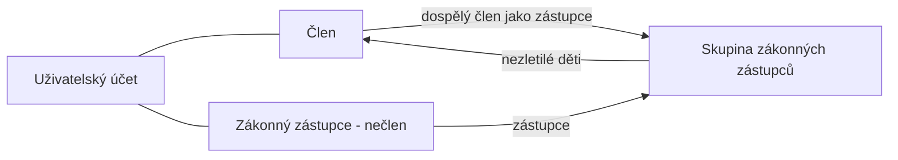

## Why

Zákonný zástupce nezletilého člena je dnes jen vložená data v záznamu člena (jeden zástupce, bez účtu, bez vazby na ostatní děti). Issues #332, #333 a #334 vyžadují rozlišit registraci nezletilého a dospělého, dát zástupcům vlastní přihlašovací účet a podporovat více zástupců na jedno dítě. Zástupci se proto budou evidovat výhradně přes skupiny zástupců (rozšíření dnešních rodinných skupin), nečlenové jako samostatní uživatelé s vlastním profilem.

## What Changes

- **Skupina zákonných zástupců (LegalGuardianGroup)** nahrazuje rodinnou skupinu: vlastníci = zákonní zástupci (libovolní uživatelé, mohou být ve více skupinách), členové = nezletilí (nejvýš v jedné skupině). Skupina odpovídá přesné množině zástupců; název se generuje z příjmení zástupců.
- Přiřazení zástupců nezletilému je deklarativní („nastav zástupce X, Y dítěti A“) z detailu nezletilého i ze stránky skupin (úprava zástupců celé skupiny); skupiny se automaticky vytvářejí, slučují a mažou. Posledního zástupce nelze odebrat.
- **Nový profil zákonného zástupce – nečlena** (jméno, e-mail, telefon), 1:1 s uživatelským účtem; přihlašovacím jménem je e-mail. Zástupce vidí a upravuje svůj profil a má oprávnění `MEMBERS:READ`.
- Nový seznam kandidátů na zástupce: nečlenští zástupci a aktivní členové starší 18 let.
- **Registrace člena** rozlišuje nezletilého a dospělého podle data narození: nezletilý vyžaduje ≥ 1 zástupce (vybraný nebo nově založený ve stejném kroku), dospělý vlastní e-mail a telefon a zástupce mít nesmí. Registrace dospělého umí převzít existujícího nečlenského zástupce.
- **BREAKING**: člen nemá vlastní údaje o zástupci; detail nezletilého zobrazuje zástupce ze skupiny. Pole `guardian` v registraci, úpravě i detailu člena mizí, `relationship` se ruší.
- Úplnost údajů bere kontakty zástupců ze skupiny; dospělý musí mít vlastní e-mail a telefon. Změna data narození, která udělá z dospělého nezletilého, je povolena i za cenu neúplnosti.
- **Aktivace účtu nezletilého**: self-service aktivace není možná na žádný e-mail; administrátor spouští akci „Založit účet“, která pošle aktivační odkaz na vlastní e-mail dítěte. Zástupce aktivuje svůj vlastní účet.
- Denní úloha vyřadí ze skupin děti, které dovršily 18 let, a smaže skupiny bez dětí.
- Přihlášení registračním číslem nebo e-mailem; odkaz „profil“ v kořenovém API pro členy i zástupce.
- Stránka „Zákonní zástupci“ (dříve „Rodinné skupiny“) jen pro `MEMBERS:MANAGE`; ruční zakládání a mazání skupin mizí.
- Pravidlo příjemců notifikací týkajících se nezletilého (všichni zástupci + dítě s vlastním e-mailem) – zatím bez implementace.

## Capabilities

### New Capabilities
- `legal-guardians`: profil nečlenského zástupce, kandidáti na zástupce, skupiny zákonných zástupců (přiřazení, slučování, stránka pro administrátory), vyřazení zletilých, pravidlo příjemců notifikací.

### Modified Capabilities
- `members`: registrace nezletilý/dospělý se zástupci, kontaktní údaje, zástupci v detailu nezletilého, úplnost podle skupiny, akce „Založit účet“, úprava člena bez údajů o zástupci, zrušení tlačítka „Rodina“.
- `user-groups`: odstranění rodinných skupin (přesun do `legal-guardians`), úprava typů skupin, vlastníků, editace, mazání a varování při ukončení členství.
- `users`: přihlašovací jméno e-mailem pro nečlenské zástupce, pravidla aktivačního e-mailu (nezletilý bez self-service aktivace).
- `users-authentication`: rozpoznání člena podle uživatelského účtu místo registračního čísla, profilové údaje nečlenského zástupce.
- `application-navigation`: položka „Zákonní zástupci“ v administraci, odkaz na vlastní profil pro členy i zástupce.

## Impact

- Backend `members`: `Member` (odstranění `GuardianInformation`), `MissingDataItem`, `RegistrationService`, `ManagementService`, přesun `familygroup` → `legalguardiangroup`, nový balíček `legalguardian`, `MemberActivationContactVerifier`, `MemberCreatedEvent`, nové plánované úlohy.
- Backend `common.users` / `authorizationserver`: username do 255 znaků, lookup člena podle `userId` v token customizeru, login formulář, `RootController` (`profile`).
- DB: úprava `V001__initial_schema.sql` (bez nové migrace – žádný perzistentní stav): drop `guardian_*`, nová `members.legal_guardians`, `common.users.user_name VARCHAR(255)`, discriminator `LEGAL_GUARDIAN`; nové varianty v `example-data`.
- API spec `docs/openapi/spec/members.yaml` (+ bundle a frontend typy): registrace, detail a úprava člena, `legal-guardians`, `legal-guardian-options`, `legal-guardian-groups`.
- Frontend: registrační formulář (sekce podle věku, výběr/založení zástupců), detail nezletilého, profil zástupce, stránka skupin zástupců, „Můj profil“ z odkazu `profile`, login label.
- Beze změny: ORIS synchronizace (zástupce neimportuje), Free/Training skupiny.
