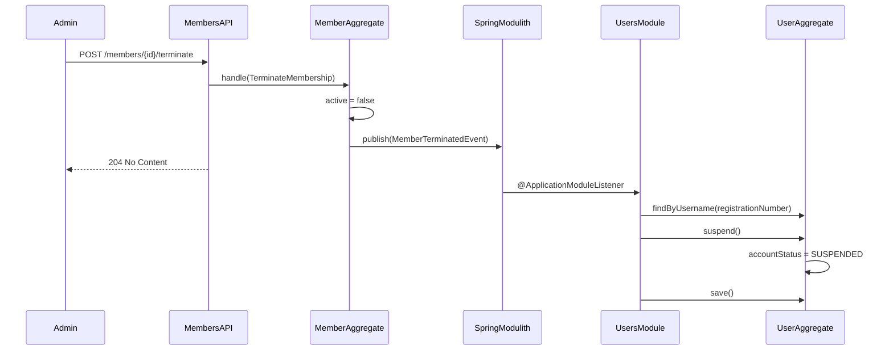

## Why

When a member's membership is terminated, the corresponding User account remains active and can still authenticate to the system. This is a security gap - terminated members should not be able to log in or use the application API. Currently, the `MemberLifecycleE2ETest` test (STEP 11) expects terminated users to be denied access with `403 Forbidden`, but this test fails because User accounts are not automatically suspended when Members are terminated.

## What Changes

- Add `suspend()` and `reactivate()` methods to User aggregate for account status changes
- Create `MemberTerminatedEventHandler` in users module to listen for `MemberTerminatedEvent` and automatically suspend the corresponding User
- Create `MemberReactivatedEvent` in members module for future member reactivation support
- Create `MemberReactivatedEventHandler` in users module to automatically reactivate User accounts
- Add `ReactivateMembership` command to Member aggregate
- Update `users` specification to document cross-module event-driven integration for user suspension
- Update `member-termination` specification to reference user suspension behavior

## Capabilities

### New Capabilities

- `member-user-suspension`: Automatic User account suspension when Member is terminated, using event-driven cross-module integration

### Modified Capabilities

- `users`: Add User suspension/reactivation state machine with event-driven triggers from Member lifecycle events
- `member-termination`: Extend to include automatic User suspension as a side-effect

## Impact

- **Affected modules**: `users` (event handlers), `members` (new event)
- **API behavior**: No breaking changes to REST API
- **Database**: User.accountStatus now set to SUSPENDED upon member termination
- **Security**: Terminated members cannot authenticate or access protected endpoints
- **Authentication**: Spring Security will deny authentication for suspended users (isAuthenticatable() returns false)
- **Test coverage**: Existing `MemberLifecycleE2ETest` STEP 11 will pass after implementation

## Architecture Decision

Event-driven integration is used instead of direct service calls:
- Members module (already depends on users) publishes `MemberTerminatedEvent` and `MemberReactivatedEvent`
- Users module (must NOT depend on members) subscribes to these events via `@ApplicationModuleListener`
- This maintains bounded context isolation - users module doesn't need to know about members module internals
- User lookup uses `username` field which matches `Member.registrationNumber` value

