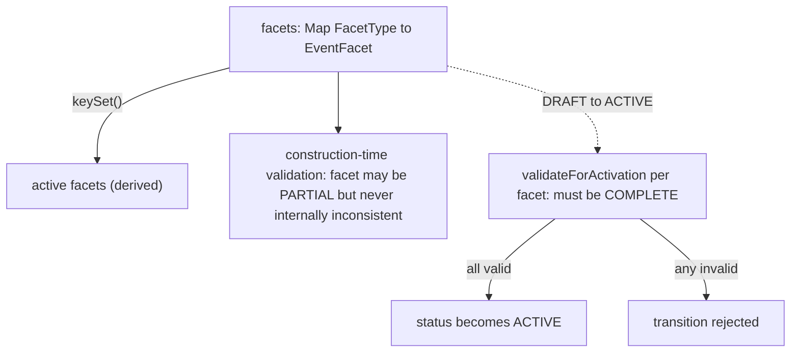
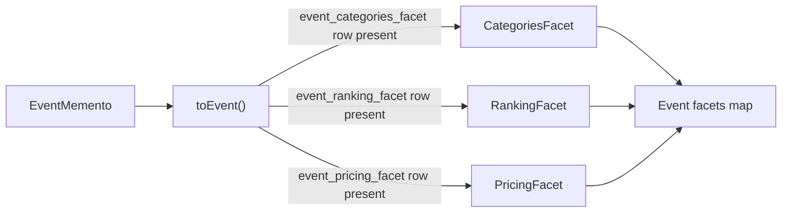

## Context

The `Event` aggregate is currently a flat record holding every possible field. Recent work (`extend-events-ranking-and-oris-pricing`) added `ranking` and `baseEntryFee` directly onto it alongside `categories`, all denormalized into the `events` table. These fields are always present regardless of whether they make sense for a given event (a training never needs ranking or entry fee).

The club needs event variants and, in the future, optional add-ons (transport, accommodation, services). Rather than keep growing the flat record, this change introduces **facets**: atomic, independently toggleable groups of event fields. The first three facets — `CATEGORIES`, `RANKING`, `PRICING` — wrap the existing fields; future facets reuse the same pattern.

**Current state relevant to the design:**
- `Event` is a pure domain aggregate persisted via the **Memento pattern** (`EventMemento` carries all Spring Data JDBC concerns; `Event` has no persistence annotations).
- `EventStatus` already has a `DRAFT → ACTIVE → FINISHED/CANCELLED` lifecycle with invariant checks (cf. `RegistrationDeadlines`).
- `EventType` exists but is currently a visual label only (name, color, ORIS discipline mapping).
- The API is HAL+FORMS driven; the frontend renders forms dynamically from `_templates` and adapts to the fields the backend exposes.
- Persistence runs on **in-memory H2** in dev/test; there is **no production environment and no production data**.

## Goals / Non-Goals

**Goals:**
- Model facets as value objects composed inside the single `Event` aggregate (one aggregate, one transaction, shared optimistic lock).
- A `sealed` facet hierarchy so the compiler enforces exhaustive handling whenever a facet is added.
- A single `facets` map as the source of truth for what is enabled (the active set is its `keySet()`); no separate active-facets field.
- Allow active-but-empty facets in `DRAFT`; enforce facet invariants at `DRAFT → ACTIVE`.
- One uniform persistence shape (a child table per facet) and one uniform API shape (a sub-resource per facet) — no special cases.
- `EventType.defaultFacets` seeds an event's facets without constraining them.
- Reuse the existing HAL+FORMS frontend machinery; render one section per active facet.
- Design facets so a later change can compute price from member selections, without building that now.

**Non-Goals:**
- Price calculation from member selections at registration time (separate follow-up change). No `priceFor()` method on the facet interface now.
- Any change to `event-registrations` (registration, unregistration, accommodation list, transactions).
- Turning categories into rich objects with per-category pricing (separate future change — categories stay a `String` list here).
- Inter-facet dependencies (e.g. RANKING requiring CATEGORIES). Facets are independent; dependencies can be added later if a real need arises.
- A data migration. The schema is rewritten in place; H2 resets on restart.
- Runtime/admin-defined custom facets. New facets are always a code change (that is the point of `sealed`).

## Decisions

### D1: Facet = value object inside the Event aggregate (not a separate aggregate)

A facet is a `ValueObject` composed into `Event`. Activating/editing a facet loads the whole `Event`, mutates it, and saves the whole `Event`. The optimistic lock (`@Version`) lives on `events`.

**Why:** keeps Event invariants in one place and fits the existing Memento persistence. A facet has no identity or lifecycle of its own — it is an aspect of the event.

**Alternatives considered:**
- *Visibility-only flag (fields stay on Event, facet just toggles display).* Rejected — no real modularity; would not support future rich facets (transport with its own data).
- *Facet as a separate aggregate / 1:N entity.* Rejected — Event stops being one aggregate, invites anaemic facets, more machinery than the domain needs. The sub-resource URL granularity (D6) gives the API ergonomics of separate resources without giving facets aggregate independence.

### D2: Atomic facets composed by EventType, not coarse "Race"/"Training" facets

Facets are the smallest meaningful field group: `CATEGORIES`, `RANKING`, `PRICING`. "Race" and "Training" are **compositions** expressed by `EventType.defaultFacets`, not facet types themselves.

```
EventType "Závod"   → defaultFacets = {CATEGORIES, RANKING, PRICING}
EventType "Trénink" → defaultFacets = {CATEGORIES}
```

**Why:** maximal orthogonality. The admin enables any combination; future facets (transport, accommodation) slot in with no special "race vs training" branching. It also dissolves the "two sets of categories" problem — there is exactly one `CategoriesFacet`.

**Alternative considered:** coarse `RacePack`/`TrainingPack`. Rejected — duplicates `categories` across pack types and bakes event-kind assumptions into the type system.

### D3: `sealed interface EventFacet` with exhaustive pattern matching

```
sealed interface EventFacet permits CategoriesFacet, RankingFacet, PricingFacet {
    FacetType type();
    void validateForActivation();   // enforced at DRAFT → ACTIVE
}
```

New facets are added by a developer as a code change: extend `permits`, fix every resulting non-exhaustive `switch`, add the memento + child table + sub-resource template.

**Why:** the compiler becomes the checklist. Idiomatic modern Java. No reflection/registry needed for the closed set we own.

**Alternative considered:** open plugin registry (γ). Rejected — loses cross-facet invariants and type safety; facets are never defined at runtime.

### D4: The facets map is the single source of truth; a facet may be partially filled

`Event` holds exactly one collection: `facets: Map<FacetType, EventFacet>`. A facet is **active iff a entry exists for its type**; the set of active facets is the derived `facets.keySet()` — there is no separate `activeFacets` field to keep in sync.

The key enabler is that **a facet is always a real instance, even when incomplete**. "Enabled but empty" is just the boundary case of "partially filled":

```
simple:  PricingFacet(fee = null)                  enabled, fee filled later
complex: TransportFacet(routes=[Praha], price=null) one route added, prices later
```

So a facet has **two validation levels**:



1. **Construction-time (always):** a facet may be partial (a category-less CATEGORIES, a fee-less PRICING, a price-less transport route) but must not be internally contradictory (e.g. a transport price without a route).
2. **`validateForActivation()` (at `DRAFT → ACTIVE`):** the facet must be complete and ready to publish.

**Why one map over a `Set` + `Map`:** because every active facet — even an empty one — is represented by an instance, "active without data" never occurs, so a separate `Set<FacetType>` would only duplicate `facets.keySet()` and add a consistency burden. This also serves the complex-facet case the simple facets hide: rich future facets (transport, accommodation) genuinely need to be saved while partially filled, which the always-present-instance model supports directly.

### D5: Persistence — one child table per facet (D2-style), schema rewritten in V001

The per-facet columns are removed from `events`. Each facet gets its own child table, and **the presence of a child row is what marks the facet active** — consistent with D4 (the facets map is the single source of truth, no separate `active_facets` field in the domain). The `events` table therefore needs no `active_facets` column; the active set is reconstructed from which child rows exist.

```
events                  ...base...   (no per-facet columns, no active_facets column)
event_categories_facet  event_id PK/FK, categories          (CSV via CsvListConverter)
event_ranking_facet     event_id PK/FK, level_id, level_short_name, level_name
event_pricing_facet     event_id PK/FK, base_entry_fee_amount, base_entry_fee_currency
```

`EventMemento` maps each child table as a nullable child memento. `toEvent()` puts a facet into the `facets` map for each present child row (a partial/empty facet is still a present row); `from(Event)` writes a child row for each entry in the facets map and deletes rows for facets no longer present.



This also settles the former open question about hard-deleting child rows on deactivation: since a present row *is* the active marker, deactivating a facet removes its entry from the map, and `from(Event)` deletes the row on save — the map and the rows can never disagree.

**Why D2 over alternatives:**
- *Denormalize into `events` (D1).* Rejected for uniformity — sub-resource editing (D6) wants per-facet rows; mixing denormalized RACE columns with child-table facets would be a special case. Future rich facets (transport routes 1:N) need their own tables anyway.
- *JSON column (D3-JSON).* Rejected — facets very likely need to be SQL-queryable (filter event list by facet content, reports); JSON goes against the grain of the existing unaccent fulltext/filter code and loses FK integrity.

**Why no migration:** dev/test is H2 only and resets on restart; there is no production data. `V001` (the single domain DDL script, per backend convention "update best-fitting script, do not add new migrations") is edited to the target shape directly.

### D6: API — a HAL+FORMS sub-resource per facet

```
GET    /api/events/{id}                 base + structured facets{} + _links{ facet:categories, ... }
PATCH  /api/events/{id}                 updateEvent template (base fields only)
GET    /api/events/{id}/facets/{type}   facet resource with its own _templates
PATCH  /api/events/{id}/facets/{type}   update<Type>Facet template
POST   /api/events/{id}/facets/{type}   activate facet (empty allowed in DRAFT)
DELETE /api/events/{id}/facets/{type}   deactivate facet
```

The Event response exposes `_links` only for **active** facets (`facet:categories`, …) and a structured `facets` object (nested per-facet DTOs, NON_NULL drops inactive ones). Available-to-activate facets are surfaced as affordances. Each facet PATCH still loads/mutates/saves the whole Event aggregate (D1) — the URL is finer-grained than the transaction boundary, which is intentional.

**Why:** mirrors the app's HAL philosophy (navigate via `_links`, each resource has its own `_templates`). Activation/deactivation as `POST`/`DELETE` on `/facets/{type}` is naturally RESTful and matches a facet's presence in the facets map being the source of truth. Rich 1:N facets (future transport/services) get a clean resource of their own. Building it now on the simple RACE-equivalent facets validates the whole mechanism on something well understood.

**Alternative considered:** flat DTO with conditionally-present fields (α). Rejected here in favour of proving the structured pattern now; flat would need rework at the first rich facet anyway.

### D7: Frontend — one section per active facet, reusing existing machinery

`EventDetailPage` keeps its base section (the `updateEvent` template) and renders a `FacetSection` per `facet:*` link. Each section navigates to the facet resource and renders it with the existing `HalFormDisplay` + `eventFormFieldsFactory`; activate/deactivate are affordance-driven. Terminology stays clean across layers: **facet** in domain/API, **section** in the UI.

**Why:** the frontend already adapts to backend-provided templates; the incremental work is "render a section per facet link", not new form infrastructure.

### D8: ORIS import targets facets

`OrisEventImportService` activates the relevant facets and fills them (CATEGORIES from classes, RANKING from level, PRICING from max class fee) instead of writing flat Event fields. Ranking/fee remain **denormalized snapshots** at import time (unchanged semantics), just relocated into their facets.

## Risks / Trade-offs

- **More tables and endpoints than a flat model** → Accepted deliberately for uniformity; each table/endpoint is tiny and the pattern is identical, so the marginal cost of facet N is low and predictable.
- **Sub-resource URL granularity vs. whole-aggregate transaction may mislead** (a reader could think a facet is its own aggregate) → Documented here (D1/D6); facet PATCH loads/saves the whole Event under the Event `@Version`.
- **Structured DTO + per-facet templates is more frontend work than a flat DTO** → Mitigated by reusing `HalFormDisplay`/factory; only the "section per facet" wrapper is new. Justified by validating the pattern before the first rich facet.
- **Concurrent edits to two facets of the same event conflict on the Event `@Version`** → Acceptable for the target load (10+ concurrent users, facets of one event rarely edited simultaneously); optimistic-lock retry surfaces to the user as today.
- **Removing always-present fields is BREAKING for any current API consumer** → No production environment yet; frontend is updated in the same change. The Event response stays self-describing via `_links`/`_templates`.

## Migration Plan

No data migration. Steps:
1. Rewrite `V001` domain DDL to the target schema (drop per-facet columns from `events`, add the three facet child tables — their presence marks active facets, no `active_facets` column — and add `default_facets` to `event_types`).
2. H2 resets on restart; `BootstrapDataLoader` seed data is updated to create events with facets where relevant.
3. **Rollback:** revert the change set; since there is no persisted production data, no down-migration is required.

## Open Questions

_Both questions raised during design were resolved by adopting the single-map model (D4); recorded here so the rationale stays discoverable._

- **Encoding of the active-facet set (CSV column vs. join table) — resolved: no such field.** The domain holds a single `facets` map (D4) and persistence marks a facet active by the *presence of its child row* (D5). There is no `active_facets` column to encode. To query the active set in SQL, join/exists against the facet child tables.
- **Hard-delete vs. keep child row on deactivation — resolved: delete on save.** Since a present child row *is* the active marker, deactivation removes the facet from the map and `from(Event)` deletes the row on save. The map and the child rows can never disagree, so there is no "orphaned but inactive" data state to manage.
