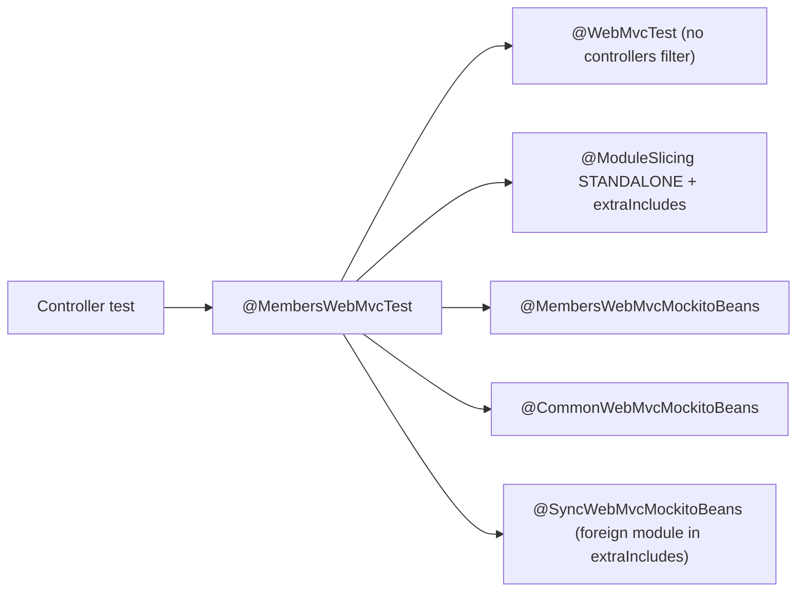

## Context

Current state in the modules not yet migrated:

- Controller tests use `@WebMvcTest(controllers = X.class)` plus `@WithPostprocessors` (a hand-maintained list of HAL postprocessors and mocks in `com.klabis.common`) plus per-class `@MockitoBean`s. Every distinct combination creates a new Spring context.
- Behavior of one controller is spread over controller, `*SecurityTest`, `*IntegrationTest` and link-processor/postprocessor unit tests.
- Some tests mock things that are not primary ports (adapter-package beans, repositories, helpers).

The `members` PoC established the target form (see `.claude/skills/backend-patterns/references/testing-guide.md`):

PoC result on `members`: contexts 16 → 8, test time 121 s → 97 s, tests 930 → 926 (duplicates merged). The gain comes from the shared context; `STANDALONE` itself gave only a few seconds.

## Goals / Non-Goals

**Goals:**
- One shared Spring context per module for all REST adapter `@WebMvcTest`s.
- Only primary ports are mocked in REST adapter tests; each type is mocked in exactly one `*WebMvcMockitoBeans` (owned by the module that defines it).
- Optional/feature-flag beans are mocked locally and have a "disabled" variant test.
- Authorization (403) tests prove enforcement of the authorization mechanism, not only the happy path.
- Remove the legacy `@WithPostprocessors` form.

**Non-Goals:**
- No change to E2E tests, JDBC tests, full `@SpringBootTest` integration tests, or domain/application unit tests (except tests for newly added port methods).
- No change to REST contracts, security rules, or HAL output.
- No speed target beyond fewer contexts; no parallel-fork tuning.

## Decisions

### D1: One meta-annotation per module, shared context
`@<Module>WebMvcTest` combines `@WebMvcTest` (no `controllers`), `@ModuleSlicing(module, mode = STANDALONE, extraIncludes, verifyAutomatically = false)`, `@ActiveProfiles("test")`, shared `@Import`s and the group mocks. Without a `controllers` filter all controllers of the module load, and Spring's context cache returns the same context for every test using it.
*Alternative:* keep `controllers=` per test — rejected, every controller then needs its own context.

### D2: `STANDALONE` + `extraIncludes` only where responses need it
`extraIncludes` loads all web beans of the included module. Include a module only when its HAL postprocessors affect the responses of the tested controllers, or when its port is injected into the tested controllers (e.g. `sync` for `SynchronizationPort`). The included module's group mock annotation is composed in.

### D3: Mock ownership
`<Module>WebMvcMockitoBeans` lives in the owning module's test sources and mocks all of that module's primary ports. A type is mocked in exactly one of them. Tests receive mocks through `@Autowired` (never a second `@MockitoBean` — a duplicate fails bootstrap).

### D4: REST adapters depend only on primary ports
Fixes made in production code (no behavior change):

| Module | Finding | Fix |
|---|---|---|
| events | `AccommodationListCsvRenderer` mocked | Check whether it is a pure adapter component; instantiate it via `@Import` of its configuration (or real bean) instead of mocking |
| finance | `MemberAccountController` uses `MemberAccountRepository` | Add the needed queries to the finance primary port; controller uses the port |
| finance | `FinanceAccountLinkSupport` implemented in the adapter package | Mock removed; the real helper is loaded with the slice (or exposed as a primary port if it needs application data) |
| sync | `SyncProjectionFieldReader` | Expose through a primary port used by `SynchronizationController` and `SyncStateResponseConverter` |
| membershipfees | `EventTypeOptionsPort`, `RankingOptionsPort` only `@Port` | Mark as `@PrimaryPort` if they are consumed by the adapter and have no secondary implementation role; otherwise add primary ports |
| common.settings | `OrisClubKeyPort` is a secondary port (`@PrimaryPort` breaks `JMoleculesArchitectureTest`) | Add a dedicated primary port over it; mock that |
| oris | `OrisApiClient` used directly by `OrisController` | Justified exception, documented in the skill |

Each finding is re-verified in the code before the change; the table is the starting hypothesis from the PoC review.

### D5: Optional beans are mocked locally
A bean injected as `Optional<T>` (feature flag, profile-gated e.g. `oris`) never goes into a group mock or into the module annotation. The test that needs it mocks it in its own class (separate Spring context, deliberately named class); sibling tests in the shared context verify the "disabled" behavior (absent affordance, 404). Rule: at most a handful of such extra contexts per module. Where an `Optional` exists only because of historical module wiring (e.g. `SynchronizationPort`, `FeeSelectionCampaignManagementPort` in the PoC), it becomes a required dependency and is provided through `extraIncludes` and the owning module's group mock.

### D6: Merge security/integration/link-processor tests into the controller test
They become `@Nested` groups in the same class; expectations move from "processor adds link X" to "response of endpoint contains link X". The link-processor branch not reachable from a controller response (e.g. "no link without context") gets a small unit test instead of being dropped.

### D7: 403 verification by one-time mutation
`@HasAuthority` is generated into the `*Api` interfaces from `backend/src/main/openapi-templates/api.mustache` (source: `x-klabis-authority` in `docs/openapi/spec/*.yaml`). The mechanism itself is already confirmed by the `members` PoC, so it is not re-checked per module. What needs checking is that each 403 test fails for the right reason. During migration, 403 tests stub the port returns, so that without the annotation the controller body runs and the test fails on the status assertion instead of an NPE. After all modules are migrated, a single mutation run covers everything: rename the `x-klabis-authority` section in the template (open and close tag together), run all REST adapter tests of the migrated modules, and require every 403 test to fail on the status assertion. Tests that still pass are enforced by another mechanism (ownership rule, field-level security) and are documented as such. The template is restored with `git checkout`.

### D8: Order — modules first, legacy removal last
`@WithPostprocessors` is used by 32 test classes; it stays until the last module is migrated, so each module is an independently committable and testable slice.

## Risks / Trade-offs

- **Shared context hides missing wiring** (a test no longer fails because its own controller lacks a bean) → the shared context is built from the real module, so missing production beans still fail bootstrap; the architecture tests remain green.
- **Mutation check relies on the generated annotation** → covers only `x-klabis-authority` endpoints; endpoints with other mechanisms are listed explicitly in the final report.
- **Modulith skips unchanged tests** (results look green with fewer tests) → run with `SPRING_MODULITH_TEST_SKIP_OPTIMIZATIONS=true --rerun-tasks` and verify skipped counts in the XML results.
- **`STANDALONE` leaves out postprocessors of foreign modules** → include them via `extraIncludes` only when asserted in responses; otherwise their absence is intended.
- **Package-private `@Import(CalendarInfrastructureConfiguration)`** in `CalendarWebMvcMockitoBeans` forces the annotation into one package → decide: make the configuration public in test scope, or replace with a test configuration.
- **Test count drops** (merged duplicates) → compare per-module test counts before/after and explain every difference.
- **Extra contexts for feature-flag variants** → at most one extra context per variant, listed in the module summary.

## Migration Plan

1. Preparation: record baseline (profiler, contexts, test counts) per module with `SKIP_OPTIMIZATIONS`.
2. Per module, one vertical slice (production port fixes → group mocks → module annotation → merged tests with stubbed 403 tests → module test run → review → commit): `groups`, `calendar`, `sync`, `finance`, `membershipfees`, `events`, `oris`, `common`.
3. Remove `@WithPostprocessors`; update `backend-patterns` skill.
4. Final full-suite verification, one-time 403 mutation check across all modules, comparison with the baseline.

Rollback: each module slice is a separate commit and can be reverted independently; the legacy form keeps working next to the migrated one until step 3.

## Open Questions

- `OrisClubKeyPort`: new primary port name and whether the existing secondary port keeps its role.
- `events`: how `AccommodationListCsvRenderer` is best loaded in the slice.
- `common`: which of the 16 `@WebMvcTest` classes belong to the module-sliced form and which test infrastructure (filters, advice) and need dedicated contexts.
