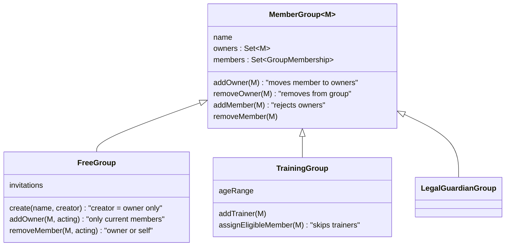

# Design

## Context

All three group types share the base aggregate `MemberGroup` (`common.groups.domain`). It already holds owners and members as two separate sets, but nothing keeps them apart:

- `FreeGroup.create` puts the creator into **both** sets.
- `FreeGroup.addOwner` requires the candidate to be a member (`CannotPromoteNonMemberToOwnerException`) and leaves them in the member set.
- `MemberGroup.removeMember` refuses to remove an owner (`OwnerCannotBeRemovedFromGroupException`); removing an owner leaves the person as a plain member.
- `TrainingGroup` lets a trainer also be an age-assigned trainee (`assignEligibleMember` does not look at trainers).
- `LegalGuardianGroup` is already disjoint by construction: owners are guardians (`UserId`), members are minors.

There is no cross-module consumer of group membership today (no module imports `com.klabis.groups`); the consumers are the group controllers themselves (member counts, detail lists, `isMember` checks for detail access) and the repository filter `FreeGroupFilter.ownerOrMemberIs`, which already ORs both sets.

There is no production data, so no data migration is needed (see proposal).

## Goals / Non-Goals

**Goals:**
- Enforce "owner ∉ members" once, in the shared base aggregate, for every group type.
- Owner promotion moves, owner removal removes from the group.
- A free group member can leave the group.

**Non-Goals:**
- Any permission derived from group ownership (that is `rebac-2` / `rebac-3`).
- Notifying owners that a member left (can be added later without changing this design).
- Changing how legal guardian groups are managed.

## Decisions

### D1. The invariant lives in `MemberGroup`

`MemberGroup` guarantees `owners ∩ members = ∅`:

| Operation | New behavior |
|---|---|
| `addOwner(x)` | if `x` is a member, remove `x` from members, then add to owners |
| `removeOwner(x)` | remove from owners (last-owner rule unchanged); `x` is **not** re-added to members |
| `addMember(x)` | rejected when `x` is an owner (`OwnerCannotBeMemberException`, new) |
| `removeMember(x)` | `OwnerCannotBeRemovedFromGroupException` is no longer reachable → removed |

Subtypes keep their own preconditions on top: `FreeGroup.addOwner` still requires current membership (promotion from members only), `TrainingGroup.addTrainer` accepts anyone.

*Alternative considered:* enforce per subtype. Rejected — the delegation in `rebac-3` reads "owners gain permissions over members" generically for all group types, so the invariant it relies on belongs to the shared type.

### D2. Free group creation

`FreeGroup.create` puts the creator only into owners. The "groups I'm in" list keeps working because `FreeGroupFilter.ownerOrMemberIs` already covers owners.

### D3. Automatic training-group assignment skips trainers

`TrainingGroup.assignEligibleMember(x)` is a no-op when `x` is a trainer of that group (no event is published). The callers (`MemberCreatedListener`, `TrainingGroupManagementService` creation and age-reassignment) do not change. The manual "add member" picker excludes trainers (extends the existing "hide existing members" option filter).

*Alternative considered:* throw and let callers filter. Rejected — automatic assignment iterates over all eligible members; skipping is the intended business rule, not an error.

### D4. Leaving a free group reuses the remove-member operation

`DELETE /api/groups/{id}/members/{memberId}` (`removeGroupMember`) is allowed when the caller is an owner **or** the caller is `memberId` itself. Domain: `FreeGroup.removeMember(memberId, actingMember)` accepts `actingMember == memberId` (and the person is a member — owners leave via `removeOwner`). The free group detail response gets a `leaveGroup` affordance (same operation, caller's own id) shown only to non-owner members; the frontend renders it as "Opustit skupinu" with a confirmation.

Training groups and legal guardian groups do not get the self path: their remove operations stay restricted to `GROUPS:TRAINING` / `MEMBERS:MANAGE`.

*Alternative considered:* a dedicated `POST /api/groups/{id}/leave`. Rejected — it would duplicate removal semantics; "remove member X" with X = me is the same state change and the existing ownership/self check expresses who may do it.

### D5. API surface

- `groups.yaml`: `removeGroupMember` description updated (owner or the member themselves); no new operation; free group detail response documents the conditional `leaveGroup` template.
- Response shapes do not change; owners simply stop appearing in member lists.

## Domain model

| Element | Change |
|---|---|
| `MemberGroup` | **Changed** — invariant owners ∩ members = ∅; promotion moves; owner removal no longer leaves a member behind |
| `OwnerCannotBeMemberException` | **Added** — adding an owner as a member |
| `OwnerCannotBeRemovedFromGroupException` | **Removed** — unreachable under the invariant |
| `FreeGroup.create` | **Changed** — creator is owner only |
| `FreeGroup.removeMember` | **Changed** — the member themselves may remove (leave) |
| `TrainingGroup.assignEligibleMember` | **Changed** — skips the group's trainers |
| `LegalGuardianGroup` | Unchanged (already disjoint) |

## Glossary

| Term | Meaning |
|---|---|
| Owner | Person who manages a group (free group owner, trainer, legal guardian). Never a member of the same group. |
| Member | Person who belongs to a group without managing it (free group member, trainee, minor). |
| Leaving a group | A free group member removing themselves from the group. |

## Risks / Trade-offs

- [A trainer who is also an age-eligible trainee today loses the trainee role] → No production data; on any existing dev/test data `addOwner` normalizes the state the next time trainers change. Bootstrap data is reviewed in tasks.
- [Owner removal now drops the person from the group, which may surprise an owner who only wanted to "step down"] → The UI confirmation for removing an owner states that the person will leave the group; stepping down while staying requires re-invitation, which is the consent the delegation model needs.
- [Frontend code that assumes the creator appears in the member list] → Covered by updating the free group detail page and its tests.
