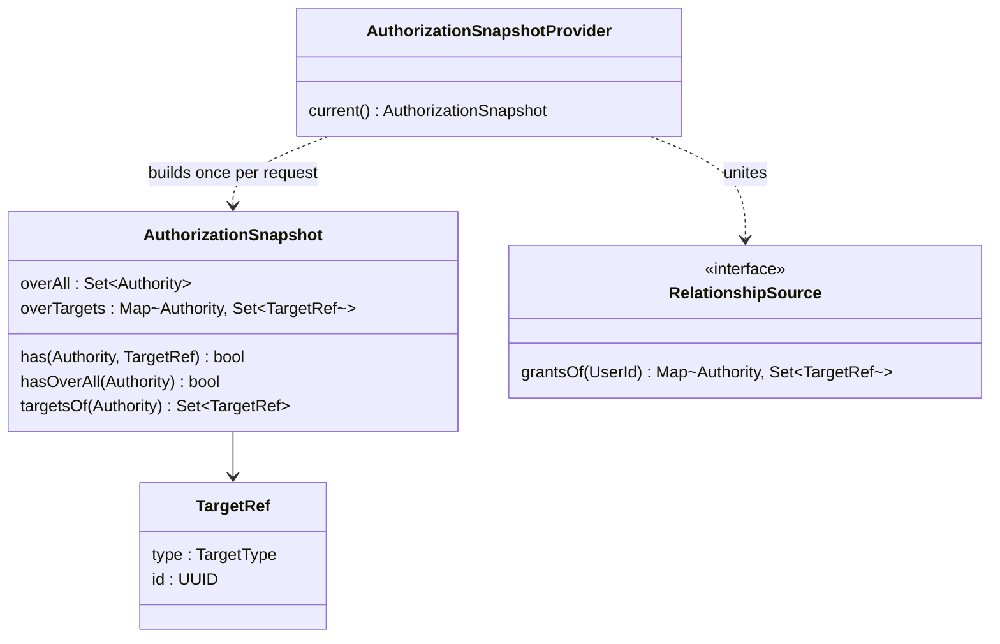

# Design

## Context

Current authorization (see proposal.md — Why):

```
JWT (issued at login) ── authorities claim ──▶ KlabisJwtAuthenticationToken.getAuthorities()
                                                     │
      ┌──────────────────────────────┬───────────────┼────────────────────────────┐
      ▼                              ▼               ▼                            ▼
HasAuthorityMethodInterceptor   HalFormsSupport   FieldSecurity serializer   imperative checks
@HasAuthority(one) OR           (same annotations,  + RequestBodyField-       (CurrentUserData.hasAuthority,
@OwnerVisible + @OwnerId == me   own code path)     AuthorizationAdvice)       canManage flags, …)
      └────────────── OwnershipResolver: "target == my userId/memberId" ─────────────┘
```

- Authorities are a JWT claim built at login by the authorization server (`AuthorizationServerConfiguration.jwtCustomizer`). `client_credentials` tokens get authorities expanded from OAuth scopes (`SCOPE_TO_AUTHORITIES`).
- `Authority.Scope` (`GLOBAL` / `CONTEXT_SPECIFIC`) has no runtime effect: only `AuthorizationPolicy.checkGlobalAuthorityNotGrantedViaGroup` reads it, and nothing calls that outside a test.
- The interceptor and `HalFormsSupport` evaluate the same annotations with separate code.
- Imperative checks bypass the annotations: `MemberController` (`canManage`), `OwnProfileEditRule` (minor may not edit self), `ManagementService.getMemberAndRecordView` (`canManageMembers` flag, birth-number access audit), `GuardianListAccess`, `EventController` / `EventManagementService` (`canManageEvents`), `TrainingGroupController` (`isMemberOf`), `MembershipFeeTierController`.
- `AccountStatusValidationFilter` already loads the user from the database on every request.
- The frontend never reads token authorities; it only follows HAL links and templates.

## Goals / Non-Goals

**Goals:**
- One authorization model in which "global" is a grant over every target of a kind.
- Pluggable relationship sources whose grants are united.
- A per-request, lazily loaded, immutable permission snapshot (one set per request).
- A single evaluator used by enforcement, affordances, field visibility, request-body field checks and application code.
- No functional change other than "permission changes apply immediately" — no relationship source grants anything yet.

**Non-Goals:**
- The first relationship-based authority (`MEMBERS:EDIT_PROFILE`) and its sources — `rebac-3`.
- Converting `x-klabis-owner-visible` operations (event registrations, finance, membership fees) to grants — each becomes a follow-up when a delegated authority needs it.
- An external authorization engine (SpiceDB, OpenFGA): the club has hundreds of members and few relationship kinds; an in-process model is sufficient.
- Querying "which targets may I act on" as a list filter in repositories.

## Decisions

### D1. Authority describes its target and its grant forms

```
Authority
  targetType : MEMBER | EVENT | NONE         what the authority is about
  grantForms : { ALL, SPECIFIC }              ALL      = may be held over everything
                                              SPECIFIC = may be held over specific targets
```

| Authority | targetType | grantForms |
|---|---|---|
| `MEMBERS_MANAGE`, `MEMBERS_READ`, `MEMBERS_PERMISSIONS` | MEMBER | {ALL} |
| `EVENTS_REGISTRATIONS` | MEMBER | {ALL} (SPECIFIC added when delegated) |
| `EVENTS_READ`, `EVENTS_MANAGE` | EVENT | {ALL} |
| `CALENDAR_MANAGE`, `GROUPS_TRAINING`, `FINANCE_MANAGE`, `SYNC_MANAGE`, `DEVELOPER` | NONE | {ALL} |

Derived rules:
- **Assignable in the permissions dialog** ⇔ `ALL ∈ grantForms` (minus standard authorities and `DEVELOPER`, as today).
- **Delegatable / derivable from a relationship** ⇔ `SPECIFIC ∈ grantForms`. An administrator authority is one with `{ALL}` only, so it can never be delegated.
- `Authority.Scope` and `AuthorizationPolicy.checkGlobalAuthorityNotGrantedViaGroup` are removed.

*Alternative considered:* separate enums for global and targeted permissions. Rejected — the same authority (e.g. `EVENTS_REGISTRATIONS`) must be holdable both ways, and the user explicitly wants "global = over all targets".

### D2. Grants and the permission snapshot



- `has(A, t) = A ∈ overAll ∨ t ∈ overTargets[A]`. Grants from a source are accepted only for authorities with `SPECIFIC` and matching `targetType` (a defensive check — a misbehaving source cannot hand out an administrator authority).
- `overAll` comes from `PermissionService` (the `user_permissions` row, plus standard authorities). `overTargets` is the union of all `RelationshipSource` beans.
- **Lazy and memoized per request** (request-scoped holder): the first authorization question in a request loads the whole snapshot (global + all sources) once; every later decision in the same request reads the same immutable object. That guarantees "one permission set per request" by construction.
- Sources return all grants of a user at once rather than answering per-target checks: one query per source per request, cheap per-row evaluation in lists, and it already supports a future "my wards" lookup. Volume is bounded by club size (hundreds).
- **Outside an HTTP request** (listeners, scheduled jobs) there is no snapshot; method security does not apply there today either.

*Alternatives considered:* (a) eager load in `AccountStatusValidationFilter` — wastes the relationship queries on the many requests that never ask; (b) per-check `check(user, A, target)` queries — N queries for a list and no single-set guarantee; (c) a materialized grants table maintained by domain events — risk of drift and backfills for every new relationship kind.

### D3. Where the code lives

New package `com.klabis.common.authorization` exposed as a named interface (`@NamedInterface("authorization")`): `Authority` metadata types, `TargetRef`, `TargetType`, `RelationshipSource` (SPI implemented by other modules, e.g. `groups`, `members` in `rebac-3`), `AuthorizationSnapshot`, `AuthorizationEvaluator`. Implementations of `RelationshipSource` live in the owning module's `infrastructure` and query their own repositories, consistent with ADR-001 (no module reads another module's repository).

### D4. Authentication reads the snapshot, tokens stop carrying authorities

- `KlabisJwtAuthenticationConverter` no longer reads the `authorities` claim for user tokens; `KlabisJwtAuthenticationToken.getAuthorities()` delegates to the request's snapshot (`overAll`), so Spring's own `hasAuthority` checks and `CurrentUserData` stay consistent with the evaluator.
- `client_credentials` tokens (no `user_id` claim) keep their scope-derived authorities from the token and have no targeted grants.
- The authorization server's token customizer stops emitting `authorities` for user grants. Login-time `KlabisUserDetailsService` keeps authorities only as far as Spring Authorization Server needs them for the login itself.
- Suspended/deactivated users are still rejected by `AccountStatusValidationFilter` before any authorization question.

*Alternative considered:* keep global authorities in the token and load only targeted grants per request. Rejected by the user decision that revocation must apply immediately, and because two sources of truth with different freshness break "one set per request".

### D5. One evaluator for every decision

`AuthorizationEvaluator` (request-scoped, over the snapshot) is the only component that answers authorization questions:

| Question | Used by |
|---|---|
| `canInvoke(method, targetClass, args)` | `HasAuthorityMethodInterceptor`, `HalFormsSupport` (affordances), `klabisLinkTo` link filtering |
| `canReadField(element, record)` | `FieldSecurityBeanSerializerModifier` / `SecuredBeanPropertyWriter` |
| `canWriteField(element, targetId)` / `canReadRequestField(…)` | `RequestBodyFieldAuthorizationAdvice`, HAL-FORMS property `isDisplayed` / `isReadOnly` |
| `has(authority)` / `has(authority, target)` / `isSelf(target)` | application code (replaces `CurrentUserData.hasAuthority`, `canManage…` flags, `SecuritySpelEvaluator.hasAuthority`) |

Rule for an operation or field with `authorities = [A1..An]`, optional target `t`, optional owner-visible:

```
allowed ⇔ ∃ Ai: (t present ? has(Ai, t) : hasOverAll(Ai))   ∨   (ownerVisible ∧ isSelf(t))
```

An ArchUnit test forbids reading `@HasAuthority`, `@OwnerVisible`, `@TargetId`, `OwnershipResolver`, `SecuritySpelEvaluator.hasAuthority` or `Authentication.getAuthorities()` anywhere outside `common.authorization` and `common.security`.

*Alternative considered:* keep the two code paths and add a parity test. Rejected — parity tests only cover the cases someone thought of; one code path makes divergence impossible.

### D6. Annotations and OpenAPI extensions

| OpenAPI | Java | Notes |
|---|---|---|
| `x-klabis-authority: MEMBERS_MANAGE` or `[MEMBERS_MANAGE, MEMBERS_EDIT_PROFILE]` | `@HasAuthority({…})` | list = any of; single value still accepted |
| `x-klabis-target-id: MEMBER` (path param or response property) | `@TargetId(TargetType.MEMBER)` | replaces `x-klabis-owner-id: true` / `@OwnerId` |
| `x-klabis-owner-visible: true` | `@OwnerVisible` | unchanged meaning: "target is me"; requires a `x-klabis-target-id` |
| `x-klabis-read-authority: [..]` (request property) | `@ReadAuthority({…})` | HAL-FORMS shows the field read-only when readable but not writable |

`tools/openapi-bundle/lib/validate.mjs` additionally checks: every authority in the list exists; an operation listing an authority with `SPECIFIC` has exactly one `x-klabis-target-id` parameter whose type equals that authority's `targetType` (`{ALL}`-only authorities are target-agnostic); `x-klabis-read-authority` only on request schemas. The validator reads `targetType`/`grantForms` from `Authority.java` the same way it reads the constant names today.

### D7. Imperative checks are migrated, behavior preserved

Each listed imperative check (see Context) is rewritten to ask the evaluator. Behavior is unchanged in this change; `OwnProfileEditRule` and the birth-number audit condition keep their current logic here and are replaced by relationship grants in `rebac-3`.

### D8. Testing support

- `@WithKlabisMockUser(authorities = {...}, targetGrants = {@TargetGrant(authority = …, type = MEMBER, ids = {...})})` installs a fixed snapshot through a test `AuthorizationSnapshotProvider`, so `@WebMvcTest`s need no database.
- Integration tests use the real provider and real sources.
- Existing tests that only set `authorities` keep working unchanged.

## Glossary

| Term | Meaning |
|---|---|
| Grant over everything | An authority held over all targets of its kind, including future ones (today's global authority) |
| Grant over a target | An authority held over one specific target (e.g. one member) |
| Target | The object an action or field is about, identified by type and id (`TargetRef`) |
| Grant form | Whether an authority may be held over everything (`ALL`), over specific targets (`SPECIFIC`), or both |
| Relationship source | A module-provided rule that derives targeted grants from a relationship (group ownership, being oneself, …) |
| Permission snapshot | The immutable set of a user's grants used for all decisions within one request |
| Owner-visible | Access to data because the target is the user themself |

## Risks / Trade-offs

- [Every authenticated request that asks an authorization question now costs 1 + N(sources) queries] → Lazy loading skips them for requests that ask nothing; sources return everything in one query each; target is <500 ms per request with 10+ concurrent users, far above this cost. Measured in the integration task.
- [Removing the `authorities` claim breaks any external client relying on it] → Only the first-party SPA and `client_credentials` clients exist; the latter are unchanged.
- [Spring Security internals expect immutable authorities on the token] → The delegating `getAuthorities()` returns the request's immutable snapshot; tests cover `hasAuthority` SpEL expressions still used by `@PreAuthorize`.
- [Big-bang annotation rename (`@OwnerId` → `@TargetId`) touches many generated APIs] → Done mechanically through the spec + templates in one task; the bundler validation catches misses.
- [Missing an imperative check leaves a second source of truth] → ArchUnit rule from D5 fails the build on direct authority reads.

## Migration Plan

No data migration. Deployment: users with tokens issued before the release keep working because authorities are no longer read from the token. Rollback: redeploy the previous version; tokens issued by the new version lack the claim, so users must log in again after a rollback.
