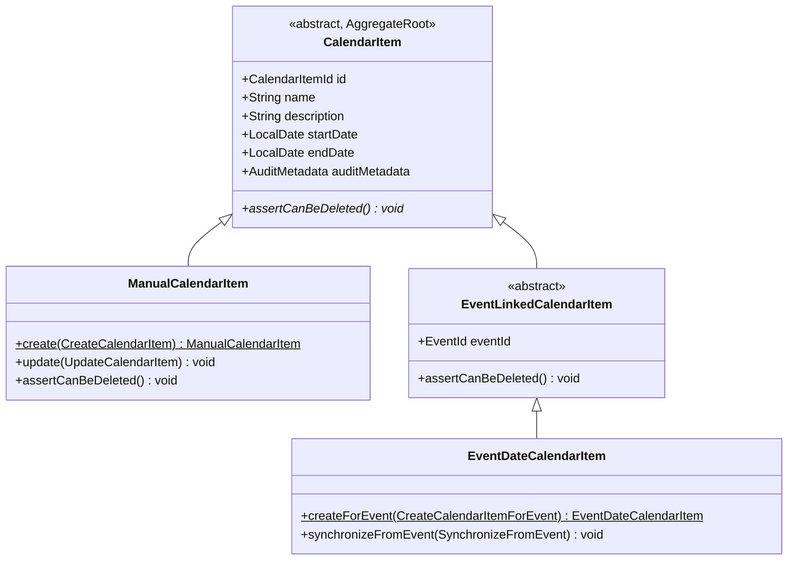

## Context

The `CalendarItem` aggregate today is a single class that plays two roles:

1. **Manual calendar item** — created, updated, and deleted by users with the `CALENDAR:MANAGE` authority.
2. **Event-linked calendar item** — created automatically when an event is published, updated when the event is modified, and deleted when the event is cancelled. Read-only from a user's perspective.

The two roles are distinguished by a nullable `eventId` field and a boolean method `isEventLinked()`. This flag is checked at runtime in multiple places (domain guards, application services, REST controller affordance logic) and every check is a place where a future variant could be forgotten.

An upcoming change will add a second event-linked variant: a calendar item that represents the **registration deadline** of an event. Both event-linked variants share the read-only nature and the lifecycle tie to an event, but they differ in label, date semantics (event date vs. deadline date), and synchronization rules (a deadline item may come and go as the event's `registrationDeadline` is set or cleared). Adding a second variant to the current design would require a second flag, or broadening `isEventLinked()` into a kind, and further scattering `switch`-like branching.

**Current state:**

- `CalendarItem` holds all fields, validations, and methods — including methods that are meaningless for one of the two roles (e.g. `update()` should never run on an event-linked item; `synchronizeFromEvent()` should never run on a manual item). Guards throw `CalendarItemReadOnlyException`.
- `CalendarRepository.findByEventId(EventId)` returns `Optional<CalendarItem>`, assuming at most one item per event — an invariant that will be broken by the upcoming change.
- `CalendarMemento` is a flat record with a nullable `eventId` — persistence discriminates by the nullity of `eventId`.
- `CalendarItemDto` is flat and does not expose the kind; the frontend does not distinguish kinds.

**Constraints:**

- No user-observable change. All scenarios in `openspec/specs/calendar-items/spec.md` remain valid.
- No REST API shape change.
- No frontend change.
- H2 in-memory, no production deployment — any schema change is local to `V001`.
- Must stay within Klabis backend patterns: clean architecture, DDD aggregates, package-private constructors, static factories, Spring Data JDBC with memento mapping, jMolecules annotations.

## Goals / Non-Goals

**Goals:**

- Express the distinction between manual and event-linked calendar items as a type hierarchy, not a runtime flag.
- Make read-only vs. editable a compile-time guarantee: methods that should not apply to a kind simply do not exist on that subtype.
- Prepare the repository API to return zero or more event-linked items for a single event, without committing to a specific set of kinds in the public API.
- Keep persistence as a single table with a discriminator column (single-table inheritance), because Spring Data JDBC does not support JPA-style multi-table inheritance.
- Keep the DTO flat and the REST API unchanged.
- Preserve all existing test assertions about user-observable behavior; only adjust test construction to the new factory API.

**Non-Goals:**

- Introducing a `RegistrationDeadlineCalendarItem` subtype. This belongs to the follow-up change.
- Adding a new discriminator value for the deadline kind. `CalendarItemKind` at the end of this change has two values: `MANUAL` and `EVENT_DATE`.
- Changing idempotence / reconciliation semantics of the event sync service (`handleEventUpdated` self-healing when the item is missing). The follow-up change will revisit this.
- Exposing the kind in the REST API. The frontend continues to be kind-agnostic.
- Adding any new database migration file. `V001` is updated in place (project convention: H2 resets on restart, there is no production data).

## Decisions

### Decision 1: Abstract base `CalendarItem` with an intermediate `EventLinkedCalendarItem`

**Rationale:**

- The intermediate `EventLinkedCalendarItem` lets the next change add `RegistrationDeadlineCalendarItem` as a sibling of `EventDateCalendarItem` without duplicating the `eventId` field, the `@Association`, or the read-only guard.
- `CalendarItem` knows nothing about events — the event coupling lives only under `EventLinkedCalendarItem`. This respects the dependency rule: the more general concept depends on nothing event-specific.
- `assertCanBeDeleted()` is abstract on the base: each subtype declares its own answer. `ManualCalendarItem` returns normally; `EventLinkedCalendarItem` throws `CalendarItemReadOnlyException`.

**Alternatives considered:**

- **Sealed types.** Java supports `sealed`/`non-sealed`, which would encode the closed hierarchy at the type level and enable exhaustive pattern matching. Rejected because Spring Data JDBC's reflection-based repository support does not play well with sealed hierarchies that use factory methods, and because the hierarchy is already effectively closed by convention (package-private constructors + static factories). If pattern matching becomes important later, sealing can be added without API impact.
- **Flat enum discriminator (`CalendarItemKind`) on a single class.** Rejected: it keeps the primitive obsession in the domain and forces every method to inspect the enum.

### Decision 2: Single-table persistence with a `kind` discriminator column

`CalendarMemento` remains a flat record with a new `kind` field. The Flyway `V001` script gains a `kind VARCHAR NOT NULL DEFAULT 'EVENT_DATE'` column. `CalendarRepositoryAdapter` performs the polymorphic dispatch:

- **memento → domain:** `switch` on `memento.kind()` invokes the `reconstruct` static factory on the appropriate subtype.
- **domain → memento:** pattern-match on the concrete subtype to derive the `kind` value and the event-link fields (`eventId`).

**Rationale:**

- Spring Data JDBC does not support JPA-style multi-table inheritance. A single table with a discriminator is the idiomatic mapping under Spring Data JDBC and is already the pattern used elsewhere in Klabis (user groups aggregates — see `project_user_groups_persistence`).
- Keeping the memento flat contains the "switch on kind" to the persistence adapter. Application and REST layers never see the discriminator.

**Alternatives considered:**

- **Three separate mementos** (one per subtype) with a single underlying table. Rejected: adds boilerplate without improving clarity; the mapping code needs to switch somewhere, and centralizing it in the adapter keeps mementos simple record types.
- **A table per subtype.** Rejected: Spring Data JDBC gives no native support, joins across tables for a polymorphic read are avoidable, and the domain is small enough that a discriminator column is clearer than multiple tables.

### Decision 3: `findByEventId` returns `List<CalendarItem>`

Before: `Optional<CalendarItem> findByEventId(EventId)`. After: `List<CalendarItem> findByEventId(EventId)`.

**Rationale:**

- The upcoming change will introduce a second event-linked item per event. Even today, returning a list lets callers filter by concrete subtype (`instanceof EventDateCalendarItem`).
- The repository contract no longer encodes an invariant ("at most one") that will soon be broken.

**Alternatives considered:**

- **Keep `Optional<CalendarItem>` and introduce `findByEventIdAndKind(EventId, CalendarItemKind)`.** Rejected: forces the application layer to know about the discriminator enum, which should stay in the persistence layer. `instanceof` against the domain type is more natural.
- **Add `findByEventIdAndType(Class<? extends EventLinkedCalendarItem>)`.** Rejected: reflects a persistence concern through a class literal at the application boundary; `findByEventId` + `instanceof` is simpler and equivalent.

### Decision 4: `CalendarItemDto` stays flat, frontend stays kind-agnostic

The DTO does not expose the kind. The frontend continues to decide affordances from HAL links (presence of an edit/delete affordance) and navigation from `_links.event` (presence indicates an event-linked item). None of this needs the kind.

**Rationale:**

- Nothing on the frontend varies by kind today, and the follow-up change's requirements are identical (both event-linked kinds navigate to the event detail on click, render with the same styling).
- Keeping the DTO stable avoids scope creep into OpenAPI regeneration, FE typing, and UI tests.

**Alternatives considered:**

- **Add a `kind` string field to the DTO.** Rejected: unused by the client; the backend convention is to expose affordances, not data fields, to drive client behavior.

### Decision 5: Replace `isEventLinked()` with `instanceof` at call sites

Call sites that previously branched on `isEventLinked()` — in `CalendarController` (affordance rendering) and implicitly in service layers — become `instanceof ManualCalendarItem` (editable) vs. the default (read-only, exposes `event` link).

**Rationale:**

- The predicate now carries the same information as the type. Using `instanceof` keeps the "editable kind" explicit and obvious to a future reader.
- When the next change adds `RegistrationDeadlineCalendarItem`, controller affordance logic needs **no change**: the new subtype is not a `ManualCalendarItem`, so it automatically gets read-only treatment.

**Alternatives considered:**

- **Retain `isEventLinked()` on the base as a convenience method.** Rejected: encourages new call sites to keep using the flag-style check and defeats the purpose of the refactor.

### Decision 6: `CalendarItemKind` enum is persistence-internal

`CalendarItemKind` lives under `com.klabis.calendar.infrastructure.jdbc` (or equivalent persistence package) and is used only by `CalendarMemento` and `CalendarRepositoryAdapter`. The domain and application layers do not reference it.

**Rationale:**

- The enum is an implementation detail of the single-table mapping. Exposing it to the application would invite `switch (kind)` blocks outside persistence, which is exactly what the type hierarchy exists to prevent.

**Alternatives considered:**

- **Place the enum in the domain package.** Rejected: creates two parallel ways to discriminate kinds (type vs. enum) and invites drift between them.

## Risks / Trade-offs

- **Risk:** Spring Data JDBC's `RowMapper` and `JdbcAggregateTemplate` do not automatically handle polymorphic return types through `CalendarJdbcRepository`. The adapter must build the domain object manually from the memento. → Mitigation: this is already the pattern for every Klabis aggregate (memento → `reconstruct` factory in adapter). No deviation from convention.

- **Risk:** Unit tests that construct `CalendarItem` through a helper (`CalendarItemTestDataBuilder`) must be rewritten. → Mitigation: builders are test-only; split the builder into `ManualCalendarItemTestDataBuilder` and `EventDateCalendarItemTestDataBuilder`, each delegating to the respective factory. Test scenarios remain identical.

- **Risk:** `CalendarItem.reconstruct(...)` is used by the adapter and takes all fields including `eventId`. After the refactor, the adapter must call a different `reconstruct` on each subtype. → Mitigation: each subtype exposes its own `reconstruct` factory with the fields it owns; the adapter's `switch(kind)` passes the right ones. The existing integration test `CalendarRepositoryAdapterTest` and `CalendarJdbcRepositoryTest` cover both round-trips.

- **Risk:** `AssociationResolver` / jMolecules annotations on `eventId` may behave differently when moved from the base class to the intermediate subclass. → Mitigation: `@Association` is a jMolecules marker annotation and does not affect runtime behavior; it is documentation/validation only. Verify that architecture tests (if any assert aggregate structure) still pass.

- **Risk:** The repository signature change from `Optional` to `List` ripples into every caller. → Mitigation: there are only two production callers (`CalendarEventSyncService`, and indirectly `CalendarManagementService` via other lookups) plus tests. Each site becomes a short filter chain. This is part of the change's scope and is covered by the task list.

- **Trade-off:** Three classes instead of one adds surface area to the domain package. Accepted because the classes have disjoint responsibilities and the increase is offset by the removal of runtime guards and the simpler controller/service logic.

## Migration Plan

Implementation order (within a single commit or a short commit chain):

1. Introduce `CalendarItemKind` enum (persistence-internal) and add `kind` to `CalendarMemento`. Update `V001` schema.
2. Make `CalendarItem` abstract: extract `ManualCalendarItem`, `EventLinkedCalendarItem`, `EventDateCalendarItem`. Move the appropriate factories and methods onto each subtype.
3. Update `CalendarRepository.findByEventId` signature to return `List<CalendarItem>`.
4. Rewrite `CalendarRepositoryAdapter` to perform polymorphic memento↔domain dispatch.
5. Update `CalendarJdbcRepository` queries to select/store the `kind` column and to return lists where needed.
6. Update `CalendarEventSyncService` to filter event-linked items to `EventDateCalendarItem` and use its synchronization method.
7. Update `CalendarManagementService` to use `ManualCalendarItem` factories/methods.
8. Update `CalendarController` affordance rendering from `isEventLinked()` to `instanceof ManualCalendarItem`.
9. Update tests and test data builders.
10. Run full test suite; all behavior-level assertions must pass unchanged.

**Rollback:** pure in-repo refactor. If issues arise, revert the commit(s). No data to roll back (H2 resets on restart).

## Open Questions

None. All design decisions are settled. Any ambiguity surfaced during implementation should be resolved by staying as close as possible to the existing Klabis conventions for aggregates and memento mappings.
