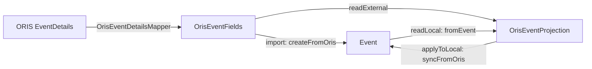

## Context

See the proposal for motivation. The short version: `OrisEventFieldsGateway` exists to
let an adapter in `com.klabis.oris.eventsync` reach `Event.syncFromOris`, justified in
its javadoc as avoiding a `sync ↔ events` cycle that measurement shows does not exist —
`com.klabis.sync` imports nothing from `com.klabis.events`.

Four facts constrain the design, all verified against the code rather than the javadoc:

1. **The ORIS data exists in two shapes, and the conversion between them is exactly
   1:1.** `OrisEventFieldsToProjectionMapper` and `OrisEventProjectionToFieldsMapper` are
   mutual inverses with no field dropped in either direction, including
   `resolvedEventTypeId`.
2. **The two shapes exist for incompatible reasons.** `OrisEventFields` holds domain
   value objects (`RegistrationDeadlines`, `Money`, `EventRanking`, `WebsiteUrl`,
   `EventCategory`) because `Event.createFromOris` and `Event.syncFromOris` take them.
   `OrisEventProjection` is flat and JSON-friendly because `SyncProjectionCodec`
   serialises it with `SORT_PROPERTIES_ALPHABETICALLY` for storage *and* hashing, and
   value objects built on `Optional` do not survive that round trip.
3. **`OrisEventDetailsMapper` is already `events.application`-private** and already
   serves both the import flow and the sync read. It is not the problem; the port
   wrapped around it is.
4. **`@OrisIntegrationComponent` is applied by seven classes**, five of them already in
   `events`. Its current home in `com.klabis.oris` is the sole cause of the
   `events → oris` edge.

## Goals / Non-Goals

**Goals:**

- The ORIS event sync adapter reaches `Event` and `EventRepository` as a module
  collaborator, not through a primary port that exists only to cross a package boundary.
- `OrisEventFieldsGateway`, `OrisEventFieldsGatewayService` and the two
  Fields↔Projection mappers are gone.
- `com.klabis.oris` depends on `events` through exactly one port, and that constraint is
  enforced by `ModuleStructureVerificationTest` rather than assumed.
- The persisted `OrisEventProjection` JSON is byte-identical before and after.

**Non-Goals:**

- Changing what the engine compares, when a pass runs, or how conflicts and retries
  behave. `SynchronizationAdapter`'s contract, `pullOnly` capabilities and the empty
  `externalVersion` are carried over untouched.
- Moving `OrisController` or any REST endpoint. `/api/oris/events` serves the UI's
  "Import from ORIS" dialog and stays where it is.
- Merging `OrisEventFields` into `OrisEventProjection` — see D3.
- Touching `Event.syncFromOris`, the category merge, or field-ownership rules.
- Resolving the self-inflicted dirty marker (`sync-skip-self-inflicted-dirty-marker`
  owns that, and touches different files).

## Decisions

### D1 — Target package is `events.infrastructure.orissync`

The adapter is a driven adapter implementing `sync`'s `SynchronizationAdapter` secondary
port. `events.infrastructure` is where this module already keeps its driven adapters
(`listeners`, `restapi`), so the sync adapter belongs beside them, not in
`events.application`.

The projection and its mapper move with it: `OrisEventProjection` is the wire format of
this specific adapter, not a module-wide concept, and `OrisEventProjectionMapper.fromEvent`
reads `Event` for that adapter alone.

*Alternative rejected:* `events.application`. That is where ports and orchestration live;
an adapter that implements another module's SPI is not application logic, and putting it
there would blur the one distinction this change is trying to sharpen.

### D2 — The gateway's two methods fold into the adapter's two methods

`readOrisFields` → `readExternal`, `applyOrisSync` → `applyToLocal`. That is the whole
of it, but two details must be carried deliberately rather than rewritten:

- **The category-removal warning.** `warnIfSyncRemovesCategoriesWithRegistrations` logs
  when an inward write would drop categories that still carry registrations. It is the
  only diagnostic on this path and must move verbatim into `applyToLocal`.
- **Transaction boundaries.** `readOrisFields` is `@Transactional(readOnly = true)`
  (it reads `EventTypeRepository`); `applyOrisSync` is `@Transactional`. The adapter's
  methods must carry the same annotations. Losing the write transaction on `applyToLocal`
  would break the `EventRepository.save` at its end; design.md D12 additionally requires
  that no transaction spans the external HTTP call, which `readExternal` must continue to
  honour.

### D3 — `OrisEventFields` stays; the two types are not merged

Open question 2 in the proposal asked whether `OrisEventFields` and `OrisEventProjection`
are one type under two names. The conversion being lossless says they carry the same
*information*; they are still not the same *type*, because each is pinned by a consumer
that cannot accept the other:

| | `OrisEventFields` | `OrisEventProjection` |
|---|---|---|
| Consumer | `Event.createFromOris`, `Event.syncFromOris` | `SyncProjectionCodec` |
| Shape | domain value objects | flat, JSON-friendly |
| Pinned by | builder signatures take `RegistrationDeadlines`, `Money`, `EventRanking` | canonical JSON: alphabetical field order, `BigDecimal` normalisation, `Optional` does not round-trip |

Merging in either direction moves cost rather than removing it: a flat type would make
`Event.createFromOris` reassemble value objects at every call site; a domain-typed
projection would need custom Jackson wiring the codec deliberately avoids, and would risk
the canonical form — the one thing this change promises not to disturb.

What actually disappears is not a type but a *detour*. Today the external read goes
`EventDetails → OrisEventFields → OrisEventProjection`, and the inward write goes
`OrisEventProjection → OrisEventFields → Event`. After the move:

`OrisEventFields` keeps one job — the import path — plus the shared `EventDetails`
mapping. The inward write no longer passes through it: `applyToLocal` builds
`EventSyncFromOrisBuilder` from the projection directly, which is what deletes
`OrisEventProjectionToFieldsMapper`.

**Consequence to accept:** reassembling `RegistrationDeadlines`, `Money`, `EventRanking`
and `EventCategory` from flat fields moves out of the deleted mapper and into
`applyToLocal`. The code does not vanish, it relocates — the saving is the round trip and
the port, not the reassembly itself.

### D4 — `readExternal` keeps going through `OrisEventFields`

`readExternal` could map `EventDetails → OrisEventProjection` directly and skip
`OrisEventFields` entirely. It should not: `OrisEventDetailsMapper` holds non-trivial
rules — organizer fallback across `org1`/`org2` to `"---"`, deadline validation raising
`BusinessRuleViolationException`, base fee derived as the maximum class fee, category
filtering on blank names — and the import path needs every one of them. A second mapper
from `EventDetails` would duplicate that logic and let the two paths drift, which is the
exact failure `OrisEventDetailsMapper`'s javadoc says it was extracted to prevent.

So the external read stays `EventDetails → OrisEventFields → OrisEventProjection`; only
the inward write loses its intermediate hop. The surviving Fields→Projection conversion
moves into `events.infrastructure.orissync` as a package-private helper (it is
`OrisEventFieldsToProjectionMapper`'s body, relocated rather than deleted).

This means `OrisEventFields` and the discipline resolution must be reachable from
`events.infrastructure.orissync`. Both are package-private in `events.application` today,
so one of them must widen to public-within-module. Preferred: expose a small
`events.application`-owned collaborator (the `EventDetails` fetch plus discipline
resolution, i.e. what `OrisEventFieldsGatewayService.readOrisFields` does minus the port)
rather than widening `OrisEventDetailsMapper` itself — the adapter should depend on one
named seam, not on two package-private statics.

### D5 — `@OrisIntegrationComponent` moves to `com.klabis.common` directly

It is a meta-annotation over `@Profile("oris")` and `@Component` with no ORIS-specific
content. `com.klabis.common` is declared `@ApplicationModule(type = OPEN)` precisely so
its types can be used from any module without non-exposed-type violations, and the
annotation has no natural sub-package there — it sits beside `ClockConfiguration` and
`ClubProperties`.

The move rewrites one import line in seven classes and is otherwise mechanical. It is the
enabling step for D6.

### D6 — `com.klabis.oris` is promoted to a Modulith module

After D5 its only outbound edge into `events` is `ImportedOrisEventsPort`. Declaring
`@ApplicationModule` on a new `com.klabis.oris.package-info` turns the boundary from
convention into a build-time check — the four `oris → events.domain` imports this change
removes would have failed the build had the module existed.

**Implementation note:** the generated `OrisImportApi`, `OrisEventSummary` and
`OrisEventSummaryBuilder` land in the module's root package (pinned by
`openApiModule(module = "oris", pkg = "com.klabis.oris")` in `build.gradle`), so they are
exposed by default and Spring MVC keeps seeing them. Verify this rather than assume it:
if the declaration turns out to restrict the generated API, `Type.OPEN` is the fallback,
and the promotion is severable from the rest of the change if it proves awkward.

## Risks / Trade-offs

**[The canonical projection form changes] → Pin it with a test before moving.**
`SyncProjectionCodec` uses one canonical form for two purposes, and the move threatens
them unequally:

- *Hashing, within a single pass.* `readLocal` and `readExternal` both go through the
  codec and their `SyncHash` values are compared. If the move let the two sides emit
  different field sets — say `fromEvent` and the new `readExternal` path drifting apart —
  every pass would report divergence immediately. **This half is not mitigated by the
  database being empty**: it needs no stored data to go wrong, only one pass.
- *Storage, across restarts.* The projection is persisted to the encrypted projection
  columns and read back on the next pass. A changed field name, field set or `@JsonIgnore`
  would make every stored projection mismatch what the new code produces.

The storage half is, for now, **not a live risk**: every deployment runs on in-memory H2
(`jdbc:h2:mem:klabis`, the default profile in `application.yml` and
`runLocalEnvironment.sh`), so each restart starts from an empty schema and no projection
written by the old code is ever read by the new one. `application-postgresql.yml` and the
Postgres/Flyway dependencies exist but are not yet used anywhere; `build.gradle.kts`
carries an *"After migrate to postgres"* note marking that as future work. So this half
should be understood as dormant rather than handled — whoever performs the Postgres
migration inherits it, and it only bites if a projection's shape changed in the meantime
without anyone noticing.

Mitigation, driven by the first half and cheap enough to cover both: carry the record
component list over character-for-character, and add a test asserting the canonical JSON
of a fully-populated projection *before* the move, so it can fail meaningfully rather than
be written to match whatever the new code happens to emit.

**[`resolvedEventTypeId` loses its `@JsonIgnore`] → Covered by the same test.** It is the
single field that violates the projection's own "plain JSON types" rule, and it is
`@JsonIgnore`d so the Klabis-owned event type never reaches hashing or storage. A move
that drops the annotation would silently start hashing a Klabis-owned field — the class of
bug this whole boundary exists to prevent.

**[A bean cycle appears] → Confirm by starting the context, not by reasoning.** The
adapter registers into the sync engine while `OrisEventImportService`, in the same module,
calls `SynchronizationPort`. The package move does not change Spring's view of this, but
the adapter gains an `EventRepository` dependency. If a cycle does appear, `ObjectProvider`
on the adapter registry is the intended fix — not restoring the port.

**[The category-removal warning is lost in the fold] → Named explicitly in tasks.** It is
easy to overlook while merging two methods into two other methods, and its absence is
invisible until an event silently loses a category that had registrations against it.

**[Merge conflict with `sync-skip-self-inflicted-dirty-marker`] → Textual only.** That
change describes the call path `OrisEventSyncAdapter.applyToLocal →
OrisEventFieldsGatewayService.applyOrisSync` in its proposal, but modifies
`EventUpdatedEvent`, `Event` and `EventsSyncListener` — no file overlap. Whichever lands
second should update the other's prose.

**[Trade-off accepted: `events` grows]** The `events` module absorbs the adapter and its
projection, so it now knows both ORIS's data shape and `sync`'s SPI. That is a real
increase in what one module holds. It is preferred to the alternative, where the same
knowledge sits outside the module and buys itself access through a port — the knowledge is
the same either way, and only the boundary violation differs.

## Open Questions

1. **What exactly does `events.application` expose to the adapter (D4)?** The shape of the
   seam — a small interface, a package-private-widened static, or a `@Component` — should
   be settled when the code is in front of you. The constraint is one named seam, not two.

2. **Does `@ApplicationModule` on `com.klabis.oris` leave the generated API visible
   (D6)?** Determined by running `ModuleStructureVerificationTest` and starting the
   context. If it does not, `Type.OPEN` or deferring D6 are both acceptable.
