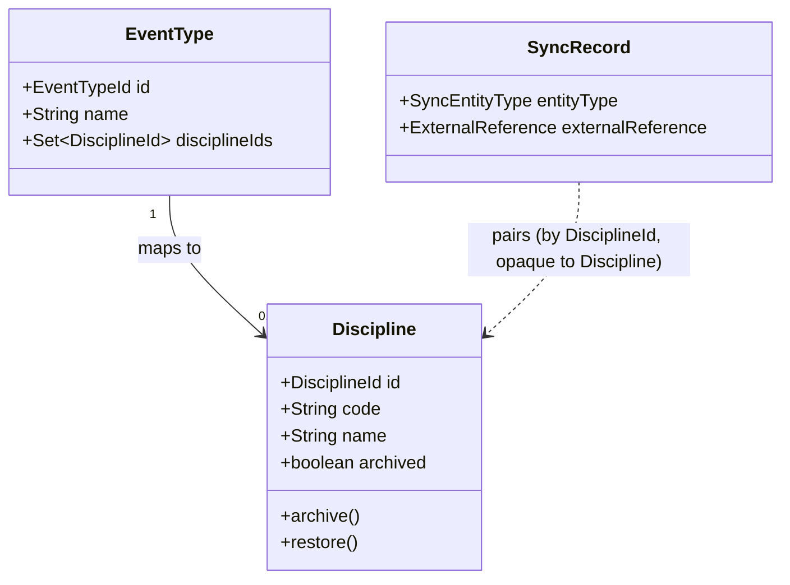

# Design

## Context

Today, `EventType` (`com.klabis.events.domain.EventType`) holds a `Set<Integer> orisDisciplineIds`, persisted via `OrisDisciplineMemento` into `events.event_type_oris_disciplines(event_type_id, discipline_id)` — raw ORIS integers, no local name or record. The only place ORIS discipline data is read is `EventTypeManagementService.listDisciplineOptions()`, which calls `orisApiClient.get().listDisciplines()` live on every request to build the HAL-FORMS picklist for the event type form.

Separately, `com.klabis.sync` is a generic, entity-agnostic bidirectional synchronisation engine (ADR-005, `docs/design-decisions.md`). Its only integration today is `OrisEventSyncAdapter` (`com.klabis.events.infrastructure.orissync`), a pull-only-creating adapter for `Event`. Per ADR-005/D2, an entity synced through the engine carries no `orisId` field itself — the pairing lives entirely in the engine's own `SyncRecord`/`ExternalReference` tables. `Event`'s pairing is always created explicitly, either by a user importing a specific ORIS event (`OrisEventImportService`) or a bulk admin import of chosen ORIS ids (`OrisEventBulkImportService`) — there is no existing mechanism for the engine to discover external records on its own.

See proposal.md - Why / What Changes for the motivation.

## Goals / Non-Goals

**Goals:**
- Replace the raw-integer discipline reference on `EventType` with a proper local `Discipline` record (code, name), following the same "no `orisId` column, engine owns the pairing" shape as `Event`.
- Route the event-type discipline picklist through local data instead of a live ORIS call.
- Keep the local catalog current automatically, with no manual per-discipline admin action.
- Reuse the existing `sync` engine and its `SynchronizationAdapter` contract unchanged — no new engine capability beyond what this change's discovery step needs.
- Give managers a CRUD API over the local `Discipline` catalog, with HAL links/affordances following the same shape as `EventTypeController`, and a soft-delete (archive) that never breaks an existing `EventType`'s reference.

**Non-Goals:**
- No outward (Klabis → ORIS) writes for disciplines — ORIS is the sole source of truth (same as events).
- No handling of ORIS discipline *removal*; pull-only sync has no delete semantics today, and ORIS disciplines are not observed to disappear in practice.
- No change to `Event`'s own sync behaviour or the `OrisEventSyncAdapter`.
- No UX/behaviour change to the frontend event-type form — it continues to consume the same `HalFormsInlineOption` shape for the discipline picklist. (The property's wire *name* and id *type* do change, per D2 — see that decision for why, and the corresponding frontend task in tasks.md for the mechanical follow-through: regenerated types plus the two hardcoded `orisDisciplineIds` string references.)

## Decisions

### D1: `Discipline` is a plain local aggregate, keyed by a generated local id, not the ORIS id

Alternative considered: key `Discipline` by the ORIS integer id directly (it's already a small, stable, natural key ORIS itself treats as an enum). Rejected to stay consistent with `Event`'s precedent and ADR-005's rule that a synced entity's local identity is independent of the external system — if Klabis ever needs a non-ORIS discipline, or ORIS renumbers, the local id is unaffected. The cost (an extra generated id) is negligible for a small reference table.

### D2: `EventType.orisDisciplineIds: Set<Integer>` becomes `EventType.disciplineIds: Set<DisciplineId>`

`events.event_type_oris_disciplines.discipline_id` changes from `INT` to a `UUID` foreign key into the new `events.disciplines` table. Since there is no production environment yet (backend `CLAUDE.md`), this is a direct edit to `V001__initial_schema.sql`, not an additive migration. `OrisDisciplineAlreadyMappedException` / `validateNoDisciplineIdConflict` keep their behaviour, now keyed on the local id.

**This also changes the `EventTypeController` REST contract**, correcting what an earlier draft of this design assumed (see the old wording this replaces, under "API Changes" below). `EventTypeDto`/`CreateEventTypeRequest`/`UpdateEventTypeRequest`'s `orisDisciplineIds: integer[]` becomes `disciplineIds: uuid[]`, referencing local `Discipline` ids directly — not the ORIS integer. This is not an independent choice; it falls out of D5: once `listDisciplineOptions()` serves the `createEventType`/`updateEventType` picklist from the local `Discipline` catalog, the option *values* it hands the client are local `DisciplineId`s (a `Discipline` has no ORIS integer to offer any more). A client can therefore only ever submit a local id back, so the request/response field must speak that language too — an ORIS-integer wire format would need a value the picklist no longer has. Resolving local-id submissions back to ORIS integers via the sync engine (mirroring D6) was considered and rejected: it would require every event-type create/update to make a sync-pairing lookup for no benefit, since the local id is already exactly what `EventTypeRepository.findByDisciplineId` (D2) and every other consumer wants. `CreateEventTypeRequestConverter`/`UpdateEventTypeRequestConverter`/`EventTypeDtoConverter` map the renamed field directly, with no sync-engine involvement at this boundary.

**Frontend impact**: this is a real, if small, break — the frontend's generated API types (`klabisApi.d.ts`/`halTypes.ts`) come from this spec, and two places hardcode the property name as a string rather than a generated constant: the event-type form's `HalFormsCheckboxGroup` (which reads options for a named property) and `labels.ts` (a display label keyed by field name). Regenerating types alone would leave those two silently matching nothing. This is in scope for this change (not deferred) — see tasks.md's frontend task under Group 2 — but is a mechanical rename, not a UX or behaviour change: the picklist still renders the same way, backed by the same `HalFormsInlineOption` list, just keyed by a differently-named, differently-typed id.

### D3: Disciplines sync through a new `DisciplineSyncAdapter`, capabilities `pullOnlyCreating()`

Mirrors `OrisEventSyncAdapter` exactly: `SyncEntityType.DISCIPLINE("disciplines")`, `ExternalSystem.ORIS`, `SyncCapabilities.pullOnlyCreating()`. `readExternal`/`readLocal` map to a `DisciplineProjection(code, name)`. Lives in `com.klabis.events.infrastructure.orissync`, next to the event adapter, per ADR-005 ("lives in the module that owns the entity").

### D4: A scheduled discovery step drives enrolment, reusing `SynchronizationPort.pullAndEnroll`, on its own schedule

The engine has no built-in "list the external system and enrol anything new" primitive — every existing adapter is driven by a caller that already knows the external id. Disciplines have no such caller: nobody names "ORIS discipline 7" the way an admin names an ORIS event. A small scheduled `DisciplineDiscoveryJob`:

1. Calls `orisApiClient.listDisciplines()` once.
2. Filters out ids already paired via `SynchronizationPort.findByExternalReferences(DISCIPLINE, ORIS, allIds)`.
3. Calls `SynchronizationPort.pullAndEnroll(SyncEntityType.DISCIPLINE, externalReference, actingUser = null)` for each new id.

This adds no new port method — `pullAndEnroll` already creates the local entity, pairs it, and runs the initial pass (design.md of `add-bidirectional-sync-engine`, D8). Already-paired disciplines are kept current by the engine's existing nightly/due-date scan; the discovery job only ever handles *new* ids. `actingUser = null` mirrors the scheduler's existing convention for system-triggered passes (`SynchronizationPort.synchronizeNow` already accepts `null` for the same reason).

**Resolved (was an open question): the discovery job runs on its own schedule**, not `klabis.sync.scan-cron`/`due-scan-interval`. Disciplines change far less often than events, and coupling the two would force one schedule to fit two very different change rates. New property `klabis.disciplines.discovery-cron` (default e.g. `0 0 3 * * *`, nightly, offset from the sync engine's own `0 0 2 * * *` so the two jobs don't contend), externalized via `KLABIS_DISCIPLINES_DISCOVERY_CRON`, following the same `@ConfigurationProperties`-with-coded-default convention `SyncProperties` already uses.

### D5: `EventTypeManagementService.listDisciplineOptions()` reads the local catalog

Drops the `Optional<OrisApiClient>` constructor dependency entirely; replaced with a `DisciplineRepository.findAllSorted()`-style read, mapped to `HalFormsInlineOption` the same way. No change to the HAL-FORMS contract the frontend consumes.

### D6: Resolving an event's ORIS discipline to a local `EventType` goes through the sync engine's pairing, not a new `orisId` lookup

`OrisEventFieldsReader.resolveEventTypeFromOrisDiscipline` currently calls `EventTypeRepository.findByOrisDisciplineId(int)` — a lookup keyed on the raw ORIS integer, backed by the raw integers stored in `event_type_oris_disciplines` today. Once that column is a `DisciplineId` FK (D2), `EventTypeRepository` can no longer resolve from an ORIS integer directly; it only knows local ids, consistent with removing `orisId`-shaped concepts from `events.domain` per ADR-005.

The resolution becomes two steps, both already-existing primitives:
1. `SynchronizationPort.findByExternalReferences(SyncEntityType.DISCIPLINE, ExternalSystem.ORIS, List.of(String.valueOf(orisDisciplineId)))` — resolves the ORIS integer to the paired `DisciplineId` (as `SyncedEntityReference.target().entityId()`), or nothing if that discipline has not been discovered yet (D4) or ORIS sent an id Klabis has never seen.
2. `EventTypeRepository.findByDisciplineId(DisciplineId)` (replaces `findByOrisDisciplineId(int)`) — a purely local lookup.

`OrisEventFieldsReader` (in `events.application`) gains a dependency on `SynchronizationPort` (in `sync.application`) to perform step 1 — the same kind of module-internal-to-generic-engine dependency `EventsSyncListener` and `OrisEventSyncAdapter` already have. If step 1 finds no pairing (discipline not yet discovered), the event simply gets no auto-mapped event type, exactly as today's "ORIS uses id 0 as sentinel for a missing discipline" branch already tolerates an unresolved discipline.

Alternative considered: keep `EventTypeRepository.findByOrisDisciplineId(int)` and have it internally query the sync tables. Rejected — it would leak ORIS/sync concepts into the `events.domain` repository port, which per ADR-005 should stay unaware of any external system; the two-step lookup keeps that awareness in `events.application`/`sync`, where `OrisEventFieldsReader` already knows about ORIS.

### D7: A manager-facing CRUD API over `Discipline`, mirroring `EventTypeController` — editable only when not ORIS-managed

Even though the catalog is normally filled by discovery (D4), a manager can also create a discipline by hand (e.g. one ORIS has not published yet). This follows the exact shape already established for `EventType`: a spec-first `DisciplinesApi` (`docs/openapi/spec/events.yaml`), a `DisciplineController` implementing it, `DisciplineManagementPort`/`DisciplineManagementService` in `events.application`, HAL links (`self`, `collection`) and HAL-FORMS templates (`createDiscipline`, `updateDiscipline`, `archiveDiscipline`, `restoreDiscipline`) gated by `x-klabis-authority`, same as `createEventType`/`updateEventType`/`deleteEventType`.

Authority: reuses `EVENTS_READ`/`EVENTS_MANAGE` rather than introducing a new authority. Disciplines only exist to feed the event-type mapping (D5's picklist); they have no independent meaning elsewhere in the domain, so a separate authority would add ceremony without a real access-control distinction.

**Editing is refused outright for any discipline paired to ORIS, active or retired** — `code`/`name` stay ORIS's exclusive responsibility, matching ADR-005's framing that a synced entity's ORIS-owned fields are not Klabis's to change. This replaces the originally-considered "let the edit through and surface the disagreement as a sync conflict" approach: simpler, and it avoids ever needing the generic conflict-resolution flow for a case where the answer is always "ORIS wins" anyway. `DisciplineManagementService.updateDiscipline` checks `SynchronizationPort.findByTarget(target).isPresent()` before allowing the write; a `DisciplineNotEditableException` (409, same family as `OrisDisciplineAlreadyMappedException`) is thrown if it is paired. `DisciplineController` hides the `updateDiscipline` HAL-FORMS template entirely for such a discipline, so the refusal is normally never reached over HTTP — the exception is defense in depth for a direct `PUT`.

A discipline created manually (never paired) has no such restriction: it is fully editable, since Klabis is its only source of truth.

### D8: Archiving is a soft delete that reuses the sync engine's existing retire/reactivate lifecycle

"Delete" must never break an `EventType`'s reference to a `Discipline` still in use — unlike `EventType.delete`, which refuses when an event still references the type (`EventTypeManagementService.deleteEventType`), archiving a `Discipline` SHALL always succeed regardless of how many event types reference it. `Discipline` gains an `archived: boolean` flag; archiving never deletes the row or touches `event_type_oris_disciplines`, so every existing FK stays valid and an archived discipline keeps whatever `code`/`name` it last had.

Archiving is modelled as the same "entity reaches the end of its life" case `data-synchronization`'s existing requirements already cover for `Event` (`EventsSyncListener` retiring on `EventFinishedEvent`/`EventCancelledEvent`): `Discipline.archive()` publishes a `DisciplineArchivedEvent`; a new `DisciplineSyncListener` (mirroring `EventsSyncListener`) retires the discipline's `SyncRecord` via `SynchronizationPort.retire`, a no-op if the discipline was never paired to ORIS (manually created). Restoring reverses both: `Discipline.restore()` clears the flag, and the controller looks up the existing `SyncRecord` via `SynchronizationPort.findByTarget` for its `ExternalReference`, then calls `pullAndEnroll` again — exactly the existing "reactivate a retired pairing... starting over from the external system's values" behaviour `data-synchronization` already specifies, needing no new engine capability. Restoring a discipline that was never paired is a pure domain-only flag flip (`findByTarget` returns empty, nothing to reactivate).

Alternative considered: a hard delete guarded the same way `EventType.delete` is (refuse if referenced). Rejected — it's exactly what the user asked to avoid: any club that has ever assigned a discipline to an event type would find deletion permanently blocked once ORIS retires or duplicates a discipline, with no way to tidy the picklist.

### D9: Every discipline representation carries a `sync` link, mirroring `EventController`'s existing pattern exactly

`data-synchronization`'s existing "shown to any signed-in user whether it is kept in step" requirement already applies to `Discipline` the moment it becomes a `SyncEntityType` (D3) — this decision is purely about wiring the existing generic sync-state surface into the `Discipline` HAL representation, not new spec-level behaviour.

`EventController` already does exactly this for `Event`: a `sync` link to `SyncApi.getSyncState(SyncEntityTypeParam.EVENTS, id)`, added only when the entity is actually enrolled (`isEnrolled(eventId)`), batched via `SynchronizationPort.findActiveByTargets` for a list response and `findByTarget` for a single-item response, both cached in `HalResponseContext` (`EnrolledEventIds`) so the postprocessor never queries the sync module per row. `DisciplineController` copies this verbatim:
- `getDiscipline` calls `synchronizationPort.findByTarget(target)` once and stores the result (as `EnrolledDisciplineIds`, a one- or zero-element set) in `HalResponseContext`.
- `listDisciplines` calls `synchronizationPort.findActiveByTargets(DISCIPLINE, pageIds)` once for the whole page and stores the resulting id set the same way.
- The shared postprocessor adds `klabisLinkTo(methodOn(SyncApi.class).getSyncState(SyncEntityTypeParam.DISCIPLINES, id)).ifPresent(link -> dtoModel.add(link.withRel("sync")))` to every `DisciplineDto`, list or detail, whenever its id is in that set.

This lookup is the same one D7 needs to decide whether `updateDiscipline` may be offered (a discipline is ORIS-managed exactly when it has an active sync pairing) — `EnrolledDisciplineIds` doubles as the "is this discipline ORIS-managed" signal for both the `sync` link and the conditional `updateDiscipline`/`archiveDiscipline`/`restoreDiscipline` templates, with a single sync lookup per request driving all of it. A manually created, never-paired discipline gets no `sync` link, exactly as an un-enrolled `Event` gets none today.

### D10: `GET /api/disciplines` is paginated, following `listEvents` rather than `listEventTypes`

Follows the `listEvents` shape exactly: `Pageable` (`PageParam`/`SizeParam`), `x-spring-paginated: true`, and the standard `self`/`first`/`last`/`next`/`prev` HAL paging links, rather than `listEventTypes`' plain unpaged array. Chosen for two reasons: the catalog's size is open-ended (ORIS discovery plus manual creation, D7) unlike the short, deliberately curated `EventType` list, and the frontend's generic paged-list handling (the HAL table component already drives itself off `first`/`last`/`next`/`prev` links for `listEvents`) then needs no special unpaged case for this resource either.

`DisciplineManagementService.listDisciplines` takes a `Pageable` and returns `Page<Discipline>`; `DisciplineRepository` gains a paginated query for it. This is separate from `DisciplineRepository.findAllSorted()` (D5), which stays an unpaged `List<Discipline>` — it only ever backs the small, in-memory `HalFormsInlineOption` list for the event-type picklist, not the `/api/disciplines` collection resource, so paginating it would add no value and would complicate D5's call site for no reason.

## Domain Changes

| Element | Change |
|---|---|
| `Discipline` (new, `events.domain`) | Added. Local aggregate: `DisciplineId`, `code`, `name`, `archived`; `archive()`/`restore()`. No `orisId` field — pairing lives only in `sync`'s `SyncRecord`. |
| `DisciplineId` (new) | Added. Type-safe id, same pattern as `EventTypeId`. |
| `DisciplineArchivedEvent` (new) | Added. Published by `Discipline.archive()`; consumed by `DisciplineSyncListener` to retire the sync pairing (D8). |
| `EventType.orisDisciplineIds: Set<Integer>` | Changed to `disciplineIds: Set<DisciplineId>`. |
| `EventTypeDto`/`CreateEventTypeRequest`/`UpdateEventTypeRequest` (`docs/openapi/spec/events.yaml`) | Changed: `orisDisciplineIds: integer[]` renamed to `disciplineIds: uuid[]` (D2); `CreateEventTypeRequestConverter`/`UpdateEventTypeRequestConverter`/`EventTypeDtoConverter` updated to match. |
| `OrisDisciplineMemento` | Changed: `discipline_id` column changes from raw `int` to `DisciplineId`'s `UUID`. |
| `SyncEntityType` | Changed: new `DISCIPLINE("disciplines")` value added alongside `EVENT`. |
| `DisciplineSyncAdapter` (new, `events.infrastructure.orissync`) | Added. Implements `SynchronizationAdapter` for `Discipline`/ORIS. |
| `DisciplineDiscoveryJob` (new, `events.infrastructure.orissync`) | Added. Scheduled on its own cron (D4); calls `pullAndEnroll` for undiscovered ORIS discipline ids. |
| `DisciplineSyncListener` (new, `events.infrastructure.orissync`) | Added. Retires the `SyncRecord` on `DisciplineArchivedEvent`, mirroring `EventsSyncListener`. |
| `DisciplineManagementPort`/`DisciplineManagementService` (new, `events.application`) | Added. CRUD + archive/restore application service, mirroring `EventTypeManagementPort`/`Service`; `updateDiscipline` refuses (`DisciplineNotEditableException`) when the discipline has any sync pairing (D7). |
| `DisciplineNotEditableException` (new, `events.domain`) | Added. Thrown by `updateDiscipline` for an ORIS-paired discipline; maps to `409 Conflict` (D7). |
| `DisciplineController` (new, `events.infrastructure.restapi`) | Added. Implements generated `DisciplinesApi`; HAL links/affordances (D7), `sync` link on every item via `EnrolledDisciplineIds` (D9), paginated `listDisciplines` (D10). |
| `EnrolledDisciplineIds` (new, `events.infrastructure.restapi`) | Added. `HalResponseContext` carrier of paired discipline ids for the current request, mirroring `EnrolledEventIds` (D9). |
| `DisciplineRepository` (new, `events.domain`) | Added. `findAllSorted(): List<Discipline>` (unpaged, non-archived, backs D5's picklist) and a paginated `Page<Discipline>` query (backs `listDisciplines`, D10) — two distinct methods for two distinct callers. |
| `EventTypeManagementService` | Changed: `Optional<OrisApiClient>` dependency removed; `listDisciplineOptions()` reads the local, non-archived `Discipline` catalog instead. |
| `EventTypeRepository.findByOrisDisciplineId(int)` | Changed to `findByDisciplineId(DisciplineId)` — purely local lookup, no ORIS integer involved. |
| `OrisEventFieldsReader` | Changed: gains a `SynchronizationPort` dependency; resolves an ORIS discipline id to a local `EventType` via `findByExternalReferences` + `findByDisciplineId` (D6) instead of a single direct repository call. |

## API Changes

New spec-first resource in `docs/openapi/spec/events.yaml`, following the exact conventions `EventTypesApi` already uses (`x-klabis-authority`, `x-hal-links`, `x-hal-templates`):

| Method | Path | Authority | Notes |
|---|---|---|---|
| `GET` | `/api/disciplines` | `EVENTS_READ` | Paginated (`PageParam`/`SizeParam`, `x-spring-paginated: true`, D10) — lists all disciplines, active and archived, each with its `archived` flag. `x-hal-links`: `self`, `first`, `last`, `next`, `prev` (standard paging links, same as `listEvents`); `x-hal-templates.createDiscipline` present only for `EVENTS_MANAGE`. |
| `POST` | `/api/disciplines` | `EVENTS_MANAGE` | Creates a discipline manually (`code`, `name`). `201` + `Location`. |
| `GET` | `/api/disciplines/{id}` | `EVENTS_READ` | `x-hal-links.self`, `.collection` (→ `listDisciplines`), `.sync` (→ generic sync state, only if ORIS-paired, D9). `x-hal-templates`: `updateDiscipline` present only for `EVENTS_MANAGE` **and only when not ORIS-paired** (D7); for `EVENTS_MANAGE`, exactly one of `archiveDiscipline` (if active) or `restoreDiscipline` (if archived) — never both. |
| `PUT` | `/api/disciplines/{id}` | `EVENTS_MANAGE` | Updates `code`/`name`. `204`. Refused with `409 Conflict` (`DisciplineNotEditableException`) if the discipline is ORIS-paired (D7) — normally unreachable over HTTP since the template is hidden in that case. |
| `DELETE` | `/api/disciplines/{id}` | `EVENTS_MANAGE` | Archives (soft-deletes) the discipline; always succeeds, unlike `deleteEventType` (D8). `204`. |
| `POST` | `/api/disciplines/{id}/restore` | `EVENTS_MANAGE` | Restores an archived discipline and, if it was ORIS-paired, reactivates the sync pairing (D8). `204`; `409 Conflict` if not currently archived. |

`EventType`'s existing HAL-FORMS templates change the shape of one property (D2): `createEventType`/`updateEventType`/`EventTypeDto`'s `orisDisciplineIds: integer[]` becomes `disciplineIds: uuid[]`, referencing local `Discipline` ids. The property's runtime-populated options (`x-hal-templates` description text updates accordingly) now come from the local, non-archived `Discipline` catalog (D5) instead of a live ORIS call — existing API consumers (the frontend event-type form) must switch to treating the option values as opaque local ids rather than ORIS integers, same as any other `HalFormsInlineOption`-backed field. Every `DisciplineDto` — in both `listDisciplines` and `getDiscipline` — carries a `sync` link when the discipline is paired to ORIS, pointing at the generic sync-state surface any `SyncEntityType` already exposes at `/api/disciplines/{id}/sync…` (`SyncEntityType.DISCIPLINE`'s `pathSegment()`; D9). A manually created, never-paired discipline has no `sync` link.

## Glossary

- **Discipline**: a local, ORIS-sourced record of an orienteering discipline (e.g. "OB" / "Orientační běh") that an event type can be mapped to.
- **Discovery**: the act of the system finding an external record it does not yet have a local counterpart for and bringing it in on its own, without a user naming it explicitly.
- **Archived discipline**: a discipline no longer offered for new event-type assignments, but never removed — any event type already referencing it keeps working, unchanged.

## Risks / Trade-offs

- [Discovery job runs against every ORIS discipline on every tick, even after the catalog is fully populated] → Cheap in practice: `listDisciplines()` returns a short, rarely-changing list, and `findByExternalReferences` is a single batch lookup; no incremental/paginated discovery is needed.
- [ORIS discipline removal is unhandled] → Accepted for now (see Non-Goals); disciplines are not observed to disappear from ORIS. A manager can archive one by hand if it should stop being offered.
- [Schema change to `event_type_oris_disciplines` is breaking] → Acceptable: no production data exists yet (backend `CLAUDE.md`, Application Profiles section).
- [A manager wants to correct an ORIS-sourced discipline's name locally, e.g. to fix a typo, and cannot] → Accepted (D7): ORIS is that field's sole source of truth; the correction belongs in ORIS. Archiving and creating a corrected manual replacement remains available if genuinely needed.

## Migration Plan

1. Edit `V001__initial_schema.sql`: add `events.disciplines` (including the `archived` column); change `event_type_oris_disciplines.discipline_id` to the new FK.
2. No data backfill needed (dev-only, H2 resets on restart; no production environment exists).
3. `EventTypeDataBootstrap`'s seeded event types reference no disciplines by default, so bootstrap data is unaffected.
