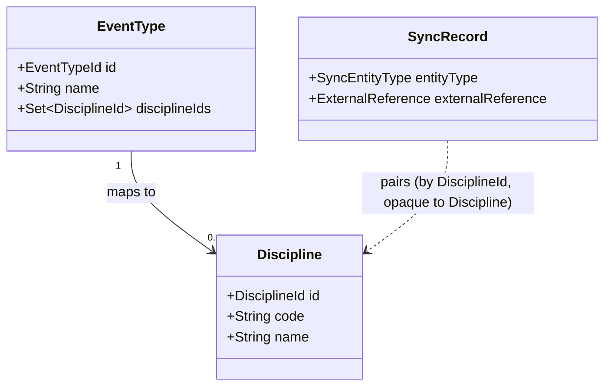

# Design

## Context

Today, `EventType` (`com.klabis.events.domain.EventType`) holds a `Set<Integer> orisDisciplineIds`, persisted via `OrisDisciplineMemento` into `events.event_type_oris_disciplines(event_type_id, discipline_id)` — raw ORIS integers, no local name or record. The only place ORIS discipline data is read is `EventTypeManagementService.listDisciplineOptions()`, which calls `orisApiClient.get().listDisciplines()` live on every request to build the HAL-FORMS picklist for the event type form.

Separately, `com.klabis.sync` is a generic, entity-agnostic bidirectional synchronisation engine (ADR-005, `docs/design-decisions.md`). Its only integration today is `OrisEventSyncAdapter` (`com.klabis.events.infrastructure.orissync`), a pull-only-creating adapter for `Event`. Per ADR-005/D2, an entity synced through the engine carries no `orisId` field itself — the pairing lives entirely in the engine's own `SyncRecord`/`ExternalReference` tables. `Event`'s pairing is always created explicitly, either by a user importing a specific ORIS event (`OrisEventImportService`) or a bulk admin import of chosen ORIS ids (`OrisEventBulkImportService`) — there is no existing mechanism for the engine to discover external records on its own.

See proposal.md - Why / What Changes for the motivation.

## Goals / Non-Goals

**Goals:**
- Replace the raw-integer discipline reference on `EventType` with a proper local `Discipline` record (code, name), following the same "no `orisId` column, engine owns the pairing" shape as `Event`.
- Route the event-type discipline picklist through local data instead of a live ORIS call.
- Keep the local catalog current automatically, with no manual per-discipline admin action.
- Reuse the existing `sync` engine and its `SynchronizationAdapter` contract unchanged — no new engine capability beyond what this change's discovery step needs.

**Non-Goals:**
- No outward (Klabis → ORIS) writes for disciplines — ORIS is the sole source of truth (same as events).
- No handling of ORIS discipline *removal*; pull-only sync has no delete semantics today, and ORIS disciplines are not observed to disappear in practice. Flagged as an open question, not solved here.
- No change to `Event`'s own sync behaviour or the `OrisEventSyncAdapter`.
- No change to the frontend event-type form beyond it continuing to consume the same `HalFormsInlineOption` shape it already does.

## Decisions

### D1: `Discipline` is a plain local aggregate, keyed by a generated local id, not the ORIS id

Alternative considered: key `Discipline` by the ORIS integer id directly (it's already a small, stable, natural key ORIS itself treats as an enum). Rejected to stay consistent with `Event`'s precedent and ADR-005's rule that a synced entity's local identity is independent of the external system — if Klabis ever needs a non-ORIS discipline, or ORIS renumbers, the local id is unaffected. The cost (an extra generated id) is negligible for a small reference table.

### D2: `EventType.orisDisciplineIds: Set<Integer>` becomes `EventType.disciplineIds: Set<DisciplineId>`

`events.event_type_oris_disciplines.discipline_id` changes from `INT` to a `UUID` foreign key into the new `events.disciplines` table. Since there is no production environment yet (backend `CLAUDE.md`), this is a direct edit to `V001__initial_schema.sql`, not an additive migration. `OrisDisciplineAlreadyMappedException` / `validateNoDisciplineIdConflict` keep their behaviour, now keyed on the local id.

### D3: Disciplines sync through a new `DisciplineSyncAdapter`, capabilities `pullOnlyCreating()`

Mirrors `OrisEventSyncAdapter` exactly: `SyncEntityType.DISCIPLINE("disciplines")`, `ExternalSystem.ORIS`, `SyncCapabilities.pullOnlyCreating()`. `readExternal`/`readLocal` map to a `DisciplineProjection(code, name)`. Lives in `com.klabis.events.infrastructure.orissync`, next to the event adapter, per ADR-005 ("lives in the module that owns the entity").

### D4: A scheduled discovery step drives enrolment, reusing `SynchronizationPort.pullAndEnroll`

The engine has no built-in "list the external system and enrol anything new" primitive — every existing adapter is driven by a caller that already knows the external id. Disciplines have no such caller: nobody names "ORIS discipline 7" the way an admin names an ORIS event. A small scheduled `DisciplineDiscoveryJob`:

1. Calls `orisApiClient.listDisciplines()` once.
2. Filters out ids already paired via `SynchronizationPort.findByExternalReferences(DISCIPLINE, ORIS, allIds)`.
3. Calls `SynchronizationPort.pullAndEnroll(SyncEntityType.DISCIPLINE, externalReference, actingUser = null)` for each new id.

This adds no new port method — `pullAndEnroll` already creates the local entity, pairs it, and runs the initial pass (design.md of `add-bidirectional-sync-engine`, D8). Already-paired disciplines are kept current by the engine's existing nightly/due-date scan; the discovery job only ever handles *new* ids. `actingUser = null` mirrors the scheduler's existing convention for system-triggered passes (`SynchronizationPort.synchronizeNow` already accepts `null` for the same reason).

### D5: `EventTypeManagementService.listDisciplineOptions()` reads the local catalog

Drops the `Optional<OrisApiClient>` constructor dependency entirely; replaced with a `DisciplineRepository.findAllSorted()`-style read, mapped to `HalFormsInlineOption` the same way. No change to the HAL-FORMS contract the frontend consumes.

### D6: Resolving an event's ORIS discipline to a local `EventType` goes through the sync engine's pairing, not a new `orisId` lookup

`OrisEventFieldsReader.resolveEventTypeFromOrisDiscipline` currently calls `EventTypeRepository.findByOrisDisciplineId(int)` — a lookup keyed on the raw ORIS integer, backed by the raw integers stored in `event_type_oris_disciplines` today. Once that column is a `DisciplineId` FK (D2), `EventTypeRepository` can no longer resolve from an ORIS integer directly; it only knows local ids, consistent with removing `orisId`-shaped concepts from `events.domain` per ADR-005.

The resolution becomes two steps, both already-existing primitives:
1. `SynchronizationPort.findByExternalReferences(SyncEntityType.DISCIPLINE, ExternalSystem.ORIS, List.of(String.valueOf(orisDisciplineId)))` — resolves the ORIS integer to the paired `DisciplineId` (as `SyncedEntityReference.target().entityId()`), or nothing if that discipline has not been discovered yet (D4) or ORIS sent an id Klabis has never seen.
2. `EventTypeRepository.findByDisciplineId(DisciplineId)` (replaces `findByOrisDisciplineId(int)`) — a purely local lookup.

`OrisEventFieldsReader` (in `events.application`) gains a dependency on `SynchronizationPort` (in `sync.application`) to perform step 1 — the same kind of module-internal-to-generic-engine dependency `EventsSyncListener` and `OrisEventSyncAdapter` already have. If step 1 finds no pairing (discipline not yet discovered), the event simply gets no auto-mapped event type, exactly as today's "ORIS uses id 0 as sentinel for a missing discipline" branch already tolerates an unresolved discipline.

Alternative considered: keep `EventTypeRepository.findByOrisDisciplineId(int)` and have it internally query the sync tables. Rejected — it would leak ORIS/sync concepts into the `events.domain` repository port, which per ADR-005 should stay unaware of any external system; the two-step lookup keeps that awareness in `events.application`/`sync`, where `OrisEventFieldsReader` already knows about ORIS.

## Domain Changes

| Element | Change |
|---|---|
| `Discipline` (new, `events.domain`) | Added. Local aggregate: `DisciplineId`, `code`, `name`. No `orisId` field — pairing lives only in `sync`'s `SyncRecord`. |
| `DisciplineId` (new) | Added. Type-safe id, same pattern as `EventTypeId`. |
| `EventType.orisDisciplineIds: Set<Integer>` | Changed to `disciplineIds: Set<DisciplineId>`. |
| `OrisDisciplineMemento` | Changed: `discipline_id` column changes from raw `int` to `DisciplineId`'s `UUID`. |
| `SyncEntityType` | Changed: new `DISCIPLINE("disciplines")` value added alongside `EVENT`. |
| `DisciplineSyncAdapter` (new, `events.infrastructure.orissync`) | Added. Implements `SynchronizationAdapter` for `Discipline`/ORIS. |
| `DisciplineDiscoveryJob` (new, `events.infrastructure.orissync`) | Added. Scheduled; calls `pullAndEnroll` for undiscovered ORIS discipline ids. |
| `EventTypeManagementService` | Changed: `Optional<OrisApiClient>` dependency removed; `listDisciplineOptions()` reads `Discipline` catalog instead. |
| `EventTypeRepository.findByOrisDisciplineId(int)` | Changed to `findByDisciplineId(DisciplineId)` — purely local lookup, no ORIS integer involved. |
| `OrisEventFieldsReader` | Changed: gains a `SynchronizationPort` dependency; resolves an ORIS discipline id to a local `EventType` via `findByExternalReferences` + `findByDisciplineId` (D6) instead of a single direct repository call. |

## API Changes

No REST contract changes. `GET`/HAL-FORMS affordances on `EventType` resources (create/update templates) keep the same `orisDisciplineIds` property name and the same `HalFormsInlineOption` shape for its options — only where those options are sourced from changes, which is not visible over HTTP. No new endpoints are added for `Discipline` itself; it has no direct API of its own in this change (it is consumed only through the event type affordance and, like any synced entity, through the existing generic `/api/disciplines/{id}/sync…` surface `SyncEntityType.pathSegment()` already provides for every enrolled entity type).

## Glossary

- **Discipline**: a local, ORIS-sourced record of an orienteering discipline (e.g. "OB" / "Orientační běh") that an event type can be mapped to.
- **Discovery**: the act of the system finding an external record it does not yet have a local counterpart for and bringing it in on its own, without a user naming it explicitly.

## Risks / Trade-offs

- [Discovery job runs against every ORIS discipline on every tick, even after the catalog is fully populated] → Cheap in practice: `listDisciplines()` returns a short, rarely-changing list, and `findByExternalReferences` is a single batch lookup; no incremental/paginated discovery is needed.
- [ORIS discipline removal is unhandled] → Accepted for now (see Non-Goals); disciplines are not observed to disappear from ORIS. Revisit if it ever happens.
- [Schema change to `event_type_oris_disciplines` is breaking] → Acceptable: no production data exists yet (backend `CLAUDE.md`, Application Profiles section).

## Migration Plan

1. Edit `V001__initial_schema.sql`: add `events.disciplines`; change `event_type_oris_disciplines.discipline_id` to the new FK.
2. No data backfill needed (dev-only, H2 resets on restart; no production environment exists).
3. `EventTypeDataBootstrap`'s seeded event types reference no disciplines by default, so bootstrap data is unaffected.

## Open Questions

- Should the discovery job share `klabis.sync.scan-cron`/`due-scan-interval`, or run on its own (coarser) schedule, given disciplines change far less often than events? Does not affect the spec, approach, or task breakdown — can be decided during implementation.
