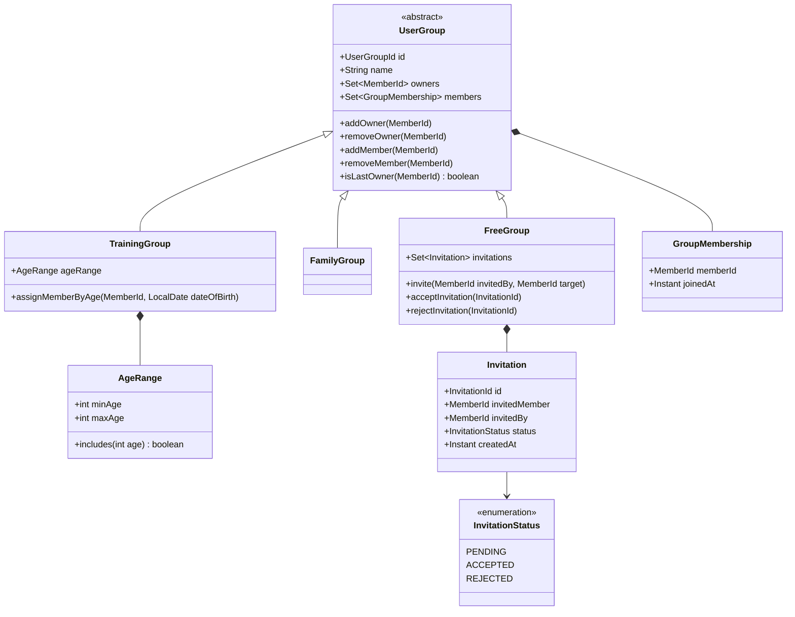
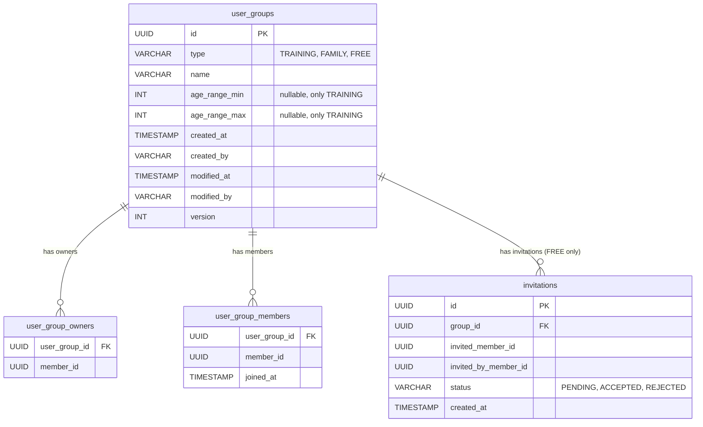

## Context

Klabis má čtyři moduly (members, events, calendar, common/users) postavené na Spring Modulith s DDD a hexagonální architekturou. Členové jsou nezávislé agregáty bez vzájemného seskupení. Autorizační model používá `Authority` enum se scope `GLOBAL` / `CONTEXT_SPECIFIC` — context-specific scope je připraven pro budoucí skupinová oprávnění, ale zatím nevyužit.

Nový modul `user-groups` zavádí koncept uživatelských skupin se třemi typy (tréninková, rodinná, volná), z nichž každý má odlišné chování pro vytváření, členství a životní cyklus.

## Goals / Non-Goals

**Goals:**
- Nový Spring Modulith modul `user-groups` s vlastním bounded contextem
- Doménový model s hierarchií agregátů (UserGroup → TrainingGroup / FamilyGroup / FreeGroup)
- Event-driven integrace s modulem `members` (automatické přiřazení, kontrola deaktivace)
- REST API s HAL+FORMS
- Pozvánkový systém pro volné skupiny
- Frontend implementace (stránky pro správu skupin, pozvánky)

**Non-Goals:**
- Úprava autorizačního systému (delegovaná oprávnění — samostatný change)
- Komunikační funkce nad skupinami (chat, email)
- Migrace existujících dat (žádná existující data k migraci)

## Decisions

### 1. Hierarchie agregátů

**Rozhodnutí:** Abstraktní základ `UserGroup` s třemi konkrétními agregáty: `TrainingGroup`, `FamilyGroup`, `FreeGroup`. Každý typ zapouzdřuje své specifické chování a pravidla.



**Alternativa:** Jeden agregát s enum diskriminátorem — odmítnuto, protože typově specifické chování (pozvánky u FreeGroup, věkový rozsah u TrainingGroup) by vyžadovalo podmínky typu `if (type == FREE)` místo polymorfismu.

### 2. Invitation jako součást FreeGroup agregátu

**Rozhodnutí:** `Invitation` je vnořená entita v `FreeGroup`. Volné skupiny mají typicky jednotky až nízké desítky členů, takže velikost agregátu není problém. Pozvánka má krátký životní cyklus (pending → accepted/rejected).

**Alternativa:** Samostatný agregát — odmítnuto jako zbytečná složitost pro daný objem.

### 3. Exkluzivita členství — enforcement na úrovni application service

**Rozhodnutí:** Pravidlo "max 1 tréninková/rodinná skupina na člena" vyžaduje dotaz napříč skupinami — agregát nemá přístup k ostatním skupinám. Validace probíhá v application service + unique DB index jako safety net.

### 4. Věkové přiřazení do tréninkových skupin

**Rozhodnutí:** Listener na `MemberCreatedEvent` v modulu `user-groups` provede přiřazení. Periodické přeřazení (když člen "vyroste") bude řešeno scheduled taskem, který projde tréninkové skupiny a přeřadí členy podle aktuálního věku.

Disjunktnost věkových rozsahů je validována při vytváření/editaci tréninkové skupiny — application service ověří, že se nový rozsah nepřekrývá s existujícími.

### 5. Deaktivace posledního vlastníka — integrace s members modulem

**Rozhodnutí:** Modul `user-groups` publikuje veřejné query API (`UserGroups` interface), které modul `members` volá při deaktivaci člena pro zjištění, zda je člen posledním vlastníkem nějaké skupiny. Members modul vrátí varování/blokaci.

**Alternativa:** Event-driven — odmítnuto, protože jde o synchronní validační kontrolu, ne asynchronní reakci.

### 6. Databázový model

Všechny typy skupin v jedné tabulce s diskriminátorem (single table inheritance) — jednoduchý model, Spring Data JDBC nepodporuje table-per-class nativně.



### 7. Package struktura

```
com.klabis.usergroups/
├── UserGroupId.java            # ID value object (used by other modules)
├── UserGroups.java             # Public query API (used by members module)
├── *Event.java                 # Domain events (consumed by other modules)
├── package-info.java           # @ApplicationModule
├── domain/
│   ├── UserGroup.java              # Abstract aggregate root
│   ├── TrainingGroup.java          # Concrete aggregate
│   ├── FamilyGroup.java            # Concrete aggregate
│   ├── FreeGroup.java              # Concrete aggregate
│   ├── GroupMembership.java        # Value object
│   ├── AgeRange.java               # Value object
│   ├── Invitation.java             # Entity (part of FreeGroup)
│   ├── InvitationId.java           # ID value object
│   ├── InvitationStatus.java       # Enum
│   └── UserGroupRepository.java    # Internal repository interface
├── application/
│   ├── GroupManagementService.java
│   ├── InvitationService.java
│   └── UserGroupsImpl.java        # Public query API implementation
├── infrastructure/
│   ├── restapi/
│   │   ├── GroupController.java
│   │   ├── InvitationController.java
│   │   └── *Request/*Response DTOs
│   ├── jdbc/
│   │   ├── UserGroupMemento.java
│   │   ├── UserGroupJdbcRepository.java
│   │   └── UserGroupRepositoryAdapter.java
│   └── listeners/
│       ├── MemberCreatedListener.java      # Auto-assign to training group
│       └── AgeBasedReassignmentScheduler.java
```

## Risks / Trade-offs

- **Single table inheritance vs. polymorfismus** — Domain model používá hierarchii, ale DB ukládá vše do jedné tabulky. Memento/adapter vrstva musí správně mapovat diskriminátor na konkrétní typ. → Mitigation: Repository adapter obsahuje factory metodu pro rekonstrukci správného typu.
- **Exkluzivita členství bez DB constraintu** — Pravidlo "max 1 tréninková skupina" je vynuceno v application service. → Mitigation: unique index na (member_id, group_type) pro TRAINING a FAMILY typy jako safety net.
- **Věkové přeřazení** — Scheduled task pro přeřazení členů může způsobit nečekané změny. → Mitigation: Publikování doménové události při přeřazení, notifikace vlastníkům skupin.
- **Guardian → rodinná skupina** — Automatické zakládání rodinné skupiny z GuardianInformation při registraci člena vyžaduje rozpoznání existujícího rodiče v systému. → Mitigation: Pro první verzi nabídnout vytvoření rodinné skupiny jako manuální akci, automatické propojení řešit později.
