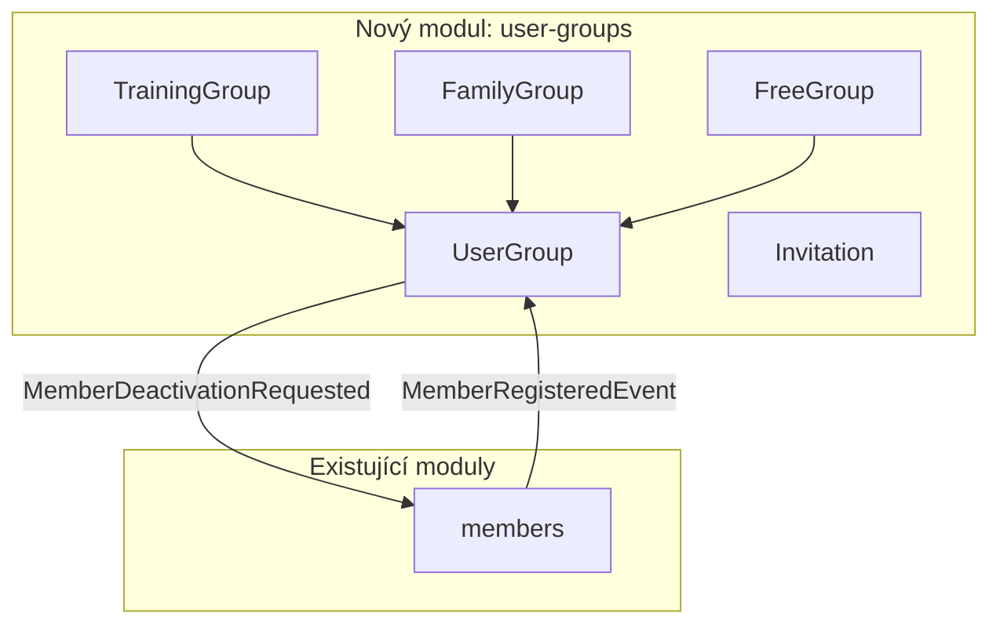

## Why

Klabis potřebuje mechanismus pro seskupování členů klubu do skupin s různým účelem — tréninkové skupiny pro organizaci svěřenců trenérů, rodinné skupiny pro propojení rodičů s dětmi, a volné skupiny pro uživatelsky definované seskupení. Skupiny umožní delegaci oprávnění (např. přihlašování členů na závody) a v budoucnu budou základem pro komunikační funkce (chat, emaily).

## What Changes

- Nový doménový koncept **Uživatelská skupina** s třemi typy: tréninková, rodinná, volná
- Každá skupina má vlastníky (≥1), název, seznam členů a sadu oprávnění odvozených od typu
- Tréninková skupina: automatické přiřazení členů podle věku, disjunktní věkové rozsahy, exkluzivní členství (max 1 tréninková skupina na člena)
- Rodinná skupina: exkluzivní členství (max 1 na člena), životní cyklus řízený adminem, propojení s existujícím GuardianInformation při registraci člena
- Volná skupina: pozvánkový systém (pozvánka + accept/reject), člen může být ve více volných skupinách, plně řízená vlastníkem
- Nové oprávnění pro správu tréninkových skupin
- Varování při deaktivaci posledního vlastníka skupiny (tréninková: musí zvolit nástupce, rodinná/volná: nástupce nebo rozpuštění)

## Capabilities

### New Capabilities

- `user-groups`: Správa uživatelských skupin — vytváření, editace, mazání skupin, správa vlastníků a členů, pozvánkový systém pro volné skupiny, automatické přiřazení do tréninkových skupin podle věku, oprávnění odvozená od typu skupiny

### Modified Capabilities

- `members`: Deaktivace člena musí zohlednit vlastnictví skupin (varování při deaktivaci posledního vlastníka)

## Impact

- Nový Spring Modulith modul `user-groups`
- Nové DB tabulky: skupiny, členství, vlastnictví, pozvánky
- Úprava deaktivačního workflow v modulu `members`
- Event-driven integrace mezi moduly (např. `MemberRegisteredEvent` → automatické přiřazení do tréninkové skupiny, deaktivace člena → kontrola vlastnictví)
- Nové REST API endpointy s HAL+FORMS pro správu skupin

